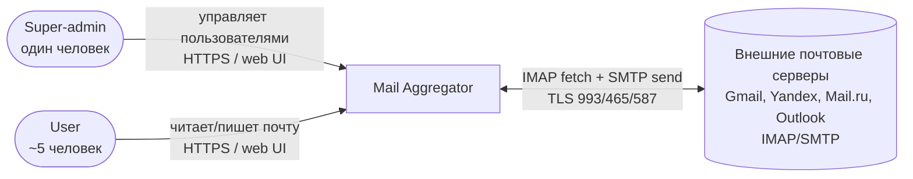
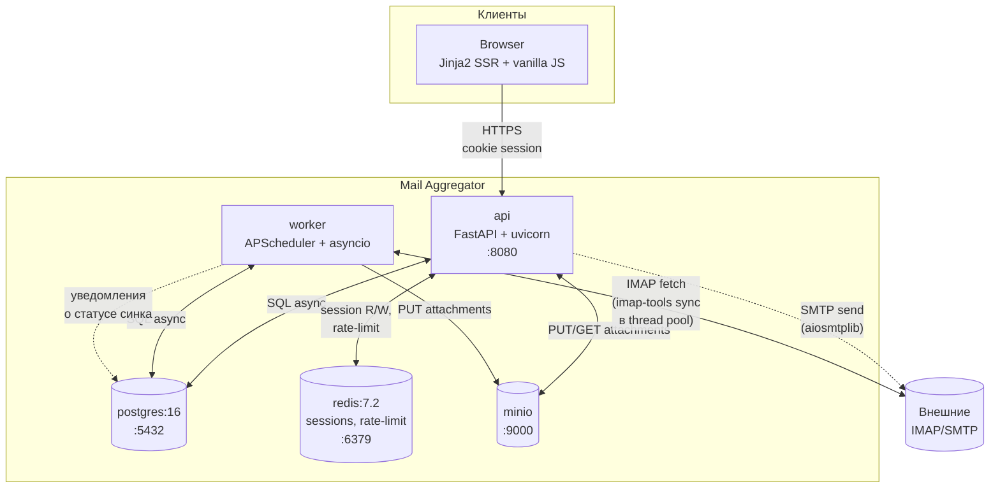
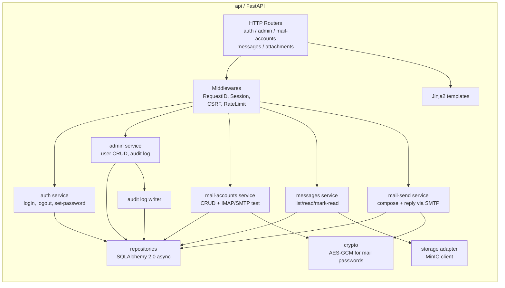
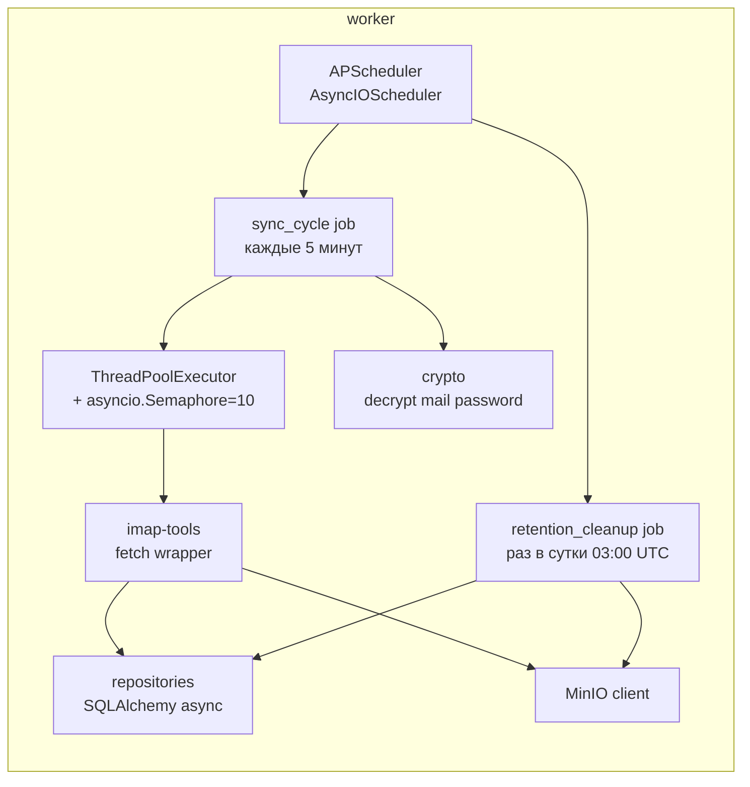
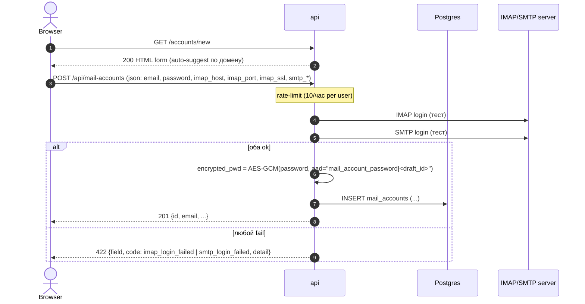
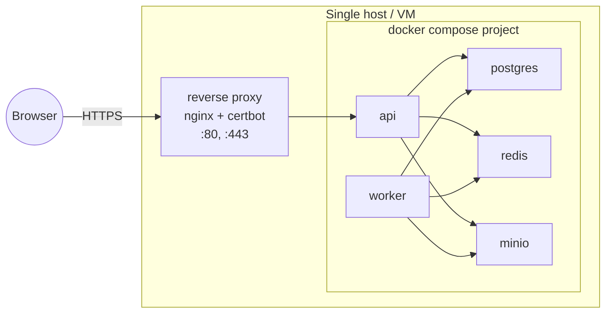

# 01. Архитектура

Описание архитектуры в нотации [C4](https://c4model.com/) — три уровня (Context, Containers, Components) плюс sequence-диаграммы ключевых сценариев.

---

## C4 Level 1 — System Context



**Действующие лица:**
- **Super-admin** — единственный, заводится из `ADMIN_LOGIN`/`ADMIN_PASSWORD`. Управляет пользователями.
- **User** — обычный пользователь. Привязывает свои почтовые аккаунты, читает/пишет почту через UI.
- **Внешние почтовые серверы** — IMAP+SMTP-сервисы провайдеров. Сервис подключается от имени пользователя по сохранённым credentials.

**Границы системы:** ничего не отправляем во внешние сервисы кроме почтовых серверов; нет интеграций с внешними IdP, аналитикой, телеметрией.

---

## C4 Level 2 — Containers



**Контейнеры:**

| Контейнер | Технология | Ответственность |
| --- | --- | --- |
| `api` | FastAPI / Python 3.12 / uvicorn | HTTP API + SSR (Jinja2). Auth, admin endpoints, user endpoints, message read/send, attachment download. |
| `worker` | Python 3.12 / APScheduler | Sync cycle (каждые 5 мин), retention cleanup (раз в сутки). |
| `postgres` | PostgreSQL 16 | Реляционная БД: пользователи, mail-аккаунты, сообщения, вложения (метаданные), audit log. |
| `redis` | Redis 7.2 | Sessions store, rate-limit counters. |
| `minio` | MinIO (S3 API) | Object storage для бинарных вложений. |

`api` и `worker` — два разных Docker-образа (или один образ с разными entrypoint, см. `07-deployment.md`). Они НЕ общаются напрямую — координация только через БД и Redis.

---

## C4 Level 3 — Components (внутри `api`)



**Внутри `worker`:**



---

## Потоки данных (data flows)

### F1. Чтение почты пользователем

1. Browser -> `GET /` (HTML inbox).
2. `api` валидирует session cookie -> Redis lookup.
3. `messages service` -> `repositories.list_messages(user_id, account_filter, limit, offset)` -> Postgres SELECT.
4. Шаблон `inbox.html` рендерится со списком; ответ Browser'у.

### F2. Открытие письма + вложение

1. `GET /messages/{id}` -> session check -> `messages service` -> SELECT с проверкой `message.user_id == session.user_id`.
2. `body_text` инлайн в шаблон.
3. Список вложений → ссылки на `GET /api/messages/{id}/attachments/{aid}`.
4. При клике: `api` SELECT attachment, проверка ownership, GET object из MinIO -> stream в response.

### F3. Отправка письма (новое или ответ)

1. `POST /api/messages/send` (json или form: from_account_id, to, subject, body, in_reply_to_message_id?).
2. CSRF + session validation.
3. `mail-send service`:
   - SELECT mail_account by id, проверка ownership.
   - `crypto.decrypt(account.encrypted_password, aad=...)`.
   - Build MIME message (`email.message.EmailMessage`, `text/plain; charset=utf-8`).
   - `aiosmtplib.send(...)`.
   - Insert в `sent_messages`.
   - Best-effort: append to IMAP `Sent` через `asyncio.to_thread` (отдельный try/except — не валим запрос при ошибке).
4. Redirect в inbox с flash-сообщением "sent".

### F4. Sync cycle (worker)

1. APScheduler -> `sync_cycle()` каждые 5 минут.
2. `cycle_id = uuid4()`, log "sync_cycle_start".
3. SELECT all `mail_accounts WHERE is_active=true`.
4. Для каждого аккаунта создаётся task `sync_one_account(acc)`; все собираются в `gather(return_exceptions=True)`.
5. В каждом task:
   - `async with semaphore`:
   - `await asyncio.wait_for(asyncio.to_thread(blocking_sync, acc), timeout=60)`.
   - `blocking_sync` использует `imap-tools` (см. ADR-0008): connect -> UIDVALIDITY check -> incremental fetch -> save messages + attachments.
   - Update `last_synced_at`, `last_synced_uidnext`, `last_sync_error=NULL`.
   - При исключении: записать в `last_sync_error`, инкремент `consecutive_failures`; >=3 -> `is_active=false` и audit-log.
6. Log "sync_cycle_finish" с агрегатами.

---

## Sequence-диаграммы

### S1. Login (обычный)

```mermaid
sequenceDiagram
    autonumber
    actor B as Browser
    participant A as api
    participant R as Redis
    participant DB as Postgres

    B->>A: GET /login
    A-->>B: 200 HTML (form, csrf in cookie+input)
    B->>A: POST /login (username, password, csrf)
    Note over A: rate-limit check (slowapi)
    A->>DB: SELECT user WHERE lower(username)=:u
    alt user not found OR lockout_until > now()
        A-->>B: 401 (generic "invalid credentials")
    else password_reset_required = true
        A->>R: SET temporary setup_session
        A-->>B: 302 -> /set-password
    else verify argon2id
        alt verify ok
            A->>R: SET session:{token} {user_id, role, csrf}
            A->>R: SADD user_sessions:{user_id} {token}
            opt user.is_admin = true
                A->>DB: INSERT admin_audit (action=admin_login, actor=user.id, ip, ua)
            end
            A-->>B: 302 -> / (Set-Cookie mas_session, mas_csrf)
        else verify fail
            A->>DB: increment failed_attempts; maybe set lockout_until
            A-->>B: 401
        end
    end
```

**Назначение `role` в session:** при формировании session JSON backend читает `users.is_admin` и кладёт `role = "admin"` если true, иначе `role = "user"`. Те же правила применяются при создании session по завершении `/set-password` (см. S2). Cookie/payload пользователя на это значение не влияют — источник один: `users.is_admin`.

### S2. Set password (первый вход / после сброса)

```mermaid
sequenceDiagram
    autonumber
    actor B as Browser
    participant A as api
    participant R as Redis
    participant DB as Postgres

    B->>A: POST /login (username, password=любой)
    A->>DB: SELECT user; password_reset_required=true
    A->>R: SET setup_session:{token} scope=set_password user_id=...
    A-->>B: 302 -> /set-password (cookie mas_setup)
    B->>A: GET /set-password
    A->>R: GET setup_session:{token}
    A-->>B: 200 HTML form (csrf)
    B->>A: POST /set-password (new_password, confirm, csrf)
    Note over A: validate min length (12), max (128), confirm matches
    A->>DB: UPDATE users SET password_hash=argon2(p), password_reset_required=false
    A->>R: DEL setup_session:{token}
    A->>R: SET session:{token2} {user_id, csrf}
    A-->>B: 302 -> / (Set-Cookie mas_session)
```

### S3. Add mail account (с тест-логином)



### S4. Send message

```mermaid
sequenceDiagram
    autonumber
    actor B as Browser
    participant A as api
    participant DB as Postgres
    participant Ext as SMTP server

    B->>A: POST /api/messages/send (from_account_id, to, subject, body, [in_reply_to])
    A->>DB: SELECT mail_account WHERE id AND user_id (ownership)
    A->>A: decrypt password
    A->>A: build MIME (text/plain; charset=utf-8); set Message-ID, In-Reply-To, References
    A->>Ext: aiosmtplib.send(...)
    alt SMTP ok
        A->>DB: INSERT sent_messages
        A-)Ext: best-effort: IMAP APPEND to "Sent" (background task; errors logged, not surfaced)
        A-->>B: 200 {sent_id}
    else SMTP fail
        A-->>B: 502 {code: smtp_failed, detail}
    end
```

### S5. Sync cycle (worker)

```mermaid
sequenceDiagram
    autonumber
    participant S as APScheduler
    participant W as worker
    participant DB as Postgres
    participant Ext as IMAP server
    participant M as MinIO

    S->>W: trigger sync_cycle (every 5 min)
    W->>DB: SELECT * FROM mail_accounts WHERE is_active=true
    loop for each account (sem=10)
        W->>W: asyncio.to_thread(blocking_sync, acc)
        W->>DB: SELECT last_synced_uidnext, last_uidvalidity
        W->>Ext: IMAP login (decrypt password)
        W->>Ext: SELECT INBOX
        Note over W,Ext: UIDVALIDITY check; if changed -> initial sync
        W->>Ext: UID SEARCH UID {last_synced_uidnext}:* ; затем UID FETCH по найденным (envelope, body, attachments). Защитный фильтр: только UID >= last_synced_uidnext.
        loop per new message
            W->>M: PUT attachments (if any)
            W->>DB: INSERT messages, attachments (ON CONFLICT DO NOTHING)
        end
        W->>DB: UPDATE mail_accounts SET last_synced_at, last_synced_uidnext, last_sync_error=NULL
    end
    Note over W: ошибки на одном аккаунте не валят остальных
    W->>W: log cycle_finish {ok, failed, new_msgs}
```

### S6. Admin reset user password

```mermaid
sequenceDiagram
    autonumber
    actor Adm as Super-admin
    participant A as api
    participant R as Redis
    participant DB as Postgres

    Adm->>A: POST /api/admin/users/{id}/reset (csrf)
    Note over A: session check (role=admin)
    A->>DB: UPDATE users SET password_hash=NULL, password_reset_required=true
    A->>DB: INSERT admin_audit (actor=admin, action=reset_password, target_user=...)
    A->>R: SMEMBERS user_sessions:{id}; DEL session:{t} for each; DEL user_sessions:{id}
    A-->>Adm: 200 {ok: true}
```

### S7. Admin delete user (cascade)

```mermaid
sequenceDiagram
    autonumber
    actor Adm as Super-admin
    participant A as api
    participant DB as Postgres
    participant M as MinIO
    participant R as Redis

    Adm->>A: DELETE /api/admin/users/{id} (csrf)
    A->>R: revoke all sessions (как в S6)
    A->>DB: SELECT mail_account_ids; SELECT message_ids; SELECT attachment_keys
    A->>M: delete_objects([keys...]) (батчами 1000)
    A->>DB: DELETE FROM users WHERE id=:id (CASCADE по FK: users -> mail_accounts -> messages -> attachments, sent_messages -> sent_attachments. Записи в admin_audit, ссылающиеся на удалённого пользователя через target_user_id, НЕ удаляются — сохранение аудит-следа; actor_user_id хранится как BIGINT без FK по той же причине.)
    A->>DB: INSERT admin_audit (actor=admin, action=delete_user, target_user=:id, target_username=cached)
    A-->>Adm: 200 {ok: true}
```

### S8. Logout (общий для user и admin)

```mermaid
sequenceDiagram
    autonumber
    actor B as Browser
    participant A as api
    participant R as Redis
    participant DB as Postgres

    B->>A: POST /logout (csrf)
    A->>R: GET session:{token}
    Note over A: читаем session.user_id и session.role
    A->>R: DEL session:{token}; SREM user_sessions:{user_id} {token}
    opt session.role == "admin"
        A->>DB: INSERT admin_audit (action=admin_logout, actor=user_id, ip, ua)
    end
    A-->>B: 302 -> /login (Set-Cookie mas_session=; max-age=0; mas_csrf=; max-age=0)
```

`admin_logout` пишется только когда session помечена `role=admin` (т.е. только для супер-админа). Обычные user-логауты в audit не пишутся.

---

## Deployment topology

См. также `07-deployment.md`.



- TLS terminates на reverse proxy (nginx 1.27 + certbot/Let's Encrypt — см. `07-deployment.md` sec. 6).
- Все backend-контейнеры в общей docker-сети, не публикуют порты наружу.
- Только `:443` (proxy) и опционально `:9001` (MinIO console, ограничен по IP) выставляются.

---

## Нефункциональные характеристики

| Атрибут | Цель | Как достигается |
| --- | --- | --- |
| Доступность | Best-effort, single-host | docker `restart=always`; healthchecks; ручной recovery |
| Производительность sync | 500 ящиков ≤ 5 минут | Semaphore=10, 30s avg per account |
| Latency UI | < 300 ms p95 для inbox listing | индексы (см. `03-data-model.md`), pagination 50 |
| Безопасность секретов | Mail-пароли шифруются at-rest | AES-256-GCM (ADR-0005) |
| Восстановление | Полное — из бэкапа Postgres + MinIO | Документировано в `07-deployment.md` |
| Наблюдаемость | Структурные логи + метрики базовые | structlog JSON; (метрики Prometheus — будущая работа, см. tech-debt) |
