# 03. Data Model

Основная БД — **PostgreSQL 16**. Имя БД: `mail_aggregator`. Кодировка: UTF-8. Часовые зоны — все TIMESTAMP-поля `TIMESTAMPTZ`, хранятся в UTC.

Все ID — `BIGSERIAL`/`BIGINT` (кроме `users.id` — то же). UUID не используем (реляции компактнее на BIGINT). Если в будущем потребуется внешняя экспонируемая идентификация — добавим `public_id UUID`.

---

## ER-диаграмма

```mermaid
erDiagram
    groups ||--o| users : "leader (1:1)"
    groups ||--o{ users : "home members (1:N via users.group_id)"
    users ||--o{ user_groups : "memberships (ADR-0030)"
    groups ||--o{ user_groups : "members (ADR-0030)"
    users ||--o{ mail_accounts : owns
    users ||--o{ sent_messages : sends
    users ||--o{ admin_audit : "subject_user (nullable, no FK)"
    users ||--o{ admin_audit : "performed (super-admin only, no FK)"
    users ||--o{ tags : owns
    users ||--o{ telegram_links : "linked_to (1:N, ADR-0024)"
    users ||--o{ telegram_notifications : "received_by"
    users ||--o| users_settings : "has (0..1)"
    groups ||--o| webhooks : "has outbound (0..1)"
    webhooks ||--o{ webhook_deliveries : "delivered"
    mail_accounts ||--o{ messages : "stores"
    messages ||--o{ attachments : "has"
    messages ||--o{ message_tags : "tagged_with"
    messages ||--o{ telegram_notifications : "notified_for"
    messages ||--o{ webhook_deliveries : "webhook_pushed"
    tags ||--o{ tag_rules : "matches_via"
    tags ||--o{ message_tags : "applied_to"
    sent_messages ||--o{ sent_attachments : "has"
    mail_accounts ||--o{ sent_messages : "from"

    users {
        bigint id PK
        text username UK
        text email "nullable"
        text display_name "nullable; UI fallback to username"
        text password_hash "nullable, argon2id"
        text role "super_admin|group_leader|group_member"
        bigint group_id FK "nullable; home/primary team; NULL only for super_admin (ADR-0030)"
        boolean password_reset_required
        timestamptz lockout_until "nullable"
        int failed_login_attempts
        timestamptz last_login_at
        timestamptz created_at
        timestamptz updated_at
    }

    groups {
        bigint id PK
        text name "1..100 chars; auto = 'Группа <leader.display_name|username>'"
        bigint leader_user_id FK "UNIQUE; one user can lead at most one group; ON DELETE RESTRICT"
        timestamptz created_at
    }

    user_groups {
        bigint id PK
        bigint user_id FK "ON DELETE CASCADE (ADR-0030)"
        bigint group_id FK "ON DELETE CASCADE (ADR-0030)"
        timestamptz created_at
    }

    mail_accounts {
        bigint id PK
        bigint user_id FK "owner; visibility via user_groups (ADR-0030)"
        text email
        text display_name "nullable; UI fallback to email"
        bytea encrypted_password "AES-GCM blob"
        text imap_host
        int imap_port
        boolean imap_ssl
        text smtp_host
        int smtp_port
        boolean smtp_ssl
        boolean smtp_starttls
        text smtp_username "nullable, falls back to email"
        bytea smtp_encrypted_password "nullable; if null reuses encrypted_password"
        boolean is_active
        bigint last_synced_uidnext "nullable"
        bigint last_uidvalidity "nullable"
        timestamptz last_synced_at "nullable"
        text last_sync_error "nullable"
        int consecutive_failures
        timestamptz created_at
        timestamptz updated_at
    }

    messages {
        bigint id PK
        bigint mail_account_id FK
        bigint uid
        bigint uidvalidity
        text message_id_header "nullable"
        text from_addr
        text from_name "nullable"
        text to_addrs "comma-separated"
        text cc_addrs "nullable"
        text subject "nullable"
        timestamptz internal_date
        text body_text
        boolean body_truncated
        boolean body_present
        boolean is_read
        text in_reply_to "nullable"
        text refs_header "nullable"
        timestamptz fetched_at
    }

    attachments {
        bigint id PK
        bigint message_id FK
        text filename
        text content_type "nullable"
        bigint size_bytes
        text s3_key
        boolean skipped_too_large
        timestamptz created_at
    }

    sent_messages {
        bigint id PK
        bigint user_id FK
        bigint from_account_id FK
        text to_addrs
        text cc_addrs "nullable"
        text bcc_addrs "nullable"
        text subject "nullable"
        text body_text
        text in_reply_to "nullable"
        text refs_header "nullable"
        text smtp_message_id "Message-ID we generated"
        boolean appended_to_sent
        text appended_error "nullable"
        timestamptz sent_at
    }

    sent_attachments {
        bigint id PK
        bigint sent_message_id FK
        text filename
        text content_type
        bigint size_bytes
        text s3_key
        timestamptz created_at
    }

    admin_audit {
        bigint id PK
        bigint actor_user_id "always super-admin"
        text action
        bigint target_user_id "nullable; for user-related actions"
        text target_username "snapshot at deletion time"
        jsonb details "nullable"
        text ip
        text user_agent "nullable"
        timestamptz created_at
    }

    tags {
        bigint id PK
        bigint user_id FK
        text name
        text color "hex #RRGGBB"
        boolean is_builtin
        timestamptz created_at
        timestamptz updated_at
    }

    tag_rules {
        bigint id PK
        bigint tag_id FK
        text type "subject_contains|body_contains|sender_contains|sender_exact"
        text pattern
        timestamptz created_at
    }

    message_tags {
        bigint message_id FK
        bigint tag_id FK
        timestamptz created_at
    }

    telegram_links {
        bigint telegram_user_id PK "Telegram User.id from signed init_data"
        bigint user_id FK "indexed (NOT unique, ADR-0024 — 1:N); ON DELETE CASCADE"
        timestamptz created_at
        timestamptz dead_at "nullable; set on Bot API 403/400 (per-chat)"
    }

    telegram_notifications {
        bigint id PK
        bigint message_id FK "ON DELETE CASCADE"
        bigint user_id FK "ON DELETE CASCADE; получатель-владелец"
        bigint telegram_user_id "NOT NULL; целевой чат (ADR-0024 §6); слепок chat_id на момент доставки, без FK"
        timestamptz sent_at "nullable"
        bigint telegram_message_id "nullable; from sendMessage response"
    }

    users_settings {
        bigint user_id PK "FK ON DELETE CASCADE"
        boolean tg_notifications_enabled "default true"
        timestamptz updated_at
    }

    webhooks {
        bigint id PK
        bigint group_id FK "UNIQUE; ON DELETE CASCADE"
        text url "https only; 1..2048"
        bytea secret_encrypted "AES-GCM, AAD=webhook_id"
        boolean is_active "default true"
        int consecutive_failures "default 0"
        timestamptz dead_at "nullable"
        timestamptz last_fired_at "nullable"
        text last_error "nullable; <=500 chars"
        timestamptz created_at
        timestamptz updated_at
    }

    webhook_deliveries {
        bigint id PK
        bigint webhook_id FK "ON DELETE CASCADE"
        bigint message_id FK "ON DELETE CASCADE"
        timestamptz sent_at "nullable; null=claimed-but-not-completed"
        int response_code "nullable"
        text response_excerpt "nullable; <=500 chars"
        timestamptz created_at
    }
```



---

## Таблицы (DDL-friendly описание)

### `users`

| Колонка | Тип | Constraints | Описание |
| --- | --- | --- | --- |
| `id` | BIGSERIAL | PRIMARY KEY | |
| `username` | TEXT | NOT NULL, UNIQUE | Lower-case стандарт; CITEXT не используем — нормализуем на уровне приложения. |
| `email` | TEXT | NULL | Опциональный email пользователя (для будущего; сейчас не используется). |
| `display_name` | TEXT | NULL, CHECK length 1..100 | Человекочитаемое имя для UI; fallback в UI на `username` если NULL. Произвольная UTF-8 (включая русский). Введено в ADR-0019 §2 — также используется как источник для авто-имени группы при создании лидера (`"Группа {display_name | username}"`). |
| `password_hash` | VARCHAR(255) | NULL | argon2id. NULL — пароль ещё не задан или сброшен. |
| `role` | TEXT | NOT NULL DEFAULT `'group_member'`, CHECK IN (`'super_admin'`, `'group_leader'`, `'group_member'`) | Роль пользователя. См. ADR-0019. Заменяет старую колонку `is_admin: BOOLEAN` (миграция: `is_admin=true → role='super_admin'`, иначе → `role='group_member'`). `seed_super_admin` upsert'ит `role='super_admin'` для админа из env. |
| `group_id` | BIGINT | NULL, FK → `groups(id)` ON DELETE SET NULL, **DEFERRABLE INITIALLY DEFERRED** | **«Домашняя»/первичная команда** пользователя (ADR-0030). NULL только для `super_admin`. См. ADR-0019 §4. С ADR-0030 источник истины для **видимости/уведомлений** — таблица `user_groups` (M:N); `users.group_id` сохраняется и нужен для: (а) инварианта лидера (CHECK + constraint-trigger остаются на `users.group_id`); (б) присвоения `mail_accounts.group_id` при добавлении ящика (ящик попадает в домашнюю команду владельца); (в) глобальной роли `users.role` (per-group роли НЕ вводятся). Домашнее членство ВСЕГДА продублировано строкой в `user_groups` (см. таблицу `user_groups` и её инварианты). DEFERRABLE — потому что при auto-create группы (новый лидер) сначала вставляется user, потом groups, потом UPDATE users.group_id; FK-проверка должна откладываться до COMMIT. |
| `password_reset_required` | BOOLEAN | NOT NULL DEFAULT true | После seed/сброса — true; после установки пароля — false. |
| `lockout_until` | TIMESTAMPTZ | NULL | Если заполнено и > now() — login отклоняется (см. ADR-0009). |
| `failed_login_attempts` | INT | NOT NULL DEFAULT 0 | Сбрасывается при успешном login или истечении lockout. |
| `last_login_at` | TIMESTAMPTZ | NULL | |
| `created_at` | TIMESTAMPTZ | NOT NULL DEFAULT now() | |
| `updated_at` | TIMESTAMPTZ | NOT NULL DEFAULT now() | Обновляется триггером или из приложения. |

**CHECK-constraints (см. ADR-0019 §6):**
- `users_role_check` — `role IN ('super_admin', 'group_leader', 'group_member')`.
- `users_role_group_invariant` — табличный CHECK:
  ```sql
  CHECK (
      (role = 'super_admin'  AND group_id IS NULL) OR
      (role = 'group_leader' AND group_id IS NOT NULL) OR
      (role = 'group_member' AND group_id IS NOT NULL)
  )
  ```
- `users_display_name_length_check` — `display_name IS NULL OR char_length(display_name) BETWEEN 1 AND 100`.

**Триггер инвариантов лидерства** (`users_group_leader_consistency_check`, см. ADR-0019 §6):
- AFTER INSERT OR UPDATE OF `role`, `group_id` ON `users`, DEFERRABLE INITIALLY DEFERRED.
- Гарантирует, что при `role='group_leader'` строка существует в `groups` с `groups.id = users.group_id` И `groups.leader_user_id = users.id`. Иначе RAISE EXCEPTION.
- Backend-сервис (`AdminService`) дополнительно валидирует ДО SQL для понятных error-codes; триггер — defense-in-depth.

**Индексы:**
- `UNIQUE (username)` — реализовано через UNIQUE constraint.
- `INDEX (role) WHERE role = 'super_admin'` — partial; для быстрого поиска админа на старте (заменяет старый `(is_admin) WHERE is_admin = true`).
- `INDEX (group_id) WHERE group_id IS NOT NULL` — для фильтрации по visibility (см. модули `messages`, `accounts`).

**Триггер `updated_at`:**
- `BEFORE UPDATE ON users` — `NEW.updated_at = now()`.

---

### `groups`

Источник истины — [ADR-0019](./adr/ADR-0019-groups-and-roles.md). Группа = ровно один лидер + 0..N участников. Один user может быть лидером максимум одной группы (UNIQUE).

| Колонка | Тип | Constraints | Описание |
| --- | --- | --- | --- |
| `id` | BIGSERIAL | PRIMARY KEY | |
| `name` | TEXT | NOT NULL, CHECK length 1..100 | Имя группы. Авто-генерация при создании лидера: `"Группа {leader.display_name \| leader.username}"`. Может быть переименована super-admin'ом через `PATCH /api/admin/groups/{id}`. |
| `leader_user_id` | BIGINT | NOT NULL, UNIQUE, FK → `users(id)` ON DELETE RESTRICT | Лидер группы. UNIQUE → один user не может быть лидером больше одной группы. ON DELETE RESTRICT → нельзя удалить user'а, пока он лидер; super-admin сначала удаляет группу, потом — user'а. |
| `created_at` | TIMESTAMPTZ | NOT NULL DEFAULT now() | |

**Индексы:**
- `UNIQUE (leader_user_id)` — implied UNIQUE constraint.
- (PK на `id` уже есть — для FK-lookups из `users.group_id`.)

**Каскады:**
- `users.group_id → groups(id) ON DELETE SET NULL` — при удалении группы все её участники получают `group_id = NULL`. Backend (`AdminService.delete_group`) **дополнительно** в той же транзакции UPDATE'ит участников: для тех, у кого `role='group_member'`, устанавливает `role` остаётся `'group_member'` (но `group_id=NULL` из-за SET NULL — это нарушает CHECK-инвариант!). **Поэтому**: `delete_group` обязан **в одной транзакции** либо удалить пользователей-членов, либо переназначить им группу, либо изменить их `role`. **Принятое решение**: при `delete_group` super-admin в UI явно подтверждает действие, backend в одной транзакции:
  1. Лидер: `role='group_member'`, `group_id=NULL` (что снова нарушает CHECK!) — поэтому фактически: лидер становится **«висящим» group_member без группы**, что запрещено CHECK. **Корректное решение**: backend требует, чтобы super-admin перед `DELETE /api/admin/groups/{id}` **сначала** через `PATCH /api/admin/users/{leader_id}` перевёл лидера в другую группу или назначил `role='super_admin'` (что невозможно — super_admin один), либо удалил всех участников. На практике — UI flow: super-admin при попытке удалить группу видит список участников и обязан либо переназначить их в другую группу, либо удалить, прежде чем удалится сама группа. **Backend выбрасывает 400 `group_has_members`**, если в группе остались users.
  2. Лидер удалить тоже нельзя из-за `ON DELETE RESTRICT`. То есть итог: чтобы удалить группу — super-admin должен сначала «опустошить» её (всех участников и лидера перевести/удалить).

  Это последовательно с инвариантами: `group_leader.group_id IS NOT NULL`, `group_member.group_id IS NOT NULL`. ON DELETE SET NULL на FK сохраняется как **safety-net** (если кто-то обойдёт backend и сделает прямой DELETE FROM groups — БД хотя бы не оставит dangling-FK), но штатный flow всегда проходит через backend-валидацию.

**Объём:** ≤ 5 групп на старте.

---

### `user_groups`

Источник истины — [ADR-0030](./adr/ADR-0030-multi-group-membership.md). Аддитивная M:N-таблица «пользователь ↔ команда» — **единственный источник истины для видимости ящиков/писем в веб-интерфейсе, адресации Telegram-уведомлений основного бота (ADR-0022) и outbound-webhooks (ADR-0023), а также подсчёта членов команды**. Заменяет прежний предикат `users.group_id = mail_accounts.group_id` на проверку членства. `users.group_id` при этом сохраняется как «домашняя»/первичная команда (см. колонку `users.group_id` выше).

| Колонка | Тип | Constraints | Описание |
| --- | --- | --- | --- |
| `id` | BIGSERIAL | PRIMARY KEY | Семантически — BIGINT PK (ADR-0030); BIGSERIAL как в остальных таблицах файла (например, `groups.id`). |
| `user_id` | BIGINT | NOT NULL, FK → `users(id)` ON DELETE CASCADE | Член команды. CASCADE → при удалении пользователя все его членства удаляются. |
| `group_id` | BIGINT | NOT NULL, FK → `groups(id)` ON DELETE CASCADE | Команда. CASCADE → при удалении группы все членства в ней удаляются (симметрично `users.group_id ON DELETE SET NULL`, но для членств — полное удаление строки). |
| `created_at` | TIMESTAMPTZ | NOT NULL DEFAULT now() | Время добавления членства. |

**Constraints:**
- UNIQUE `(user_id, group_id)` — пользователь не может состоять в одной команде дважды. Обеспечивает идемпотентность `POST /api/admin/users/{id}/groups` (повторное добавление = no-op/409).

**Индексы:**
- UNIQUE `(user_id, group_id)` — также обслуживает прямой lookup «членства пользователя».
- `INDEX (group_id)` — обратный поиск «члены команды» (`members_count`, список участников в карточке группы).

**Инварианты (ADR-0030):**
- **Домашнее членство всегда продублировано:** для любого пользователя с `users.group_id IS NOT NULL` существует строка `user_groups(user_id, users.group_id)`. Домашнее членство удалить нельзя (его смена — только через «Переместить», `PATCH /api/admin/users/{id}` с `group_id`).
- **`super_admin`:** `users.group_id IS NULL` И **нет** строк в `user_groups` (он видит всё без членств; добавлять его в команды запрещено).
- **Лидер:** ровно одна команда, где он лидер (`groups.leader_user_id = users.id`), — это его домашняя команда (= `users.group_id`); плюс может иметь произвольное число **дополнительных** членств в `user_groups`. Доп. членства лидера не делают его лидером тех команд (роль глобальная, одна).
- **Видимость = объединение всех членств:** пользователь видит ящики/письма всех команд из `user_groups` (домашняя + добавленные).

**Объём:** ≤ 5 пользователей × ≤ 5 команд = ≤ 25 строк на обозримом горизонте.

---

### `mail_accounts`

| Колонка | Тип | Constraints | Описание |
| --- | --- | --- | --- |
| `id` | BIGSERIAL | PK | |
| `user_id` | BIGINT | NOT NULL, FK → `users(id)` ON DELETE CASCADE | Владелец mail-аккаунта. Visibility (super_admin / group_leader / group_member) с ADR-0030 определяется через **членства** зрителя: ящик виден, если `mail_accounts.group_id` входит в множество команд зрителя из `user_groups` (ранее — сравнение `mail_accounts.group_id = users.group_id`, ADR-0019 §7.1). `mail_accounts.group_id` остаётся 1:1 — ящик принадлежит одной команде. |
| `group_id` | BIGINT | NULL, FK → `groups(id)` ON DELETE SET NULL | Команда, которой принадлежит ящик (**1:1**). Источник истины принадлежности; видимость зрителя считается как `group_id ∈ scope.group_ids` (предикат канонически определён в ADR-0019 §7 + ADR-0030; см. также раздел «область видимости» в `06-security.md`). **ADR-0031:** значение **выбирается при создании** и **может меняться** после создания (перенос). При создании: если в payload `group_id` не передан — берётся **домашняя** группа владельца (`users.group_id`); для `super_admin`, создающего ящик на себя, домашней группы нет → `NULL` (персональный ящик). Если передан — валидируется по роли создателя (ADR-0031 §4). Перенос — через `PATCH /api/mail-accounts/{id}` с `group_id` (`MailAccountsRepo.update_group`). `NULL` = персональный ящик без команды (бывает только у super_admin). **Миграция БД не требуется** — колонка существует с ADR-0019; ADR-0031 меняет только логику присвоения/изменения. `ON DELETE SET NULL` — при удалении группы её ящики становятся персональными (safety-net). |
| `email` | TEXT | NOT NULL | Адрес почты пользователя в этом сервисе. Для OAuth-аккаунтов — извлекается из `id_token`/Graph при consent. |
| `display_name` | TEXT | NULL, CHECK length 1..100 | Никнейм / ярлык для UI. Если задан — показывается вместо `email` (см. ADR-0020). Не уникален. Любая UTF-8 строка 1..100 (после trim'а пустая интерпретируется как NULL). |
| `auth_type` | TEXT | NOT NULL DEFAULT `'password'`, CHECK in (`'password'`,`'oauth_outlook'`) | **ADR-0025:** способ аутентификации. `password` — IMAP/SMTP LOGIN по зашифрованному паролю; `oauth_outlook` — XOAUTH2 по OAuth-токенам. |
| `encrypted_password` | BYTEA | **NULL** (ADR-0025; ранее NOT NULL) | AES-256-GCM blob (см. ADR-0005). Для `auth_type='password'` — NOT NULL (CHECK); для `oauth_outlook` — NULL. |
| `oauth_provider` | TEXT | NULL | **ADR-0025:** `'outlook'`. NULL для password-аккаунтов. |
| `oauth_refresh_token_encrypted` | BYTEA | NULL | **ADR-0025:** refresh-token, AES-256-GCM (AAD=`account_id`, тот же `MailPasswordCipher`). NOT NULL для `oauth_outlook` (CHECK). |
| `oauth_access_token_encrypted` | BYTEA | NULL | **ADR-0025:** кэш access-token (~1ч), шифрован. Кэш, не источник истины. |
| `oauth_access_token_expires_at` | TIMESTAMPTZ | NULL | **ADR-0025:** истечение access-token; sync проверяет до коннекта (буфер 60с). |
| `oauth_needs_consent` | BOOLEAN | NOT NULL DEFAULT false | **ADR-0025:** true → refresh инвалидирован (`invalid_grant`); требуется повторный consent; worker пропускает. |
| `oauth_scopes` | TEXT | NULL | **ADR-0025:** фактически выданные scopes (space-separated) — диагностика. |
| `proxy_url` | TEXT | NULL | **ADR-0025 (заложено, не используется — TD-029):** per-account proxy. worker/тестеры игнорируют в текущем спринте. |
| `imap_host` | TEXT | NOT NULL | |
| `imap_port` | INT | NOT NULL DEFAULT 993 | |
| `imap_ssl` | BOOLEAN | NOT NULL DEFAULT true | |
| `smtp_host` | TEXT | NOT NULL | |
| `smtp_port` | INT | NOT NULL DEFAULT 465 | |
| `smtp_ssl` | BOOLEAN | NOT NULL DEFAULT true | true = SSL on connect (порт 465). |
| `smtp_starttls` | BOOLEAN | NOT NULL DEFAULT false | true для порта 587. Взаимоисключаемо с `smtp_ssl`. |
| `smtp_username` | TEXT | NULL | Если NULL — использовать `email`. |
| `smtp_encrypted_password` | BYTEA | NULL | Если NULL — использовать `encrypted_password`. |
| `is_active` | BOOLEAN | NOT NULL DEFAULT true | false → worker пропускает. Может быть выключен пользователем или автоматически (см. ADR-0008/ADR-0026). **ADR-0026:** auto-disable только по PERMANENT-ошибкам (порог `SYNC_MAX_CONSECUTIVE_FAILURES` или явный auth/decrypt) и только если не сработал circuit-breaker; TRANSIENT-ошибки НЕ дисейблят. |
| `last_synced_uidnext` | BIGINT | NULL | UIDNEXT INBOX, зафиксированный после последнего успешного цикла. |
| `last_uidvalidity` | BIGINT | NULL | UIDVALIDITY INBOX. |
| `last_synced_at` | TIMESTAMPTZ | NULL | Время последней синхронизации. **ADR-0026:** обновляется на success и на PERMANENT-ошибку; на TRANSIENT НЕ трогается (сохраняет приоритет `list_active()` ORDER BY `last_synced_at NULLS FIRST`). |
| `last_sync_error` | TEXT | NULL | Краткое описание последней ошибки (без секретов). **ADR-0026:** пишется и для TRANSIENT, и для PERMANENT; UI-префикс из `error_classify.error_prefix()`. NULL = успех. |
| `consecutive_failures` | INT | NOT NULL DEFAULT 0 | **ADR-0026:** счётчик подряд идущих **PERMANENT**-ошибок (TRANSIENT не инкрементит). Сброс на 0 при успешном цикле (`mark_sync_success`). `>= SYNC_MAX_CONSECUTIVE_FAILURES` (default 3) → auto-disable при не сработавшем circuit-breaker. |
| `created_at` | TIMESTAMPTZ | NOT NULL DEFAULT now() | |
| `updated_at` | TIMESTAMPTZ | NOT NULL DEFAULT now() | |

**Constraints:**
- CHECK `imap_port BETWEEN 1 AND 65535`, `smtp_port BETWEEN 1 AND 65535`.
- CHECK `NOT (smtp_ssl AND smtp_starttls)` — взаимоисключающие.
- CHECK `display_name IS NULL OR char_length(display_name) BETWEEN 1 AND 100` (см. ADR-0020).
- UNIQUE `(user_id, email)` — один пользователь не может дважды добавить ту же почту.
- **ADR-0025:** CHECK `auth_type IN ('password','oauth_outlook')` (`ck_mail_accounts_auth_type`).
- **ADR-0025:** CHECK `auth_type <> 'password' OR encrypted_password IS NOT NULL` (`ck_mail_accounts_password_creds`).
- **ADR-0025:** CHECK `auth_type <> 'oauth_outlook' OR (oauth_refresh_token_encrypted IS NOT NULL AND oauth_provider = 'outlook')` (`ck_mail_accounts_oauth_creds`).

**Индексы:**
- `INDEX (user_id)` — FK lookup.
- `INDEX (is_active) WHERE is_active = true` — для worker.
- `INDEX (group_id) WHERE group_id IS NOT NULL` — для visibility-фильтра `ma.group_id = ANY(:group_ids)` (ADR-0030) и фильтра `?group_id=` super_admin'а; теперь активно используется и при переносе ящиков (ADR-0031).

---

### `messages`

| Колонка | Тип | Constraints | Описание |
| --- | --- | --- | --- |
| `id` | BIGSERIAL | PK | |
| `mail_account_id` | BIGINT | NOT NULL, FK → `mail_accounts(id)` ON DELETE CASCADE | |
| `uid` | BIGINT | NOT NULL | IMAP UID. |
| `uidvalidity` | BIGINT | NOT NULL | IMAP UIDVALIDITY на момент сохранения. |
| `message_id_header` | TEXT | NULL | RFC 822 Message-ID. |
| `from_addr` | TEXT | NOT NULL | Email отправителя. |
| `from_name` | TEXT | NULL | Display name. |
| `to_addrs` | TEXT | NOT NULL DEFAULT '' | Comma-separated. |
| `cc_addrs` | TEXT | NULL | |
| `subject` | TEXT | NULL | |
| `internal_date` | TIMESTAMPTZ | NOT NULL | INTERNALDATE. |
| `body_text` | TEXT | NOT NULL DEFAULT '' | Plain-text тело (`text/plain`-часть либо `html2text(html)`, см. ADR-0012). Max 1 MiB. **Tag-matching `body_contains` читает И это поле, И `body_html` (см. `body_html` ниже + ADR-0017 §4.3).** |
| `body_html` | TEXT | NULL | Сырой HTML из `text/html`-части письма (как пришёл). Migration `20260513_011`. **UI рендерит именно это поле** (`message_view.html`). Может расходиться по тексту с `body_text` (MIME plain≠html — реальный Apple-кейс). Поэтому `body_contains` матчит дополнительно по `strip_tags(body_html)` (ADR-0017 §4.3). |
| `body_truncated` | BOOLEAN | NOT NULL DEFAULT false | |
| `body_present` | BOOLEAN | NOT NULL DEFAULT true | false если ни text/plain, ни text/html не было. |
| `is_read` | BOOLEAN | NOT NULL DEFAULT false | Локальный флаг, не синкается обратно в IMAP. |
| `in_reply_to` | TEXT | NULL | RFC 822 In-Reply-To. |
| `refs_header` | TEXT | NULL | RFC 822 References. |
| `fetched_at` | TIMESTAMPTZ | NOT NULL DEFAULT now() | |

**Constraints:**
- UNIQUE `(mail_account_id, uidvalidity, uid)` — идемпотентность (см. ADR-0008).

**Индексы:**
- `INDEX (mail_account_id, internal_date DESC)` — основной для inbox listing per account.
- `INDEX (mail_account_id, is_read) WHERE is_read = false` — частичный, для счётчика непрочитанных.
- `INDEX (internal_date)` — для retention cleanup.

---

### `attachments`

| Колонка | Тип | Constraints | Описание |
| --- | --- | --- | --- |
| `id` | BIGSERIAL | PK | |
| `message_id` | BIGINT | NOT NULL, FK → `messages(id)` ON DELETE CASCADE | |
| `filename` | TEXT | NOT NULL | Original filename (sanitized для s3_key, исходный для UI). |
| `content_type` | TEXT | NULL | MIME type. |
| `size_bytes` | BIGINT | NOT NULL | |
| `s3_key` | TEXT | NOT NULL | Полный ключ в bucket `mail-attachments`. |
| `skipped_too_large` | BOOLEAN | NOT NULL DEFAULT false | true → объект НЕ загружен в MinIO; запись для UI/audit. |
| `created_at` | TIMESTAMPTZ | NOT NULL DEFAULT now() | |

**Индексы:**
- `INDEX (message_id)` — FK lookup.

---

### `sent_messages`

| Колонка | Тип | Constraints | Описание |
| --- | --- | --- | --- |
| `id` | BIGSERIAL | PK | |
| `user_id` | BIGINT | NOT NULL, FK → `users(id)` ON DELETE CASCADE | |
| `from_account_id` | BIGINT | NOT NULL, FK → `mail_accounts(id)` ON DELETE CASCADE | |
| `to_addrs` | TEXT | NOT NULL | |
| `cc_addrs` | TEXT | NULL | |
| `bcc_addrs` | TEXT | NULL | |
| `subject` | TEXT | NULL | |
| `body_text` | TEXT | NOT NULL | |
| `in_reply_to` | TEXT | NULL | |
| `refs_header` | TEXT | NULL | |
| `smtp_message_id` | TEXT | NOT NULL | Сгенерированный сервисом Message-ID (`<uuid@aggregator-host>`). |
| `appended_to_sent` | BOOLEAN | NOT NULL DEFAULT false | true — успешно положено в IMAP/Sent. |
| `appended_error` | TEXT | NULL | Если не удалось — описание. |
| `sent_at` | TIMESTAMPTZ | NOT NULL DEFAULT now() | |

**Индексы:**
- `INDEX (user_id, sent_at DESC)`.
- `INDEX (from_account_id)`.

---

### `sent_attachments`

| Колонка | Тип | Constraints | Описание |
| --- | --- | --- | --- |
| `id` | BIGSERIAL | PK | |
| `sent_message_id` | BIGINT | NOT NULL, FK → `sent_messages(id)` ON DELETE CASCADE | |
| `filename` | TEXT | NOT NULL | |
| `content_type` | TEXT | NULL | |
| `size_bytes` | BIGINT | NOT NULL | |
| `s3_key` | TEXT | NOT NULL | |
| `created_at` | TIMESTAMPTZ | NOT NULL DEFAULT now() | |

**Примечание для исполнителя:** на текущей итерации UI **не предлагает** прикреплять файлы при отправке (см. `08-frontend.md`). Таблица создаётся пустой и зарезервирована под будущую функциональность; FK + DDL гарантируют, что миграция не понадобится при включении фичи. Если backend-агент примет решение реализовать аттачи в первой версии — он должен поднять Q к архитектору перед изменением UX.

---

### `admin_audit`

| Колонка | Тип | Constraints | Описание |
| --- | --- | --- | --- |
| `id` | BIGSERIAL | PK | |
| `actor_user_id` | BIGINT | NOT NULL | id супер-админа. **БЕЗ FK** (запись должна жить даже если случайно удалили админа из БД; см. seed-логику). |
| `action` | TEXT | NOT NULL | Enum-string: `admin_login`, `admin_logout`, `create_user`, `reset_password`, `delete_user`, `lockout_triggered`, `account_auto_disabled`, **`group_create`**, **`group_delete`**, **`group_rename`**, **`user_role_change`**, **`user_group_change`** (новые из ADR-0019 §9; `user_group_change` с ADR-0030 пишется при «Переместить» — синхронизация `users.group_id` + `user_groups`), **`user_group_add`**, **`user_group_remove`** (новые из ADR-0030 — add/remove дополнительного членства в `user_groups`), **`mail_account_group_change`** (новое из ADR-0031 — перенос ящика между командами; `details={mail_account_id, from_group_id, to_group_id}`; `actor=инициатор`, `target_user_id=владелец ящика`), **`telegram_link_created`**, **`telegram_link_revoked`**, **`telegram_link_dead_marked`** (из ADR-0022), **`telegram_link_rebound`**, **`telegram_link_limit_reached`** (новые из ADR-0024), `telegram_link_collision` (**deprecated** ADR-0024 §3 — больше не пишется, оставлен для исторических записей), **`webhook_created`**, **`webhook_updated`**, **`webhook_deleted`**, **`webhook_secret_rotated`**, **`webhook_dead_marked`** (из ADR-0023), **`oauth_account_linked`**, **`oauth_refresh_invalidated`** (новые из ADR-0025). |
| `target_user_id` | BIGINT | NULL | id затронутого пользователя (для user-actions). |
| `target_username` | TEXT | NULL | snapshot username на случай delete. |
| `details` | JSONB | NULL | Произвольная структурированная информация (например, для `account_auto_disabled` — `{mail_account_id, reason}`). |
| `ip` | TEXT | NULL | Удалённый IP админа. |
| `user_agent` | TEXT | NULL | Усечённый до 256 символов. |
| `created_at` | TIMESTAMPTZ | NOT NULL DEFAULT now() | |

**Индексы:**
- `INDEX (created_at DESC)`.
- `INDEX (actor_user_id, created_at DESC)`.
- `INDEX (target_user_id)` WHERE target_user_id IS NOT NULL.

**Ретенция аудита:** **бессрочная**. Объём ничтожный (несколько действий в день). Если понадобится — отдельный ADR.

---

### `tags`

Источник истины — [ADR-0017](./adr/ADR-0017-tags.md). Per-user классификационные метки, прикладываемые к `messages` через rule-based матчинг.

| Колонка | Тип | Constraints | Описание |
| --- | --- | --- | --- |
| `id` | BIGSERIAL | PK | |
| `user_id` | BIGINT | NOT NULL, FK → `users(id)` ON DELETE CASCADE | Владелец тега. Tag всегда per-user. |
| `name` | TEXT | NOT NULL | Видимое имя тега (1..64 символа; UI-валидация). Произвольная строка, в т.ч. кириллица. |
| `color` | TEXT | NOT NULL | Hex `#RRGGBB`. Backend валидирует: (а) regex `^#[0-9A-Fa-f]{6}$`; (б) значение принадлежит whitelist из 8 цветов палитры (см. `08-frontend.md` сек. 5.1). UI выбирает radio-кнопкой из палитры. |
| `is_builtin` | BOOLEAN | NOT NULL DEFAULT false | true для 4 системных тегов (`DPLA.PLA`, `Диспут`, `Отменить подписку`, `Продление аккаунта`). Запрет на DELETE; rules/name/color редактируемы. |
| `created_at` | TIMESTAMPTZ | NOT NULL DEFAULT now() | |
| `updated_at` | TIMESTAMPTZ | NOT NULL DEFAULT now() | Обновляется триггером `BEFORE UPDATE ON tags`. |

**Constraints:**
- UNIQUE `(user_id, name)` — у одного пользователя не может быть двух тегов с одним именем.
- CHECK `char_length(name) BETWEEN 1 AND 64`.
- CHECK `color ~ '^#[0-9A-Fa-f]{6}$'`.

**Индексы:**
- `INDEX (user_id)` — list-tags-for-user (часто, при каждом рендере inbox для filter dropdown).

**Триггер:** `BEFORE UPDATE ON tags` — `NEW.updated_at = now()`.

**Объём:** ≤ 5 пользователей × ~20 тегов = ≤ 100 строк.

---

### `tag_rules`

Правила, по которым тег прикладывается к письмам. Несколько rules для одного тега — соединяются логическим **OR** (см. ADR-0017 §3).

| Колонка | Тип | Constraints | Описание |
| --- | --- | --- | --- |
| `id` | BIGSERIAL | PK | |
| `tag_id` | BIGINT | NOT NULL, FK → `tags(id)` ON DELETE CASCADE | |
| `type` | TEXT | NOT NULL | Enum-string: `subject_contains` \| `body_contains` \| `sender_contains` \| `sender_exact`. CHECK constraint. |
| `pattern` | TEXT | NOT NULL | Слово/фраза для whole-word **case-sensitive** матча (для `*_contains` — экранируется, граничные классы, нормализация пробелов; см. ADR-0017 §4) или полный email (для `sender_exact`, case-insensitive). 1..256 символов. |
| `created_at` | TIMESTAMPTZ | NOT NULL DEFAULT now() | |

**Constraints:**
- CHECK `type IN ('subject_contains','body_contains','sender_contains','sender_exact')`.
- CHECK `char_length(pattern) BETWEEN 1 AND 256`.

**Индексы:**
- `INDEX (tag_id)` — load-rules-for-tag.

**Не делается:**
- Нет UNIQUE `(tag_id, type, pattern)` — пользователь сознательно может продублировать; приложение может предупредить, но не блокирует. Дубль не ломает SQL (`INSERT message_tags ... ON CONFLICT DO NOTHING`).

**Объём:** ≤ 100 тегов × ~5 rules = ≤ 500 строк.

---

### `message_tags`

Many-to-many линки тегов и сообщений. Создаются worker'ом при синке (см. `05-modules.md` модуль `tags`) и synchronous'но при `apply_to_existing` через API.

| Колонка | Тип | Constraints | Описание |
| --- | --- | --- | --- |
| `message_id` | BIGINT | NOT NULL, FK → `messages(id)` ON DELETE CASCADE | |
| `tag_id` | BIGINT | NOT NULL, FK → `tags(id)` ON DELETE CASCADE | |
| `created_at` | TIMESTAMPTZ | NOT NULL DEFAULT now() | |

**Constraints:**
- PRIMARY KEY `(message_id, tag_id)` — идемпотентность, один линк на пару.

**Индексы:**
- PK `(message_id, tag_id)` — также служит как индекс для list-tags-for-message.
- `INDEX (tag_id, message_id)` — обратная сортировка для list-messages-with-tag (inbox filter `tag_id`).

**Объём (верхняя граница):** 750 000 messages × среднее 3 tags/message = ~2.25M строк ≈ 110 MB. Постоянно очищается через CASCADE при retention cleanup `messages`.

---

### `telegram_links`

Источник истины — [ADR-0022](./adr/ADR-0022-telegram-sso-and-notifications.md) + [ADR-0024](./adr/ADR-0024-multi-telegram-links.md). Связка `telegram_user_id` (внешний ID в Telegram Bot API) с внутренним `users.id`. Создаётся при первом успешном `POST /login`/`POST /set-password` после открытия WebApp через бот, либо через `POST /api/telegram/links` при активной сессии (добавление второго TG, ADR-0024 §4); удаляется при `POST /api/admin/users/{id}/reset` (все), `DELETE /api/telegram/links/{telegram_user_id}` (конкретный), `DELETE /api/admin/users/{id}` (каскад). **round-43 (ADR-0022 §1.5):** `POST /logout` более **НЕ** удаляет привязки — расцеплено (logout = только веб-сессия; push переживает выход; отвязка — кнопкой «Отвязать»). Активная линковка обеспечивает persistent SSO и доставку push-уведомлений.

**ADR-0024:** инвариант «один user — один TG» снят. Один `user_id` может иметь **несколько** активных `telegram_user_id` (мягкий потолок `TG_MAX_LINKS_PER_USER`, default 10). Направление `telegram_user_id` (PK) → `user_id` остаётся 1:1, поэтому SSO-резолв однозначен.

| Колонка | Тип | Constraints | Описание |
| --- | --- | --- | --- |
| `telegram_user_id` | BIGINT | PRIMARY KEY | Telegram User.id (из подписанного `init_data.user`). PK выбран для атомарного `INSERT … ON CONFLICT (telegram_user_id) DO UPDATE` при перепривязке. Один TG-аккаунт по-прежнему принадлежит ровно одному internal user. |
| `user_id` | BIGINT | NOT NULL, FK → `users(id)` ON DELETE CASCADE | Внутренний user. **ADR-0024: UNIQUE снят** — один user может иметь несколько TG-привязок. |
| `created_at` | TIMESTAMPTZ | NOT NULL DEFAULT now() | Обновляется при перепривязке через `ON CONFLICT DO UPDATE SET created_at=now()`. |
| `dead_at` | TIMESTAMPTZ | NULL | Если != NULL — Bot API вернул 403/400 (user заблокировал бота в ЭТОМ чате); диспатчер пропускает доставку в этот чат, остальные линки того же user'а живут. При следующем успешном `POST /api/telegram/auth` от того же tg-user'а — обнуляется через upsert. |

**Индексы:**
- PK на `telegram_user_id` — обслуживает lookup при SSO (`/api/telegram/auth`).
- `telegram_links_user_id_idx` на `(user_id)` (**неуникальный**, ADR-0024) — обслуживает форс-отзыв (admin reset / link_user_missing — `DELETE WHERE user_id=:uid`), список «мои привязки» и SQL получателей нотификаций (`JOIN telegram_links tl ON tl.user_id = u.id` — теперь даёт по строке на каждый живой TG).

**Объём:** ≤ 5 пользователей × ≤ `TG_MAX_LINKS_PER_USER` (10) = ≤ 50 строк.

---

### `telegram_notifications`

Источник истины — [ADR-0022](./adr/ADR-0022-telegram-sso-and-notifications.md) §2.3 + [ADR-0024](./adr/ADR-0024-multi-telegram-links.md) §6. Реестр доставленных push-уведомлений в Telegram. **ADR-0024: дедуп per `(message_id, telegram_user_id)`** (раньше `(message_id, user_id)`) — при нескольких чатах на одного user каждый чат должен получить уведомление, поэтому ключ идемпотентности — конкретный чат. Создаётся диспатчером перед `sendMessage` (через `INSERT … ON CONFLICT DO NOTHING`); если RETURNING пустой — доставка в этот чат пропускается (уже было).

| Колонка | Тип | Constraints | Описание |
| --- | --- | --- | --- |
| `id` | BIGSERIAL | PK | |
| `message_id` | BIGINT | NOT NULL, FK → `messages(id)` ON DELETE CASCADE | Привязка к письму. CASCADE → автоматическая очистка при retention cleanup (ADR-0011). |
| `user_id` | BIGINT | NOT NULL, FK → `users(id)` ON DELETE CASCADE | Получатель-владелец (для аудита «что доставлено user X» и recovery-JOIN). |
| `telegram_user_id` | BIGINT | NOT NULL | **ADR-0024:** конкретный chat_id, в который доставлено. FK на `telegram_links` НЕ ставится (реестр доставок переживает удаление/перепривязку линка — слепок chat_id на момент доставки, как `telegram_message_id`). Legacy-строки после миграции с потерянным линком → `0` (см. TD-028). |
| `sent_at` | TIMESTAMPTZ | NULL | NULL → row claim'ed диспатчером, но `sendMessage` ещё не завершён (или провалился до COMMIT). Используется как маркер «попытка-без-доставки» при mark-dead. |
| `telegram_message_id` | BIGINT | NULL | message_id в Telegram chat (ответ Bot API `sendMessage.result.message_id`). Зарезервирован под будущие операции (edit/delete уведомлений). |

**Constraints:**
- UNIQUE `(message_id, telegram_user_id)` (constraint/индекс `telegram_notifications_msg_chat_uq`) — идемпотентность доставки per-chat (ADR-0024). Старый `telegram_notifications_unique` на `(message_id, user_id)` — **снят**.

**Индексы:**
- UNIQUE-индекс по `(message_id, telegram_user_id)` — также обслуживает lookup «было ли уже отправлено в этот чат».
- `telegram_notifications_message_id_idx` на `(message_id)` — для recovery_scan.
- `telegram_notifications_user_id_idx` на `(user_id)` — для аудит-запросов «что отправлено user'у X».

**Объём:** оценка ≤ 5 users × ≤ `TG_MAX_LINKS_PER_USER` чатов × ≤ 100 ящиков × ~5 писем/день × 30 дней retention. С `ON DELETE CASCADE` от `messages` автоматически очищается вместе с письмами (ADR-0011).

---

### `users_settings`

Источник истины — [ADR-0022](./adr/ADR-0022-telegram-sso-and-notifications.md) §2.7. Пользовательские preferences (1:1 с `users`). На текущей итерации — только opt-out для Telegram-нотификаций; в будущем — другие preferences (язык, плотность списка, etc.).

| Колонка | Тип | Constraints | Описание |
| --- | --- | --- | --- |
| `user_id` | BIGINT | PRIMARY KEY, FK → `users(id)` ON DELETE CASCADE | 1:1 с users. |
| `tg_notifications_enabled` | BOOLEAN | NOT NULL DEFAULT TRUE | true (default) — пользователь получает push-уведомления о новых письмах (round-31: по всем письмам при `TG_NOTIFY_ALL_MESSAGES=true`, либо только с тегами при `false`). false — диспатчер пропускает (фильтр в `list_recipients_for_message`). Default true намеренно — opt-out, не opt-in (пользователь сам отключит, если будет завален). |
| `updated_at` | TIMESTAMPTZ | NOT NULL DEFAULT now() | Обновляется триггером `BEFORE UPDATE ON users_settings`. |

**Индексы:** PK на `user_id`.

**Триггер:** `BEFORE UPDATE ON users_settings` — `NEW.updated_at = now()`.

**Особенность:** запрос «есть ли opt-out» — `LEFT JOIN users_settings us ON us.user_id = u.id` + `COALESCE(us.tg_notifications_enabled, true) = true`. Строка в `users_settings` создаётся лениво при первом `PATCH /api/me/settings`; до этого — поведение default `true`.

**Объём:** ≤ N (число пользователей сервиса), <100 строк на обозримом горизонте.

---

### `webhooks`

Источник истины — [ADR-0023](./adr/ADR-0023-outbound-webhooks.md) §1.1. Outbound HTTP-webhook **одна на команду** (`UNIQUE(group_id)`); срабатывает при появлении нового письма с тегом в одном из ящиков команды. Лидер команды настраивает свой webhook (без участия super_admin'а); super_admin может работать с любым через `?group_id=`.

| Колонка | Тип | Constraints | Описание |
| --- | --- | --- | --- |
| `id` | BIGSERIAL | PRIMARY KEY | Также используется как AAD-биндинг для `secret_encrypted` (AES-256-GCM, AAD=`b"webhook_secret\|" + str(id)`). |
| `group_id` | BIGINT | NOT NULL, UNIQUE, FK → `groups(id)` ON DELETE CASCADE | Одна группа — максимум один webhook. CASCADE → при удалении группы webhook + все его `webhook_deliveries` удаляются автоматически (через дополнительный CASCADE на `webhook_deliveries.webhook_id`). |
| `url` | TEXT | NOT NULL, CHECK length 9..2048, CHECK `url LIKE 'https://%'` | HTTPS only. Лексическая проверка (`https://`) — на уровне БД; SSRF-валидация (запрет приватных CIDR) — на уровне backend (см. `06-security.md` §4). |
| `secret_encrypted` | BYTEA | NOT NULL | Plaintext secret (`secrets.token_urlsafe(32)`) зашифрован через `MailPasswordCipher` (AES-256-GCM, `version_byte`+IV+CT+tag; ADR-0005) с AAD=`b"webhook_secret\|" + str(webhook.id)`. Расшифровка с другим `webhook_id` → `InvalidTag`. Один-shot-show в API response при создании/ротации. |
| `is_active` | BOOLEAN | NOT NULL DEFAULT TRUE | Лидер может временно отключить через `PATCH /api/webhooks/me {"is_active": false}`. Диспатчер пропускает inactive (`WHERE is_active=true`). |
| `consecutive_failures` | INT | NOT NULL DEFAULT 0 | Счётчик подряд идущих non-retriable failures (4xx кроме 408/429). Сбрасывается на 0 при первом 2xx или при `PATCH is_active=true` после dead. |
| `dead_at` | TIMESTAMPTZ | NULL | `!= NULL` → диспатчер пропускает. Выставляется при: (а) `consecutive_failures >= WEBHOOK_MAX_FAILURES_BEFORE_DEAD=10`; (б) HTTP 410 Gone (немедленно); (в) `InvalidTag` при decrypt secret'а (compromise/key rotation issue). Сбрасывается на NULL через `PATCH is_active=true`. |
| `last_fired_at` | TIMESTAMPTZ | NULL | Время последнего успешного 2xx (для UI status). |
| `last_error` | TEXT | NULL | Усечённый до 500 байт текст последней ошибки (`HTTP 500: ...` / `network: TimeoutException` / `consecutive_4xx`). Без секретов; backend гарантирует через redact. |
| `created_at` | TIMESTAMPTZ | NOT NULL DEFAULT now() | Используется в фильтре «не флудим историей» (`m.internal_date >= w.created_at`) — симметрично round-13 для TG-нотификаций. |
| `updated_at` | TIMESTAMPTZ | NOT NULL DEFAULT now() | Обновляется триггером `BEFORE UPDATE ON webhooks`. |

**Constraints:**
- `webhooks_url_https_check`: CHECK `url LIKE 'https://%'`.
- `webhooks_url_length_check`: CHECK `char_length(url) BETWEEN 9 AND 2048` (минимум 9 = длина `https://x`).
- UNIQUE `(group_id)`.

**Индексы:**
- `webhooks_active_idx` на `(is_active) WHERE is_active = TRUE` — partial; для диспатчера / recovery_scan (фильтр `is_active`).
- UNIQUE на `group_id` обслуживает lookup при dispatch (один из шагов SQL §3.2 ADR-0023).

**Триггер:** `BEFORE UPDATE ON webhooks` — `NEW.updated_at = now()`.

**Объём:** ≤ 5 команд × 1 webhook = ≤ 5 строк.

---

### `webhook_deliveries`

Источник истины — [ADR-0023](./adr/ADR-0023-outbound-webhooks.md) §1.2. Реестр доставленных webhook-событий per `(webhook_id, message_id)`. Создаётся диспатчером перед `POST` (`INSERT … ON CONFLICT (webhook_id, message_id) DO NOTHING RETURNING id`); если RETURNING пустой — доставка пропускается (уже было).

| Колонка | Тип | Constraints | Описание |
| --- | --- | --- | --- |
| `id` | BIGSERIAL | PRIMARY KEY | Используется как `X-Webhook-Delivery-Id` header в исходящем POST'е (receiver видит для отслеживания). |
| `webhook_id` | BIGINT | NOT NULL, FK → `webhooks(id)` ON DELETE CASCADE | При удалении webhook'а — всё его реестр доставок уходит. |
| `message_id` | BIGINT | NOT NULL, FK → `messages(id)` ON DELETE CASCADE | При retention cleanup `messages` (ADR-0011) — реестр доставок чистится автоматически. Симметрично `telegram_notifications`. |
| `sent_at` | TIMESTAMPTZ | NULL | NULL → row claim'ed диспатчером, но POST ещё не завершён (или провалился до COMMIT с `mark_failed`). `mark_sent` и `mark_failed` оба ставят `sent_at = now()`; `rollback` делает DELETE (для transient ошибок 5xx/408/429/network). |
| `response_code` | INT | NULL | HTTP-статус от receiver (2xx, 4xx, etc.). NULL если был `rollback` (но при `rollback` row физически удаляется, так что NULL только в окне race до `mark_sent`/`mark_failed`). |
| `response_excerpt` | TEXT | NULL | Первые 500 байт `resp.text` от receiver. NULL = transient до mark. |
| `created_at` | TIMESTAMPTZ | NOT NULL DEFAULT now() | |

**Constraints:**
- UNIQUE `(webhook_id, message_id)` (constraint `webhook_deliveries_unique`) — идемпотентность доставки. Гарантирует, что повторный sync_cycle того же `message_id` не приведёт к double-POST.

**Индексы:**
- UNIQUE-индекс `(webhook_id, message_id)` — также служит для `try_reserve` SQL.
- `webhook_deliveries_webhook_id_idx` на `(webhook_id)` — для будущего audit «сколько раз сработал webhook X».
- `webhook_deliveries_message_id_idx` на `(message_id)` — для recovery_scan LEFT JOIN.

**Объём:** оценка ≤ 5 команд × ≤ 100 ящиков (общий пул) × ~5 писем-с-тегами/день × 30 дней retention = **~75 000 строк max**. С CASCADE от `messages` (retention 30d, ADR-0011) — автоматическая очистка вместе с письмами.

---

### Заполнение builtin-тегов

Builtin-теги создаются **не через миграцию**, а через **post-login hook** в `auth.AuthService` — при первом успешном login пользователя или завершении set-password flow (см. ADR-0017 §6 и `05-modules.md` модуль `auth`). Реализация — в `backend/app/tags/builtin.py` (статичный список из 4 объектов).

Псевдокод (для исполнителя — это всё в коде, не в DDL):

```python
BUILTIN_TAGS = [
    {"name": "DPLA.PLA", "color": "#2563eb", "rules": [
        {"type": "subject_contains", "pattern": "DPLA"},
        {"type": "subject_contains", "pattern": "PLA"},
        {"type": "body_contains",    "pattern": "DPLA"},
        {"type": "body_contains",    "pattern": "PLA"},
    ]},
    {"name": "Диспут", "color": "#dc2626", "rules": [
        {"type": "subject_contains", "pattern": "Apple Inc"},
        {"type": "sender_exact",     "pattern": "AppStoreNotices@apple.com"},
    ]},
    {"name": "Отменить подписку", "color": "#f59e0b", "rules": [
        {"type": "body_contains", "pattern": "cancel"},
        {"type": "body_contains", "pattern": "subscription"},
    ]},
    {"name": "Продление аккаунта", "color": "#16a34a", "rules": [
        {"type": "body_contains", "pattern": "Your Distribution Certificate will no longer be valid in 30 days"},
    ]},
]
```

`TagsService.ensure_builtin_tags(user_id)`:
1. `SELECT 1 FROM tags WHERE user_id=:uid AND is_builtin=true LIMIT 1` — если есть, return.
2. Иначе — в одной транзакции INSERT всех 4 tags + tag_rules.

Идемпотентен: повторный вызов NoOp.

---

## Каскады удаления — сводная таблица

| Удаление чего | Что каскадно удаляется (Postgres ON DELETE CASCADE) | Что чистится приложением |
| --- | --- | --- |
| `users(id)` | `mail_accounts`, `sent_messages`, `sent_attachments`, `messages` (через `mail_accounts → messages → attachments`), `attachments`, `tags`, `tag_rules` (через `tags`), `message_tags` (через `tags` и `messages`), **`telegram_links`** (ADR-0022), **`telegram_notifications`** (ADR-0022), **`users_settings`** (ADR-0022), **`user_groups`** (ADR-0030 — все членства пользователя) | Объекты MinIO по префиксу `{user_id}/`; все session keys (Redis); запись в `admin_audit` (action=delete_user). **Защита от удаления лидера** — `groups.leader_user_id ON DELETE RESTRICT` (см. ADR-0019 §3): нельзя удалить user'а, пока он лидер; super-admin сначала удаляет группу. |
| `mail_accounts(id)` | `messages`, `attachments`, `sent_messages` (FK from_account_id), `message_tags` (через `messages`), **`telegram_notifications`** (через `messages`), **`webhook_deliveries`** (через `messages`, ADR-0023) | Объекты MinIO по префиксу `{user_id}/{mail_account_id}/` |
| `messages(id)` (retention) | `attachments`, `message_tags`, **`telegram_notifications`** (ADR-0022), **`webhook_deliveries`** (ADR-0023) | Объекты MinIO по prefix `{user_id}/{mail_account_id}/{uid}/` |
| `tags(id)` (user delete tag) | `tag_rules`, `message_tags` | — |
| `groups(id)` (super-admin delete group) | `users.group_id` → SET NULL (FK ON DELETE SET NULL — см. ADR-0019 §4), **`user_groups`** (FK ON DELETE CASCADE, ADR-0030 — все членства в этой команде, домашние и дополнительные), **`webhooks`** (FK ON DELETE CASCADE, ADR-0023) → каскадно **`webhook_deliveries`** | Backend ОБЯЗАН в той же транзакции: проверить, что в группе нет участников (`SELECT 1 FROM users WHERE group_id = :group_id`) и нет лидера (тот же group). Если есть — `400 group_has_members`. Super-admin сначала переназначает участников / переводит лидера, потом удаляет группу. SET NULL для `users.group_id` остаётся как safety-net для прямого DDL обхода. Webhook каскад намеренно `CASCADE` (а не `RESTRICT`) — webhook привязан к группе, а не к её участникам; удаление группы должно унести и её исходящий канал. |
| `webhooks(id)` (DELETE /api/webhooks/me) | **`webhook_deliveries`** (FK ON DELETE CASCADE, ADR-0023) | — |

Приложение перед каждым DELETE собирает список s3_key заранее (одним SELECT) и удаляет объекты MinIO, потом DELETE из БД. Транзакционности между MinIO и Postgres нет; в случае сбоя возможны "осиротевшие" объекты — это допустимо (cleanup `orphan_scan` в backlog).

---

## Объёмные оценки

- ~5 пользователей × ~100 ящиков = 500 строк `mail_accounts`.
- 500 ящиков × ~50 писем/день × 30 дней = **750 000 max** строк `messages`.
- При среднем размере 50 KiB и 0.3 attachments/письмо: ~200 000 объектов в MinIO, ~10–15 GiB.
- Размер БД (без TOAST вне `body_text`): ~5–10 GiB на пике.
- `tags`: ≤ 100 строк; `tag_rules`: ≤ 500 строк; `message_tags`: ≤ 2.25M строк ≈ 110 MB (см. ADR-0017).

---

## Миграции

- Используем Alembic (см. `02-tech-stack.md`). Каждая миграция — отдельный файл в `backend/migrations/versions/`.
- **Первая миграция (V001_initial)** создаёт всю схему выше + триггеры `updated_at` (за исключением tags-таблиц — см. ниже).
- Seed супер-админа — отдельная init-фаза приложения (не миграция; см. `05-modules.md → admin module → seed flow`).
- **Миграция `002_add_tags`** (ADR-0017) создаёт `tags`, `tag_rules`, `message_tags` + триггер `updated_at` на `tags`. Builtin-теги в эту миграцию **не попадают** — они создаются post-login hook'ом (см. ADR-0017 §6).
- **Миграция `003_groups_and_roles`** (ADR-0019 + ADR-0020) — последовательность:
  1. `CREATE TABLE groups (...)` (см. секцию `groups` выше).
  2. `ALTER TABLE users ADD COLUMN role TEXT NULL` (nullable временно).
  3. `ALTER TABLE users ADD COLUMN display_name TEXT NULL`.
  4. `ALTER TABLE users ADD COLUMN group_id BIGINT NULL REFERENCES groups(id) ON DELETE SET NULL DEFERRABLE INITIALLY DEFERRED`.
  5. **Data-миграция** (см. ADR-0019 §1):
     ```sql
     UPDATE users SET role = 'super_admin' WHERE is_admin = true;
     UPDATE users SET role = 'group_member' WHERE is_admin = false;
     ```
  6. Закрепить constraint'ы:
     ```sql
     ALTER TABLE users ALTER COLUMN role SET NOT NULL;
     ALTER TABLE users ALTER COLUMN role SET DEFAULT 'group_member';
     ALTER TABLE users ADD CONSTRAINT users_role_check
         CHECK (role IN ('super_admin','group_leader','group_member'));
     ALTER TABLE users ADD CONSTRAINT users_role_group_invariant CHECK (
         (role = 'super_admin'  AND group_id IS NULL) OR
         (role = 'group_leader' AND group_id IS NOT NULL) OR
         (role = 'group_member' AND group_id IS NOT NULL)
     );
     ALTER TABLE users ADD CONSTRAINT users_display_name_length_check
         CHECK (display_name IS NULL OR char_length(display_name) BETWEEN 1 AND 100);
     ```
  7. Удалить старую колонку и старый индекс:
     ```sql
     DROP INDEX IF EXISTS users_is_admin_idx;
     ALTER TABLE users DROP COLUMN is_admin;
     ```
  8. Создать новые индексы:
     ```sql
     CREATE INDEX users_role_super_admin_idx ON users(role) WHERE role = 'super_admin';
     CREATE INDEX users_group_id_idx ON users(group_id) WHERE group_id IS NOT NULL;
     ```
  9. Создать функцию + констрейнт-триггер `users_group_leader_consistency_check` (DEFERRABLE INITIALLY DEFERRED) — DDL целиком в ADR-0019 §6.
  10. `ALTER TABLE mail_accounts ADD COLUMN display_name TEXT NULL`. Добавить CHECK `display_name IS NULL OR char_length(display_name) BETWEEN 1 AND 100`.

  **Запуск миграции и совместимость с existing-данными:**
  - Существующий super-admin (созданный seed'ом, `is_admin=true`) → `role='super_admin'`, `group_id=NULL`. Инвариант выполняется.
  - Существующие обычные пользователи → `role='group_member'`. Но `group_id IS NULL` → нарушает инвариант `users_role_group_invariant`!
  - **Решение для миграции** (важный edge case): если на момент миграции есть users с `is_admin=false` — миграция должна их обработать. Стратегия: `users_role_group_invariant` создаётся **NOT VALID** изначально, а `VALIDATE CONSTRAINT` выполняется отдельно после того, как **post-migration init-step** или сам super-admin вручную распределит существующих non-admin users по группам через UI.
    ```sql
    ALTER TABLE users ADD CONSTRAINT users_role_group_invariant CHECK (...) NOT VALID;
    ```
  - Альтернатива (проще, рекомендуемая для production deploy): на момент применения миграции в системе **есть только super-admin** (другие пользователи ещё не созданы или их < 5). Backend deploy script делает: «сначала миграция, затем super-admin создаёт группы и распределяет всех пользователей вручную через `/admin/groups` UI». Если есть legacy non-admin users — devops инструктируется (см. `07-deployment.md` release-notes этого спринта): создать дефолтную группу «Legacy» с лидером=super_admin (но super_admin не может быть лидером по инварианту — берётся первый non-admin user-кандидат или специально созданный технический user) и переназначить всех. Простейшая стратегия — на старте проекта (≤5 users все известны) — выполняется ручная одноразовая операция в Sprint deploy.
  - Рекомендуем NOT VALID-вариант как defense, плюс post-deploy ручной шаг распределения. Backend в любом случае при попытке UPDATE/INSERT users проверит инвариант (CHECK не NOT VALID после `VALIDATE CONSTRAINT`).
- **Миграция `004_telegram_sso_and_notifications`** (ADR-0022):
  1. `CREATE TABLE telegram_links` (см. секцию `telegram_links` выше) + индекс `telegram_links_user_id_idx`.
  2. `CREATE TABLE telegram_notifications` (см. секцию `telegram_notifications` выше) + UNIQUE constraint + индексы.
  3. `CREATE TABLE users_settings` (см. секцию `users_settings` выше) + триггер `BEFORE UPDATE`.
  4. Никакой data-миграции — все три таблицы стартуют пустыми. Первые записи появятся:
     - `telegram_links` — после первого успешного `POST /api/telegram/auth` + login flow.
     - `telegram_notifications` — после первого письма с тегами у user'а с активной `telegram_links` записью.
     - `users_settings` — после первого `PATCH /api/me/settings`.
- **Миграция `005_outbound_webhooks`** (ADR-0023):
  1. `CREATE TABLE webhooks` (DDL — см. секцию `webhooks` выше) + CHECK-constraints (`https://` + length 9..2048) + partial index `webhooks_active_idx` + триггер `BEFORE UPDATE`.
  2. `CREATE TABLE webhook_deliveries` (DDL — см. секцию `webhook_deliveries` выше) + UNIQUE `(webhook_id, message_id)` + два индекса.
  3. Никакой data-миграции — обе таблицы стартуют пустыми. Первые записи появятся:
     - `webhooks` — после первого `POST /api/webhooks/me` от лидера команды (или super_admin'а).
     - `webhook_deliveries` — после первого письма с тегом в команде, где настроен webhook (триггер симметричен ADR-0022, см. `worker.sync_cycle.save_message`).
  4. Backend-агент дополнительно расширяет `ALLOWED_ACTIONS` в `backend/app/audit/service.py` на 5 новых action'ов: `webhook_created`, `webhook_updated`, `webhook_deleted`, `webhook_secret_rotated`, `webhook_dead_marked` (см. таблицу `admin_audit` выше).
- **Миграция `20260527_017_multi_telegram_links`** (ADR-0024, Спринт A) — down_revision `20260521_016`:
  1. `op.drop_constraint(<uq telegram_links.user_id>, 'telegram_links')` — снять column-level UNIQUE с `user_id` (фактическое имя определить через `\d telegram_links`; column-level UNIQUE обычно `telegram_links_user_id_key`). Убедиться, что неуникальный `telegram_links_user_id_idx` существует (пересоздать, если он был поглощён unique-индексом).
  2. `ALTER TABLE telegram_notifications ADD COLUMN telegram_user_id BIGINT NULL` (временно nullable для backfill).
  3. Backfill: `UPDATE telegram_notifications tn SET telegram_user_id = tl.telegram_user_id FROM telegram_links tl WHERE tl.user_id = tn.user_id` (на момент миграции 1:1 ещё держится → однозначно).
  4. Осиротевшие строки (линк уже удалён): `UPDATE telegram_notifications SET telegram_user_id = 0 WHERE telegram_user_id IS NULL` (синтетический legacy chat, TD-028; уже доставлены, вычистятся retention).
  5. `ALTER COLUMN telegram_user_id SET NOT NULL`.
  6. `op.drop_constraint('telegram_notifications_unique', 'telegram_notifications')` — снять `(message_id, user_id)`.
  7. `CREATE UNIQUE INDEX telegram_notifications_msg_chat_uq ON telegram_notifications (message_id, telegram_user_id)`.
  - `down`: lossy — восстановление `(message_id,user_id)` UNIQUE требует дедупа multi-chat строк (оставить `min(id)`); задокументировано в ADR-0024 §8.
- **Миграция `20260527_018_outlook_oauth2`** (ADR-0025, Спринт B) — down_revision `20260527_017`:
  1. `ALTER TABLE mail_accounts ADD COLUMN auth_type TEXT NOT NULL DEFAULT 'password'`.
  2. `ADD COLUMN oauth_provider TEXT NULL`, `oauth_refresh_token_encrypted BYTEA NULL`, `oauth_access_token_encrypted BYTEA NULL`, `oauth_access_token_expires_at TIMESTAMPTZ NULL`, `oauth_needs_consent BOOLEAN NOT NULL DEFAULT false`, `oauth_scopes TEXT NULL`, `proxy_url TEXT NULL`.
  3. `ALTER COLUMN encrypted_password DROP NOT NULL`.
  4. `ADD CONSTRAINT ck_mail_accounts_auth_type CHECK (auth_type IN ('password','oauth_outlook'))`.
  5. `ADD CONSTRAINT ck_mail_accounts_password_creds CHECK (auth_type <> 'password' OR encrypted_password IS NOT NULL)`.
  6. `ADD CONSTRAINT ck_mail_accounts_oauth_creds CHECK (auth_type <> 'oauth_outlook' OR (oauth_refresh_token_encrypted IS NOT NULL AND oauth_provider = 'outlook'))`.
  - Никакой data-миграции: все существующие строки получают `auth_type='password'` (default), инвариант выполняется (`encrypted_password` у них NOT NULL).
  - `down`: drop constraints + columns; восстановить `encrypted_password NOT NULL` (lossy при наличии oauth-строк — требует предварительного удаления oauth-аккаунтов).
- **Миграция `20260623_019_user_groups`** (ADR-0030) — down_revision `20260527_018`:
  1. `CREATE TABLE user_groups` (DDL — см. секцию `user_groups` выше): `id` BIGSERIAL PRIMARY KEY, `user_id` BIGINT NOT NULL FK → `users(id)` ON DELETE CASCADE, `group_id` BIGINT NOT NULL FK → `groups(id)` ON DELETE CASCADE, `created_at` TIMESTAMPTZ NOT NULL DEFAULT now().
  2. `ADD CONSTRAINT user_groups_user_group_uq UNIQUE (user_id, group_id)`.
  3. `CREATE INDEX user_groups_group_id_idx ON user_groups (group_id)`.
  4. **Backfill домашних членств** (в той же миграции): для каждого `users.group_id IS NOT NULL` → строка в `user_groups`:
     ```sql
     INSERT INTO user_groups (user_id, group_id)
     SELECT id, group_id FROM users WHERE group_id IS NOT NULL
     ON CONFLICT (user_id, group_id) DO NOTHING;
     ```
     После backfill каждый пользователь с группой имеет своё домашнее членство; `super_admin` (`group_id IS NULL`) строк не получает.
  5. `users.group_id` **НЕ удаляется** — сохраняется как «домашняя» команда (см. ADR-0030 §1 и колонку `users.group_id`).
  - `down`: `DROP TABLE user_groups` (lossy для дополнительных членств — домашние восстановимы из `users.group_id`, добавленные — нет; задокументировано в ADR-0030).
