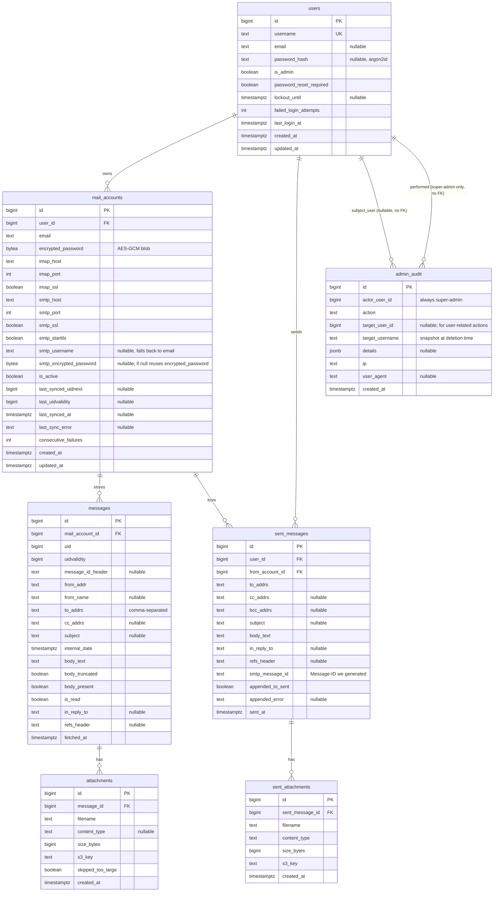

# 03. Data Model

Основная БД — **PostgreSQL 16**. Имя БД: `mail_aggregator`. Кодировка: UTF-8. Часовые зоны — все TIMESTAMP-поля `TIMESTAMPTZ`, хранятся в UTC.

Все ID — `BIGSERIAL`/`BIGINT` (кроме `users.id` — то же). UUID не используем (реляции компактнее на BIGINT). Если в будущем потребуется внешняя экспонируемая идентификация — добавим `public_id UUID`.

---

## ER-диаграмма

---

## Таблицы (DDL-friendly описание)

### `users`

| Колонка | Тип | Constraints | Описание |
| --- | --- | --- | --- |
| `id` | BIGSERIAL | PRIMARY KEY | |
| `username` | TEXT | NOT NULL, UNIQUE | Lower-case стандарт; CITEXT не используем — нормализуем на уровне приложения. |
| `email` | TEXT | NULL | Опциональный email пользователя (для будущего; сейчас не используется). |
| `password_hash` | VARCHAR(255) | NULL | argon2id. NULL — пароль ещё не задан или сброшен. |
| `is_admin` | BOOLEAN | NOT NULL DEFAULT false | true только для одного супер-админа из env. |
| `password_reset_required` | BOOLEAN | NOT NULL DEFAULT true | После seed/сброса — true; после установки пароля — false. |
| `lockout_until` | TIMESTAMPTZ | NULL | Если заполнено и > now() — login отклоняется (см. ADR-0009). |
| `failed_login_attempts` | INT | NOT NULL DEFAULT 0 | Сбрасывается при успешном login или истечении lockout. |
| `last_login_at` | TIMESTAMPTZ | NULL | |
| `created_at` | TIMESTAMPTZ | NOT NULL DEFAULT now() | |
| `updated_at` | TIMESTAMPTZ | NOT NULL DEFAULT now() | Обновляется триггером или из приложения. |

**Индексы:**
- `UNIQUE (username)` — реализовано через UNIQUE constraint.
- `INDEX (is_admin) WHERE is_admin = true` — partial; для быстрого поиска админа на старте.

**Триггер:**
- `BEFORE UPDATE ON users` — `NEW.updated_at = now()`.

---

### `mail_accounts`

| Колонка | Тип | Constraints | Описание |
| --- | --- | --- | --- |
| `id` | BIGSERIAL | PK | |
| `user_id` | BIGINT | NOT NULL, FK → `users(id)` ON DELETE CASCADE | |
| `email` | TEXT | NOT NULL | Адрес почты пользователя в этом сервисе. |
| `encrypted_password` | BYTEA | NOT NULL | AES-256-GCM blob (см. ADR-0005). |
| `imap_host` | TEXT | NOT NULL | |
| `imap_port` | INT | NOT NULL DEFAULT 993 | |
| `imap_ssl` | BOOLEAN | NOT NULL DEFAULT true | |
| `smtp_host` | TEXT | NOT NULL | |
| `smtp_port` | INT | NOT NULL DEFAULT 465 | |
| `smtp_ssl` | BOOLEAN | NOT NULL DEFAULT true | true = SSL on connect (порт 465). |
| `smtp_starttls` | BOOLEAN | NOT NULL DEFAULT false | true для порта 587. Взаимоисключаемо с `smtp_ssl`. |
| `smtp_username` | TEXT | NULL | Если NULL — использовать `email`. |
| `smtp_encrypted_password` | BYTEA | NULL | Если NULL — использовать `encrypted_password`. |
| `is_active` | BOOLEAN | NOT NULL DEFAULT true | false → worker пропускает. Может быть выключен пользователем или автоматически при 3 fail (см. ADR-0008). |
| `last_synced_uidnext` | BIGINT | NULL | UIDNEXT INBOX, зафиксированный после последнего успешного цикла. |
| `last_uidvalidity` | BIGINT | NULL | UIDVALIDITY INBOX. |
| `last_synced_at` | TIMESTAMPTZ | NULL | |
| `last_sync_error` | TEXT | NULL | Краткое описание последней ошибки (без секретов). |
| `consecutive_failures` | INT | NOT NULL DEFAULT 0 | Сброс на 0 при успешном цикле. |
| `created_at` | TIMESTAMPTZ | NOT NULL DEFAULT now() | |
| `updated_at` | TIMESTAMPTZ | NOT NULL DEFAULT now() | |

**Constraints:**
- CHECK `imap_port BETWEEN 1 AND 65535`, `smtp_port BETWEEN 1 AND 65535`.
- CHECK `NOT (smtp_ssl AND smtp_starttls)` — взаимоисключающие.
- UNIQUE `(user_id, email)` — один пользователь не может дважды добавить ту же почту.

**Индексы:**
- `INDEX (user_id)` — FK lookup.
- `INDEX (is_active) WHERE is_active = true` — для worker.

---

### `messages`

| Колонка | Тип | Constraints | Описание |
| --- | --- | --- | --- |
| `id` | BIGSERIAL | PK | |
| `mail_account_id` | BIGINT | NOT NULL, FK → `mail_accounts(id)` ON DELETE CASCADE | |
| `uid` | BIGINT | NOT NULL | IMAP UID. |
| `uidvalidity` | BIGINT | NOT NULL | IMAP UIDVALIDITY на момент сохранения. |
| `message_id_header` | TEXT | NULL | RFC 822 Message-ID. |
| `from_addr` | TEXT | NOT NULL | Email отправителя. |
| `from_name` | TEXT | NULL | Display name. |
| `to_addrs` | TEXT | NOT NULL DEFAULT '' | Comma-separated. |
| `cc_addrs` | TEXT | NULL | |
| `subject` | TEXT | NULL | |
| `internal_date` | TIMESTAMPTZ | NOT NULL | INTERNALDATE. |
| `body_text` | TEXT | NOT NULL DEFAULT '' | Plain-text тело (см. ADR-0012). Max 1 MiB. |
| `body_truncated` | BOOLEAN | NOT NULL DEFAULT false | |
| `body_present` | BOOLEAN | NOT NULL DEFAULT true | false если ни text/plain, ни text/html не было. |
| `is_read` | BOOLEAN | NOT NULL DEFAULT false | Локальный флаг, не синкается обратно в IMAP. |
| `in_reply_to` | TEXT | NULL | RFC 822 In-Reply-To. |
| `refs_header` | TEXT | NULL | RFC 822 References. |
| `fetched_at` | TIMESTAMPTZ | NOT NULL DEFAULT now() | |

**Constraints:**
- UNIQUE `(mail_account_id, uidvalidity, uid)` — идемпотентность (см. ADR-0008).

**Индексы:**
- `INDEX (mail_account_id, internal_date DESC)` — основной для inbox listing per account.
- `INDEX (mail_account_id, is_read) WHERE is_read = false` — частичный, для счётчика непрочитанных.
- `INDEX (internal_date)` — для retention cleanup.

---

### `attachments`

| Колонка | Тип | Constraints | Описание |
| --- | --- | --- | --- |
| `id` | BIGSERIAL | PK | |
| `message_id` | BIGINT | NOT NULL, FK → `messages(id)` ON DELETE CASCADE | |
| `filename` | TEXT | NOT NULL | Original filename (sanitized для s3_key, исходный для UI). |
| `content_type` | TEXT | NULL | MIME type. |
| `size_bytes` | BIGINT | NOT NULL | |
| `s3_key` | TEXT | NOT NULL | Полный ключ в bucket `mail-attachments`. |
| `skipped_too_large` | BOOLEAN | NOT NULL DEFAULT false | true → объект НЕ загружен в MinIO; запись для UI/audit. |
| `created_at` | TIMESTAMPTZ | NOT NULL DEFAULT now() | |

**Индексы:**
- `INDEX (message_id)` — FK lookup.

---

### `sent_messages`

| Колонка | Тип | Constraints | Описание |
| --- | --- | --- | --- |
| `id` | BIGSERIAL | PK | |
| `user_id` | BIGINT | NOT NULL, FK → `users(id)` ON DELETE CASCADE | |
| `from_account_id` | BIGINT | NOT NULL, FK → `mail_accounts(id)` ON DELETE CASCADE | |
| `to_addrs` | TEXT | NOT NULL | |
| `cc_addrs` | TEXT | NULL | |
| `bcc_addrs` | TEXT | NULL | |
| `subject` | TEXT | NULL | |
| `body_text` | TEXT | NOT NULL | |
| `in_reply_to` | TEXT | NULL | |
| `refs_header` | TEXT | NULL | |
| `smtp_message_id` | TEXT | NOT NULL | Сгенерированный сервисом Message-ID (`<uuid@aggregator-host>`). |
| `appended_to_sent` | BOOLEAN | NOT NULL DEFAULT false | true — успешно положено в IMAP/Sent. |
| `appended_error` | TEXT | NULL | Если не удалось — описание. |
| `sent_at` | TIMESTAMPTZ | NOT NULL DEFAULT now() | |

**Индексы:**
- `INDEX (user_id, sent_at DESC)`.
- `INDEX (from_account_id)`.

---

### `sent_attachments`

| Колонка | Тип | Constraints | Описание |
| --- | --- | --- | --- |
| `id` | BIGSERIAL | PK | |
| `sent_message_id` | BIGINT | NOT NULL, FK → `sent_messages(id)` ON DELETE CASCADE | |
| `filename` | TEXT | NOT NULL | |
| `content_type` | TEXT | NULL | |
| `size_bytes` | BIGINT | NOT NULL | |
| `s3_key` | TEXT | NOT NULL | |
| `created_at` | TIMESTAMPTZ | NOT NULL DEFAULT now() | |

**Примечание для исполнителя:** на текущей итерации UI **не предлагает** прикреплять файлы при отправке (см. `08-frontend.md`). Таблица создаётся пустой и зарезервирована под будущую функциональность; FK + DDL гарантируют, что миграция не понадобится при включении фичи. Если backend-агент примет решение реализовать аттачи в первой версии — он должен поднять Q к архитектору перед изменением UX.

---

### `admin_audit`

| Колонка | Тип | Constraints | Описание |
| --- | --- | --- | --- |
| `id` | BIGSERIAL | PK | |
| `actor_user_id` | BIGINT | NOT NULL | id супер-админа. **БЕЗ FK** (запись должна жить даже если случайно удалили админа из БД; см. seed-логику). |
| `action` | TEXT | NOT NULL | Enum-string: `admin_login`, `admin_logout`, `create_user`, `reset_password`, `delete_user`, `lockout_triggered`, `account_auto_disabled`. |
| `target_user_id` | BIGINT | NULL | id затронутого пользователя (для user-actions). |
| `target_username` | TEXT | NULL | snapshot username на случай delete. |
| `details` | JSONB | NULL | Произвольная структурированная информация (например, для `account_auto_disabled` — `{mail_account_id, reason}`). |
| `ip` | TEXT | NULL | Удалённый IP админа. |
| `user_agent` | TEXT | NULL | Усечённый до 256 символов. |
| `created_at` | TIMESTAMPTZ | NOT NULL DEFAULT now() | |

**Индексы:**
- `INDEX (created_at DESC)`.
- `INDEX (actor_user_id, created_at DESC)`.
- `INDEX (target_user_id)` WHERE target_user_id IS NOT NULL.

**Ретенция аудита:** **бессрочная**. Объём ничтожный (несколько действий в день). Если понадобится — отдельный ADR.

---

## Каскады удаления — сводная таблица

| Удаление чего | Что каскадно удаляется (Postgres ON DELETE CASCADE) | Что чистится приложением |
| --- | --- | --- |
| `users(id)` | `mail_accounts`, `sent_messages`, `sent_attachments`, `messages` (через `mail_accounts → messages → attachments`), `attachments` | Объекты MinIO по префиксу `{user_id}/`; все session keys (Redis); запись в `admin_audit` (action=delete_user) |
| `mail_accounts(id)` | `messages`, `attachments`, `sent_messages` (FK from_account_id) | Объекты MinIO по префиксу `{user_id}/{mail_account_id}/` |
| `messages(id)` (retention) | `attachments` | Объекты MinIO по prefix `{user_id}/{mail_account_id}/{uid}/` |

Приложение перед каждым DELETE собирает список s3_key заранее (одним SELECT) и удаляет объекты MinIO, потом DELETE из БД. Транзакционности между MinIO и Postgres нет; в случае сбоя возможны "осиротевшие" объекты — это допустимо (cleanup `orphan_scan` в backlog).

---

## Объёмные оценки

- ~5 пользователей × ~100 ящиков = 500 строк `mail_accounts`.
- 500 ящиков × ~50 писем/день × 30 дней = **750 000 max** строк `messages`.
- При среднем размере 50 KiB и 0.3 attachments/письмо: ~200 000 объектов в MinIO, ~10–15 GiB.
- Размер БД (без TOAST вне `body_text`): ~5–10 GiB на пике.

---

## Миграции

- Используем Alembic (см. `02-tech-stack.md`). Каждая миграция — отдельный файл в `backend/migrations/versions/`.
- **Первая миграция (V001_initial)** создаёт всю схему выше + триггеры `updated_at`.
- Seed супер-админа — отдельная init-фаза приложения (не миграция; см. `05-modules.md → admin module → seed flow`).
