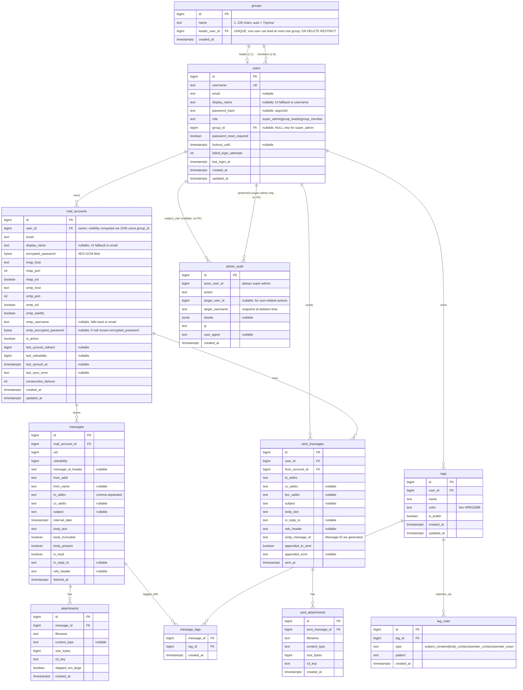

# 03. Data Model

Основная БД — **PostgreSQL 16**. Имя БД: `mail_aggregator`. Кодировка: UTF-8. Часовые зоны — все TIMESTAMP-поля `TIMESTAMPTZ`, хранятся в UTC.

Все ID — `BIGSERIAL`/`BIGINT` (кроме `users.id` — то же). UUID не используем (реляции компактнее на BIGINT). Если в будущем потребуется внешняя экспонируемая идентификация — добавим `public_id UUID`.

---

## ER-диаграмма



---

## Таблицы (DDL-friendly описание)

### `users`

| Колонка | Тип | Constraints | Описание |
| --- | --- | --- | --- |
| `id` | BIGSERIAL | PRIMARY KEY | |
| `username` | TEXT | NOT NULL, UNIQUE | Lower-case стандарт; CITEXT не используем — нормализуем на уровне приложения. |
| `email` | TEXT | NULL | Опциональный email пользователя (для будущего; сейчас не используется). |
| `display_name` | TEXT | NULL, CHECK length 1..100 | Человекочитаемое имя для UI; fallback в UI на `username` если NULL. Произвольная UTF-8 (включая русский). Введено в ADR-0019 §2 — также используется как источник для авто-имени группы при создании лидера (`"Группа {display_name | username}"`). |
| `password_hash` | VARCHAR(255) | NULL | argon2id. NULL — пароль ещё не задан или сброшен. |
| `role` | TEXT | NOT NULL DEFAULT `'group_member'`, CHECK IN (`'super_admin'`, `'group_leader'`, `'group_member'`) | Роль пользователя. См. ADR-0019. Заменяет старую колонку `is_admin: BOOLEAN` (миграция: `is_admin=true → role='super_admin'`, иначе → `role='group_member'`). `seed_super_admin` upsert'ит `role='super_admin'` для админа из env. |
| `group_id` | BIGINT | NULL, FK → `groups(id)` ON DELETE SET NULL, **DEFERRABLE INITIALLY DEFERRED** | Группа пользователя. NULL только для `super_admin`. См. ADR-0019 §4. DEFERRABLE — потому что при auto-create группы (новый лидер) сначала вставляется user, потом groups, потом UPDATE users.group_id; FK-проверка должна откладываться до COMMIT. |
| `password_reset_required` | BOOLEAN | NOT NULL DEFAULT true | После seed/сброса — true; после установки пароля — false. |
| `lockout_until` | TIMESTAMPTZ | NULL | Если заполнено и > now() — login отклоняется (см. ADR-0009). |
| `failed_login_attempts` | INT | NOT NULL DEFAULT 0 | Сбрасывается при успешном login или истечении lockout. |
| `last_login_at` | TIMESTAMPTZ | NULL | |
| `created_at` | TIMESTAMPTZ | NOT NULL DEFAULT now() | |
| `updated_at` | TIMESTAMPTZ | NOT NULL DEFAULT now() | Обновляется триггером или из приложения. |

**CHECK-constraints (см. ADR-0019 §6):**
- `users_role_check` — `role IN ('super_admin', 'group_leader', 'group_member')`.
- `users_role_group_invariant` — табличный CHECK:
  ```sql
  CHECK (
      (role = 'super_admin'  AND group_id IS NULL) OR
      (role = 'group_leader' AND group_id IS NOT NULL) OR
      (role = 'group_member' AND group_id IS NOT NULL)
  )
  ```
- `users_display_name_length_check` — `display_name IS NULL OR char_length(display_name) BETWEEN 1 AND 100`.

**Триггер инвариантов лидерства** (`users_group_leader_consistency_check`, см. ADR-0019 §6):
- AFTER INSERT OR UPDATE OF `role`, `group_id` ON `users`, DEFERRABLE INITIALLY DEFERRED.
- Гарантирует, что при `role='group_leader'` строка существует в `groups` с `groups.id = users.group_id` И `groups.leader_user_id = users.id`. Иначе RAISE EXCEPTION.
- Backend-сервис (`AdminService`) дополнительно валидирует ДО SQL для понятных error-codes; триггер — defense-in-depth.

**Индексы:**
- `UNIQUE (username)` — реализовано через UNIQUE constraint.
- `INDEX (role) WHERE role = 'super_admin'` — partial; для быстрого поиска админа на старте (заменяет старый `(is_admin) WHERE is_admin = true`).
- `INDEX (group_id) WHERE group_id IS NOT NULL` — для фильтрации по visibility (см. модули `messages`, `accounts`).

**Триггер `updated_at`:**
- `BEFORE UPDATE ON users` — `NEW.updated_at = now()`.

---

### `groups`

Источник истины — [ADR-0019](./adr/ADR-0019-groups-and-roles.md). Группа = ровно один лидер + 0..N участников. Один user может быть лидером максимум одной группы (UNIQUE).

| Колонка | Тип | Constraints | Описание |
| --- | --- | --- | --- |
| `id` | BIGSERIAL | PRIMARY KEY | |
| `name` | TEXT | NOT NULL, CHECK length 1..100 | Имя группы. Авто-генерация при создании лидера: `"Группа {leader.display_name \| leader.username}"`. Может быть переименована super-admin'ом через `PATCH /api/admin/groups/{id}`. |
| `leader_user_id` | BIGINT | NOT NULL, UNIQUE, FK → `users(id)` ON DELETE RESTRICT | Лидер группы. UNIQUE → один user не может быть лидером больше одной группы. ON DELETE RESTRICT → нельзя удалить user'а, пока он лидер; super-admin сначала удаляет группу, потом — user'а. |
| `created_at` | TIMESTAMPTZ | NOT NULL DEFAULT now() | |

**Индексы:**
- `UNIQUE (leader_user_id)` — implied UNIQUE constraint.
- (PK на `id` уже есть — для FK-lookups из `users.group_id`.)

**Каскады:**
- `users.group_id → groups(id) ON DELETE SET NULL` — при удалении группы все её участники получают `group_id = NULL`. Backend (`AdminService.delete_group`) **дополнительно** в той же транзакции UPDATE'ит участников: для тех, у кого `role='group_member'`, устанавливает `role` остаётся `'group_member'` (но `group_id=NULL` из-за SET NULL — это нарушает CHECK-инвариант!). **Поэтому**: `delete_group` обязан **в одной транзакции** либо удалить пользователей-членов, либо переназначить им группу, либо изменить их `role`. **Принятое решение**: при `delete_group` super-admin в UI явно подтверждает действие, backend в одной транзакции:
  1. Лидер: `role='group_member'`, `group_id=NULL` (что снова нарушает CHECK!) — поэтому фактически: лидер становится **«висящим» group_member без группы**, что запрещено CHECK. **Корректное решение**: backend требует, чтобы super-admin перед `DELETE /api/admin/groups/{id}` **сначала** через `PATCH /api/admin/users/{leader_id}` перевёл лидера в другую группу или назначил `role='super_admin'` (что невозможно — super_admin один), либо удалил всех участников. На практике — UI flow: super-admin при попытке удалить группу видит список участников и обязан либо переназначить их в другую группу, либо удалить, прежде чем удалится сама группа. **Backend выбрасывает 400 `group_has_members`**, если в группе остались users.
  2. Лидер удалить тоже нельзя из-за `ON DELETE RESTRICT`. То есть итог: чтобы удалить группу — super-admin должен сначала «опустошить» её (всех участников и лидера перевести/удалить).

  Это последовательно с инвариантами: `group_leader.group_id IS NOT NULL`, `group_member.group_id IS NOT NULL`. ON DELETE SET NULL на FK сохраняется как **safety-net** (если кто-то обойдёт backend и сделает прямой DELETE FROM groups — БД хотя бы не оставит dangling-FK), но штатный flow всегда проходит через backend-валидацию.

**Объём:** ≤ 5 групп на старте.

---

### `mail_accounts`

| Колонка | Тип | Constraints | Описание |
| --- | --- | --- | --- |
| `id` | BIGSERIAL | PK | |
| `user_id` | BIGINT | NOT NULL, FK → `users(id)` ON DELETE CASCADE | Владелец mail-аккаунта. Visibility (super_admin / group_leader / group_member) определяется через JOIN `mail_accounts.user_id → users.group_id` (см. ADR-0019 §7.1). |
| `email` | TEXT | NOT NULL | Адрес почты пользователя в этом сервисе. |
| `display_name` | TEXT | NULL, CHECK length 1..100 | Никнейм / ярлык для UI. Если задан — показывается вместо `email` (см. ADR-0020). Не уникален. Любая UTF-8 строка 1..100 (после trim'а пустая интерпретируется как NULL). |
| `encrypted_password` | BYTEA | NOT NULL | AES-256-GCM blob (см. ADR-0005). |
| `imap_host` | TEXT | NOT NULL | |
| `imap_port` | INT | NOT NULL DEFAULT 993 | |
| `imap_ssl` | BOOLEAN | NOT NULL DEFAULT true | |
| `smtp_host` | TEXT | NOT NULL | |
| `smtp_port` | INT | NOT NULL DEFAULT 465 | |
| `smtp_ssl` | BOOLEAN | NOT NULL DEFAULT true | true = SSL on connect (порт 465). |
| `smtp_starttls` | BOOLEAN | NOT NULL DEFAULT false | true для порта 587. Взаимоисключаемо с `smtp_ssl`. |
| `smtp_username` | TEXT | NULL | Если NULL — использовать `email`. |
| `smtp_encrypted_password` | BYTEA | NULL | Если NULL — использовать `encrypted_password`. |
| `is_active` | BOOLEAN | NOT NULL DEFAULT true | false → worker пропускает. Может быть выключен пользователем или автоматически при 3 fail (см. ADR-0008). |
| `last_synced_uidnext` | BIGINT | NULL | UIDNEXT INBOX, зафиксированный после последнего успешного цикла. |
| `last_uidvalidity` | BIGINT | NULL | UIDVALIDITY INBOX. |
| `last_synced_at` | TIMESTAMPTZ | NULL | |
| `last_sync_error` | TEXT | NULL | Краткое описание последней ошибки (без секретов). |
| `consecutive_failures` | INT | NOT NULL DEFAULT 0 | Сброс на 0 при успешном цикле. |
| `created_at` | TIMESTAMPTZ | NOT NULL DEFAULT now() | |
| `updated_at` | TIMESTAMPTZ | NOT NULL DEFAULT now() | |

**Constraints:**
- CHECK `imap_port BETWEEN 1 AND 65535`, `smtp_port BETWEEN 1 AND 65535`.
- CHECK `NOT (smtp_ssl AND smtp_starttls)` — взаимоисключающие.
- CHECK `display_name IS NULL OR char_length(display_name) BETWEEN 1 AND 100` (см. ADR-0020).
- UNIQUE `(user_id, email)` — один пользователь не может дважды добавить ту же почту.

**Индексы:**
- `INDEX (user_id)` — FK lookup.
- `INDEX (is_active) WHERE is_active = true` — для worker.

---

### `messages`

| Колонка | Тип | Constraints | Описание |
| --- | --- | --- | --- |
| `id` | BIGSERIAL | PK | |
| `mail_account_id` | BIGINT | NOT NULL, FK → `mail_accounts(id)` ON DELETE CASCADE | |
| `uid` | BIGINT | NOT NULL | IMAP UID. |
| `uidvalidity` | BIGINT | NOT NULL | IMAP UIDVALIDITY на момент сохранения. |
| `message_id_header` | TEXT | NULL | RFC 822 Message-ID. |
| `from_addr` | TEXT | NOT NULL | Email отправителя. |
| `from_name` | TEXT | NULL | Display name. |
| `to_addrs` | TEXT | NOT NULL DEFAULT '' | Comma-separated. |
| `cc_addrs` | TEXT | NULL | |
| `subject` | TEXT | NULL | |
| `internal_date` | TIMESTAMPTZ | NOT NULL | INTERNALDATE. |
| `body_text` | TEXT | NOT NULL DEFAULT '' | Plain-text тело (см. ADR-0012). Max 1 MiB. |
| `body_truncated` | BOOLEAN | NOT NULL DEFAULT false | |
| `body_present` | BOOLEAN | NOT NULL DEFAULT true | false если ни text/plain, ни text/html не было. |
| `is_read` | BOOLEAN | NOT NULL DEFAULT false | Локальный флаг, не синкается обратно в IMAP. |
| `in_reply_to` | TEXT | NULL | RFC 822 In-Reply-To. |
| `refs_header` | TEXT | NULL | RFC 822 References. |
| `fetched_at` | TIMESTAMPTZ | NOT NULL DEFAULT now() | |

**Constraints:**
- UNIQUE `(mail_account_id, uidvalidity, uid)` — идемпотентность (см. ADR-0008).

**Индексы:**
- `INDEX (mail_account_id, internal_date DESC)` — основной для inbox listing per account.
- `INDEX (mail_account_id, is_read) WHERE is_read = false` — частичный, для счётчика непрочитанных.
- `INDEX (internal_date)` — для retention cleanup.

---

### `attachments`

| Колонка | Тип | Constraints | Описание |
| --- | --- | --- | --- |
| `id` | BIGSERIAL | PK | |
| `message_id` | BIGINT | NOT NULL, FK → `messages(id)` ON DELETE CASCADE | |
| `filename` | TEXT | NOT NULL | Original filename (sanitized для s3_key, исходный для UI). |
| `content_type` | TEXT | NULL | MIME type. |
| `size_bytes` | BIGINT | NOT NULL | |
| `s3_key` | TEXT | NOT NULL | Полный ключ в bucket `mail-attachments`. |
| `skipped_too_large` | BOOLEAN | NOT NULL DEFAULT false | true → объект НЕ загружен в MinIO; запись для UI/audit. |
| `created_at` | TIMESTAMPTZ | NOT NULL DEFAULT now() | |

**Индексы:**
- `INDEX (message_id)` — FK lookup.

---

### `sent_messages`

| Колонка | Тип | Constraints | Описание |
| --- | --- | --- | --- |
| `id` | BIGSERIAL | PK | |
| `user_id` | BIGINT | NOT NULL, FK → `users(id)` ON DELETE CASCADE | |
| `from_account_id` | BIGINT | NOT NULL, FK → `mail_accounts(id)` ON DELETE CASCADE | |
| `to_addrs` | TEXT | NOT NULL | |
| `cc_addrs` | TEXT | NULL | |
| `bcc_addrs` | TEXT | NULL | |
| `subject` | TEXT | NULL | |
| `body_text` | TEXT | NOT NULL | |
| `in_reply_to` | TEXT | NULL | |
| `refs_header` | TEXT | NULL | |
| `smtp_message_id` | TEXT | NOT NULL | Сгенерированный сервисом Message-ID (`<uuid@aggregator-host>`). |
| `appended_to_sent` | BOOLEAN | NOT NULL DEFAULT false | true — успешно положено в IMAP/Sent. |
| `appended_error` | TEXT | NULL | Если не удалось — описание. |
| `sent_at` | TIMESTAMPTZ | NOT NULL DEFAULT now() | |

**Индексы:**
- `INDEX (user_id, sent_at DESC)`.
- `INDEX (from_account_id)`.

---

### `sent_attachments`

| Колонка | Тип | Constraints | Описание |
| --- | --- | --- | --- |
| `id` | BIGSERIAL | PK | |
| `sent_message_id` | BIGINT | NOT NULL, FK → `sent_messages(id)` ON DELETE CASCADE | |
| `filename` | TEXT | NOT NULL | |
| `content_type` | TEXT | NULL | |
| `size_bytes` | BIGINT | NOT NULL | |
| `s3_key` | TEXT | NOT NULL | |
| `created_at` | TIMESTAMPTZ | NOT NULL DEFAULT now() | |

**Примечание для исполнителя:** на текущей итерации UI **не предлагает** прикреплять файлы при отправке (см. `08-frontend.md`). Таблица создаётся пустой и зарезервирована под будущую функциональность; FK + DDL гарантируют, что миграция не понадобится при включении фичи. Если backend-агент примет решение реализовать аттачи в первой версии — он должен поднять Q к архитектору перед изменением UX.

---

### `admin_audit`

| Колонка | Тип | Constraints | Описание |
| --- | --- | --- | --- |
| `id` | BIGSERIAL | PK | |
| `actor_user_id` | BIGINT | NOT NULL | id супер-админа. **БЕЗ FK** (запись должна жить даже если случайно удалили админа из БД; см. seed-логику). |
| `action` | TEXT | NOT NULL | Enum-string: `admin_login`, `admin_logout`, `create_user`, `reset_password`, `delete_user`, `lockout_triggered`, `account_auto_disabled`, **`group_create`**, **`group_delete`**, **`group_rename`**, **`user_role_change`**, **`user_group_change`** (новые из ADR-0019 §9). |
| `target_user_id` | BIGINT | NULL | id затронутого пользователя (для user-actions). |
| `target_username` | TEXT | NULL | snapshot username на случай delete. |
| `details` | JSONB | NULL | Произвольная структурированная информация (например, для `account_auto_disabled` — `{mail_account_id, reason}`). |
| `ip` | TEXT | NULL | Удалённый IP админа. |
| `user_agent` | TEXT | NULL | Усечённый до 256 символов. |
| `created_at` | TIMESTAMPTZ | NOT NULL DEFAULT now() | |

**Индексы:**
- `INDEX (created_at DESC)`.
- `INDEX (actor_user_id, created_at DESC)`.
- `INDEX (target_user_id)` WHERE target_user_id IS NOT NULL.

**Ретенция аудита:** **бессрочная**. Объём ничтожный (несколько действий в день). Если понадобится — отдельный ADR.

---

### `tags`

Источник истины — [ADR-0017](./adr/ADR-0017-tags.md). Per-user классификационные метки, прикладываемые к `messages` через rule-based матчинг.

| Колонка | Тип | Constraints | Описание |
| --- | --- | --- | --- |
| `id` | BIGSERIAL | PK | |
| `user_id` | BIGINT | NOT NULL, FK → `users(id)` ON DELETE CASCADE | Владелец тега. Tag всегда per-user. |
| `name` | TEXT | NOT NULL | Видимое имя тега (1..64 символа; UI-валидация). Произвольная строка, в т.ч. кириллица. |
| `color` | TEXT | NOT NULL | Hex `#RRGGBB`. Backend валидирует: (а) regex `^#[0-9A-Fa-f]{6}$`; (б) значение принадлежит whitelist из 8 цветов палитры (см. `08-frontend.md` сек. 5.1). UI выбирает radio-кнопкой из палитры. |
| `is_builtin` | BOOLEAN | NOT NULL DEFAULT false | true для 4 системных тегов (`DPLA.PLA`, `Диспут`, `Отменить подписку`, `Продление аккаунта`). Запрет на DELETE; rules/name/color редактируемы. |
| `created_at` | TIMESTAMPTZ | NOT NULL DEFAULT now() | |
| `updated_at` | TIMESTAMPTZ | NOT NULL DEFAULT now() | Обновляется триггером `BEFORE UPDATE ON tags`. |

**Constraints:**
- UNIQUE `(user_id, name)` — у одного пользователя не может быть двух тегов с одним именем.
- CHECK `char_length(name) BETWEEN 1 AND 64`.
- CHECK `color ~ '^#[0-9A-Fa-f]{6}$'`.

**Индексы:**
- `INDEX (user_id)` — list-tags-for-user (часто, при каждом рендере inbox для filter dropdown).

**Триггер:** `BEFORE UPDATE ON tags` — `NEW.updated_at = now()`.

**Объём:** ≤ 5 пользователей × ~20 тегов = ≤ 100 строк.

---

### `tag_rules`

Правила, по которым тег прикладывается к письмам. Несколько rules для одного тега — соединяются логическим **OR** (см. ADR-0017 §3).

| Колонка | Тип | Constraints | Описание |
| --- | --- | --- | --- |
| `id` | BIGSERIAL | PK | |
| `tag_id` | BIGINT | NOT NULL, FK → `tags(id)` ON DELETE CASCADE | |
| `type` | TEXT | NOT NULL | Enum-string: `subject_contains` \| `body_contains` \| `sender_contains` \| `sender_exact`. CHECK constraint. |
| `pattern` | TEXT | NOT NULL | Подстрока (для `*_contains`) или полный email (для `sender_exact`). 1..256 символов. |
| `created_at` | TIMESTAMPTZ | NOT NULL DEFAULT now() | |

**Constraints:**
- CHECK `type IN ('subject_contains','body_contains','sender_contains','sender_exact')`.
- CHECK `char_length(pattern) BETWEEN 1 AND 256`.

**Индексы:**
- `INDEX (tag_id)` — load-rules-for-tag.

**Не делается:**
- Нет UNIQUE `(tag_id, type, pattern)` — пользователь сознательно может продублировать; приложение может предупредить, но не блокирует. Дубль не ломает SQL (`INSERT message_tags ... ON CONFLICT DO NOTHING`).

**Объём:** ≤ 100 тегов × ~5 rules = ≤ 500 строк.

---

### `message_tags`

Many-to-many линки тегов и сообщений. Создаются worker'ом при синке (см. `05-modules.md` модуль `tags`) и synchronous'но при `apply_to_existing` через API.

| Колонка | Тип | Constraints | Описание |
| --- | --- | --- | --- |
| `message_id` | BIGINT | NOT NULL, FK → `messages(id)` ON DELETE CASCADE | |
| `tag_id` | BIGINT | NOT NULL, FK → `tags(id)` ON DELETE CASCADE | |
| `created_at` | TIMESTAMPTZ | NOT NULL DEFAULT now() | |

**Constraints:**
- PRIMARY KEY `(message_id, tag_id)` — идемпотентность, один линк на пару.

**Индексы:**
- PK `(message_id, tag_id)` — также служит как индекс для list-tags-for-message.
- `INDEX (tag_id, message_id)` — обратная сортировка для list-messages-with-tag (inbox filter `tag_id`).

**Объём (верхняя граница):** 750 000 messages × среднее 3 tags/message = ~2.25M строк ≈ 110 MB. Постоянно очищается через CASCADE при retention cleanup `messages`.

---

### Заполнение builtin-тегов

Builtin-теги создаются **не через миграцию**, а через **post-login hook** в `auth.AuthService` — при первом успешном login пользователя или завершении set-password flow (см. ADR-0017 §6 и `05-modules.md` модуль `auth`). Реализация — в `backend/app/tags/builtin.py` (статичный список из 4 объектов).

Псевдокод (для исполнителя — это всё в коде, не в DDL):

```python
BUILTIN_TAGS = [
    {"name": "DPLA.PLA", "color": "#2563eb", "rules": [
        {"type": "subject_contains", "pattern": "DPLA"},
        {"type": "subject_contains", "pattern": "PLA"},
        {"type": "body_contains",    "pattern": "DPLA"},
        {"type": "body_contains",    "pattern": "PLA"},
    ]},
    {"name": "Диспут", "color": "#dc2626", "rules": [
        {"type": "subject_contains", "pattern": "Apple Inc"},
        {"type": "sender_exact",     "pattern": "AppStoreNotices@apple.com"},
    ]},
    {"name": "Отменить подписку", "color": "#f59e0b", "rules": [
        {"type": "body_contains", "pattern": "cancel"},
        {"type": "body_contains", "pattern": "subscription"},
    ]},
    {"name": "Продление аккаунта", "color": "#16a34a", "rules": [
        {"type": "body_contains", "pattern": "Your Distribution Certificate will no longer be valid in 30 days"},
    ]},
]
```

`TagsService.ensure_builtin_tags(user_id)`:
1. `SELECT 1 FROM tags WHERE user_id=:uid AND is_builtin=true LIMIT 1` — если есть, return.
2. Иначе — в одной транзакции INSERT всех 4 tags + tag_rules.

Идемпотентен: повторный вызов NoOp.

---

## Каскады удаления — сводная таблица

| Удаление чего | Что каскадно удаляется (Postgres ON DELETE CASCADE) | Что чистится приложением |
| --- | --- | --- |
| `users(id)` | `mail_accounts`, `sent_messages`, `sent_attachments`, `messages` (через `mail_accounts → messages → attachments`), `attachments`, `tags`, `tag_rules` (через `tags`), `message_tags` (через `tags` и `messages`) | Объекты MinIO по префиксу `{user_id}/`; все session keys (Redis); запись в `admin_audit` (action=delete_user). **Защита от удаления лидера** — `groups.leader_user_id ON DELETE RESTRICT` (см. ADR-0019 §3): нельзя удалить user'а, пока он лидер; super-admin сначала удаляет группу. |
| `mail_accounts(id)` | `messages`, `attachments`, `sent_messages` (FK from_account_id), `message_tags` (через `messages`) | Объекты MinIO по префиксу `{user_id}/{mail_account_id}/` |
| `messages(id)` (retention) | `attachments`, `message_tags` | Объекты MinIO по prefix `{user_id}/{mail_account_id}/{uid}/` |
| `tags(id)` (user delete tag) | `tag_rules`, `message_tags` | — |
| `groups(id)` (super-admin delete group) | `users.group_id` → SET NULL (FK ON DELETE SET NULL — см. ADR-0019 §4) | Backend ОБЯЗАН в той же транзакции: проверить, что в группе нет участников (`SELECT 1 FROM users WHERE group_id = :group_id`) и нет лидера (тот же group). Если есть — `400 group_has_members`. Super-admin сначала переназначает участников / переводит лидера, потом удаляет группу. SET NULL остаётся как safety-net для прямого DDL обхода. |

Приложение перед каждым DELETE собирает список s3_key заранее (одним SELECT) и удаляет объекты MinIO, потом DELETE из БД. Транзакционности между MinIO и Postgres нет; в случае сбоя возможны "осиротевшие" объекты — это допустимо (cleanup `orphan_scan` в backlog).

---

## Объёмные оценки

- ~5 пользователей × ~100 ящиков = 500 строк `mail_accounts`.
- 500 ящиков × ~50 писем/день × 30 дней = **750 000 max** строк `messages`.
- При среднем размере 50 KiB и 0.3 attachments/письмо: ~200 000 объектов в MinIO, ~10–15 GiB.
- Размер БД (без TOAST вне `body_text`): ~5–10 GiB на пике.
- `tags`: ≤ 100 строк; `tag_rules`: ≤ 500 строк; `message_tags`: ≤ 2.25M строк ≈ 110 MB (см. ADR-0017).

---

## Миграции

- Используем Alembic (см. `02-tech-stack.md`). Каждая миграция — отдельный файл в `backend/migrations/versions/`.
- **Первая миграция (V001_initial)** создаёт всю схему выше + триггеры `updated_at` (за исключением tags-таблиц — см. ниже).
- Seed супер-админа — отдельная init-фаза приложения (не миграция; см. `05-modules.md → admin module → seed flow`).
- **Миграция `002_add_tags`** (ADR-0017) создаёт `tags`, `tag_rules`, `message_tags` + триггер `updated_at` на `tags`. Builtin-теги в эту миграцию **не попадают** — они создаются post-login hook'ом (см. ADR-0017 §6).
- **Миграция `003_groups_and_roles`** (ADR-0019 + ADR-0020) — последовательность:
  1. `CREATE TABLE groups (...)` (см. секцию `groups` выше).
  2. `ALTER TABLE users ADD COLUMN role TEXT NULL` (nullable временно).
  3. `ALTER TABLE users ADD COLUMN display_name TEXT NULL`.
  4. `ALTER TABLE users ADD COLUMN group_id BIGINT NULL REFERENCES groups(id) ON DELETE SET NULL DEFERRABLE INITIALLY DEFERRED`.
  5. **Data-миграция** (см. ADR-0019 §1):
     ```sql
     UPDATE users SET role = 'super_admin' WHERE is_admin = true;
     UPDATE users SET role = 'group_member' WHERE is_admin = false;
     ```
  6. Закрепить constraint'ы:
     ```sql
     ALTER TABLE users ALTER COLUMN role SET NOT NULL;
     ALTER TABLE users ALTER COLUMN role SET DEFAULT 'group_member';
     ALTER TABLE users ADD CONSTRAINT users_role_check
         CHECK (role IN ('super_admin','group_leader','group_member'));
     ALTER TABLE users ADD CONSTRAINT users_role_group_invariant CHECK (
         (role = 'super_admin'  AND group_id IS NULL) OR
         (role = 'group_leader' AND group_id IS NOT NULL) OR
         (role = 'group_member' AND group_id IS NOT NULL)
     );
     ALTER TABLE users ADD CONSTRAINT users_display_name_length_check
         CHECK (display_name IS NULL OR char_length(display_name) BETWEEN 1 AND 100);
     ```
  7. Удалить старую колонку и старый индекс:
     ```sql
     DROP INDEX IF EXISTS users_is_admin_idx;
     ALTER TABLE users DROP COLUMN is_admin;
     ```
  8. Создать новые индексы:
     ```sql
     CREATE INDEX users_role_super_admin_idx ON users(role) WHERE role = 'super_admin';
     CREATE INDEX users_group_id_idx ON users(group_id) WHERE group_id IS NOT NULL;
     ```
  9. Создать функцию + констрейнт-триггер `users_group_leader_consistency_check` (DEFERRABLE INITIALLY DEFERRED) — DDL целиком в ADR-0019 §6.
  10. `ALTER TABLE mail_accounts ADD COLUMN display_name TEXT NULL`. Добавить CHECK `display_name IS NULL OR char_length(display_name) BETWEEN 1 AND 100`.

  **Запуск миграции и совместимость с existing-данными:**
  - Существующий super-admin (созданный seed'ом, `is_admin=true`) → `role='super_admin'`, `group_id=NULL`. Инвариант выполняется.
  - Существующие обычные пользователи → `role='group_member'`. Но `group_id IS NULL` → нарушает инвариант `users_role_group_invariant`!
  - **Решение для миграции** (важный edge case): если на момент миграции есть users с `is_admin=false` — миграция должна их обработать. Стратегия: `users_role_group_invariant` создаётся **NOT VALID** изначально, а `VALIDATE CONSTRAINT` выполняется отдельно после того, как **post-migration init-step** или сам super-admin вручную распределит существующих non-admin users по группам через UI.
    ```sql
    ALTER TABLE users ADD CONSTRAINT users_role_group_invariant CHECK (...) NOT VALID;
    ```
  - Альтернатива (проще, рекомендуемая для production deploy): на момент применения миграции в системе **есть только super-admin** (другие пользователи ещё не созданы или их < 5). Backend deploy script делает: «сначала миграция, затем super-admin создаёт группы и распределяет всех пользователей вручную через `/admin/groups` UI». Если есть legacy non-admin users — devops инструктируется (см. `07-deployment.md` release-notes этого спринта): создать дефолтную группу «Legacy» с лидером=super_admin (но super_admin не может быть лидером по инварианту — берётся первый non-admin user-кандидат или специально созданный технический user) и переназначить всех. Простейшая стратегия — на старте проекта (≤5 users все известны) — выполняется ручная одноразовая операция в Sprint deploy.
  - Рекомендуем NOT VALID-вариант как defense, плюс post-deploy ручной шаг распределения. Backend в любом случае при попытке UPDATE/INSERT users проверит инвариант (CHECK не NOT VALID после `VALIDATE CONSTRAINT`).
