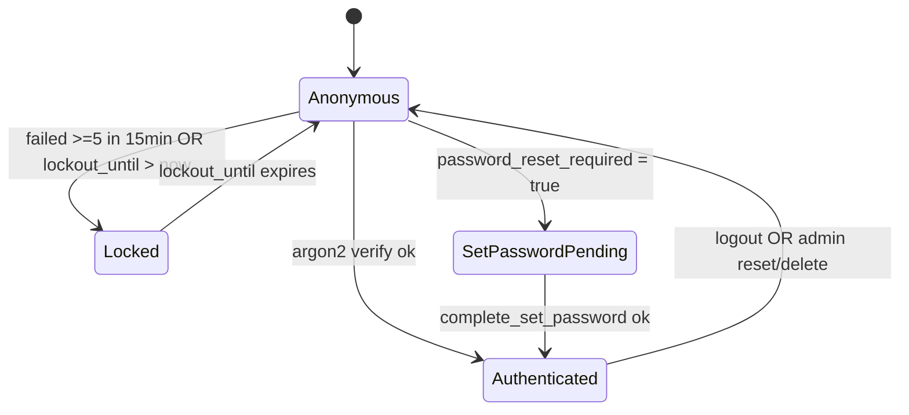
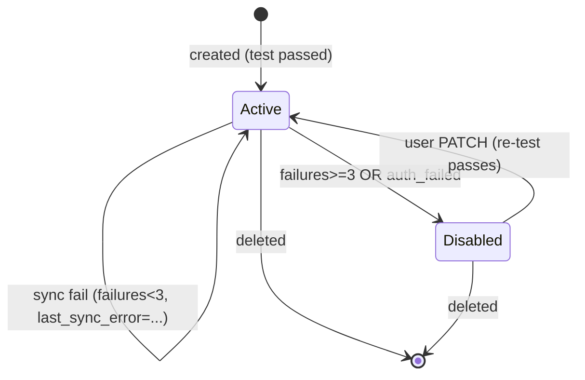

# 05. Модули

Спецификация всех модулей backend и worker. Это **базис для исполнителей** — backend/frontend/devops агенты реализуют систему строго по этому документу. Если требуется изменение публичного интерфейса модуля — сначала ADR / правка `docs/`, потом код.

Контейнер `api` собирается из модулей 1–9. Контейнер `worker` использует модули 5, 6, 7, 8, 11. Frontend (модуль 10) — Jinja2-шаблоны и JS, обслуживаются `api`.

Каждый модуль описан по структуре:
1. **Назначение**.
2. **Публичный API/интерфейс**.
3. **Зависимости**.
4. **Состояния и переходы** (если применимо).
5. **Edge cases**.
6. **Тестируемые инварианты**.

---

## 0. Структура репозитория (целевая)

Финальную структуру утверждает devops при bootstrap. Ниже — ожидание архитектора:

```
backend/
  app/
    __init__.py
    main.py                # FastAPI app factory + middlewares + routers
    config.py              # pydantic-settings: env -> Settings
    db.py                  # async engine + session factory
    redis.py               # async redis client
    storage.py             # MinIO/S3 client wrapper
    crypto.py              # AES-GCM encrypt/decrypt
    logging.py             # structlog setup
    exceptions.py          # типы доменных ошибок + handlers
    csrf.py                # CSRF middleware + helpers
    rate_limit.py          # slowapi setup
    deps.py                # FastAPI dependencies (get_session, get_current_user, ...)
    auth/
      router.py
      service.py
      schemas.py
    admin/
      router.py
      service.py
      schemas.py
    accounts/
      router.py
      service.py
      schemas.py
      providers.py        # IMAP/SMTP defaults для популярных доменов
    messages/
      router.py
      service.py
      schemas.py
    send/
      router.py
      service.py
      schemas.py
      mime.py
    tags/
      router.py            # API + HTML routes для /tags, /api/tags
      service.py           # TagsService (create, update, delete, apply_to_existing, ensure_builtin_tags, apply_tags_to_message)
      schemas.py           # Pydantic для request/response
      builtin.py           # Список 4 builtin-тегов + правил (статичный)
      sql.py               # Готовые SQL для apply (используются service'ом и worker'ом)
    telegram/              # ADR-0018; bot launcher only (no DB tables, no auth changes)
      __init__.py
      router.py            # POST /api/telegram/webhook/{secret}
      bot.py               # send_message_with_webapp_button(chat_id, text), handle_update(update); httpx async к api.telegram.org
      schemas.py           # Pydantic минимально: TelegramUpdate с message.chat.id, message.text, message.from.id
    audit/
      service.py
    models/                # SQLAlchemy ORM
      __init__.py
      user.py
      mail_account.py
      message.py
      attachment.py
      sent_message.py
      sent_attachment.py
      admin_audit.py
      tag.py                # Tag, TagRule, MessageTag ORM
    repositories/
      users.py
      mail_accounts.py
      messages.py
      sent_messages.py
      audit.py
      tags.py               # TagsRepo, TagRulesRepo, MessageTagsRepo
    templates/             # Jinja2
      base.html
      login.html
      set_password.html
      inbox.html
      message_view.html
      compose.html
      accounts/list.html
      accounts/form.html
      admin/users.html
      admin/audit.html
      tags/list.html
      tags/form.html
    static/
      css/main.css
      js/app.js
      js/csrf.js
      js/inbox.js
      js/compose.js
      js/tags.js
      js/tg.js               # ADR-0018: Telegram WebApp adaptation (theme vars + body.tg-app)
  migrations/              # alembic
    env.py
    versions/
      001_initial.py
      002_add_tags.py        # ADR-0017
  tests/
    unit/
    integration/
    e2e/
worker/
  app/
    __init__.py
    main.py                # APScheduler entrypoint
    config.py              # shared with backend (через общий пакет, см. ниже)
    sync_cycle.py
    cleanup.py
    imap_fetcher.py
    smtp_appender.py       # IMAP APPEND wrapper
  tests/
shared/                    # общий пакет, импортируется и api, и worker
  __init__.py
  models/                  # те же ORM (или re-export)
  crypto.py
  storage.py
  config.py
  logging.py
deploy/
  docker-compose.yml
  api.Dockerfile
  worker.Dockerfile
  nginx/nginx.conf
  nginx/templates/default.conf.template
  postgres/init.sql        # роль/БД (или через docker env)
.github/workflows/ci.yml
.env.example
README.md
docs/                      # этот каталог
```

`shared/` создаётся, чтобы избежать дублирования моделей/конфига между `api` и `worker`. Devops-агент может выбрать другой layout (например, mono-package), но **разделение на два контейнера обязательно**.

---

## 1. config

### Назначение
Единая точка получения конфигурации из env-переменных. Используется и API, и worker.

### Публичный API
```python
class Settings(BaseSettings):
    # см. полный список env в 07-deployment.md, секция "Environment variables"
    ...
def get_settings() -> Settings  # cached
```

### Зависимости
- `pydantic-settings`.
- env-файл `.env` для локального запуска.

### Edge cases
- Отсутствие обязательного env -> процесс падает на старте с ясным сообщением.
- `MAIL_ENCRYPTION_KEY` декодируется из base64; если длина != 32 байта — fail.
- В prod (`APP_ENV=prod`) — `ENABLE_DOCS=false` хардкодится поверх env.

### Инварианты
- `get_settings()` возвращает один и тот же объект (singleton через `lru_cache`).
- Никакие секреты не логируются (см. ADR-0014 redact-list).

---

## 2. db

### Назначение
Async SQLAlchemy engine + sessionmaker. FastAPI-dependency `get_session()` для роутеров.

### Публичный API
```python
async def get_session() -> AsyncIterator[AsyncSession]
def get_engine() -> AsyncEngine
```

### Зависимости
- SQLAlchemy 2.0, asyncpg.
- `Settings.DATABASE_URL` — postgres://...

### Состояния
- Connection pool: `pool_size=10`, `max_overflow=20`. Worker использует отдельный engine с `pool_size=5`.

### Edge cases
- Postgres недоступен -> readyz вернёт 503; в API endpoint -> 503.

### Инварианты
- Сессия всегда закрывается через `async with` или dependency cleanup.
- Каждая мутация — внутри `async with session.begin():` (явная транзакция).

---

## 3. redis (client + helpers)

### Назначение
Единый async Redis-клиент. Helpers для работы с сессиями и rate-limit.

### Публичный API
```python
def get_redis() -> Redis  # global, lazy
class SessionStore:
    async def create(user_id: int, role: str, ip: str, ua: str) -> tuple[token: str, csrf: str]
    async def get(token: str) -> SessionData | None
    async def touch(token: str) -> None  # продлить sliding TTL
    async def revoke(token: str) -> None
    async def revoke_all_for_user(user_id: int) -> int
class SetupSessionStore:  # для set-password flow
    async def create(user_id: int) -> tuple[token: str, csrf: str]
    async def get(token: str) -> SetupSessionData | None
    async def revoke(token: str) -> None
```

### Зависимости
- `redis` (5+).
- `Settings.REDIS_URL`.

### Состояния
- Ключи:
  - `session:{token}` — JSON (`user_id`, `role`, `csrf_token`, `ip`, `ua_hash`, `created_at`, `last_seen_at`); sliding TTL 12h.
  - `user_sessions:{user_id}` — SET tokens; TTL = 7 дней (абсолютный max сессии).
  - `setup_session:{token}` — JSON (`user_id`, `csrf_token`); TTL 15 мин.
  - `force_sync:{account_id}` — "1"; TTL 60s. Worker удаляет при обработке.
  - `flash:{session_id}` — JSON-список `[{category: "success" | "error" | "info", text: str}]`; TTL 60 сек. Read-and-clear: backend при рендере следующей HTML-страницы делает `GET` + `DEL` атомарно (Lua-script или MULTI/EXEC), передаёт список в template-context как `flashes`. См. ADR-0015 (no-JS fallback) и `06-security.md` секция CSRF.
  - `rl:{key}` — slowapi internal.
  - `lockout:{username}` — для дублирования с DB (опционально; основной источник — БД).

### Edge cases
- Redis fail -> sessions недоступны -> все user-запросы 503; админ-логин невозможен.
- Concurrent revoke + create — гонка не страшна (новый токен другой).

### Инварианты
- TTL сессий — sliding на каждом успешном `get`+`touch`.
- При revoke удаляется и из `user_sessions:{user_id}`.

---

## 4. storage (MinIO/S3 wrapper)

### Назначение
Тонкая обёртка над `aioboto3` для работы с bucket `mail-attachments`.

### Публичный API
```python
class Storage:
    async def ensure_bucket() -> None
    async def put_object(key: str, data: AsyncIterable[bytes] | bytes, content_type: str | None) -> None
    async def get_object_stream(key: str) -> AsyncIterator[bytes]
    async def delete_objects(keys: list[str]) -> None  # батчами по 1000
    async def delete_prefix(prefix: str) -> int  # list + batch delete
    def build_key(user_id: int, mail_account_id: int, message_uid: int, attachment_id: int, filename: str) -> str
```

### Зависимости
- `aioboto3`.
- env: `S3_ENDPOINT_URL`, `S3_ACCESS_KEY`, `S3_SECRET_KEY`, `S3_BUCKET_NAME=mail-attachments`, `S3_REGION=us-east-1`.

### Edge cases
- Объект не найден на download -> 404 + log warning.
- `delete_objects` partial failure -> retry один раз; оставшиеся записать в audit (level=warning).

### Инварианты
- `build_key` детерминирован.
- `ensure_bucket` идемпотентен.

---

## 5. crypto (AES-GCM)

### Назначение
Шифрование почтовых паролей (см. ADR-0005).

### Публичный API
```python
def encrypt_mail_password(plain: str, mail_account_id: int) -> bytes
def decrypt_mail_password(blob: bytes, mail_account_id: int) -> str
```

### Зависимости
- `cryptography`.
- env: `MAIL_ENCRYPTION_KEY` (base64 32B), опционально `MAIL_ENCRYPTION_KEY_PREV`.

### Состояния
Версия ключа берётся из первого байта blob: `0x01` -> current, `0x00` -> previous.

### Edge cases
- `mail_account_id=0` или None -> ValueError (AAD нельзя строить).
- `InvalidTag` (порча/неправильный AAD) -> прокидывается; вызывающий обрабатывает (для пароля = treat as auth failure).
- Encrypt: всегда новый IV (`os.urandom(12)`), version_byte=0x01.

### Инварианты
- AAD = `b"mail_account_password|" + str(id).encode()`.
- Длина IV = 12 байт.
- Encrypt -> Decrypt round-trip всегда успешен с тем же id.

### Тонкость для INSERT
При INSERT нового `mail_accounts` мы ещё не знаем id (BIGSERIAL).

**Решение (обязательное):** предварительно `SELECT nextval('mail_accounts_id_seq')`, получаем будущий id, шифруем пароль с этим id в AAD, выполняем INSERT с явным id. Атомарно и просто; никаких placeholder-blob или промежуточных UPDATE.

При rotation ключа и при `PATCH /api/mail-accounts/{id}` с обновлением пароля — id уже известен, шаг с `nextval` не нужен.

> **Alternatives considered.** Двухшаговая схема (INSERT с пустым `encrypted_password`, затем UPDATE после получения id) рассматривалась и отклонена: усложняет инвариант "blob всегда валиден", требует CHECK-условий и переходного состояния. `nextval` — однозначно проще.

---

## 6. logging

### Назначение
Конфигурация structlog + middleware для request_id (см. ADR-0014).

### Публичный API
```python
def configure_logging(level: str, service: str) -> None
def get_logger(name: str) -> structlog.BoundLogger
class RequestIDMiddleware: ...
```

### Edge cases
- Pydantic `ValidationError` -> логируется на INFO с полем `event=validation_error` (без значений запроса, только список field paths и кодов).

### Инварианты
- Каждое событие имеет `service`, `timestamp`, `level`, `event`.
- Никогда не логируется поле `password`/`encrypted_password`/`csrf_token`/`session_token` (явный redact-список и тесты на это).

---

## 7. auth (модуль)

### Назначение
Login, logout, set-password, super-admin seed, lockout-логика.

### Назначение `role` в session
- При создании любой сессии (после успешного `POST /login` ИЛИ после успешного `POST /set-password`) backend читает `users.is_admin` из БД и кладёт в Redis JSON-payload поле `role`:
  - `users.is_admin = true`  → `role = "admin"`
  - `users.is_admin = false` → `role = "user"`
- Никакие данные из cookie/payload клиента на это значение не влияют.
- При успешном login для `is_admin=true` пользователя auth-модуль дополнительно вызывает `AuditWriter.log(action="admin_login", actor_user_id=user.id, ip, ua)`.
- При `POST /logout`, если у текущей сессии `role == "admin"`, auth-модуль перед удалением сессии вызывает `AuditWriter.log(action="admin_logout", ...)`.

### Post-login hook: builtin-теги (ADR-0017)

После успешного создания сессии (в обоих flow — `complete_set_password` и `login`) и **до** возврата `LoginResult` auth-модуль вызывает:

```python
await tags_service.ensure_builtin_tags(user_id=user.id)
```

Метод идемпотентен (см. `03-data-model.md` секция "Заполнение builtin-тегов" и модуль 18 ниже). Ошибка вызова — пробрасывается (это безопасно: builtin-теги — функциональный must-have; если БД отвалилась — login не удался по тем же причинам).

Логирование: `event=builtin_tags_created` (новые) или `event=builtin_tags_unchanged` (уже были).

### Публичный API
- HTTP routes: см. `04-api-contracts.md` секция Public Auth (two-step login per ADR-0016).
- Service:
```python
class AuthService:
    async def lookup_for_login(self, username) -> LoginLookupResult  # step-1 of two-step login
    async def login(self, username, password, ip, ua) -> LoginResult  # step-2
    async def logout(self, session_token) -> None
    async def begin_set_password(self, user_id) -> tuple[setup_token: str, csrf: str]
    async def complete_set_password(self, user_id, setup_token, password, password_confirm) -> tuple[session_token: str, csrf: str]

@dataclass
class LoginResult:
    kind: Literal["session_created", "set_password_required", "invalid", "locked"]
    session_token: str | None = None
    setup_token: str | None = None
    csrf: str | None = None
    retry_after_sec: int | None = None

@dataclass
class LoginLookupResult:
    kind: Literal["not_found", "set_password_required", "ready_for_password"]
    user_id: int | None = None
    setup_token: str | None = None
```

- Seed:
```python
async def seed_super_admin(settings, db) -> None
```
- Запускается в startup hook FastAPI один раз.
- **Идемпотентно с upsert пароля.** Логика:
  - `INSERT INTO users (username, password_hash, is_admin, password_reset_required) VALUES (lower(:admin_login), argon2(:admin_password), true, false) ON CONFLICT (username) DO UPDATE SET password_hash = EXCLUDED.password_hash, is_admin = true, password_reset_required = false, lockout_until = NULL, failed_login_attempts = 0`.
  - Это означает: при каждом старте `api` пароль супер-админа в БД синхронизируется с текущим `ADMIN_PASSWORD` из env. Изменение пароля = обновить `.env` и перезапустить `api` (см. `07-deployment.md` секция "Смена пароля супер-админа").
  - Гарантирует, что admin не может оказаться "залочен" из-за прошлых неудачных попыток (lockout всегда сбрасывается при seed).
- Логируется: `event=admin_seed_created` (новая запись), `event=admin_seed_password_updated` (существующий admin, hash изменился), `event=admin_seed_unchanged` (существующий admin, hash совпал — это можно определить через `argon2.verify` перед UPDATE; либо просто всегда писать `admin_seed_applied`).

### Зависимости
- repositories.users, redis.SessionStore/SetupSessionStore, slowapi, audit.
- `argon2-cffi`.

### Состояния пользователя при логине


### Edge cases
- Двойной login в одном браузере — старая сессия НЕ инвалидируется; обе валидны до TTL. (Можно добавить опцию "только одна сессия" — текущим scope не требуется.)
- Setup-session протух (>15 мин) — пользователь увидит редирект на `/login`.
- Попытка login при `password_hash IS NULL` и `password_reset_required=false` — невозможна по инварианту (либо одно, либо другое); но defensive — обращаемся как с `set_password_required`.
- Race на `failed_login_attempts` — допускаем; это счётчик, не критично.

### Инварианты
- `password_hash IS NULL` <=> `password_reset_required=true` (инвариант поддерживается приложением, обеспечивается тестом).
- При successful login — `failed_login_attempts=0`, `lockout_until=NULL`, `last_login_at=now()`.
- `is_admin=true` пользователь не может быть удалён через admin API (см. модуль admin).
- `seed_super_admin` — идемпотентен и **upsert пароль**: при каждом старте `api` `users.password_hash` для `ADMIN_LOGIN` приводится к `argon2(ADMIN_PASSWORD)`; `is_admin=true`, `password_reset_required=false`, `lockout_until=NULL`, `failed_login_attempts=0`. Это покрывает сценарий "смена пароля супер-админа через `.env` + restart" (см. `07-deployment.md`).

---

## 8. admin (модуль)

### Назначение
Управление пользователями: list / create / reset / delete; чтение audit log.

### Публичный API
- HTTP routes: см. `04-api-contracts.md` секция Admin API.
- **Pagination:** page-based (`page`, `limit`, `total`) для `GET /api/admin/users` и `GET /api/admin/audit`. Объёмы небольшие (несколько десятков пользователей; audit — единицы записей в день), поэтому `COUNT(*)` приемлем; UI показывает классическую нумерацию страниц.
- Service:
```python
class AdminService:
    async def list_users(q: str|None, page: int, limit: int) -> tuple[list[UserDTO], total]
    async def create_user(username: str, email: str|None, actor_id: int, ip: str, ua: str) -> UserDTO
    async def reset_password(target_id: int, actor_id: int, ip, ua) -> None
    async def delete_user(target_id: int, actor_id: int, ip, ua) -> DeletionStats
    async def list_audit(filters, page, limit) -> tuple[list[AuditDTO], total]
```

### Зависимости
- repositories.users, repositories.mail_accounts, repositories.messages, repositories.audit, storage, redis.SessionStore.

### Состояния
- Не имеет своего persisted state.

### Edge cases
- Delete super-admin — `BadRequestError("cannot_delete_admin")`.
- Reset super-admin — `BadRequestError("cannot_reset_admin")`.
- Username case sensitivity — нормализуем в lower-case при INSERT и поиске.
- Параллельное удаление и логин одного пользователя — после revoke_all_for_user сессия удалится; если успели создать новую в момент CASCADE delete — новая сессия будет валидной несколько мс, но user в БД уже нет; следующий запрос с этой сессии получит `not_found` и автоматически логаут (см. middleware ниже).

### Инварианты
- Каждое из (`create_user`, `reset_password`, `delete_user`, `lockout_triggered`, `account_auto_disabled`, `admin_login`, `admin_logout`) пишет ровно одну запись `admin_audit`. Записи `admin_login` и `admin_logout` пишутся **только** при `users.is_admin = true` для актора (обычные user-логины/логауты в audit не идут — для них достаточно `users.last_login_at` и application-логов). Логика принадлежит модулю `auth`, который в момент успешного login (после загрузки `User` из БД) и в момент logout вызывает `AuditWriter.log(...)` если `user.is_admin`.
- delete_user — atomic: либо всё удалено, либо ничего (Postgres ACID; MinIO best-effort, осиротевшие объекты — допустимо).
- Возврат `DeletionStats` соответствует фактическому числу удалённых записей.

### Content negotiation (no-JS fallback)

Endpoints из whitelist (см. `04-api-contracts.md` секция "Form-encoded fallback" + ADR-0015) принимают оба content-type'а и выбирают формат ответа по запросу клиента.

Для admin-роутера — endpoints в whitelist:
- `POST /api/admin/users` (create);
- `POST /api/admin/users/{id}/reset`;
- `DELETE /api/admin/users/{id}` (canonical) и `POST /api/admin/users/{id}/delete` + `_method=DELETE` (form-fallback через `MethodOverrideMiddleware`).

Реализация (рекомендуемый паттерн):

```python
# admin/schemas.py
class CreateUserJSON(BaseModel):
    username: str = Field(min_length=3, max_length=64, pattern=r"[A-Za-z0-9_.-]+")
    email: str | None = None

@dataclass
class CreateUserForm:
    username: str
    email: str | None
    csrf_token: str
    @classmethod
    def from_form(cls, request: Request) -> "CreateUserForm": ...
```

```python
# admin/router.py
@router.post("/api/admin/users")
async def create_user(request: Request, ...):
    is_form = is_form_encoded(request)  # helper в deps.py
    if is_form:
        form = await request.form()
        payload = CreateUserJSON(username=form.get("username", ""),
                                 email=form.get("email") or None)
    else:
        payload = CreateUserJSON.model_validate(await request.json())

    try:
        user = await admin_service.create_user(
            payload.username, payload.email, actor_id=..., ip=..., ua=...
        )
    except ConflictError as e:
        if is_form:
            await flash(request, "error", e.message)
            return await render(request, "admin/users.html",
                                form_error=e, form_values={"username": payload.username, "email": payload.email})
        raise  # JSON-клиент получит 409 как раньше

    if is_form:
        await flash(request, "success", "Пользователь создан")
        return RedirectResponse("/admin", status_code=303)
    return JSONResponse(user.dict(), status_code=201)
```

Helpers (рекомендация для `deps.py` или `csrf.py` — на усмотрение реализующего):
- `is_form_encoded(request) -> bool` — `True` если `Content-Type` начинается с `application/x-www-form-urlencoded` И `Accept` НЕ содержит `application/json`.
- `flash(request, category: str, text: str)` — пишет в `flash:{session_id}` в Redis (см. модуль 3).
- `consume_flashes(request) -> list[Flash]` — read-and-clear; вызывается из `Jinja2Templates`-context-builder для каждой HTML-страницы.

Все redirect-цели и тексты flash — из таблицы в ADR-0015 (server-side, не из формы).

---

## 9. accounts (mail-accounts)

### Назначение
CRUD mail-аккаунтов пользователя, тестирование IMAP+SMTP логина.

### Публичный API
- HTTP routes: см. `04-api-contracts.md` секция Mail accounts.
- Service:
```python
class MailAccountService:
    async def list(user_id: int) -> list[MailAccountDTO]
    async def get(user_id: int, account_id: int) -> MailAccountDTO
    async def test(user_id: int, payload: MailAccountTestRequest) -> TestResult
    async def create(user_id: int, payload: MailAccountCreateRequest) -> MailAccountDTO
    async def update(user_id: int, account_id: int, payload: MailAccountUpdateRequest) -> MailAccountDTO
    async def delete(user_id: int, account_id: int) -> None
    async def force_sync(user_id: int, account_id: int) -> None
```

- Provider defaults (helper):
```python
def suggest_provider_defaults(email: str) -> ProviderHint | None
# домен → ProviderHint(imap_host, imap_port=993, imap_ssl=True, smtp_host, smtp_port=465|587, smtp_ssl|smtp_starttls)
```
Поддерживаемые домены (на старт): `gmail.com`, `googlemail.com`, `yandex.ru`, `yandex.com`, `mail.ru`, `inbox.ru`, `bk.ru`, `list.ru`, `outlook.com`, `hotmail.com`, `live.com`. Хардкод-таблица в `accounts/providers.py`.

### Зависимости
- repositories.mail_accounts, crypto, imap-tools (для теста), aiosmtplib (для теста), redis (force_sync маркер).

### Состояния mail-аккаунта (worker-side)


### Edge cases
- IMAP login OK, но INBOX недоступен (?нет таких прав) — `imap_login_failed` с `details.detail="cannot_select_inbox"`.
- Один и тот же email уже добавлен — 409.
- Пользователь меняет только пароль — нужно повторно прогнать IMAP+SMTP тест (иначе можно сохранить битый пароль).
- Удаление: сначала собираем s3_key всех вложений, удаляем из MinIO, затем DELETE FROM mail_accounts (CASCADE).

### Инварианты
- Ни один INSERT/UPDATE без успешного теста IMAP+SMTP.
- Шифрование пароля выполняется в той же транзакции, в которой INSERT.
- Удаление аккаунта удаляет все его сообщения и вложения (БД + MinIO).

### Content negotiation (no-JS fallback)

Endpoints из whitelist для accounts-роутера (см. `04-api-contracts.md` секция "Form-encoded fallback" + ADR-0015):
- `POST /api/mail-accounts` (create);
- `PATCH /api/mail-accounts/{id}` (edit) — также `POST /api/mail-accounts/{id}` + `_method=PATCH`;
- `DELETE /api/mail-accounts/{id}` (canonical) — также `POST /api/mail-accounts/{id}/delete` + `_method=DELETE`;
- `POST /api/mail-accounts/{id}/sync-now`.

**НЕ** в whitelist: `POST /api/mail-accounts/test` — этот endpoint используется только из JS (`account_form.js`) для inline-проверки соединения. В no-JS режиме "Test connection" недоступен (см. `08-frontend.md` sec 8) — `Save` сам делает тест.

Паттерн реализации идентичен admin (см. модуль 8 секция "Content negotiation"):
- `is_form_encoded(request)` → выбор схемы парсинга (`request.form()` vs `request.json()`).
- На success: `flash(...)` + `RedirectResponse(redirect_url, 303)` для form-клиента; `JSONResponse(...)` для JSON-клиента.
- На validation/external error: re-render `accounts/form.html` (для create/edit) или `accounts/list.html` (для delete/sync-now) с error-context для form-клиента; стандартный `{error:...}` JSON для JSON-клиента.

Особенности парсинга form-полей:
- Чекбоксы (`imap_ssl`, `smtp_ssl`, `smtp_starttls`): значение `on`, `true`, `1` → `True`; отсутствие поля или `off`/`false`/`0` → `False`. Браузер при unchecked-чекбоксе вообще не присылает поле.
- Опциональные строки (`smtp_username`, `smtp_password`, `email` для admin): пустая строка интерпретируется как `None` (`null`) — это семантика "поле есть, но без значения".
- В edit-форме `password=` (пустая строка) трактуется как "не менять пароль" (как описано в `04-api-contracts.md`).

Redirect targets и flash-тексты — из таблицы в ADR-0015 (server-side, не из формы).

---

## 10. messages (read & list)

### Назначение
Чтение объединённого inbox, чтение конкретного письма, mark-read, скачивание вложений.

### Публичный API
- HTTP routes: см. `04-api-contracts.md` секция Messages.
- **Pagination:** keyset (cursor-based) по `(internal_date DESC, id DESC)`. Курсор — base64(`{internal_date_iso}:{id}`). Возврат: `next_cursor: str | null`. Total count не возвращается (дорого и не требуется UI). HTML-инбокс `GET /` использует тот же курсор.
- Service:
```python
class MessageService:
    async def list_for_user(user_id: int, account_id: int|None, tag_id: int|None, unread: bool|None, cursor: str|None, limit: int) -> tuple[list[MessageListDTO], next_cursor: str|None]
    async def get(user_id: int, message_id: int) -> MessageDetailDTO
    async def mark_read(user_id: int, message_id: int, is_read: bool) -> None
    async def stream_attachment(user_id: int, message_id: int, attachment_id: int) -> tuple[Attachment, AsyncIterator[bytes]]
```

#### Tag-aware fields в DTO (ADR-0017)
- `MessageListDTO` дополнен `tags: list[TagBriefDTO]` (`{id, name, color}`). Один query: leftjoin `message_tags mt` → `tags t` GROUP BY message с `array_agg`/`json_agg` (или один доп-SELECT на batch — на усмотрение реализации).
- `MessageDetailDTO` дополнен таким же `tags: list[TagBriefDTO]`.
- `tag_id`-фильтр в `list_for_user`: добавляет `JOIN message_tags mt ON mt.message_id = m.id AND mt.tag_id = :tag_id`. Ownership tag'а валидируется отдельно (`SELECT 1 FROM tags WHERE id=:tag_id AND user_id=:user_id`); если `tag_id` чужой/невалиден — `404 not_found` (не молча игнорировать).

### Зависимости
- repositories.messages, storage.

### Edge cases
- Курсор невалиден -> 400 `validation_error`.
- Пользователь без mail-аккаунтов -> пустой список, `next_cursor=null`.
- Attachment skipped_too_large -> 404 + flash в UI с поясняющим текстом.
- Body очень большое -> уже обрезано на этапе sync (1 MiB, см. ADR-0012); UI не делает дополнительной обрезки.

### Инварианты
- Любой read-эндпоинт обязательно проверяет ownership через JOIN `mail_accounts.user_id = :user_id` (для messages/attachments).
- Pagination keyset стабильна при вставке новых писем (новые имеют больший id, не попадают на старую страницу).

---

## 11. send (mail-send)

### Назначение
Отправка нового письма / ответа через SMTP выбранного аккаунта.

### Публичный API
- HTTP route: см. `POST /api/messages/send`.
- Service:
```python
class SendService:
    async def send(
        user_id: int,
        from_account_id: int,
        to: list[str],
        cc: list[str] | None,
        bcc: list[str] | None,
        subject: str | None,
        body: str,
        in_reply_to_message_id: int | None,
    ) -> SendResult
```
- MIME builder в `send/mime.py`:
```python
def build_mime(
    from_addr: str,
    to: list[str],
    cc: list[str] | None,
    bcc: list[str] | None,
    subject: str | None,
    body_text: str,
    in_reply_to_header: str | None,
    references_header: str | None,
    message_id: str,  # сгенерированный сервисом
) -> EmailMessage
```

### Зависимости
- repositories.mail_accounts, repositories.messages (для in_reply_to lookup), repositories.sent_messages, crypto, aiosmtplib, imap-tools (для best-effort APPEND).

### Edge cases
- `from_account_id` не принадлежит пользователю -> 404.
- `in_reply_to_message_id` не принадлежит пользователю -> 404.
- BCC: backend убирает из MIME (BCC по определению не в headers); SMTP RCPT TO добавляется отдельно.
- SMTP вернул soft fail (4xx) -> 502 (не сохраняем sent_message).
- IMAP APPEND fail -> sent_message сохранён, `appended_to_sent=false`, `appended_error="..."`. Возвращаем 200 (отправка успешна!).
- Адреса в TO/CC/BCC: валидация по RFC 5322; <2k chars total в строке заголовка (RFC limit на soft-line — 998, на hard — 78; lib `email.policy.SMTP` нормализует).

### Инварианты
- `smtp_message_id` уникален и соответствует header `Message-ID:`.
- `INSERT INTO sent_messages` происходит ТОЛЬКО после успешной SMTP-отправки.
- IMAP APPEND — best-effort, не влияет на успех endpoint'а.

### Content negotiation (no-JS fallback)

`POST /api/messages/send` входит в whitelist form-encoded fallback (см. `04-api-contracts.md` + ADR-0015).

Парсинг form-полей:
- `from_account_id` — целое число (form-string → int).
- `to`, `cc`, `bcc` — одна строка с разделителями `,` или `;`. Парсер: `re.split(r"[,;]", value)` → `strip()` → отбросить пустые → RFC 5322-валидация. Пустая строка / отсутствие поля → пустой список.
- `subject` — строка (опц.).
- `body` — строка (обяз., 0..1 MiB).
- `in_reply_to_message_id` — целое число или пустая строка (трактуется как `None`).

Поведение:
- Success → `flash("success", "Письмо отправлено")` + `RedirectResponse("/", 303)` для form-клиента; `JSONResponse({sent_id, ...}, 200)` для JSON-клиента.
- Validation error → re-render `compose.html` с `form_values` (значения возвращаются для повторной правки) и `form_errors` (per-field).
- SMTP fail (502) → re-render `compose.html` с flash "Не удалось отправить: ..." и сохранёнными `form_values`.

---

## 12. audit

### Назначение
Запись действий супер-админа в `admin_audit`.

### Публичный API
```python
class AuditWriter:
    async def log(
        actor_user_id: int,
        action: str,
        target_user_id: int | None = None,
        target_username: str | None = None,
        details: dict | None = None,
        ip: str | None = None,
        user_agent: str | None = None,
    ) -> None
```

### Зависимости
- repositories.audit.

### Edge cases
- Запись audit упала (БД недоступна) — пробрасываем исключение; вызывающий operation должен откатиться. Это намеренно: лучше отказать в действии, чем потерять аудит.

### Инварианты
- `action` ∈ enum (см. `03-data-model.md`).
- `created_at` всегда заполняется БД (`DEFAULT now()`).

---

## 13. middlewares

### Назначение
Cross-cutting: request_id, session, method override, CSRF, rate-limit.

### Публичный API
- `RequestIDMiddleware`.
- `SessionMiddleware` — читает cookie, кладёт `request.state.session: SessionData | None`.
- `MethodOverrideMiddleware` — поддержка no-JS fallback (см. под-секцию ниже и ADR-0015).
- `CSRFMiddleware` — проверяет токен на state-changing методах. См. ADR-0010.
- slowapi rate-limit регистрируется через декораторы на роутерах.

### Порядок middleware в стеке (важно!)

`RequestIDMiddleware` → `SessionMiddleware` → `MethodOverrideMiddleware` → `CSRFMiddleware` → routers.

Обоснование порядка:
- `MethodOverrideMiddleware` должен идти **после** body-парсинга (Starlette body-reader, доступен через `await request.form()`), чтобы прочитать `_method` из form-body.
- `MethodOverrideMiddleware` должен идти **до** `CSRFMiddleware`, чтобы CSRF-проверка работала по уже override'нутому методу (и понимала, что DELETE/PATCH требуют CSRF). Это безопасно: токен всё равно проверяется (override не bypass'ит CSRF).

### Method override middleware (ADR-0015)

#### Назначение
Поддержка сценариев из `08-frontend.md` секция 8: HTML-форма из чистого `<form>` (без JS) умеет посылать только `GET` или `POST`. Для `DELETE`/`PATCH`/`PUT` поверх формы используется скрытое поле `_method`.

#### Конфигурация
```python
class MethodOverrideMiddleware:
    WHITELIST_PATHS = [
        # Точные пути
        "/api/messages/send",
        "/api/mail-accounts",
        # С id-плейсхолдерами (паттерн через regex / route matching)
        r"^/api/mail-accounts/\d+$",          # PATCH
        r"^/api/mail-accounts/\d+/delete$",   # DELETE (sibling-роут)
        r"^/api/mail-accounts/\d+/sync-now$",
        "/api/admin/users",
        r"^/api/admin/users/\d+/reset$",
        r"^/api/admin/users/\d+/delete$",     # DELETE (sibling-роут)
        # Tags (ADR-0017)
        "/api/tags",
        r"^/api/tags/\d+$",                       # PATCH
        r"^/api/tags/\d+/delete$",                # DELETE (sibling-роут)
        r"^/api/tags/\d+/rules$",                 # POST add rule
        r"^/api/tags/\d+/rules/\d+/delete$",      # DELETE rule (sibling-роут)
        r"^/api/tags/\d+/apply-to-existing$",
    ]
    ALLOWED_OVERRIDES = {"DELETE", "PATCH", "PUT"}
```

#### Алгоритм
```text
1. Если request.method != "POST" → pass-through.
2. Если Content-Type не начинается с "application/x-www-form-urlencoded" → pass-through.
3. Прочитать form-body (await request.form()).
4. value = form.get("_method", "").upper()
5. Если value пуст → pass-through.
6. Если path не в WHITELIST_PATHS:
       → return 400 JSONResponse {error: {code: "method_override_not_allowed", message: "..."}}
       (для form-клиента — re-render generic 4xx page)
7. Если value не в ALLOWED_OVERRIDES → pass-through (игнорируем неизвестные значения).
8. log.debug "method_override_applied" original=POST effective=value path=request.url.path request_id=...
9. Mutate request scope: scope["method"] = value
10. await call_next(request)
```

#### Инварианты
- Override применяется **только** к whitelist-роутам.
- CSRF-проверка после override — обязательна (стандартный flow `CSRFMiddleware`).
- Никаких bypass'ов CSRF, auth, rate-limit для override-запросов.
- Если `_method` пришёл вне whitelist'а — `400 method_override_not_allowed` (а не silent ignore — намеренно: ловит ошибки конфигурации).

### Зависимости
- redis.SessionStore, settings.

### Edge cases
- Сессия валидна, но `user_id` не существует в БД (был удалён админом, или race) — `SessionMiddleware` детектит на первом DB lookup в роутере (через `get_current_user` dependency); если `not_found` — middleware revoke session, удаляет cookies, возвращает 401 для API или 302 на /login для HTML.
- Запрос с устаревшим CSRF (cookie есть, в Redis нет) — 403 `csrf_failed`.
- HEAD/OPTIONS — пропускаются без CSRF.
- `_method` в multipart/form-data — игнорируется (whitelist-эндпоинты не используют multipart). Если в будущем понадобится — отдельный ADR.

### Инварианты
- Sliding TTL обновляется только при успешной авторизации запроса.
- На `/healthz`, `/readyz`, `/login`, `/set-password`, статике — middleware пропускает auth-проверку.
- `MethodOverrideMiddleware` не модифицирует body запроса — только переписывает `scope["method"]`. Остальные middleware и роутеры читают form-body заново через стандартные FastAPI-механизмы.

---

## 14. worker — sync_cycle + force_sync_dispatcher

### Назначение
- `sync_cycle` — каждые 5 минут синхронизирует INBOX всех активных аккаунтов (см. ADR-0008, ADR-0013).
- `force_sync_dispatcher` — каждые 10 секунд драйнит Redis-маркеры `force_sync:{id}`, которые ставит API-эндпоинт `POST /accounts/{id}/sync`. Обеспечивает sub-10s latency на кнопку «Sync now» в UI без понижения общей частоты polling до 1 минуты (что било бы по rate-limit IMAP-провайдеров для всех 500 аккаунтов).

### Публичный API
```python
async def sync_cycle() -> None              # запускается APScheduler каждые SYNC_INTERVAL_MINUTES
async def force_sync_dispatch() -> None     # запускается APScheduler каждые 10 сек
async def sync_one_account(account: MailAccount) -> AccountSyncResult
```

### Зависимости
- repositories.mail_accounts (`list_active`, `list_active_by_ids`), repositories.messages, crypto, storage, imap-tools (через to_thread), redis.

### Алгоритм sync_cycle

```text
1. cycle_id = uuid4(); log "sync_cycle_start"
2. SELECT FROM mail_accounts WHERE is_active=true ORDER BY last_synced_at NULLS FIRST, id
3. semaphore = asyncio.Semaphore(MAX_CONCURRENT_IMAP)
4. tasks = [sync_one_with_sem(acc, semaphore) for acc in accounts]
5. results = await asyncio.gather(*tasks, return_exceptions=True)
6. log "sync_cycle_finish" с aggregate stats
```

`sync_cycle` НЕ драйнит `force_sync:*` — это ответственность `force_sync_dispatcher`.

### Алгоритм force_sync_dispatch

```text
1. forced_ids = [int(k.split(":")[1]) async for k in redis.scan_iter(match="force_sync:*", count=500)]
   redis.delete(key) для каждого подхваченного маркера   # курсор-based scan, не блокирует Redis
2. if not forced_ids: return  (без логов — чтобы не засорять)
3. log "force_sync_dispatch_start" с account_ids_count
4. accounts = MailAccountsRepo.list_active_by_ids(forced_ids)   # отфильтровывает inactive
5. tasks под тем же Semaphore(MAX_CONCURRENT_IMAP), что и sync_cycle
6. log "force_sync_dispatch_finish" с per-cycle stats
```

`max_instances=1, coalesce=True` гарантирует, что два тика dispatcher'а не выполняются параллельно (если sync медленный — следующие маркеры дождутся следующего тика).

### sync_one_account (упрощённо)

```text
1. password = decrypt(acc.encrypted_password, aad=acc.id)
2. mailbox = imap_tools.MailBox(acc.imap_host, port, ssl=acc.imap_ssl).login(acc.email, password, initial_folder="INBOX")
3. uidvalidity = mailbox.uidvalidity
4. if acc.last_uidvalidity is not None AND uidvalidity != acc.last_uidvalidity:
       acc.last_synced_uidnext = None  # форсим initial sync ниже
       log "uidvalidity_changed"
5. if acc.last_synced_uidnext is None:
       since = today - 30d
       uids = mailbox.uids(criteria=AND(date_gte=since))
   else:
       uids = mailbox.uids(criteria=f"UID {acc.last_synced_uidnext}:*")
       uids = [u for u in uids if int(u) >= acc.last_synced_uidnext]
6. for batch in chunks(uids, 50):
       msgs = mailbox.fetch(AND(uid=','.join(batch)), mark_seen=False)
       for msg in msgs:
           save_message(msg, acc, uidvalidity, storage)
7. new_uidnext = mailbox.uidnext or (max(uids)+1 if uids else acc.last_synced_uidnext)
8. UPDATE mail_accounts SET last_synced_uidnext=new_uidnext, last_uidvalidity=uidvalidity,
                           last_synced_at=now(), last_sync_error=NULL, consecutive_failures=0
9. mailbox.logout()
```

### save_message
- Body: prefer `text/plain`; if absent — `html2text(html)`. Truncate to 1 MiB. Set `body_present`/`body_truncated`.
- Attachments: для каждого `att`: если `size <= 25 MiB` — PUT в MinIO (key из storage.build_key); иначе записать с `skipped_too_large=true`.
- INSERT messages + attachments в одной транзакции.
- ON CONFLICT (`mail_account_id`, `uidvalidity`, `uid`) DO NOTHING.
- **Apply tags (ADR-0017):** если INSERT messages вернул `RETURNING id` (т.е. это была новая запись, не дубль), в той же транзакции выполняется `tags_service.apply_tags_to_message(message_id, user_id)` (использует SQL `APPLY_TAGS_TO_MESSAGE` из `app/tags/sql.py`). Все условия — один SQL-запрос, ON CONFLICT DO NOTHING. Падение apply откатывает всю транзакцию (включая INSERT messages) → message будет пере-обработан при следующем sync. `user_id` берётся из `mail_accounts.user_id` (resolve один раз перед циклом save_message). При ON CONFLICT (письмо уже было) apply пропускается — повторно теги не применяются.

### Обработка ошибок (per-account)
| Ошибка | Действие |
| --- | --- |
| `imaplib.error.AUTHENTICATIONFAILED` | `last_sync_error="auth_failed"`, `is_active=false`, audit `account_auto_disabled` |
| TimeoutError / `asyncio.TimeoutError` (60s timeout) | `last_sync_error="timeout"`, increment failures |
| `OSError` (network) | `last_sync_error="network: <msg>"`, increment failures |
| Любая другая | `last_sync_error="error: <type>"`, increment failures |

После 3 подряд failures (`consecutive_failures >= 3`): `is_active=false`, audit `account_auto_disabled` с `details.reason="3_consecutive_failures"`.

### Edge cases
- INBOX отсутствует/переименован — IMAP server вернёт ошибку SELECT — обрабатывается как auth_failed-аналог, помечаем acc как `is_active=false` с `last_sync_error="cannot_select_inbox"`.
- Пустой UIDs — записываем new_uidnext = old (если IMAP не вернул UIDNEXT — не трогаем).
- Очень много новых писем (>1000) — батчуем по 50.

### Инварианты
- Failure одного аккаунта не валит остальные.
- Каждый цикл логирует start и finish (даже если все упали).
- Sync строго последовательный per-account (один task = одно соединение).

---

## 15. worker — retention_cleanup

### Назначение
Раз в сутки удалять старые messages + attachments (см. ADR-0011).

### Публичный API
```python
async def retention_cleanup() -> CleanupStats
```

### Алгоритм
```text
threshold = now() - 30d
loop:
    rows = SELECT id, mail_account_id, ma.user_id
           FROM messages m JOIN mail_accounts ma ON ma.id = m.mail_account_id
           WHERE m.internal_date < threshold
           LIMIT 5000
    if not rows: break
    s3keys = SELECT s3_key FROM attachments WHERE message_id IN rows AND skipped_too_large=false
    storage.delete_objects(s3keys)
    DELETE FROM attachments WHERE message_id IN rows
    DELETE FROM messages WHERE id IN rows
log stats
```

### Edge cases
- MinIO частично fail — мы всё равно удаляем строки в БД (иначе бесконечно зависнем); осиротевшие объекты — допустимы.
- Если cleanup идёт > 1 час — следующий запуск сегодня уже не страшен (cron в 03:00 завтра).

### Инварианты
- Идемпотентен.
- Не удаляет sent_messages (см. ADR-0011).

---

## 16. frontend (Jinja2 + JS)

### Назначение
SSR HTML-страницы и минимальный vanilla JS.

### Публичный API (для исполнителя — frontend агент)
- Шаблоны и JS-файлы перечислены в `08-frontend.md`.
- API-контракты для AJAX — в `04-api-contracts.md`.

### Зависимости
- Jinja2 (через FastAPI `Jinja2Templates`).
- Базовый шаблон `base.html` с блоками `title`, `content`, `extra_js`, общей навигацией и flash-сообщениями.

### Edge cases
- JS отключен — основные сценарии должны работать (см. `08-frontend.md` секция 8). Технический механизм — method override + form-encoded acceptance + content negotiation, описан в [ADR-0015](./adr/ADR-0015-no-js-fallback.md). Frontend-агент использует hidden-поле `_method` в формах для PATCH/DELETE и form-encoded body для create/edit.
- AJAX используется только для UX-улучшений (mark-read inline, sync-now без перезагрузки, "Test connection").

### Инварианты
- Все формы включают `csrf_input()` macro.
- Никакой inline `<script>` (CSP не разрешает); JS — только из `/static/js/*.js`.
- Формы для DELETE/PATCH-операций используют `<input type="hidden" name="_method" value="DELETE|PATCH">` поверх POST на whitelist-роут (см. `04-api-contracts.md` + ADR-0015).

---

## 17. tags (модуль)

### Назначение
Управление пользовательскими и встроенными тегами писем (см. ADR-0017). Применяет теги к новым письмам в worker'е и предоставляет user-facing API/HTML для CRUD тегов и rules. Per-user изоляция.

### Публичный API
- HTTP routes: см. `04-api-contracts.md` секция Tags + HTML-страницы `/tags`, `/tags/new`, `/tags/{id}/edit`.
- Service:
```python
class TagsService:
    async def list_for_user(user_id: int) -> list[TagDTO]
    async def get(user_id: int, tag_id: int) -> TagDTO
    async def create(user_id: int, name: str, color: str, rules: list[RuleSpec], apply_to_existing: bool) -> tuple[TagDTO, applied_count: int]
    async def update(user_id: int, tag_id: int, name: str | None, color: str | None) -> TagDTO
    async def delete(user_id: int, tag_id: int) -> None  # raises CannotDeleteBuiltinTagError
    async def add_rule(user_id: int, tag_id: int, type_: str, pattern: str) -> RuleDTO
    async def delete_rule(user_id: int, tag_id: int, rule_id: int) -> None
    async def apply_to_existing(user_id: int, tag_id: int) -> int          # returns applied_count
    async def ensure_builtin_tags(user_id: int) -> None                    # idempotent; called from auth post-login hook
    async def apply_tags_to_message(message_id: int, user_id: int) -> int  # called from worker.save_message
```

- Repository (в `repositories/tags.py`):
```python
class TagsRepo:
    async def list_for_user(user_id: int) -> list[Tag]
    async def get_owned(user_id: int, tag_id: int) -> Tag | None
    async def create(user_id: int, name: str, color: str, is_builtin: bool) -> Tag
    async def update_meta(tag_id: int, name: str | None, color: str | None) -> Tag
    async def delete(tag_id: int) -> None
    async def has_any_builtin(user_id: int) -> bool

class TagRulesRepo:
    async def list_for_tag(tag_id: int) -> list[TagRule]
    async def add(tag_id: int, type_: str, pattern: str) -> TagRule
    async def delete(rule_id: int) -> None

class MessageTagsRepo:
    async def link(message_id: int, tag_id: int) -> None  # idempotent (ON CONFLICT)
    async def list_for_message(message_id: int) -> list[Tag]
    async def list_messages_with_tag(user_id: int, tag_id: int, cursor: str | None, limit: int) -> list[Message]
    async def count_messages_for_user(user_id: int) -> int  # для tag_apply_too_many guard
```

### Зависимости
- repositories.tags, repositories.users (для ownership), repositories.messages (для apply_to_existing count guard).
- Не зависит от Redis / MinIO.
- Используется из `auth.AuthService` (ensure_builtin_tags), `messages.MessageService` (получение tags при list/get), `worker.sync_cycle.save_message` (apply_tags_to_message).

### Состояния
- Таг не имеет lifecycle-FSM. `is_builtin=true` — флаг защиты от DELETE (выставляется только из `ensure_builtin_tags`); user не может включить его через API.

### SQL-helpers (`backend/app/tags/sql.py`)

Готовый текст параметризованных запросов; используется service'ом и worker'ом без дублирования. Источник истины — ADR-0017 §5/§7.

```python
APPLY_TAGS_TO_MESSAGE = """
INSERT INTO message_tags (message_id, tag_id)
SELECT :message_id, t.id
FROM tags t
WHERE t.user_id = :user_id
  AND EXISTS (
    SELECT 1 FROM tag_rules r WHERE r.tag_id = t.id AND (
        (r.type = 'subject_contains' AND :subject  ILIKE '%' || r.pattern || '%') OR
        (r.type = 'body_contains'    AND :body     ILIKE '%' || r.pattern || '%') OR
        (r.type = 'sender_contains'  AND :sender   ILIKE '%' || r.pattern || '%') OR
        (r.type = 'sender_exact'     AND LOWER(:sender) = LOWER(r.pattern))
    )
  )
ON CONFLICT (message_id, tag_id) DO NOTHING
"""

APPLY_TAG_TO_EXISTING = """
INSERT INTO message_tags (message_id, tag_id)
SELECT m.id, :tag_id
FROM messages m
JOIN mail_accounts ma ON ma.id = m.mail_account_id
WHERE ma.user_id = :user_id
  AND EXISTS (
    SELECT 1 FROM tag_rules r WHERE r.tag_id = :tag_id AND (
        (r.type = 'subject_contains' AND m.subject   ILIKE '%' || r.pattern || '%') OR
        (r.type = 'body_contains'    AND m.body_text ILIKE '%' || r.pattern || '%') OR
        (r.type = 'sender_contains'  AND m.from_addr ILIKE '%' || r.pattern || '%') OR
        (r.type = 'sender_exact'     AND LOWER(m.from_addr) = LOWER(r.pattern))
    )
  )
ON CONFLICT (message_id, tag_id) DO NOTHING
"""
```

В `apply_tags_to_message` параметры `:subject`, `:body`, `:sender`, `:user_id`, `:message_id` — backend передаёт значениями из объекта `Message` (вытащить можно как из переданного объекта, так и SELECT'ом по message_id). Альтернатива — внутри SQL JOIN'нуть `messages m ON m.id = :message_id` (одинаково по производительности).

### Edge cases
- Создание тега: race с другим запросом того же пользователя (две одновременные POST /api/tags с одинаковым name) → один из POST вернёт 409 (UNIQUE constraint).
- `apply_to_existing` при пустом массиве rules — INSERT не вернёт строк, `applied_count=0`. Это валидное состояние (пользователь хочет создать пустой тег и потом добавить rules).
- DELETE rule после того как rule сработал → существующие `message_tags` остаются (см. note в `04-api-contracts.md`).
- Pattern с `%` или `_` — рабочие как ILIKE-wildcards; намеренно (см. ADR-0017 §4).
- `apply_to_existing=true` при число messages > 100 000 → `tag_apply_too_many` (422). Перед heavy SQL делаем `count_messages_for_user(user_id)`; см. ADR-0017 §7.
- `ensure_builtin_tags` race (одновременно два login одного user'а): первый создаст builtin, второй увидит `has_any_builtin=true` и сделает return. Если ровно одновременно оба прошли проверку и пытаются INSERT — UNIQUE `(user_id, name)` гарантирует, что второй получит IntegrityError; ловим его и treat as success (idempotent retry-safe).

### Тестируемые инварианты
- `list_for_user(user_id)` возвращает **только** теги этого пользователя.
- `get_owned(user_id, tag_id)` возвращает None, если tag не пользователя (используется для 404 в API).
- DELETE builtin → `CannotDeleteBuiltinTagError` (преобразуется в 400 `cannot_delete_builtin_tag`).
- `ensure_builtin_tags` вызванный дважды → только 4 builtin тега (idempotent).
- `apply_tags_to_message` для сообщения, у которого subject="DPLA report" и user имеет builtin "DPLA.PLA" → `message_tags` содержит link.
- `apply_tags_to_message` для message чужого пользователя (manual SQL test) → нет линков (защита через `t.user_id = :user_id`).
- Pattern с `'` (одинарная кавычка) → корректно параметризован (нет SQL injection); тест: pattern=`O'Brien` сработает на subject `Hello, O'Brien!`.
- ILIKE case-insensitive: pattern `Apple Inc`, subject `notification from APPLE INC.` → match.

### Content negotiation (no-JS fallback)

Whitelist endpoints для tags-роутера (см. `04-api-contracts.md` секция "Form-encoded fallback" + ADR-0015):
- `POST /api/tags` (create);
- `PATCH /api/tags/{id}` (edit) — также `POST /api/tags/{id}` + `_method=PATCH`;
- `DELETE /api/tags/{id}` (canonical) — также `POST /api/tags/{id}/delete` + `_method=DELETE`;
- `POST /api/tags/{id}/rules` (add rule);
- `DELETE /api/tags/{id}/rules/{rule_id}` — также `POST /api/tags/{id}/rules/{rule_id}/delete` + `_method=DELETE`;
- `POST /api/tags/{id}/apply-to-existing`.

Также этот whitelist должен быть зарегистрирован в `MethodOverrideMiddleware.WHITELIST_PATHS` (см. модуль 13):
```python
WHITELIST_PATHS = [
    # ... существующие ...
    r"^/api/tags/\d+$",                            # PATCH
    r"^/api/tags/\d+/delete$",                     # DELETE form-fallback
    r"^/api/tags/\d+/rules/\d+/delete$",           # DELETE rule form-fallback
]
```

Парсинг form-полей:
- `name`, `color` — строки (`color` валидируется regex `^#[0-9A-Fa-f]{6}$`).
- `apply_to_existing` — чекбокс (`on`/`true`/`1` → true; отсутствует → false).
- `rule_type[]` и `rule_pattern[]` — массивы (`form.getlist('rule_type')` / `form.getlist('rule_pattern')`); парные по индексу. Пары, где оба поля пустые, пропускаются. Несовпадение длин → `validation_error`.
- `type`, `pattern` (для add-rule) — строки.

Особый момент с rules: при создании тега по UI пользователь может добавлять/удалять строки condition динамически (JS). Без JS он вводит фиксированное число пар (template рендерит, например, 5 пустых строк, лишние оставляет пустыми; backend пропускает empty pairs). Это работает без JS.

Помимо whitelist — все остальные tags-роуты (`GET /api/tags`, `GET /api/tags/{id}`, `GET /api/tags/{id}/rules`) используют только JSON и не требуют form-encoded acceptance.

### Пагинация / объёмы
- `list_for_user`: возвращает все теги пользователя одним запросом, без pagination (≤ 20 тегов realistic max).
- `list_for_message`: возвращает все теги одного письма (≤ 5–10 realistic max).
- `list_messages_with_tag`: использует ту же keyset-пагинацию, что и `messages.list_for_user`. Endpoint: `GET /api/messages?tag_id=X&cursor=...`.

---

## 18. telegram (модуль)

### Назначение
Webhook-приёмник Telegram Bot API; bot выступает **исключительно** launcher'ом — отдаёт WebApp-кнопку, ведущую на основной URL сервиса (`TELEGRAM_WEBAPP_URL`). Источник истины — [ADR-0018](./adr/ADR-0018-telegram-launcher.md).

**Никаких** изменений в auth/session/CSRF/БД. **Никакой** линковки telegram_user_id ↔ user_id. **Никакой** initData-аутентификации. Пользователь, открывший WebApp из бота, видит обычную login-форму (two-step, ADR-0016) и логинится cookie-сессией так же, как в браузере.

### Публичный API
- HTTP route: `POST /api/telegram/webhook/{secret}` — см. `04-api-contracts.md` секция 4a.
- Bot helpers (`backend/app/telegram/bot.py`):
```python
async def send_message_with_webapp_button(chat_id: int, text: str) -> None
    # POST https://api.telegram.org/bot{token}/sendMessage
    # body: {chat_id, text, reply_markup: {inline_keyboard: [[{text: "Open Mail Aggregator", web_app: {url: TELEGRAM_WEBAPP_URL}}]]}}

async def handle_update(update: TelegramUpdate) -> None
    # message.text starts with "/start" → send_message_with_webapp_button
    # message.text starts with "/help"  → send plain "Send /start to open the app"
    # all other updates                 → no-op
```
- Schemas (`backend/app/telegram/schemas.py`) — Pydantic `TelegramUpdate` с минимальными полями:
```python
class TelegramFrom(BaseModel):
    id: int

class TelegramChat(BaseModel):
    id: int

class TelegramMessage(BaseModel):
    chat: TelegramChat
    text: str | None = None
    from_: TelegramFrom | None = Field(default=None, alias="from")

class TelegramUpdate(BaseModel):
    update_id: int
    message: TelegramMessage | None = None
    # extra fields (callback_query, edited_message, ...) — Pydantic игнорирует через model_config = ConfigDict(extra="ignore")
```

### Зависимости
- `httpx` (async) — уже в зависимостях для IMAP/SMTP-связанных задач не используется, но добавлен в `pyproject.toml` для других целей; реиспользуется. Если по факту ещё не подключён — devops добавляет одной строкой.
- `Settings.TELEGRAM_BOT_TOKEN`, `TELEGRAM_WEBHOOK_SECRET`, `TELEGRAM_WEBAPP_URL`, `TELEGRAM_BOT_ENABLED` — см. `07-deployment.md` секция 4.
- structlog redact-list дополнен `TELEGRAM_BOT_TOKEN` (см. `06-security.md` §1.8 + ADR-0014).

### Состояния
- Модуль stateless — нет persisted state; апдейты обрабатываются и забываются.

### Алгоритм webhook handler
```text
1. Path-secret check: if path-segment {secret} != settings.TELEGRAM_WEBHOOK_SECRET → 403
2. Header check: if request.headers["X-Telegram-Bot-Api-Secret-Token"] != settings.TELEGRAM_WEBHOOK_SECRET → 403
3. Если settings.TELEGRAM_BOT_ENABLED is False → return 200 (валидируем secret, но не дёргаем Bot API)
4. Pydantic-парсинг body как TelegramUpdate; ValidationError → log warn → return 200 (Telegram не любит ретраи)
5. await handle_update(update)
6. return 200 (всегда; HTTPException только для secret-fail)
```

### Edge cases
- Bot API временно недоступен (timeout/5xx от api.telegram.org) — `send_message_with_webapp_button` логирует warn и возвращает None; webhook возвращает 200 (Telegram не должен ретраить — пользователь и так увидит, что бот молчит, и отправит /start ещё раз).
- Произвольный текст без `/start` — игнорируется молча. Допустимо: бот не диалоговый.
- Forwarded-update от Telegram (re-delivery) — обрабатываем как новый: `/start` снова отдаст кнопку, никаких side-effects не возникает (нет dedup по `update_id`, idempotent by design).
- Несовпадение `update_id` контракта — ловится Pydantic.

### Тестируемые инварианты
- `POST /api/telegram/webhook/<wrong>` → `403`, нет вызова `send_message`.
- `POST /api/telegram/webhook/<correct>` без header `X-Telegram-Bot-Api-Secret-Token` → `403`.
- `POST /api/telegram/webhook/<correct>` с правильным header и body `{"update_id": 1, "message": {"chat": {"id": 100}, "text": "/start", "from": {"id": 200}}}` → `200`, Bot API получил `sendMessage` с inline-keyboard, в keyboard ровно одна кнопка с `web_app.url == TELEGRAM_WEBAPP_URL`.
- То же body с `text="hello"` → `200`, Bot API не дёргался.
- Body без `message` (например, `callback_query`) → `200`, Bot API не дёргался.
- `TELEGRAM_BOT_ENABLED=false` + правильный secret + body `/start` → `200`, Bot API не дёргался.
- `TELEGRAM_BOT_TOKEN` не появляется в логах ни на одном уровне (включая DEBUG) — проверяется отдельным redact-тестом (см. модуль 6 logging).

### Frontend (тонкий клиент)
- `backend/app/static/js/tg.js` — на DOMContentLoaded:
  - Если нет `window.Telegram?.WebApp` → no-op (страница открыта в обычном браузере).
  - Иначе: `Telegram.WebApp.ready()`; читать `Telegram.WebApp.themeParams`; для каждого ключа `bg_color`/`text_color`/`hint_color`/`link_color`/`button_color`/`button_text_color`/`secondary_bg_color` — `document.documentElement.style.setProperty('--tg-' + name.replace(/_color$/, '').replace('_', '-'), value)`.
  - `document.body.classList.add('tg-app')`.
  - Подписка `Telegram.WebApp.onEvent('themeChanged', applyTheme)` для повторного применения при смене темы пользователем.
- В `base.html` подключение скриптов (DEFER):
  ```html
  <script src="https://telegram.org/js/telegram-web-app.js" defer></script>
  <script src="/static/js/tg.js" defer></script>
  ```
- CSP `script-src` расширяется на `https://telegram.org` (см. `06-security.md` §6 — таблица обновлена).
- CSS-правила для `body.tg-app` — в `static/css/main.css` (см. `08-frontend.md` §10): скрытие `header.topbar nav`, переопределение `--bg`/`--text`/`--primary` из `--tg-*` с fallback.

### Интеграция с другими модулями
- **auth** — не изменяется. Cookies `mas_session`/`mas_csrf` ставятся при обычном login независимо от того, открыт ли клиент через бот или браузер. Telegram WebView shares cookies with system WebView (на iOS WKWebView, на Android system WebView), `SameSite=Lax` + `Secure` поверх HTTPS работают.
- **redis** — не изменяется (нет новых ключей).
- **БД** — не изменяется (нет новых таблиц, нет новых колонок).
- **middlewares** — webhook-роут не подпадает под `SessionMiddleware`/`CSRFMiddleware` через path-prefix `/api/telegram/webhook/*` (явный exempt в стеке middleware рядом с `/healthz`/`/readyz`/`/login`).

---

## 19. QA / тесты — обязательный набор для backend/worker

Это не отдельный модуль кода, а сводный список тестов, которые QA-агент обязан реализовать. Backend-агент покрывает unit-тестами доменные функции, QA-агент — integration/e2e.

### Критические unit-инварианты
- crypto: encrypt -> decrypt round-trip; tampering tag -> InvalidTag; неправильный AAD -> InvalidTag.
- argon2: verify ok / verify fail; needs_rehash после смены параметров.
- session_store: create -> get -> revoke; touch продлевает TTL; revoke_all_for_user удаляет все.
- CSRF middleware: missing/invalid token -> 403; valid -> pass; safe methods bypass.
- rate-limit: 6-я попытка login -> 429.
- mime builder: text/plain charset=utf-8; In-Reply-To/References корректны; BCC отсутствует в headers.
- providers.suggest_provider_defaults: правильные дефолты для всех 11 доменов.
- tags (ADR-0017): `ensure_builtin_tags` идемпотентен; per-user изоляция (cross-user — нет утечек); DELETE builtin → `CannotDeleteBuiltinTagError`; UNIQUE `(user_id, name)` — race на create возвращает 409.
- telegram (ADR-0018): `POST /api/telegram/webhook/<wrong>` → 403; правильный secret + `/start` → 200 и Bot API получил `sendMessage` с inline-keyboard и web_app.url; правильный secret + `/help` или произвольный текст или body без `message` → 200 без вызова Bot API; `TELEGRAM_BOT_TOKEN` отсутствует во всех логах (redact-test).

### Integration (с реальными Postgres/Redis/MinIO в test-compose)
- POST mail-account с замоканным IMAP/SMTP (через mock-server) — успех/fail; шифрование сохраняется/расшифровывается.
- Sync cycle с замоканным IMAP — новые письма попадают, ON CONFLICT работает.
- Retention cleanup — удаляет старше 30 дней, не трогает свежие.
- Admin reset password — все сессии user'а удалены.
- Admin delete user — каскад до MinIO (объекты удалены).
- Force sync — маркер обработан в течение следующего тика.
- Tags: первый login создаёт 4 builtin-тега; повторный login не дублирует. Sync с письмом subject="DPLA report" → автоматически прицепляется builtin "DPLA.PLA". Создание custom тега с `apply_to_existing=true` — новые linkы появились в `message_tags`. DELETE message → CASCADE удаляет `message_tags` (нет orphan). DELETE user → CASCADE удаляет `tags`/`tag_rules`/`message_tags`.

### E2E (через httpx + Browser-less)
- Полный flow: admin создаёт user -> user logs in -> set password -> add account -> sync (триггер вручную) -> читает inbox -> отвечает -> sent_messages инкрементится.

### Coverage
- Минимум 75% по модулям 1–11, 14, 15, 17, 18.
- Никаких `# pragma: no cover` без обоснования в комментарии.
