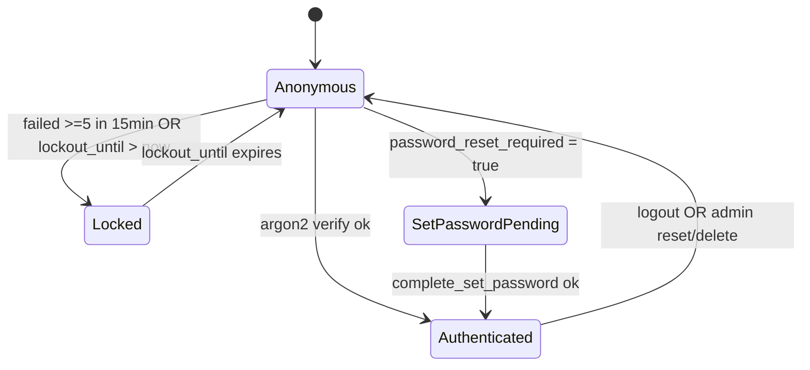
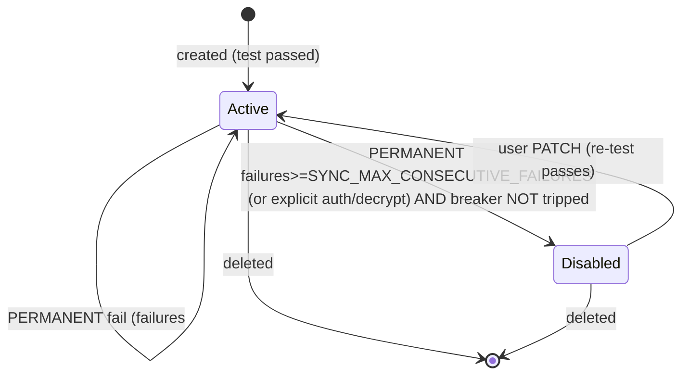

# 05. Модули

Спецификация всех модулей backend и worker. Это **базис для исполнителей** — backend/frontend/devops агенты реализуют систему строго по этому документу. Если требуется изменение публичного интерфейса модуля — сначала ADR / правка `docs/`, потом код.

Контейнер `api` собирается из модулей 1–9. Контейнер `worker` использует модули 5, 6, 7, 8, 11. Frontend (модуль 10) — Jinja2-шаблоны и JS, обслуживаются `api`.

Каждый модуль описан по структуре:
1. **Назначение**.
2. **Публичный API/интерфейс**.
3. **Зависимости**.
4. **Состояния и переходы** (если применимо).
5. **Edge cases**.
6. **Тестируемые инварианты**.

---

## 0. Структура репозитория (целевая)

Финальную структуру утверждает devops при bootstrap. Ниже — ожидание архитектора:

```
backend/
  app/
    __init__.py
    main.py                # FastAPI app factory + middlewares + routers
    config.py              # pydantic-settings: env -> Settings
    db.py                  # async engine + session factory
    redis.py               # async redis client
    storage.py             # MinIO/S3 client wrapper
    crypto.py              # AES-GCM encrypt/decrypt
    logging.py             # structlog setup
    exceptions.py          # типы доменных ошибок + handlers
    csrf.py                # CSRF middleware + helpers
    rate_limit.py          # slowapi setup
    deps.py                # FastAPI dependencies (get_session, get_current_user, ...)
    auth/
      router.py
      service.py
      schemas.py
    admin/
      router.py
      service.py
      schemas.py
    groups/                # ADR-0019; groups CRUD (super-admin only)
      router.py            # /admin/groups, /api/admin/groups/*
      service.py           # GroupsService (create, rename, delete, list, get_with_members)
      schemas.py           # Pydantic для request/response
    accounts/
      router.py
      service.py
      schemas.py
      providers.py        # IMAP/SMTP defaults для популярных доменов
    oauth/                # ADR-0025 — OAuth2 Outlook (Спринт B)
      router.py           # GET /api/oauth/outlook/authorize, GET /api/oauth/outlook/callback
      service.py          # OutlookOAuthService: build_authorize_url, exchange_code, OutlookTokenService.get_valid_access_token
      schemas.py
    messages/
      router.py
      service.py
      schemas.py
    send/
      router.py
      service.py
      schemas.py
      mime.py
    tags/
      router.py            # API + HTML routes для /tags, /api/tags
      service.py           # TagsService (create, update, delete, apply_to_existing, ensure_builtin_tags, apply_tags_to_message)
      schemas.py           # Pydantic для request/response
      builtin.py           # Список 4 builtin-тегов + правил (статичный)
      sql.py               # Готовые SQL для apply (используются service'ом и worker'ом)
    telegram/              # ADR-0018 (launcher) + ADR-0022 (SSO + push-нотификации)
      __init__.py
      router.py            # POST /api/telegram/webhook/{secret}, POST /api/telegram/auth
      bot.py               # send_message_with_webapp_button, send_notification, handle_update; httpx async к api.telegram.org
      auth_service.py      # TelegramAuthService: validate_init_data, try_sso, link_pending, revoke_for_user, mark_link_dead
      schemas.py           # TelegramUpdate, TelegramAuthRequest, TelegramAuthResponse, ValidatedTelegramUser
      notify_format.py     # format_notification(acc_label, from_label, tag_names, subject, body_preview) -> HTML-строка (round-34)
    webhooks/              # ADR-0023 — outbound webhooks per группа
      __init__.py
      router.py            # GET /my/integrations, GET/POST/PATCH/DELETE /api/webhooks/me, /rotate-secret, /test
      service.py           # WebhooksService.create_for_scope/get_for_scope/update_for_scope/delete_for_scope/rotate_secret/send_test
      dispatch_service.py  # WebhookDispatchService.enqueue_message_ids, dispatch_one_payload — копируется по паттерну telegram/auth_service+notify_format
      schemas.py           # WebhookCreate, WebhookUpdate, WebhookDTO (no secret), WebhookCreatedDTO (with one-shot secret), TestResultDTO
      payload.py           # build_message_tagged_payload(ctx, team_tags, webhook_id, delivery_id) — формирование dict для json.dumps
    audit/
      service.py
    models/                # SQLAlchemy ORM
      __init__.py
      user.py                # User (с role, display_name, group_id — ADR-0019/0020)
      group.py               # Group ORM — ADR-0019
      mail_account.py        # MailAccount (с display_name — ADR-0020)
      message.py
      attachment.py
      sent_message.py
      sent_attachment.py
      admin_audit.py
      tag.py                # Tag, TagRule, MessageTag ORM
      telegram_link.py      # ADR-0022 — TelegramLink ORM
      telegram_notification.py  # ADR-0022 — TelegramNotification ORM
      user_settings.py      # ADR-0022 — UserSettings ORM
      webhook.py            # ADR-0023 — Webhook + WebhookDelivery ORM
    repositories/
      users.py
      groups.py             # GroupsRepo — ADR-0019
      mail_accounts.py
      messages.py
      sent_messages.py
      audit.py
      tags.py               # TagsRepo, TagRulesRepo, MessageTagsRepo
      telegram_links.py     # ADR-0022 + ADR-0024 — TelegramLinksRepo (get_active_*, list_by_user_id, list_active_by_user_id, upsert, delete_all_by_user_id, delete_one, mark_dead/mark_alive)
      telegram_notifications.py  # ADR-0022 + ADR-0024 — TelegramNotificationsRepo (try_reserve(message_id,user_id,telegram_user_id), mark_sent, rollback, list_recipients_for_message, list_tags_for_message, list_missing_for_recovery per (message_id,telegram_user_id))
      user_settings.py      # ADR-0022 — UserSettingsRepo (get, upsert)
      webhooks.py           # ADR-0023 — WebhooksRepo (get_by_group_id, reserve_id, insert_with_explicit_id, update_*, set_active, delete, mark_dead/success, bump_failures, touch_last_error, find_active_for_message)
      webhook_deliveries.py # ADR-0023 — WebhookDeliveriesRepo (try_reserve, mark_sent, mark_failed, rollback, list_tags_for_team, list_missing_for_recovery)
    templates/             # Jinja2 — все на русском, см. ADR-0021
      base.html              # включает Log out button (восстановлен после редизайна) + ссылка «Интеграции» для group_leader/super_admin (ADR-0023)
      _macros.html           # csrf_input, flash_messages, error_text(code) — RU mapping (ADR-0021); tag_chip; secret_reveal_block (ADR-0023, one-shot show plaintext)
      login.html
      set_password.html
      inbox.html             # колонки display_name, owner; group filter (super_admin)
      message_view.html
      compose.html
      accounts/list.html     # display_name + owner для group-видимости
      accounts/form.html     # поле display_name (никнейм)
      admin/users.html       # колонки role, group, display_name; форма create/PATCH user
      admin/audit.html
      admin/groups/list.html # ADR-0019 — список групп
      admin/groups/form.html # ADR-0019 — create/edit группы
      tags/list.html
      tags/form.html
      my/integrations.html   # ADR-0023 — webhook config UI: URL form, status (last_fired_at/last_error/consecutive_failures/dead), кнопки Save/Rotate/Test/Delete
    static/
      css/main.css
      js/app.js
      js/csrf.js
      js/inbox.js
      js/compose.js
      js/tags.js
      js/tg.js               # ADR-0018: Telegram WebApp adaptation (theme vars + body.tg-app)
  migrations/              # alembic
    env.py
    versions/
      001_initial.py
      002_add_tags.py            # ADR-0017
      003_groups_and_roles.py    # ADR-0019 + ADR-0020 — см. 03-data-model.md секция Миграции
      004_telegram_sso_and_notifications.py  # ADR-0022 — telegram_links, telegram_notifications, users_settings
      005_outbound_webhooks.py   # ADR-0023 — webhooks, webhook_deliveries
      20260527_017_multi_telegram_links.py   # ADR-0024 (Спринт A) — drop UNIQUE(telegram_links.user_id); telegram_notifications +telegram_user_id, UNIQUE(message_id, telegram_user_id)
      20260527_018_outlook_oauth2.py         # ADR-0025 (Спринт B) — mail_accounts +auth_type/oauth_* columns, encrypted_password DROP NOT NULL, CHECK constraints
  tests/
    unit/
    integration/
    e2e/
worker/
  app/
    __init__.py
    main.py                # APScheduler entrypoint (jobs: sync_cycle, force_sync_dispatch, retention_cleanup, tg_notify_dispatch, tg_notify_recovery_scan, webhook_dispatch, webhook_recovery_scan)
    config.py              # shared with backend (через общий пакет, см. ниже)
    sync_cycle.py
    cleanup.py
    imap_fetcher.py
    smtp_appender.py       # IMAP APPEND wrapper
    tg_notify_dispatch.py  # ADR-0022 — диспатчер Telegram-нотификаций (каждые 5 сек)
    tg_notify_recovery.py  # ADR-0022 — recovery_scan (каждый час)
    webhook_dispatch.py    # ADR-0023 — диспатчер outbound webhooks (каждые 5 сек)
    webhook_recovery.py    # ADR-0023 — recovery_scan для webhooks (каждый час)
  tests/
shared/                    # общий пакет, импортируется и api, и worker
  __init__.py
  models/                  # те же ORM (или re-export)
  crypto.py
  storage.py
  config.py
  logging.py
deploy/
  docker-compose.yml
  api.Dockerfile
  worker.Dockerfile
  nginx/nginx.conf
  nginx/templates/default.conf.template
  postgres/init.sql        # роль/БД (или через docker env)
.github/workflows/ci.yml
.env.example
README.md
docs/                      # этот каталог
```

`shared/` создаётся, чтобы избежать дублирования моделей/конфига между `api` и `worker`. Devops-агент может выбрать другой layout (например, mono-package), но **разделение на два контейнера обязательно**.

---

## 1. config

### Назначение
Единая точка получения конфигурации из env-переменных. Используется и API, и worker.

### Публичный API
```python
class Settings(BaseSettings):
    # см. полный список env в 07-deployment.md, секция "Environment variables"
    ...
def get_settings() -> Settings  # cached
```

### Зависимости
- `pydantic-settings`.
- env-файл `.env` для локального запуска.

### Edge cases
- Отсутствие обязательного env -> процесс падает на старте с ясным сообщением.
- `MAIL_ENCRYPTION_KEY` декодируется из base64; если длина != 32 байта — fail.
- В prod (`APP_ENV=prod`) — `ENABLE_DOCS=false` хардкодится поверх env.

### Инварианты
- `get_settings()` возвращает один и тот же объект (singleton через `lru_cache`).
- Никакие секреты не логируются (см. ADR-0014 redact-list).

---

## 2. db

### Назначение
Async SQLAlchemy engine + sessionmaker. FastAPI-dependency `get_session()` для роутеров.

### Публичный API
```python
async def get_session() -> AsyncIterator[AsyncSession]
def get_engine() -> AsyncEngine
```

### Зависимости
- SQLAlchemy 2.0, asyncpg.
- `Settings.DATABASE_URL` — postgres://...

### Состояния
- Connection pool: `pool_size=10`, `max_overflow=20`. Worker использует отдельный engine с `pool_size=5`.

### Edge cases
- Postgres недоступен -> readyz вернёт 503; в API endpoint -> 503.

### Инварианты
- Сессия всегда закрывается через `async with` или dependency cleanup.
- Каждая мутация — внутри `async with session.begin():` (явная транзакция).

---

## 3. redis (client + helpers)

### Назначение
Единый async Redis-клиент. Helpers для работы с сессиями и rate-limit.

### Публичный API
```python
def get_redis() -> Redis  # global, lazy
class SessionStore:
    async def create(user_id: int, role: str, group_id: int | None, ip: str, ua: str) -> tuple[token: str, csrf: str]
    async def get(token: str) -> SessionData | None
    async def touch(token: str) -> None  # продлить sliding TTL
    async def revoke(token: str) -> None
    async def revoke_all_for_user(user_id: int) -> int
class SetupSessionStore:  # для set-password flow
    async def create(user_id: int) -> tuple[token: str, csrf: str]
    async def get(token: str) -> SetupSessionData | None
    async def revoke(token: str) -> None

@dataclass
class SessionData:
    user_id: int
    role: Literal['super_admin', 'group_leader', 'group_member']  # ADR-0019
    group_id: int | None                                           # ADR-0019; None для super_admin
    csrf_token: str
    ip: str
    ua_hash: str
    created_at: datetime
    last_seen_at: datetime
```

### Зависимости
- `redis` (5+).
- `Settings.REDIS_URL`.

### Состояния
- Ключи:
  - `session:{token}` — JSON (`user_id`, `role`, `group_id`, `csrf_token`, `ip`, `ua_hash`, `created_at`, `last_seen_at`); sliding TTL 12h. **Поле `group_id`** добавлено в ADR-0019 §10 — `null` для `super_admin`, integer для `group_leader`/`group_member`. **Breaking change для существующих сессий** при деплое (старая модель `is_admin: bool` несовместима); все юзеры будут разлогинены.
  - `user_sessions:{user_id}` — SET tokens; TTL = 7 дней (абсолютный max сессии).
  - `setup_session:{token}` — JSON (`user_id`, `csrf_token`); TTL 15 мин.
  - `force_sync:{account_id}` — "1"; TTL 60s. Worker удаляет при обработке.
  - `flash:{session_id}` — JSON-список `[{category: "success" | "error" | "info", text: str}]`; TTL 60 сек. Read-and-clear: backend при рендере следующей HTML-страницы делает `GET` + `DEL` атомарно (Lua-script или MULTI/EXEC), передаёт список в template-context как `flashes`. См. ADR-0015 (no-JS fallback) и `06-security.md` секция CSRF.
  - `rl:{key}` — slowapi internal.
  - `lockout:{username}` — для дублирования с DB (опционально; основной источник — БД).

### Edge cases
- Redis fail -> sessions недоступны -> все user-запросы 503; админ-логин невозможен.
- Concurrent revoke + create — гонка не страшна (новый токен другой).

### Инварианты
- TTL сессий — sliding на каждом успешном `get`+`touch`.
- При revoke удаляется и из `user_sessions:{user_id}`.

---

## 4. storage (MinIO/S3 wrapper)

### Назначение
Тонкая обёртка над `aioboto3` для работы с bucket `mail-attachments`.

### Публичный API
```python
class Storage:
    async def ensure_bucket() -> None
    async def put_object(key: str, data: AsyncIterable[bytes] | bytes, content_type: str | None) -> None
    async def get_object_stream(key: str) -> AsyncIterator[bytes]
    async def delete_objects(keys: list[str]) -> None  # батчами по 1000
    async def delete_prefix(prefix: str) -> int  # list + batch delete
    def build_key(user_id: int, mail_account_id: int, message_uid: int, attachment_id: int, filename: str) -> str
```

### Зависимости
- `aioboto3`.
- env: `S3_ENDPOINT_URL`, `S3_ACCESS_KEY`, `S3_SECRET_KEY`, `S3_BUCKET_NAME=mail-attachments`, `S3_REGION=us-east-1`.

### Edge cases
- Объект не найден на download -> 404 + log warning.
- `delete_objects` partial failure -> retry один раз; оставшиеся записать в audit (level=warning).

### Инварианты
- `build_key` детерминирован.
- `ensure_bucket` идемпотентен.

---

## 5. crypto (AES-GCM)

### Назначение
Шифрование почтовых паролей (см. ADR-0005).

### Публичный API
```python
def encrypt_mail_password(plain: str, mail_account_id: int) -> bytes
def decrypt_mail_password(blob: bytes, mail_account_id: int) -> str
```

### Зависимости
- `cryptography`.
- env: `MAIL_ENCRYPTION_KEY` (base64 32B), опционально `MAIL_ENCRYPTION_KEY_PREV`.

### Состояния
Версия ключа берётся из первого байта blob: `0x01` -> current, `0x00` -> previous.

### Edge cases
- `mail_account_id=0` или None -> ValueError (AAD нельзя строить).
- `InvalidTag` (порча/неправильный AAD) -> прокидывается; вызывающий обрабатывает (для пароля = treat as auth failure).
- Encrypt: всегда новый IV (`os.urandom(12)`), version_byte=0x01.

### Инварианты
- AAD = `b"mail_account_password|" + str(id).encode()`.
- Длина IV = 12 байт.
- Encrypt -> Decrypt round-trip всегда успешен с тем же id.

### Тонкость для INSERT
При INSERT нового `mail_accounts` мы ещё не знаем id (BIGSERIAL).

**Решение (обязательное):** предварительно `SELECT nextval('mail_accounts_id_seq')`, получаем будущий id, шифруем пароль с этим id в AAD, выполняем INSERT с явным id. Атомарно и просто; никаких placeholder-blob или промежуточных UPDATE.

При rotation ключа и при `PATCH /api/mail-accounts/{id}` с обновлением пароля — id уже известен, шаг с `nextval` не нужен.

> **Alternatives considered.** Двухшаговая схема (INSERT с пустым `encrypted_password`, затем UPDATE после получения id) рассматривалась и отклонена: усложняет инвариант "blob всегда валиден", требует CHECK-условий и переходного состояния. `nextval` — однозначно проще.

---

## 6. logging

### Назначение
Конфигурация structlog + middleware для request_id (см. ADR-0014).

### Публичный API
```python
def configure_logging(level: str, service: str) -> None
def get_logger(name: str) -> structlog.BoundLogger
class RequestIDMiddleware: ...
```

### Edge cases
- Pydantic `ValidationError` -> логируется на INFO с полем `event=validation_error` (без значений запроса, только список field paths и кодов).

### Инварианты
- Каждое событие имеет `service`, `timestamp`, `level`, `event`.
- Никогда не логируется поле `password`/`encrypted_password`/`csrf_token`/`session_token` (явный redact-список и тесты на это).

---

## 7. auth (модуль)

### Назначение
Login, logout, set-password, super-admin seed, lockout-логика.

### Назначение `role` и `group_id` в session (ADR-0019)
- При создании любой сессии (после успешного `POST /login` ИЛИ после успешного `POST /set-password`) backend читает `users.role` и `users.group_id` из БД и кладёт в Redis JSON-payload:
  - `users.role` ∈ {`super_admin`, `group_leader`, `group_member`} → `session.role`
  - `users.group_id` (BIGINT \| NULL) → `session.group_id`
- Никакие данные из cookie/payload клиента на эти значения не влияют.
- При успешном login для `role == 'super_admin'` пользователя auth-модуль дополнительно вызывает `AuditWriter.log(action="admin_login", actor_user_id=user.id, ip, ua)`.
- При `POST /logout`, если у текущей сессии `role == 'super_admin'`, auth-модуль перед удалением сессии вызывает `AuditWriter.log(action="admin_logout", ...)`.
- **Старая bool-модель `is_admin`** заменена. В коде нет ни одной ссылки на `is_admin` после миграции 003. Помощник `is_super_admin(session) -> bool` (`session.role == 'super_admin'`) используется в FastAPI dependency `require_super_admin` — оставляет API роутера читаемым.

### Построение `VisibilityScope` (ADR-0019 §7)

В `backend/app/deps.py` определён dataclass и dependency:

```python
@dataclass(frozen=True)
class VisibilityScope:
    user_id: int
    role: Literal['super_admin', 'group_leader', 'group_member']
    group_id: int | None  # NULL для super_admin

async def get_visibility_scope(session: SessionData = Depends(get_current_session)) -> VisibilityScope:
    return VisibilityScope(user_id=session.user_id, role=session.role, group_id=session.group_id)
```

Все Service-методы, которые читают/листают `mail_accounts` или `messages`, принимают `scope: VisibilityScope` и используют его для построения SQL WHERE-фильтра (см. модули `accounts`, `messages`).

### Post-login hook: builtin-теги (ADR-0017)

После успешного создания сессии (в обоих flow — `complete_set_password` и `login`) и **до** возврата `LoginResult` auth-модуль вызывает:

```python
await tags_service.ensure_builtin_tags(user_id=user.id)
```

Метод идемпотентен (см. `03-data-model.md` секция "Заполнение builtin-тегов" и модуль 18 ниже). Ошибка вызова — пробрасывается (это безопасно: builtin-теги — функциональный must-have; если БД отвалилась — login не удался по тем же причинам).

Логирование: `event=builtin_tags_created` (новые) или `event=builtin_tags_unchanged` (уже были).

### Публичный API
- HTTP routes: см. `04-api-contracts.md` секция Public Auth (two-step login per ADR-0016).
- Service:
```python
class AuthService:
    async def lookup_for_login(self, username) -> LoginLookupResult  # step-1 of two-step login
    async def login(self, username, password, ip, ua) -> LoginResult  # step-2
    async def logout(self, session_token) -> None
    async def begin_set_password(self, user_id) -> tuple[setup_token: str, csrf: str]
    async def complete_set_password(self, user_id, setup_token, password, password_confirm) -> tuple[session_token: str, csrf: str]

@dataclass
class LoginResult:
    kind: Literal["session_created", "set_password_required", "invalid", "locked"]
    session_token: str | None = None
    setup_token: str | None = None
    csrf: str | None = None
    retry_after_sec: int | None = None

@dataclass
class LoginLookupResult:
    kind: Literal["not_found", "set_password_required", "ready_for_password"]
    user_id: int | None = None
    setup_token: str | None = None
```

- Seed:
```python
async def seed_super_admin(settings, db) -> None
```
- Запускается в startup hook FastAPI один раз.
- **Идемпотентно с upsert пароля.** Логика:
  - `INSERT INTO users (username, password_hash, is_admin, password_reset_required) VALUES (lower(:admin_login), argon2(:admin_password), true, false) ON CONFLICT (username) DO UPDATE SET password_hash = EXCLUDED.password_hash, is_admin = true, password_reset_required = false, lockout_until = NULL, failed_login_attempts = 0`.
  - Это означает: при каждом старте `api` пароль супер-админа в БД синхронизируется с текущим `ADMIN_PASSWORD` из env. Изменение пароля = обновить `.env` и перезапустить `api` (см. `07-deployment.md` секция "Смена пароля супер-админа").
  - Гарантирует, что admin не может оказаться "залочен" из-за прошлых неудачных попыток (lockout всегда сбрасывается при seed).
- Логируется: `event=admin_seed_created` (новая запись), `event=admin_seed_password_updated` (существующий admin, hash изменился), `event=admin_seed_unchanged` (существующий admin, hash совпал — это можно определить через `argon2.verify` перед UPDATE; либо просто всегда писать `admin_seed_applied`).

### Зависимости
- repositories.users, redis.SessionStore/SetupSessionStore, slowapi, audit.
- `argon2-cffi`.

### Состояния пользователя при логине


### Edge cases
- Двойной login в одном браузере — старая сессия НЕ инвалидируется; обе валидны до TTL. (Можно добавить опцию "только одна сессия" — текущим scope не требуется.)
- Setup-session протух (>15 мин) — пользователь увидит редирект на `/login`.
- Попытка login при `password_hash IS NULL` и `password_reset_required=false` — невозможна по инварианту (либо одно, либо другое); но defensive — обращаемся как с `set_password_required`.
- Race на `failed_login_attempts` — допускаем; это счётчик, не критично.

### Инварианты
- `password_hash IS NULL` <=> `password_reset_required=true` (инвариант поддерживается приложением, обеспечивается тестом).
- При successful login — `failed_login_attempts=0`, `lockout_until=NULL`, `last_login_at=now()`.
- `is_admin=true` пользователь не может быть удалён через admin API (см. модуль admin).
- `seed_super_admin` — идемпотентен и **upsert пароль**: при каждом старте `api` `users.password_hash` для `ADMIN_LOGIN` приводится к `argon2(ADMIN_PASSWORD)`; `is_admin=true`, `password_reset_required=false`, `lockout_until=NULL`, `failed_login_attempts=0`. Это покрывает сценарий "смена пароля супер-админа через `.env` + restart" (см. `07-deployment.md`).

---

## 8. admin (модуль)

### Назначение
Управление пользователями: list / create / reset / delete; чтение audit log.

### Публичный API
- HTTP routes: см. `04-api-contracts.md` секция Admin API.
- **Pagination:** page-based (`page`, `limit`, `total`) для `GET /api/admin/users` и `GET /api/admin/audit`. Объёмы небольшие (несколько десятков пользователей; audit — единицы записей в день), поэтому `COUNT(*)` приемлем; UI показывает классическую нумерацию страниц.
- Service:
```python
class AdminService:
    async def list_users(q: str|None, page: int, limit: int) -> tuple[list[UserDTO], total]
    async def create_user(
        username: str, email: str|None, display_name: str|None,
        role: Literal['group_leader','group_member'],
        group_id: int|None,
        actor_id: int, ip: str, ua: str,
    ) -> UserDTO
    async def update_user(
        target_id: int,
        display_name: str|None|UNSET, role: str|UNSET, group_id: int|None|UNSET,
        actor_id: int, ip: str, ua: str,
    ) -> UserDTO  # ADR-0019; UNSET = не менять
    async def reset_password(target_id: int, actor_id: int, ip, ua) -> None
    async def delete_user(target_id: int, actor_id: int, ip, ua) -> DeletionStats
    async def list_audit(filters, page, limit) -> tuple[list[AuditDTO], total]
```

`UNSET` — sentinel-значение (например, `class _Unset: pass`), отличает «не передан» от «явно null». Реализующий может также использовать `pydantic.fields.FieldInfo(default=...)` или дополнительные `*_set: bool` флаги.

#### Логика create_user / update_user (ADR-0019 §5)

`create_user`:
1. Валидирует `role`: разрешены `'group_leader'` и `'group_member'`. `'super_admin'` запрещён (`forbidden`).
2. Если `role == 'group_member'`: `group_id` обязателен; backend проверяет `groups.id` существует. INSERT user в одной транзакции.
3. Если `role == 'group_leader'`:
   - Если `group_id` передан и not None → `400 group_id_must_be_null_for_new_leader`.
   - В одной транзакции (DEFERRABLE constraints):
     a. INSERT users (без group_id, role='group_leader' temporarily; чтобы инвариант не сработал — INSERT с `role='group_member', group_id=NULL` тоже не валиден). **Корректная последовательность** (опираясь на DEFERRABLE):
        - `BEGIN`
        - `INSERT users (... role='group_leader', group_id=NULL)` — нарушает CHECK, но т.к. CHECK на табличном уровне не deferrable, он сработает immediately. **Поэтому реализация делает иначе:** сначала INSERT с `role='group_member', group_id=NULL` — нарушает invariant.
     - **Решение** (рекомендуем для backend-агента): использовать **временный плейсхолдер**. Backend делает:
       ```sql
       BEGIN;
       SET CONSTRAINTS ALL DEFERRED;
       INSERT INTO users (..., role='group_leader', group_id=NULL) RETURNING id;
       INSERT INTO groups (name, leader_user_id) VALUES (..., :user_id) RETURNING id;
       UPDATE users SET group_id = :group_id WHERE id = :user_id;
       COMMIT;
       ```
       На COMMIT — все DEFERRED constraints (FK + invariant CHECK + leader-consistency trigger) проверяются разом и проходят. Для этого:
       - FK `users.group_id → groups(id)` объявлен `DEFERRABLE INITIALLY DEFERRED`.
       - CHECK `users_role_group_invariant` — **immediate** (CHECK не может быть DEFERRED). Поэтому INSERT users с `role='group_leader', group_id=NULL` **сразу упадёт**.
       - **Альтернатива (корректная)**: INSERT user'а сразу с правильным `group_id` после INSERT в groups. Но FK `users.group_id → groups.id` обычно прошёл бы immediate-проверку. Если FK DEFERRABLE — OK.
       - **Принятая реализация для backend-агента**:
         ```sql
         BEGIN;
         SET CONSTRAINTS users_group_id_fkey DEFERRED;
         -- Step 1: INSERT user с role='group_member', group_id=NULL (нарушает invariant?)
         -- На самом деле invariant позволяет: 'group_member' + NULL не разрешён → нарушает.
         ```
         **Финальное решение**: invariant в БД написан **DEFERRABLE INITIALLY DEFERRED** (не table-level CHECK, а через CONSTRAINT TRIGGER). См. `03-data-model.md` секцию `users` — триггер `users_group_leader_consistency_check` уже описан как DEFERRABLE INITIALLY DEFERRED. Аналогично, **invariant** про role+group_id **тоже** реализуется через DEFERRABLE CONSTRAINT TRIGGER (а не через CHECK на колонке). Architect обязан добавить такой триггер; см. ADR-0019 §6.
4. Audit: `create_user`. Дополнительно `group_create` с `details.auto_created=true` если новый лидер.

`update_user`:
1. Валидирует, что target user — не super_admin (нельзя менять role super-admin'а через API).
2. Загружает текущую запись.
3. Если меняется только `display_name` — простой UPDATE.
4. Если меняется `role`:
   - `'super_admin'` — запрещён.
   - `group_member → group_leader`: либо `group_id` передан null → auto-create новой группы (логика как в create_user); либо `group_id` равен текущему group user'а — backend проверяет, что в группе нет другого лидера, иначе `400 conflict`.
   - `group_leader → group_member`: backend проверяет, что в группе есть **другой** лидер либо группа удалится (через отдельный flow). Если лидер единственный — `400 cannot_demote_lone_leader`. Реализация: сначала super-admin переводит участников в другую группу или удаляет их → потом удаляет группу → потом меняет role этого user'а.
5. Если меняется `group_id` без смены role (только для group_member) — простой UPDATE с проверкой существования группы.
6. Все изменения — в одной транзакции с `SET CONSTRAINTS ALL DEFERRED` если затрагиваются leader-flow.
7. После UPDATE: `SessionStore.revoke_all_for_user(target_id)` — все сессии target user'а инвалидируются (см. ADR-0019 §10).
8. Audit:
   - `user_role_change` если поменялся role.
   - `user_group_change` если поменялся только group_id.
   - `group_create` если auto-create группы (новый лидер).

### Зависимости
- repositories.users, repositories.groups (ADR-0019), repositories.mail_accounts, repositories.messages, repositories.audit, storage, redis.SessionStore.

### Состояния
- Не имеет своего persisted state.

### Edge cases
- Delete super-admin — `BadRequestError("cannot_delete_admin")`.
- Reset super-admin — `BadRequestError("cannot_reset_admin")`.
- Username case sensitivity — нормализуем в lower-case при INSERT и поиске.
- Параллельное удаление и логин одного пользователя — после revoke_all_for_user сессия удалится; если успели создать новую в момент CASCADE delete — новая сессия будет валидной несколько мс, но user в БД уже нет; следующий запрос с этой сессии получит `not_found` и автоматически логаут (см. middleware ниже).
- **(ADR-0019)** Удаление лидера группы — невозможно (`groups.leader_user_id ON DELETE RESTRICT`). Super-admin сначала переводит лидера в другую роль/группу через `PATCH /api/admin/users/{id}` (что само по себе требует распустить группу), потом удаляет user'а. На API-уровне `DELETE /api/admin/users/{id}` для лидера → `409 conflict` с `details.reason='user_is_group_leader'`.
- **(ADR-0019)** PATCH role/group приводит к revoke_all_for_user — после операции у target user'а нет активных сессий; это видно как «выкинули из системы» и считается expected behavior.
- **(ADR-0019)** Race на `groups.leader_user_id UNIQUE`: одновременно две POST /api/admin/groups с одним `leader_user_id` → один получает 409 (UNIQUE constraint).

### Инварианты
- Каждое из (`create_user`, `reset_password`, `delete_user`, `lockout_triggered`, `account_auto_disabled`, `admin_login`, `admin_logout`) пишет ровно одну запись `admin_audit`. Записи `admin_login` и `admin_logout` пишутся **только** при `users.is_admin = true` для актора (обычные user-логины/логауты в audit не идут — для них достаточно `users.last_login_at` и application-логов). Логика принадлежит модулю `auth`, который в момент успешного login (после загрузки `User` из БД) и в момент logout вызывает `AuditWriter.log(...)` если `user.is_admin`.
- delete_user — atomic: либо всё удалено, либо ничего (Postgres ACID; MinIO best-effort, осиротевшие объекты — допустимо).
- Возврат `DeletionStats` соответствует фактическому числу удалённых записей.

### Content negotiation (no-JS fallback)

Endpoints из whitelist (см. `04-api-contracts.md` секция "Form-encoded fallback" + ADR-0015) принимают оба content-type'а и выбирают формат ответа по запросу клиента.

Для admin-роутера — endpoints в whitelist:
- `POST /api/admin/users` (create);
- `POST /api/admin/users/{id}/reset`;
- `DELETE /api/admin/users/{id}` (canonical) и `POST /api/admin/users/{id}/delete` + `_method=DELETE` (form-fallback через `MethodOverrideMiddleware`).

Реализация (рекомендуемый паттерн):

```python
# admin/schemas.py
class CreateUserJSON(BaseModel):
    username: str = Field(min_length=3, max_length=64, pattern=r"[A-Za-z0-9_.-]+")
    email: str | None = None

@dataclass
class CreateUserForm:
    username: str
    email: str | None
    csrf_token: str
    @classmethod
    def from_form(cls, request: Request) -> "CreateUserForm": ...
```

```python
# admin/router.py
@router.post("/api/admin/users")
async def create_user(request: Request, ...):
    is_form = is_form_encoded(request)  # helper в deps.py
    if is_form:
        form = await request.form()
        payload = CreateUserJSON(username=form.get("username", ""),
                                 email=form.get("email") or None)
    else:
        payload = CreateUserJSON.model_validate(await request.json())

    try:
        user = await admin_service.create_user(
            payload.username, payload.email, actor_id=..., ip=..., ua=...
        )
    except ConflictError as e:
        if is_form:
            await flash(request, "error", e.message)
            return await render(request, "admin/users.html",
                                form_error=e, form_values={"username": payload.username, "email": payload.email})
        raise  # JSON-клиент получит 409 как раньше

    if is_form:
        await flash(request, "success", "Пользователь создан")
        return RedirectResponse("/admin", status_code=303)
    return JSONResponse(user.dict(), status_code=201)
```

Helpers (рекомендация для `deps.py` или `csrf.py` — на усмотрение реализующего):
- `is_form_encoded(request) -> bool` — `True` если `Content-Type` начинается с `application/x-www-form-urlencoded` И `Accept` НЕ содержит `application/json`.
- `flash(request, category: str, text: str)` — пишет в `flash:{session_id}` в Redis (см. модуль 3).
- `consume_flashes(request) -> list[Flash]` — read-and-clear; вызывается из `Jinja2Templates`-context-builder для каждой HTML-страницы.

Все redirect-цели и тексты flash — из таблицы в ADR-0015 (server-side, не из формы).

---

## 8a. groups (модуль) — ADR-0019

### Назначение
Управление группами (CRUD) и связь group → leader_user_id. Только для super_admin.

### Публичный API
- HTTP routes: см. `04-api-contracts.md` секция Groups + HTML-страницы `/admin/groups`, `/admin/groups/new`, `/admin/groups/{id}/edit`.
- Service:
```python
class GroupsService:
    async def list_for_admin(q: str | None, page: int, limit: int) -> tuple[list[GroupDTO], total: int]
    async def get_with_members(group_id: int) -> GroupWithMembersDTO  # 404 если нет
    async def create(name: str, leader_user_id: int, actor_id: int, ip: str, ua: str) -> GroupDTO
    async def rename(group_id: int, name: str, actor_id: int, ip: str, ua: str) -> GroupDTO
    async def delete(group_id: int, actor_id: int, ip: str, ua: str) -> None  # 400 если group_has_members

# DTOs
@dataclass
class GroupDTO:
    id: int
    name: str
    leader: UserBriefDTO  # {id, username, display_name}
    members_count: int
    created_at: datetime

@dataclass
class GroupWithMembersDTO(GroupDTO):
    members: list[UserBriefDTO]  # включая лидера; backend сортирует: leader первым
```

- Repository (`repositories/groups.py`):
```python
class GroupsRepo:
    async def list_paginated(q: str | None, page: int, limit: int) -> tuple[list[Group], int]
    async def get(group_id: int) -> Group | None
    async def get_members(group_id: int) -> list[User]
    async def has_other_leader_in_group(group_id: int, except_user_id: int) -> bool
    async def insert(name: str, leader_user_id: int) -> Group
    async def rename(group_id: int, name: str) -> Group
    async def delete(group_id: int) -> None  # БД CASCADE/RESTRICT обработает
```

### Зависимости
- repositories.users, repositories.groups, repositories.audit, redis.SessionStore (для revoke_all_for_user при role/group changes).
- Не зависит от MinIO, accounts, tags.

### Состояния
- Группа не имеет lifecycle FSM. Существует или нет.

### Edge cases
- `create` с `leader_user_id`, который уже лидер другой группы → `409 conflict` (UNIQUE constraint).
- `create` с `leader_user_id`, который — `super_admin` → `400 forbidden` (super_admin не может быть лидером).
- `create`: backend в одной транзакции: (а) валидирует target user (existing group_member, не super_admin, ещё не лидер); (б) `INSERT INTO groups`; (в) `UPDATE users SET role='group_leader', group_id=:new_group_id WHERE id=:leader_user_id`; (г) `SessionStore.revoke_all_for_user(leader_user_id)`. DEFERRABLE constraints позволяют на момент COMMIT всё проверить.
- `rename`: только UPDATE `groups.name`; не затрагивает users.
- `delete`: backend сначала делает `SELECT count(*) FROM users WHERE group_id = :id` (включая лидера). Если > 0 → `400 group_has_members` с `details.members_count`. UI должен сначала эту группу опустошить (через `PATCH /api/admin/users` для каждого участника + удаление лидера user'а или его перевод). Только когда `count(*) = 0` (а это значит, что и `groups.leader_user_id` ссылается на user'а, который имеет `group_id = NULL` — что нарушает invariant; на практике лидер удаляется как user'а, и тогда RESTRICT отлавливает это первым). **Реальная последовательность для super-admin'а через UI**:
  1. Перевести каждого `group_member` в другую группу (через `PATCH /api/admin/users`) или удалить их (через `DELETE /api/admin/users`).
  2. Удалить лидера user'а через `DELETE /api/admin/users` (после перевода его в другую группу с role='group_member', что само требует наличия другой группы; либо если других групп нет — super-admin сначала создаёт временную группу для распределения).
  3. После того как у группы 0 users (включая бывшего лидера) — `DELETE FROM groups` проходит. Audit `group_delete`.

  Этот flow сложен, но соответствует требованию «явные действия super-admin'а». UI явно показывает чек-лист «Что нужно сделать перед удалением группы».

### Тестируемые инварианты
- `create_group(leader_id)` для user'а, который уже лидер другой → 409.
- `create_group(leader_id)` для super_admin → 400.
- После `create_group`: `users.role` лидера обновился на `group_leader`, `group_id` указывает на новую группу, его сессии revoke'нуты.
- `delete_group` пока есть участники → 400 group_has_members.
- `delete_group` пустой группы → 204; БД row удалён.
- `rename`: затрагивает только `groups.name`; user'ы не меняются.

### Content negotiation (no-JS fallback)

Endpoints в whitelist (см. `04-api-contracts.md` секция «Form-encoded fallback» + ADR-0015):
- `POST /api/admin/groups` (create);
- `PATCH /api/admin/groups/{id}` (rename) — также `POST /api/admin/groups/{id}` + `_method=PATCH`;
- `DELETE /api/admin/groups/{id}` — также `POST /api/admin/groups/{id}/delete` + `_method=DELETE`.

Все добавляются в `MethodOverrideMiddleware.WHITELIST_PATHS`:
```python
WHITELIST_PATHS = [
    # ... существующие ...
    "/api/admin/groups",                          # POST create
    r"^/api/admin/groups/\d+$",                   # PATCH rename
    r"^/api/admin/groups/\d+/delete$",            # DELETE form-fallback
    r"^/api/admin/users/\d+$",                    # PATCH user (role/group/display_name) — ADR-0019
]
```

Парсинг form-полей:
- `name` — строка 1..100.
- `leader_user_id` — целое число.

Redirect targets и flash-тексты — из таблицы в ADR-0015 (см. `04-api-contracts.md`).

---

## 9. accounts (mail-accounts)

### Назначение
CRUD mail-аккаунтов пользователя, тестирование IMAP+SMTP логина.

### Публичный API
- HTTP routes: см. `04-api-contracts.md` секция Mail accounts.
- Service (ADR-0019: все методы принимают `scope: VisibilityScope` вместо `user_id`):
```python
class MailAccountService:
    async def list_for_scope(scope: VisibilityScope, group_id_filter: int | None = None, user_id_filter: int | None = None) -> list[MailAccountDTO]
    async def get_in_scope(scope: VisibilityScope, account_id: int) -> MailAccountDTO  # 404 если вне scope
    async def test(scope: VisibilityScope, payload: MailAccountTestRequest) -> TestResult
    async def create(scope: VisibilityScope, payload: MailAccountCreateRequest) -> MailAccountDTO  # учитывает target_user_id
    async def update(scope: VisibilityScope, account_id: int, payload: MailAccountUpdateRequest) -> MailAccountDTO  # включает display_name
    async def delete(scope: VisibilityScope, account_id: int) -> None
    async def force_sync(scope: VisibilityScope, account_id: int) -> None
```

#### SQL для visibility-фильтра (ADR-0019 §7.1)

`list_for_scope` строит WHERE по правилам:
```python
if scope.role == 'super_admin':
    where = "TRUE"
    if group_id_filter is not None:
        where += " AND ma.user_id IN (SELECT id FROM users WHERE group_id = :group_id_filter)"
    if user_id_filter is not None:
        where += " AND ma.user_id = :user_id_filter"
else:  # group_leader / group_member
    where = "ma.user_id IN (SELECT id FROM users WHERE group_id = :scope_group_id)"
    if user_id_filter is not None:
        where += " AND ma.user_id = :user_id_filter"  # backend проверяет, что target в той же группе
```

`get_in_scope`, `update`, `delete`, `force_sync`, `test` — каждый сначала загружает аккаунт + JOIN на user'а владельца, проверяет соответствие scope, иначе `404`.

#### create — логика target_user_id (ADR-0019 §8)

```python
if scope.role == 'super_admin':
    target_user_id = payload.target_user_id or scope.user_id
    # backend проверяет существование target_user_id в users
elif scope.role == 'group_leader':
    target_user_id = payload.target_user_id or scope.user_id
    # backend проверяет, что target_user.group_id == scope.group_id, иначе 403 user_not_in_group_scope
elif scope.role == 'group_member':
    if payload.target_user_id is not None and payload.target_user_id != scope.user_id:
        raise ValidationError("target_user_id_forbidden_for_member")
    target_user_id = scope.user_id
```

Далее — стандартный flow (тест IMAP/SMTP, AES-GCM шифрование, INSERT с явным id через `nextval` — см. модуль 5 crypto). UNIQUE `(user_id, email)` по-прежнему действует — на одного владельца не более одной записи с данным email.

#### display_name (ADR-0020)

Поле `display_name: str | None` в `MailAccountCreateRequest` и `MailAccountUpdateRequest`. Backend: `display_name = (payload.display_name or "").strip() or None` перед сохранением. CHECK constraint в БД (1..100) — defense.

UI везде использует helper `effective_account_label(account) = account.display_name or account.email`.

- Provider defaults (helper):
```python
def suggest_provider_defaults(email: str) -> ProviderHint | None
# домен → ProviderHint(imap_host, imap_port=993, imap_ssl=True, smtp_host, smtp_port=465|587, smtp_ssl|smtp_starttls)
```
Поддерживаемые домены (на старт): `gmail.com`, `googlemail.com`, `yandex.ru`, `yandex.com`, `mail.ru`, `inbox.ru`, `bk.ru`, `list.ru`, `outlook.com`, `hotmail.com`, `live.com`. Хардкод-таблица в `accounts/providers.py`.

### Зависимости
- repositories.mail_accounts, crypto, imap-tools (для теста), aiosmtplib (для теста), redis (force_sync маркер).

### Состояния mail-аккаунта (worker-side)


> **ADR-0026:** переход в `Disabled` происходит **только** по PERMANENT-ошибкам и **только** если
> circuit-breaker не сработал в этом цикле. TRANSIENT-ошибки (DNS/таймаут/сеть/«too many
> simultaneous connections»/нераспознанное) **никогда** не ведут в `Disabled` и не инкрементят
> счётчик — аккаунт остаётся `Active` и само-восстанавливается следующим успешным циклом.

### Edge cases
- IMAP login OK, но INBOX недоступен (?нет таких прав) — `imap_login_failed` с `details.detail="cannot_select_inbox"`.
- Один и тот же email уже добавлен — 409.
- Пользователь меняет только пароль — нужно повторно прогнать IMAP+SMTP тест (иначе можно сохранить битый пароль).
- Удаление: сначала собираем s3_key всех вложений, удаляем из MinIO, затем DELETE FROM mail_accounts (CASCADE).

### Инварианты
- Ни один INSERT/UPDATE без успешного теста IMAP+SMTP.
- Шифрование пароля выполняется в той же транзакции, в которой INSERT.
- Удаление аккаунта удаляет все его сообщения и вложения (БД + MinIO).

### Content negotiation (no-JS fallback)

Endpoints из whitelist для accounts-роутера (см. `04-api-contracts.md` секция "Form-encoded fallback" + ADR-0015):
- `POST /api/mail-accounts` (create);
- `PATCH /api/mail-accounts/{id}` (edit) — также `POST /api/mail-accounts/{id}` + `_method=PATCH`;
- `DELETE /api/mail-accounts/{id}` (canonical) — также `POST /api/mail-accounts/{id}/delete` + `_method=DELETE`;
- `POST /api/mail-accounts/{id}/sync-now`.

**НЕ** в whitelist: `POST /api/mail-accounts/test` — этот endpoint используется только из JS (`account_form.js`) для inline-проверки соединения. В no-JS режиме "Test connection" недоступен (см. `08-frontend.md` sec 8) — `Save` сам делает тест.

Паттерн реализации идентичен admin (см. модуль 8 секция "Content negotiation"):
- `is_form_encoded(request)` → выбор схемы парсинга (`request.form()` vs `request.json()`).
- На success: `flash(...)` + `RedirectResponse(redirect_url, 303)` для form-клиента; `JSONResponse(...)` для JSON-клиента.
- На validation/external error: re-render `accounts/form.html` (для create/edit) или `accounts/list.html` (для delete/sync-now) с error-context для form-клиента; стандартный `{error:...}` JSON для JSON-клиента.

Особенности парсинга form-полей:
- Чекбоксы (`imap_ssl`, `smtp_ssl`, `smtp_starttls`): значение `on`, `true`, `1` → `True`; отсутствие поля или `off`/`false`/`0` → `False`. Браузер при unchecked-чекбоксе вообще не присылает поле.
- Опциональные строки (`smtp_username`, `smtp_password`, `email` для admin): пустая строка интерпретируется как `None` (`null`) — это семантика "поле есть, но без значения".
- В edit-форме `password=` (пустая строка) трактуется как "не менять пароль" (как описано в `04-api-contracts.md`).

Redirect targets и flash-тексты — из таблицы в ADR-0015 (server-side, не из формы).

### 9.1 OAuth Outlook аккаунты (ADR-0025, Спринт B)

Новый модуль `backend/app/oauth/` обслуживает OAuth-flow; созданный аккаунт — обычная строка `mail_accounts` с `auth_type='oauth_outlook'`, поэтому read/list/delete/visibility работают без изменений.

- **`OutlookOAuthService`** (`oauth/service.py`):
  - `build_authorize_url(user_id) -> str` — генерит state+PKCE в Redis `oauth_state:{state}`, собирает Microsoft authorize URL (см. ADR-0025 §2).
  - `exchange_code(code, state) -> MailAccountDTO` — валидирует state (GET+DEL), обменивает code→токены, резолвит email, create/update `mail_account` (зашифрованные токены через `MailPasswordCipher`, AAD=`account_id`).
  - `OutlookTokenService.get_valid_access_token(account) -> str` — кэш-aware refresh (буфер 60с, rotation, `invalid_grant`→`oauth_needs_consent`). Используется и worker'ом (перед IMAP), и `send`/`testers` (перед SMTP).
- **`testers.py`**: ветвление по `auth_type` — для oauth используется `imap_test_oauth`/`smtp_test_oauth` (XOAUTH2), для password — текущий путь.
- **`update`**: для `auth_type='oauth_outlook'` запрещено менять креды/host/port (`400 validation_error`); допускается только `display_name`.
- **Безопасность**: см. `06-security.md` §1.11 + §2.2. Токены не логируются (redact-list).
- **Зависимости**: repositories.mail_accounts, crypto, redis (state + refresh-lock), httpx (token endpoint), imap-tools/aiosmtplib (XOAUTH2-коннект для теста).

---

## 10. messages (read & list)

### Назначение
Чтение объединённого inbox, чтение конкретного письма, mark-read, скачивание вложений.

### Публичный API
- HTTP routes: см. `04-api-contracts.md` секция Messages.
- **Pagination:** keyset (cursor-based) по `(internal_date DESC, id DESC)`. Курсор — base64(`{internal_date_iso}:{id}`). Возврат: `next_cursor: str | null`. Total count не возвращается (дорого и не требуется UI). HTML-инбокс `GET /` использует тот же курсор.
- Service (ADR-0019: scope-aware):
```python
class MessageService:
    async def list_for_scope(
        scope: VisibilityScope,
        account_id: int|None,
        group_id_filter: int|None,   # super_admin only
        tag_id: int|None,
        unread: bool|None,
        cursor: str|None,
        limit: int,
    ) -> tuple[list[MessageListDTO], next_cursor: str|None]
    async def get_in_scope(scope: VisibilityScope, message_id: int) -> MessageDetailDTO  # 404 если вне scope
    async def mark_read(scope: VisibilityScope, message_id: int, is_read: bool) -> None  # 404 если вне scope
    async def stream_attachment(scope: VisibilityScope, message_id: int, attachment_id: int) -> tuple[Attachment, AsyncIterator[bytes]]
```

#### Visibility SQL (ADR-0019 §7.2)

Базовый JOIN везде — `messages m JOIN mail_accounts ma ON ma.id = m.mail_account_id JOIN users u ON u.id = ma.user_id`. WHERE:

| Role | WHERE-фильтр (поверх существующих account_id, tag_id, unread, cursor) |
| --- | --- |
| `super_admin` | `TRUE` (если `group_id_filter` — добавляется `u.group_id = :group_id_filter`) |
| `group_leader` / `group_member` | `u.group_id = :scope_group_id` |

Если `account_id` задан — backend дополнительно проверяет, что `mail_accounts.user_id` лежит в видимости (для super_admin — всегда; для леid/member — `u.group_id = scope.group_id`).

#### Tag-aware fields в DTO (ADR-0017)
- `MessageListDTO` дополнен `tags: list[TagBriefDTO]` (`{id, name, color}`). Один query: leftjoin `message_tags mt` → `tags t` GROUP BY message с `array_agg`/`json_agg` (или один доп-SELECT на batch — на усмотрение реализации).
- **Важно (ADR-0019 §7.4):** Tags остаются per-user. Когда лидер видит письмо участника, к message'у прикреплены теги **владельца ящика** (`mail_account.user_id`), а не теги лидера. Это означает, что `JOIN message_tags mt → tags t` идёт с условием `t.user_id = ma.user_id` (т.е. владелец сообщения), а не текущего пользователя. Это согласовано: тег — атрибут владельца, не зрителя.
- `MessageDetailDTO` дополнен таким же `tags: list[TagBriefDTO]`.
- `MessageListDTO` и `MessageDetailDTO` также дополнены: `mail_account_display_name: str | None` (ADR-0020) и `owner: {id, username, display_name}` (ADR-0019 §7.2).
- `tag_id`-фильтр в `list_for_scope`: добавляет `JOIN message_tags mt ON mt.message_id = m.id AND mt.tag_id = :tag_id`. Ownership tag'а валидируется отдельно (`SELECT 1 FROM tags WHERE id=:tag_id AND user_id=:scope.user_id`); если `tag_id` чужой/невалиден — `404 not_found`. **Note**: `tag_id` фильтр работает только над тегами **текущего пользователя** — даже супер-админ фильтрует только свои теги (т.к. теги per-user). Для админа это означает, что он не может фильтровать «теги Васи»; для этого нужен `user_id_filter` (фичу не вводим, scope ограничен).

### Зависимости
- repositories.messages, storage.

### Edge cases
- Курсор невалиден -> 400 `validation_error`.
- Пользователь без mail-аккаунтов -> пустой список, `next_cursor=null`.
- Attachment skipped_too_large -> 404 + flash в UI с поясняющим текстом.
- Body очень большое -> уже обрезано на этапе sync (1 MiB, см. ADR-0012); UI не делает дополнительной обрезки.

### Инварианты
- Любой read-эндпоинт обязательно проверяет ownership через JOIN `mail_accounts.user_id = :user_id` (для messages/attachments).
- Pagination keyset стабильна при вставке новых писем (новые имеют больший id, не попадают на старую страницу).

---

## 11. send (mail-send)

### Назначение
Отправка нового письма / ответа через SMTP выбранного аккаунта.

### Публичный API
- HTTP route: см. `POST /api/messages/send`.
- Service:
```python
class SendService:
    async def send(
        user_id: int,
        from_account_id: int,
        to: list[str],
        cc: list[str] | None,
        bcc: list[str] | None,
        subject: str | None,
        body: str,
        in_reply_to_message_id: int | None,
    ) -> SendResult
```
- MIME builder в `send/mime.py`:
```python
def build_mime(
    from_addr: str,
    to: list[str],
    cc: list[str] | None,
    bcc: list[str] | None,
    subject: str | None,
    body_text: str,
    in_reply_to_header: str | None,
    references_header: str | None,
    message_id: str,  # сгенерированный сервисом
) -> EmailMessage
```

### Зависимости
- repositories.mail_accounts, repositories.messages (для in_reply_to lookup), repositories.sent_messages, crypto, aiosmtplib, imap-tools (для best-effort APPEND).
- **ADR-0025:** для `from_account` с `auth_type='oauth_outlook'` — SMTP-аутентификация через XOAUTH2 (access-token из `OutlookTokenService.get_valid_access_token`), а не login/пароль; IMAP APPEND аналогично через XOAUTH2. Ветвление по `account.auth_type`.

### Edge cases
- `from_account_id` не принадлежит пользователю -> 404.
- (ADR-0025) oauth-аккаунт с `oauth_needs_consent=true` -> send недоступен, `409 oauth_reconsent_required` (требуется переподключить Outlook).
- `in_reply_to_message_id` не принадлежит пользователю -> 404.
- BCC: backend убирает из MIME (BCC по определению не в headers); SMTP RCPT TO добавляется отдельно.
- SMTP вернул soft fail (4xx) -> 502 (не сохраняем sent_message).
- IMAP APPEND fail -> sent_message сохранён, `appended_to_sent=false`, `appended_error="..."`. Возвращаем 200 (отправка успешна!).
- Адреса в TO/CC/BCC: валидация по RFC 5322; <2k chars total в строке заголовка (RFC limit на soft-line — 998, на hard — 78; lib `email.policy.SMTP` нормализует).

### Инварианты
- `smtp_message_id` уникален и соответствует header `Message-ID:`.
- `INSERT INTO sent_messages` происходит ТОЛЬКО после успешной SMTP-отправки.
- IMAP APPEND — best-effort, не влияет на успех endpoint'а.

### Content negotiation (no-JS fallback)

`POST /api/messages/send` входит в whitelist form-encoded fallback (см. `04-api-contracts.md` + ADR-0015).

Парсинг form-полей:
- `from_account_id` — целое число (form-string → int).
- `to`, `cc`, `bcc` — одна строка с разделителями `,` или `;`. Парсер: `re.split(r"[,;]", value)` → `strip()` → отбросить пустые → RFC 5322-валидация. Пустая строка / отсутствие поля → пустой список.
- `subject` — строка (опц.).
- `body` — строка (обяз., 0..1 MiB).
- `in_reply_to_message_id` — целое число или пустая строка (трактуется как `None`).

Поведение:
- Success → `flash("success", "Письмо отправлено")` + `RedirectResponse("/", 303)` для form-клиента; `JSONResponse({sent_id, ...}, 200)` для JSON-клиента.
- Validation error → re-render `compose.html` с `form_values` (значения возвращаются для повторной правки) и `form_errors` (per-field).
- SMTP fail (502) → re-render `compose.html` с flash "Не удалось отправить: ..." и сохранёнными `form_values`.

---

## 12. audit

### Назначение
Запись действий супер-админа в `admin_audit`.

### Публичный API
```python
class AuditWriter:
    async def log(
        actor_user_id: int,
        action: str,
        target_user_id: int | None = None,
        target_username: str | None = None,
        details: dict | None = None,
        ip: str | None = None,
        user_agent: str | None = None,
    ) -> None
```

### Зависимости
- repositories.audit.

### Edge cases
- Запись audit упала (БД недоступна) — пробрасываем исключение; вызывающий operation должен откатиться. Это намеренно: лучше отказать в действии, чем потерять аудит.

### Инварианты
- `action` ∈ enum (см. `03-data-model.md`).
- `created_at` всегда заполняется БД (`DEFAULT now()`).

---

## 13. middlewares

### Назначение
Cross-cutting: request_id, session, method override, CSRF, rate-limit.

### Публичный API
- `RequestIDMiddleware`.
- `SessionMiddleware` — читает cookie, кладёт `request.state.session: SessionData | None`.
- `MethodOverrideMiddleware` — поддержка no-JS fallback (см. под-секцию ниже и ADR-0015).
- `CSRFMiddleware` — проверяет токен на state-changing методах. См. ADR-0010.
- slowapi rate-limit регистрируется через декораторы на роутерах.

### Порядок middleware в стеке (важно!)

`RequestIDMiddleware` → `SessionMiddleware` → `MethodOverrideMiddleware` → `CSRFMiddleware` → routers.

Обоснование порядка:
- `MethodOverrideMiddleware` должен идти **после** body-парсинга (Starlette body-reader, доступен через `await request.form()`), чтобы прочитать `_method` из form-body.
- `MethodOverrideMiddleware` должен идти **до** `CSRFMiddleware`, чтобы CSRF-проверка работала по уже override'нутому методу (и понимала, что DELETE/PATCH требуют CSRF). Это безопасно: токен всё равно проверяется (override не bypass'ит CSRF).

### Method override middleware (ADR-0015)

#### Назначение
Поддержка сценариев из `08-frontend.md` секция 8: HTML-форма из чистого `<form>` (без JS) умеет посылать только `GET` или `POST`. Для `DELETE`/`PATCH`/`PUT` поверх формы используется скрытое поле `_method`.

#### Конфигурация
```python
class MethodOverrideMiddleware:
    WHITELIST_PATHS = [
        # Точные пути
        "/api/messages/send",
        "/api/mail-accounts",
        # С id-плейсхолдерами (паттерн через regex / route matching)
        r"^/api/mail-accounts/\d+$",          # PATCH
        r"^/api/mail-accounts/\d+/delete$",   # DELETE (sibling-роут)
        r"^/api/mail-accounts/\d+/sync-now$",
        "/api/admin/users",
        r"^/api/admin/users/\d+$",            # PATCH (ADR-0019: role/group/display_name)
        r"^/api/admin/users/\d+/reset$",
        r"^/api/admin/users/\d+/delete$",     # DELETE (sibling-роут)
        # Groups (ADR-0019)
        "/api/admin/groups",                  # POST create
        r"^/api/admin/groups/\d+$",           # PATCH rename
        r"^/api/admin/groups/\d+/delete$",    # DELETE (sibling-роут)
        # Tags (ADR-0017)
        "/api/tags",
        r"^/api/tags/\d+$",                       # PATCH
        r"^/api/tags/\d+/delete$",                # DELETE (sibling-роут)
        r"^/api/tags/\d+/rules$",                 # POST add rule
        r"^/api/tags/\d+/rules/\d+/delete$",      # DELETE rule (sibling-роут)
        r"^/api/tags/\d+/apply-to-existing$",
    ]
    ALLOWED_OVERRIDES = {"DELETE", "PATCH", "PUT"}
```

#### Алгоритм
```text
1. Если request.method != "POST" → pass-through.
2. Если Content-Type не начинается с "application/x-www-form-urlencoded" → pass-through.
3. Прочитать form-body (await request.form()).
4. value = form.get("_method", "").upper()
5. Если value пуст → pass-through.
6. Если path не в WHITELIST_PATHS:
       → return 400 JSONResponse {error: {code: "method_override_not_allowed", message: "..."}}
       (для form-клиента — re-render generic 4xx page)
7. Если value не в ALLOWED_OVERRIDES → pass-through (игнорируем неизвестные значения).
8. log.debug "method_override_applied" original=POST effective=value path=request.url.path request_id=...
9. Mutate request scope: scope["method"] = value
10. await call_next(request)
```

#### Инварианты
- Override применяется **только** к whitelist-роутам.
- CSRF-проверка после override — обязательна (стандартный flow `CSRFMiddleware`).
- Никаких bypass'ов CSRF, auth, rate-limit для override-запросов.
- Если `_method` пришёл вне whitelist'а — `400 method_override_not_allowed` (а не silent ignore — намеренно: ловит ошибки конфигурации).

### Зависимости
- redis.SessionStore, settings.

### Edge cases
- Сессия валидна, но `user_id` не существует в БД (был удалён админом, или race) — `SessionMiddleware` детектит на первом DB lookup в роутере (через `get_current_user` dependency); если `not_found` — middleware revoke session, удаляет cookies, возвращает 401 для API или 302 на /login для HTML.
- Запрос с устаревшим CSRF (cookie есть, в Redis нет) — 403 `csrf_failed`.
- HEAD/OPTIONS — пропускаются без CSRF.
- `_method` в multipart/form-data — игнорируется (whitelist-эндпоинты не используют multipart). Если в будущем понадобится — отдельный ADR.

### Инварианты
- Sliding TTL обновляется только при успешной авторизации запроса.
- На `/healthz`, `/readyz`, `/login`, `/set-password`, статике — middleware пропускает auth-проверку.
- `MethodOverrideMiddleware` не модифицирует body запроса — только переписывает `scope["method"]`. Остальные middleware и роутеры читают form-body заново через стандартные FastAPI-механизмы.

---

## 14. worker — sync_cycle + force_sync_dispatcher

### Назначение
- `sync_cycle` — каждые 5 минут синхронизирует INBOX всех активных аккаунтов (см. ADR-0008, ADR-0013).
- `force_sync_dispatcher` — каждые 10 секунд драйнит Redis-маркеры `force_sync:{id}`, которые ставит API-эндпоинт `POST /accounts/{id}/sync`. Обеспечивает sub-10s latency на кнопку «Sync now» в UI без понижения общей частоты polling до 1 минуты (что било бы по rate-limit IMAP-провайдеров для всех 500 аккаунтов).

### Публичный API
```python
async def sync_cycle() -> None              # запускается APScheduler каждые SYNC_INTERVAL_MINUTES
async def force_sync_dispatch() -> None     # запускается APScheduler каждые 10 сек
async def sync_one_account(account: MailAccount) -> AccountSyncResult
```

### Зависимости
- repositories.mail_accounts (`list_active`, `list_active_by_ids`), repositories.messages, crypto, storage, imap-tools (через to_thread), redis.
- **ADR-0025:** для `auth_type='oauth_outlook'` — `oauth.service.OutlookTokenService` (httpx token endpoint + Redis refresh-lock) для получения access-token перед XOAUTH2-коннектом.

### Алгоритм sync_cycle

```text
1. cycle_id = uuid4(); log "sync_cycle_start"
2. SELECT FROM mail_accounts WHERE is_active=true ORDER BY last_synced_at NULLS FIRST, id
3. semaphore = asyncio.Semaphore(MAX_CONCURRENT_IMAP)
4. tasks = [sync_one_with_sem(acc, semaphore) for acc in accounts]
5. results = await asyncio.gather(*tasks, return_exceptions=True)
6. log "sync_cycle_finish" с aggregate stats
```

`sync_cycle` НЕ драйнит `force_sync:*` — это ответственность `force_sync_dispatcher`.

### Алгоритм force_sync_dispatch

```text
1. forced_ids = [int(k.split(":")[1]) async for k in redis.scan_iter(match="force_sync:*", count=500)]
   redis.delete(key) для каждого подхваченного маркера   # курсор-based scan, не блокирует Redis
2. if not forced_ids: return  (без логов — чтобы не засорять)
3. log "force_sync_dispatch_start" с account_ids_count
4. accounts = MailAccountsRepo.list_active_by_ids(forced_ids)   # отфильтровывает inactive
5. tasks под тем же Semaphore(MAX_CONCURRENT_IMAP), что и sync_cycle
6. log "force_sync_dispatch_finish" с per-cycle stats
```

`max_instances=1, coalesce=True` гарантирует, что два тика dispatcher'а не выполняются параллельно (если sync медленный — следующие маркеры дождутся следующего тика).

### sync_one_account (упрощённо)

```text
0. (ADR-0025) if acc.auth_type == 'oauth_outlook':
       if acc.oauth_needs_consent: skip (log oauth_needs_consent, не trigger failure-counter)
       access_token = OutlookTokenService.get_valid_access_token(acc)   # refresh при необходимости
       mailbox.client.authenticate("XOAUTH2", build_xoauth2(acc.email, access_token))  # SASL XOAUTH2
       → перейти к шагу 3
1. password = decrypt(acc.encrypted_password, aad=acc.id)              # только auth_type='password'
2. mailbox = imap_tools.MailBox(acc.imap_host, port, ssl=acc.imap_ssl).login(acc.email, password, initial_folder="INBOX")
3. uidvalidity = mailbox.uidvalidity
4. if acc.last_uidvalidity is not None AND uidvalidity != acc.last_uidvalidity:
       acc.last_synced_uidnext = None  # форсим initial sync ниже
       log "uidvalidity_changed"
5. if acc.last_synced_uidnext is None:
       since = today - 30d
       uids = mailbox.uids(criteria=AND(date_gte=since))
   else:
       uids = mailbox.uids(criteria=f"UID {acc.last_synced_uidnext}:*")
       uids = [u for u in uids if int(u) >= acc.last_synced_uidnext]
6. for batch in chunks(uids, 50):
       msgs = mailbox.fetch(AND(uid=','.join(batch)), mark_seen=False)
       for msg in msgs:
           save_message(msg, acc, uidvalidity, storage)
7. new_uidnext = mailbox.uidnext or (max(uids)+1 if uids else acc.last_synced_uidnext)
8. UPDATE mail_accounts SET last_synced_uidnext=new_uidnext, last_uidvalidity=uidvalidity,
                           last_synced_at=now(), last_sync_error=NULL, consecutive_failures=0
9. mailbox.logout()
```

### save_message
- Body: prefer `text/plain`; if absent — `html2text(html)`. Truncate to 1 MiB. Set `body_present`/`body_truncated`.
- Attachments: для каждого `att`: если `size <= 25 MiB` — PUT в MinIO (key из storage.build_key); иначе записать с `skipped_too_large=true`.
- INSERT messages + attachments в одной транзакции.
- ON CONFLICT (`mail_account_id`, `uidvalidity`, `uid`) DO NOTHING.
- **Apply tags (ADR-0017):** если INSERT messages вернул `RETURNING id` (т.е. это была новая запись, не дубль), в той же транзакции выполняется `tags_service.apply_tags_to_message(message_id, user_id)` (использует SQL `APPLY_TAGS_TO_MESSAGE` из `app/tags/sql.py`). Все условия — один SQL-запрос, ON CONFLICT DO NOTHING. Падение apply откатывает всю транзакцию (включая INSERT messages) → message будет пере-обработан при следующем sync. `user_id` берётся из `mail_accounts.user_id` (resolve один раз перед циклом save_message). При ON CONFLICT (письмо уже было) apply пропускается — повторно теги не применяются.
- **Enqueue notification (ADR-0022 §2.1):** ПОСЛЕ COMMIT транзакции save_message (а не внутри неё — чтобы доставка не зависела от транзакционной видимости), если `apply_tags_to_message` вернул `applied_count > 0`, добавить `message_id` в локальный аккумулятор `notify_ids`. После завершения цикла обработки одного account'а (т.е. в `sync_one_account` после `mailbox.logout()`) выполнить **один** `LPUSH tg_notify_queue val1 val2 …` всеми накопленными ID. Padение LPUSH (Redis down) — ловится try/except + log warn `event=tg_notify_enqueue_failed`; **не** прерывает sync_cycle. Recovery_scan (см. 14.1) подберёт упущенные.
- **Enqueue outbound webhook (ADR-0023 §3.1):** **параллельно и независимо** от TG-блока выше. Тот же `notify_ids` (один источник истины — письма с `applied_count > 0`) передаётся в `WebhookDispatchService(s).enqueue_message_ids(notify_ids)`, который делает pre-filter (отбрасывает ids, у которых владеющая группа не имеет активного webhook'а) и один batched `LPUSH webhook_dispatch_queue val1 val2 …`. Падение этого блока ловится своим try/except + log warn `event=webhook_enqueue_failed`; **не** валит ни sync_cycle, ни TG-доставку. Recovery_scan webhook'ов (см. 14.2) подберёт упущенные с тем же 24-часовым окном.

### Обработка ошибок (per-account) — ADR-0026

Источник истины: [ADR-0026](./adr/ADR-0026-sync-error-resilience.md). Ключевой принцип: worker
различает **TRANSIENT** (вина сети/сервера/провайдера — пройдёт сам) и **PERMANENT** (вина
настроек/данных) ошибки. Только PERMANENT инкрементит счётчик и может привести к disable.

**Единый модуль классификации** `worker/app/error_classify.py`:
```python
def classify(exc_or_text) -> Literal["transient", "permanent"]
def error_prefix(exc_or_text) -> str   # UI-текст: invalid_host | auth_failed | timeout | network | error | …
```
Обе функции читают **одну** таблицу подстрок (lower-case) → UI-префикс и класс никогда не
расходятся. **Класс определяется НЕЗАВИСИМО от UI-префикса.**

#### Таблица классификации и приоритетов (первое совпадение выигрывает; transient-блок 1–7 до permanent-блока 8–9)

> **Single source of truth — [ADR-0026](./adr/ADR-0026-sync-error-resilience.md) §1.** Таблица ниже —
> побитовая копия таблицы ADR-0026 §1 (те же подстроки, типы, порядок, классы, UI-префиксы). Backend
> кодит по этой таблице; при изменении правил правятся **оба** документа в одном коммите. Любое
> расхождение между ADR §1 и этой таблицей — баг документации.

| Приоритет | Условие (тип / подстрока в lower-case) | Класс | UI-префикс |
| --- | --- | --- | --- |
| 1 | `socket.timeout` / `TimeoutError` / `asyncio.TimeoutError` | transient | `timeout` |
| 2 | `socket.gaierror` / `could not resolve` / `name or service not known` / `temporary failure in name resolution` / `nodename nor servname` | transient | `invalid_host` |
| 3 | `too many` / `simultaneous` / `try again` / `temporarily` / `unavailable` / `inuse` / `system error` / `rate` / `throttl` | transient | `auth_failed` (если есть auth-маркер) иначе `network` |
| 4 | `timed out` / `timeout` | transient | `timeout` |
| 5 | `ConnectionError` / `ssl.SSLError` / `connection refused` / `connection reset` / `broken pipe` / `network is unreachable` / `no route to host` / `ssl` | transient | `network` |
| 6 | `OSError` с сетевым errno (`ECONNREFUSED/ECONNRESET/ETIMEDOUT/EHOSTUNREACH/ENETUNREACH/EPIPE`) | transient | `network` |
| 7 | OAuth httpx `5xx`/`429`/network (worker-обёртка `oauth_token_error: …`: подстроки `5xx`/`429`/`token_network`/`network`/`timeout`/`unexpected`/`oauth_exchange_failed`) | transient | `oauth_token_error` |
| 8 | `authenticationfailed` / `invalid credentials` / `login failed` / `[alert]` / `account is disabled` / `account has been blocked` / oauth `invalid_grant` | **permanent** | `auth_failed` |
| 9 | decrypt-fail (`InvalidTag`/`AssertionError`) | **permanent** | `decrypt_fail` |
| 10 | нераспознанное — **в т.ч. программные исключения** (`TypeError`/`KeyError`/`AttributeError`/`ValueError`, не из network/IMAP/OAuth-наборов 1–9) | **transient** (fail-open) | `error` |

**Кейс корня инцидента:** `"too many simultaneous connections"` приходит как `LOGIN NO`, но
совпадает по приоритету 3 → **transient** (а не auth) → НЕ дисейблит. Permanent-блок (8–9)
срабатывает только если ни одно правило 1–7 не совпало.

**Fail-open (приоритет 10):** нераспознанное → transient. Цена ложного permanent (зря отключим
ящик навсегда) >> цены ложного transient (повторит попытку, запишет ошибку).
**Логирование (приоритет 10):** программные исключения, не распознанные правилами 1–9, логируются
на уровне **ERROR с traceback** (`exc_info=True`, event `sync_account_unexpected_error`) — сигнал
алертинга, что код встретил неожиданный путь; класс остаётся `transient`. Сетевые/IMAP-ошибки
(правила 1–9) — WARNING.

#### Поведение по классам

| | TRANSIENT | PERMANENT |
| --- | --- | --- |
| `last_sync_error` | пишется (для UI) | пишется (в т.ч. при подавлении брейкером — см. ниже) |
| `consecutive_failures` | **НЕ** инкрементится | `+1` |
| `last_synced_at` | **НЕ** трогается (= «последний успех» для UI) | `now()` |
| `is_active` | **НЕ** трогается | disable при пороге (см. ниже) |
| следующий цикл | повторит; success само-восстановит | продолжит инкремент до disable |

**Инвариант полноты выборки (нет starvation, ADR-0026 §2):** transient оставляет `last_synced_at`
нетронутым **безопасно**, потому что `list_active()` (`backend/app/repositories/mail_accounts.py`)
**НЕ лимитирует** выборку — `SELECT … WHERE is_active ORDER BY last_synced_at NULLS FIRST, id` **без
LIMIT**. `sync_cycle` прогоняет **всех** активных под семафором каждый цикл; `ORDER BY` влияет
только на **порядок** обработки внутри цикла, **не на состав**. Поэтому устойчиво-transient аккаунт
(вечно стоящий в голове очереди со старым/`NULL` `last_synced_at`) **не вытесняет** здоровые ящики —
они синхронизируются в том же цикле. Голодание невозможно by construction; отдельное `last_attempt_at`
и миграция не нужны. Если когда-либо `list_active()` начнёт LIMIT-ить выборку — потребуется новый ADR
с `last_attempt_at`.

- PERMANENT disable: при `consecutive_failures >= SYNC_MAX_CONSECUTIVE_FAILURES` (config, default 3),
  **либо** для явных auth (приоритет 8) / decrypt (приоритет 9) — мгновенно (порог не нужен), —
  но всегда **через circuit-breaker** (см. ниже).
- **Инвариант само-восстановления:** `mark_sync_success` сбрасывает
  `consecutive_failures=0, last_sync_error=NULL`. Так как transient не отключает аккаунт, он остаётся
  `is_active=true` → попадает в следующий `list_active()` → первый успешный цикл после восстановления
  сети сам обнуляет состояние. Отдельный re-enable job не нужен.

#### Circuit-breaker (защита от массового disable)

Если в одном цикле `total >= SYNC_MASS_FAILURE_MIN` (default 5) И
`permanent_failures / total >= SYNC_MASS_FAILURE_RATIO` (default 0.5) → **подавить и инкремент, и
disable** для всех permanent-аккаунтов этого цикла (вероятен общий сбой, а не «у всех разом протух
пароль»). Подавлять только disable нельзя — иначе на следующем цикле все перешагнут порог разом.
`last_sync_error` при этом всё равно пишется (информативно и безопасно).

**Двухфазный `_run_for_accounts`:**
1. `sync_one_account` на ошибке вычисляет `classify()`/`error_prefix()`, **сразу** пишет
   `last_sync_error` (transient — no-bump метод; permanent — тоже пишет error, но bump/disable
   откладывает) и возвращает `outcome: "ok" | "transient" | "permanent"`.
2. После `asyncio.gather` цикл считает `total` и `permanent_failures`, вычисляет `breaker_tripped`.
3. Если `breaker_tripped` — ничего со счётчиками не делать (лог `sync_breaker_tripped` WARNING +
   audit `sync_mass_failure_suppressed` severity warning). Иначе для каждого permanent: bump через
   `mark_sync_failure(disable=False)`; если порог достигнут или это явный auth/decrypt →
   `_disable_after_failures` (disable + audit `account_auto_disabled`,
   `details.reason="N_consecutive_failures"` или `"auth_failed"`/`"decrypt_fail"`).

**Наблюдаемость подавлённых permanent (ADR-0026 §3):** `last_sync_error` пишется в фазе 1 для **ВСЕХ**
ошибок, **включая permanent, подавлённые брейкером** — поэтому в UI у каждого реально-протухшего
ящика виден его конкретный `last_sync_error`, даже когда disable подавлён и аккаунт остался `Active`.
Audit `sync_mass_failure_suppressed` (severity warning, один раз на цикл) несёт
`details={total, permanent_failures, transient_failures, ratio, threshold_ratio, threshold_min}`.
Эскалация при N подряд сработавших брейкер-циклах (вечный массовый permanent → провайдер заблокировал
IP) — [TD-035](./100-known-tech-debt.md).

Edge-cases: `total<MIN` → брейкер выключен (покрывает `force_sync_dispatch` с 1 аккаунтом);
ровно `ratio==RATIO` → срабатывает (`>=`); все permanent при `total>=MIN` → `ratio=1.0` → срабатывает
(сценарий инцидента); один протухший из 85 → `1/85<0.5` → нормально дисейблится.

#### DNS / connect retry (`imap_fetcher`)
Открытие соединения + login оборачивается в `SYNC_CONNECT_RETRIES` (default 2) повторов с backoff
`0.5s/1.0s` **только** на **мгновенные** `gaierror`/`ConnectionError`/сетевой `OSError`
(резолв/коннект). **`socket.timeout`/`TimeoutError` НЕ ретраятся** (ADR-0026 §4, MINOR-1): ретрай
таймаута умножил бы время ожидания (`(retries+1)×timeout`) и растянул цикл — таймаут проходит
обычным transient-путём и повторится в следующем 5-мин цикле. Auth-fail и permanent **не** ретраятся.
Единичный DNS-глюк не считается ошибкой вообще. Бюджет ≤1.5s/падающий аккаунт при
`MAX_CONCURRENT_IMAP=10` приемлем. Job `sync_cycle` — `max_instances=1, coalesce=True` (как остальные
worker-jobs), поэтому растянутый retry-окнами цикл не наложится на следующий тик.

### Edge cases
- INBOX отсутствует/переименован — IMAP server вернёт ошибку SELECT; классифицируется обычной
  таблицей (если содержит auth-маркер без transient-маркеров → permanent `auth_failed`), `last_sync_error="cannot_select_inbox"`.
- Пустой UIDs — записываем new_uidnext = old (если IMAP не вернул UIDNEXT — не трогаем).
- Очень много новых писем (>1000) — батчуем по 50.

### Инварианты
- Failure одного аккаунта не валит остальные.
- Каждый цикл логирует start и finish (даже если все упали).
- Sync строго последовательный per-account (один task = одно соединение).

---

## 14.1. worker — tg_notify_dispatch + tg_notify_recovery_scan

Источник истины — [ADR-0022](./adr/ADR-0022-telegram-sso-and-notifications.md) §2.

### Назначение
- `tg_notify_dispatch` — каждые `TG_NOTIFY_DISPATCH_INTERVAL_SEC=5` сек драйнит Redis `tg_notify_queue` (LIST), доставляет Bot API `sendMessage` всем получателям, обеспечивает идемпотентность через `telegram_notifications`. Обрабатывает 429 (re-enqueue) и mark-dead при 403/400.
- `tg_notify_recovery_scan` — раз в час сканирует messages последних `TG_NOTIFY_RECOVERY_WINDOW_HOURS=24` ч, у которых есть **видимый залинкованный чат без строки** `telegram_notifications` по **`(message_id, telegram_user_id)`** (per-chat, round-33 + ADR-0024; раньше per `(message_id, user_id)`), и LPUSH'ит их в очередь (защита от потерь при crash Redis/worker + от частичной доставки throttled-получателям). **ADR-0024:** JOIN `telegram_links` даёт строку на каждый живой чат → `NOT EXISTS (tn WHERE tn.message_id=m.id AND tn.telegram_user_id=tl.telegram_user_id)`.

### Отбор писем для уведомления (round-31)
- **Какие письма уведомляются** — под env-флагом `TG_NOTIFY_ALL_MESSAGES` (`shared/config.py`, default `True`):
  - `true` (default) — уведомление по **каждому** новому письму (наличие тега НЕ требуется). `worker/sync_cycle` ставит в очередь каждый вставленный `message_id`; recipient-SQL (§2.2 ADR-0022) НЕ добавляет `EXISTS(message_tags)`.
  - `false` — историческое поведение: только письма с ≥1 тегом. `sync_cycle` ставит только `applied>0`; recipient-SQL добавляет `AND EXISTS(message_tags)`.
  - Откат — сменой env + рестарт worker (lru-cache `get_settings`), без редеплоя кода.
- **Текст уведомления** (`notify_format.format_notification`) — строки в порядке: «почта» (всегда) + «Тег/Теги …» (только если теги есть; singular/plural) + «Отправитель» (всегда) + «Тема: …» + превью тела. Плейсхолдер «—» убран.
- **Тема + превью тела (round-34)** — `format_notification` принимает `subject: str | None` и `body_preview: str` (см. §2.5 ADR-0022):
  - строка «Тема: <b>…</b>» печатается только если `subject` непуст после strip; тема >150 симв. обрезается (`SUBJECT_MAX=150`, `notify_format`). Пустая тема — строку не показываем (плейсхолдер «(без темы)» в push не используется; он остаётся только в callback-ответе при открытии письма).
  - строка превью печатается только если тело непусто; обрезается до `PREVIEW_LEN=120` симв. Длины — **константы модуля** `notify_format.py`, не env.
  - оба значения user-controlled → `html.escape()` (как acc/from/tag).
- **Источник полей выборки (round-34)** — `dispatch_one_payload` уже грузит `Message` через `db.get(Message, message_id)`; `message.subject` / `message.body_text` / `message.body_html` берутся **из этого объекта** — отдельный запрос/метод репозитория `telegram_notifications.py` НЕ добавляется.
- **Источник превью** — `body_text` (plain); если пуст → `body_html` через `shared.html_sanitize.sanitize_telegram_html` сведённый к plain. Обоснование: round-29 показал, что `body_text` ≠ `body_html` у Apple; для короткого тизера plain-part «чище» (нет верстки/CSS/трекинга). Нормализация (схлопывание whitespace/nbsp/zero-width в один пробел + срез 120) делается **в Python в `notify_service`**, НЕ в SQL.
- **Edge-cases**: пустая тема → нет строки «Тема:»; пустое тело → нет строки превью; очень длинные тема/тело → срез + «…»; HTML/спецсимволы и переводы строк в теме/теле → escape + схлопывание в пробел; итоговый текст ≤ ~400 симв. → одна `sendMessage` без chunk-сплита.

### Публичный API
```python
async def tg_notify_dispatch() -> None        # APScheduler interval=5s; max_instances=1, coalesce=True
async def tg_notify_recovery_scan() -> None   # APScheduler interval=1h; max_instances=1, coalesce=True
# Доставка одного payload (message_id) — TelegramNotifyService.dispatch_one_payload(raw: str)
```

### Зависимости
- redis (LPOP с count, LPUSH; per-chat token-bucket `rl:tg_send:<chat_id>`).
- repositories: `telegram_notifications` (try_reserve, mark_sent, rollback, list_recipients_for_message, list_tags_for_message), `telegram_links` (mark_dead), `mail_accounts`/`messages` (контекст — acc label, from_name|from_addr).
- `backend/app/rate_limit.py:try_consume` (неблокирующий per-chat throttle, round-31).
- `backend/app/telegram/bot.py:send_notification`.
- audit (для mark-dead).

### Алгоритм tg_notify_dispatch

```text
1. items = await redis.lpop("tg_notify_queue", count=TG_NOTIFY_BATCH_SIZE)  # default 30
2. if not items: return
3. for raw in items:
     message_id = json.loads(raw)["message_id"]
     await dispatch_one(message_id)
4. log event=tg_notify_dispatch_finish с per-cycle stats (sent, skipped_idempotent, marked_dead, retried)
```

### Алгоритм dispatch_one_payload (round-12 + round-31)

```text
1. message = db.get(Message, mid); if None: log + return (удалено retention'ом)
   account = mail_accounts.get_by_id(message.mail_account_id); if None: log + return
2. recipients = list_recipients_for_message(mid)   # SQL ADR-0022 §2.2 (тег-предикат условен от TG_NOTIFY_ALL_MESSAGES)
   if not recipients: return
   # round-34: subject/body берутся из ЗАГРУЖЕННОГО message — отдельного запроса нет.
   raw = message.body_text if message.body_text.strip() else html_to_plain(message.body_html)  # ADR §2.4: strip-check, не truthiness-or (body_text NOT NULL default '')
   body_preview = normalize_preview(raw)  # схлоп ws+nbsp, срез 120, '' если пусто
3. message_tags = list_tags_for_message(mid)        # round-12: ОДИН раз на письмо (не per-recipient)
   # round-31: НЕТ раннего return при пустом списке — теги опциональны (§2.5).
   tag_names = dedup message_tags by (name, color)   # round-21
4. needs_retry = False                                # round-32: НЕТ флага throttled — throttle не инициирует re-enqueue
   for r in recipients:
     a. # round-31 per-chat throttle ДО try_reserve:
        if not try_consume(LIMIT_TG_SEND_PER_CHAT(cap=TG_SEND_PER_CHAT_PER_MINUTE), key=str(r.telegram_user_id)):
            continue                                  # round-32: сейчас не шлём, строку НЕ резервируем,
                                                       # hot re-enqueue НЕ делаем — письмо подберёт recovery_scan
                                                       # (NOT EXISTS notif, окно 24ч). Иначе busy-loop при inflow>cap.
     b. notif_id = try_reserve(mid, r.user_id, r.telegram_user_id); if None: continue   # дедуп per-chat (ADR-0024 §6/§7)
     c. text_html = format_notification(acc_label, from_label, tag_names, subject=message.subject, body_preview=body_preview)   # round-34; tag_names/subject/preview опциональны
     d. outcome = send_notification(chat_id=r.telegram_user_id, text_html, message_id=mid)
        ok          -> mark_sent(notif_id, telegram_message_id)
        dead(403/400)-> mark_link_dead(...); строку НЕ удаляем (audit-маркер)
        retry_after -> rollback(notif_id); needs_retry = True   # round-32: 429 — кратковременно, re-enqueue оправдан
        transient   -> rollback(notif_id); needs_retry = True
5. if needs_retry:                                    # round-32: ТОЛЬКО retry_after/transient, НЕ throttle
     enqueue_recovery([mid])                          # немедленный re-enqueue (тот же путь, что retry_after)
```

Re-enqueue (для `needs_retry`) — **целого message_id** (payload очереди = message_id; per-recipient payload отсутствует). Дедуп `telegram_notifications` UNIQUE `(message_id, telegram_user_id)` (ADR-0024 §6) гарантирует, что на повторном проходе уже доставленные **чаты** пропускаются (per-chat, не per-user — у одного user может быть несколько TG). **round-32:** throttled-получатель НЕ запускает hot re-enqueue (это давало busy-loop при устойчивом `inflow > per-chat cap`) — его доставляет `recovery_scan` (раз в час, окно 24ч). **round-33/round-35:** recovery подбирает письмо через **per-chat** `NOT EXISTS (telegram_notifications WHERE message_id=m.id AND telegram_user_id=tl.telegram_user_id)` — это корректно для частичной доставки (один чат доставлен, другой throttled); прежний per-message `NOT EXISTS` терял throttled-получателя навсегда (CRITICAL fix, ADR-0022 §2.8; гранулярность доведена до per-chat в ADR-0024 §7). Backlog рассасывается ~capacity попыток/чат/час. Осознанный компромисс при флуде дольше окна — TD-027. Различие throttle (через recovery) vs `retry_after` (немедленно) и обоснование per-chat-vs-per-message — ADR-0022 §2.9.

### Алгоритм tg_notify_recovery_scan (round-35: per-chat, visibility-aware — ADR-0024 §7)

```text
1. cutoff = now() - interval 'TG_NOTIFY_RECOVERY_WINDOW_HOURS hours'
2. ids = SELECT DISTINCT m.id FROM messages m
         JOIN mail_accounts ma ON ma.id = m.mail_account_id
         JOIN users u ON (u.role='super_admin'
                          OR (ma.group_id IS NOT NULL AND u.group_id = ma.group_id)
                          OR u.id = ma.user_id)
         JOIN telegram_links tl ON tl.user_id = u.id
                          AND tl.dead_at IS NULL
                          AND m.internal_date >= tl.created_at
         LEFT JOIN users_settings us ON us.user_id = u.id
         WHERE m.fetched_at > :cutoff
           AND COALESCE(us.tg_notifications_enabled, true) = true
           -- AND EXISTS (SELECT 1 FROM message_tags mt WHERE mt.message_id=m.id)  -- ТОЛЬКО при TG_NOTIFY_ALL_MESSAGES=false
           AND NOT EXISTS (SELECT 1 FROM telegram_notifications tn
                           WHERE tn.message_id=m.id
                             AND tn.telegram_user_id=tl.telegram_user_id)   -- per-chat! (ADR-0024 §7)
         ORDER BY m.id
         LIMIT TG_NOTIFY_RECOVERY_BATCH_SIZE
3. if not ids: return
4. enqueue_recovery(ids)   # LPUSH source=recovery (один LPUSH на message_id — dispatch резолвит всех получателей)
5. log event=tg_notify_recovery_scan_finish count=len(ids)
```

**round-33/round-35 (CRITICAL fix + ADR-0024):** recovery переиспользует recipient-логику §2.2 ADR-0022 и проверяет `NOT EXISTS` по **`(message_id, telegram_user_id)`** (per-chat), а не по `message_id` или `(message_id, user_id)`. JOIN `telegram_links tl` уже даёт строку на каждый живой TG пользователя (ADR-0024 §1 снял `UNIQUE(user_id)` → 1:N), поэтому сравнение идёт с `tl.telegram_user_id`. Прежний per-message вариант при частичной доставке (письмо видно A и B; A доставлен, B throttled) возвращал FALSE из-за строки A и **навсегда** терял уведомление для B; per-`(message_id,user_id)` (round-33) терял бы второй TG того же user'а после multi-TG. Теперь recovery находит письмо, пока есть хотя бы один видимый чат без строки. Тег-предикат условен от `TG_NOTIFY_ALL_MESSAGES` (как §2.2). Побочно recovery стал visibility-aware → **TD-025 закрыт** (больше нет холостых enqueue писем без получателей / до привязки). Производительность приемлема: 1/час, `messages.fetched_at` индексирован, `LIMIT` ограничивает batch, `telegram_notifications(message_id,telegram_user_id)` UNIQUE-индекс для `NOT EXISTS`.

### Edge cases
- Redis недоступен в момент LPOP — APScheduler следующий тик повторит. exception вверх — APScheduler логирует и продолжает по расписанию.
- Bot API rate-limit hit на конкретного recipient (`Too Many Requests: retry after X` per-chat): retry_after-логика покрывает.
- `mail_accounts` удалён между `save_message` и `dispatch_one_payload` — recipients SQL вернёт пустой list (JOIN не найдёт mail_accounts → users → telegram_links). Тогда try_reserve не выполняется, telegram_notifications не появляется, recovery_scan позже не подберёт (нет message → NOT EXISTS не сработает). Допустимо: письмо тоже скоро удалится каскадом.
- Recipient `users.role` сменился (с group_member на group_leader, например) — recipients SQL пересчитывается на каждый dispatch_one_payload, динамическая правка group_id уже отражена. Это покрывает scenario «added to group after message arrived».
- `mail_accounts.group_id` сменился (см. round-10 patch) — то же, SQL пересчитан, recipients актуальны.
- Очень много recipients (e.g., super_admin + 4 member группы) — dispatcher делает sendMessage последовательно (await в цикле), не параллельно, чтобы не выходить за лимиты per-chat.
- **Flood / per-chat throttle (round-31; busy-loop fix round-32):** при `TG_NOTIFY_ALL_MESSAGES=true` super_admin получает уведомления по всем письмам всей системы. Перед каждым `send_notification` — неблокирующая проверка `try_consume(LIMIT_TG_SEND_PER_CHAT, key=chat_id)` (`TG_SEND_PER_CHAT_PER_MINUTE`, default 20/мин). При исчерпании лимита получатель пропускается (`continue`): строка `telegram_notifications` НЕ резервируется и **немедленный hot re-enqueue НЕ делается** (это создавало бы busy-loop при устойчивом `inflow > cap` — поток не «спадает», и письмо ре-энквьюилось бы каждые 5с бесконечно). Вместо этого throttled-письмо подбирает `recovery_scan` (раз в час): он отбирает письма с `NOT EXISTS telegram_notifications` в окне `TG_NOTIFY_RECOVERY_WINDOW_HOURS=24` — естественный backoff ~1ч. Backlog рассасывается постепенно (~capacity попыток на чат за час). Осознанный компромисс: при устойчивом флуде (`inflow > cap` дольше окна) часть писем может не доставиться в TG в пределах 24ч — см. TD-027 (само письмо при этом не теряется, видно в UI). Отличие от `retry_after` (429): там немедленный re-enqueue сохранён — это кратковременный, не структурный всплеск (§2.9 ADR-0022). Глобальный bot-лимит (~30/sec) этим НЕ покрывается — см. TD-026.

### Инварианты
- Идемпотентность: повторный dispatch_one_payload(message_id) → try_reserve вернёт None → пропуск.
- mark_dead не каскадно валит другие линковки (UPDATE WHERE telegram_user_id=:tid — per-chat, ADR-0024 §2/§7; не трогает остальные TG того же user'а).
- sync_cycle никогда не падает из-за ошибок Bot API/Redis на этом пути (изоляция через try/except в LPUSH).
- Bot API token не появляется в логах (redact-list).

---

## 14.2. worker — webhook_dispatch + webhook_recovery_scan

Источник истины — [ADR-0023](./adr/ADR-0023-outbound-webhooks.md) §3.

### Назначение
- `webhook_dispatch` — каждые `WEBHOOK_DISPATCH_INTERVAL_SECONDS=5` сек драйнит Redis `webhook_dispatch_queue` (LIST), доставляет webhook receiver'у HTTP POST, обеспечивает идемпотентность через `webhook_deliveries`. Обрабатывает 4xx/5xx/timeout/network с разной семантикой (см. §3.4 ADR-0023).
- `webhook_recovery_scan` — раз в `WEBHOOK_RECOVERY_INTERVAL_SECONDS=3600` сек сканирует messages последних `WEBHOOK_RECOVERY_WINDOW_HOURS=24` ч с `message_tags`, у которых для соответствующего активного webhook'а нет успешной/mark_failed `webhook_deliveries` row → LPUSH'ит их в очередь.

Эти job'ы — параллель `tg_notify_dispatch` / `tg_notify_recovery_scan` (см. §14.1). Изоляция полная: падение webhook-канала не влияет на TG, и наоборот.

### Публичный API
```python
async def webhook_dispatch() -> None        # APScheduler interval=5s; max_instances=1, coalesce=True
async def webhook_recovery_scan() -> None   # APScheduler interval=1h; max_instances=1, coalesce=True
async def dispatch_one_payload(message_id: int) -> DispatchOneResult
```

### Зависимости
- redis (LPOP с count, LPUSH).
- repositories: `webhooks` (find_active_for_message, mark_dead, mark_success, bump_failures, touch_last_error), `webhook_deliveries` (try_reserve, mark_sent, mark_failed, rollback, list_tags_for_team, list_missing_for_recovery).
- `backend/app/webhooks/dispatch_service.py:dispatch_one_payload`.
- `backend/app/webhooks/payload.py:build_message_tagged_payload`.
- `shared/crypto.py:decrypt_webhook_secret` (AAD=webhook_id).
- `httpx.AsyncClient` (общий instance с `follow_redirects=False`, `timeout=WEBHOOK_HTTP_TIMEOUT_SECONDS=10`).
- audit (для mark_dead).

### Алгоритм webhook_dispatch

```text
1. items = await redis.lpop("webhook_dispatch_queue", count=WEBHOOK_BATCH_SIZE)  # default 30
2. if not items: return
3. for raw in items:
     message_id = json.loads(raw)["message_id"]
     await dispatch_one_payload(message_id)
4. log event=webhook_dispatch_finish с per-cycle stats (sent, skipped_idempotent, marked_dead, mark_failed, rolled_back, no_recipient)
```

### Алгоритм dispatch_one_payload

См. полный алгоритм в ADR-0023 §3.4. Сводно:

```text
1. ctx = SELECT ... FROM messages JOIN mail_accounts JOIN groups WHERE m.id=:mid
   if not ctx: log warn "webhook_dispatch_message_missing" and return
2. recipient = WebhooksRepo.find_active_for_message(mail_account_id, group_id, message_id)
   # SQL ADR-0023 §3.2: WHERE w.is_active AND w.dead_at IS NULL AND m.internal_date >= w.created_at
   #                    AND EXISTS(message_tags JOIN tags WHERE user принадлежит группе ИЛИ super_admin)
   if recipient is None: return
3. delivery_id = WebhookDeliveriesRepo.try_reserve(recipient.webhook_id, message_id)
   if delivery_id is None: return  # уже доставлено (UNIQUE)
4. team_tags = WebhookDeliveriesRepo.list_tags_for_team(message_id, recipient.group_id)
   if not team_tags: rollback; return  # defensive
5. secret_plaintext = decrypt_webhook_secret(recipient.secret_encrypted, recipient.webhook_id)
   except InvalidTag: rollback; mark_dead(reason='secret_decrypt_failed'); audit; return
6. payload = build_message_tagged_payload(ctx, team_tags, recipient.webhook_id, delivery_id)
7. headers = {X-Webhook-Secret, X-Webhook-Event, X-Webhook-Delivery-Id, User-Agent, Content-Type}
8. POST через httpx (timeout=10, follow_redirects=False)
   - network/timeout: rollback + touch_last_error; recovery_scan через час
   - 410:           mark_failed + mark_dead(reason='410_gone') + audit; return
   - 4xx (≠408/429): mark_failed + bump_failures; if ≥10: mark_dead(reason='consecutive_4xx') + audit
   - 408/429/5xx:   rollback + touch_last_error (no counter); recovery_scan через час
   - 2xx:           mark_sent + mark_success
```

### Алгоритм webhook_recovery_scan

```text
1. threshold = now() - interval 'WEBHOOK_RECOVERY_WINDOW_HOURS hours'
2. ids = SELECT m.id FROM messages m JOIN mail_accounts ma ON ma.id = m.mail_account_id
         WHERE m.fetched_at > :threshold
           AND EXISTS (SELECT 1 FROM message_tags mt WHERE mt.message_id = m.id)
           AND EXISTS (SELECT 1 FROM webhooks w
                        WHERE w.group_id = ma.group_id
                          AND w.is_active = TRUE
                          AND w.dead_at IS NULL
                          AND m.internal_date >= w.created_at)
           AND NOT EXISTS (SELECT 1 FROM webhook_deliveries wd
                            JOIN webhooks w ON w.id = wd.webhook_id
                            WHERE wd.message_id = m.id
                              AND w.group_id = ma.group_id
                              AND wd.sent_at IS NOT NULL)
         ORDER BY m.id LIMIT 5000
3. if not ids: return
4. await redis.lpush("webhook_dispatch_queue", *[json.dumps({"message_id": i}) for i in ids])
5. log event=webhook_recovery_scan_finish count=len(ids)
```

`webhook_recovery_scan` уважает фильтр «не флудим историей» (`m.internal_date >= w.created_at`) симметрично §3.2 ADR-0023 — recovery не «оживляет» письма, которые пришли до создания webhook'а.

### Edge cases
- Redis недоступен в момент LPOP — APScheduler следующий тик повторит. Exception → APScheduler логирует и продолжает по расписанию (через `_safe_webhook_dispatch` wrapper).
- Receiver медленный, но в итоге отвечает в окне 10s — нормальное 2xx.
- Receiver вернул 3xx (redirect) — backend не следует, трактует как failed (4xx); `consecutive_failures += 1`. См. §4.3 ADR-0023.
- Receiver вернул 2xx без body — `mark_sent` с `response_excerpt = ""`; нормально.
- `mail_accounts.group_id` сменился (round-10 patch) — recipient SQL пересчитывается на каждый dispatch_one_payload (нет cache); webhook новой группы получит письмо, если оно подпадает под фильтр (`m.internal_date >= w.created_at`).
- Webhook удалён (`DELETE FROM webhooks`) после LPUSH — recipient SQL вернёт None → `dispatch_one_payload` тихо завершается; webhook_deliveries не создаётся (CASCADE уже всё удалил).
- `InvalidTag` при decrypt → выставляется `dead_at` (вариант "compromise/key rotation"); audit. Лидер видит status='dead' на `/my/integrations`. Если это последствие ротации `MAIL_ENCRYPTION_KEY` (см. ADR-0005) — backend-агент при реализации `mas-cli reencrypt` должен включить таблицу `webhooks.secret_encrypted` в список re-encrypted blob'ов.
- Многократный recovery_scan в течение часа (если предыдущий job завис) — `coalesce=True` гарантирует пропуск дублирующих тиков.

### Инварианты
- Идемпотентность: повторный `dispatch_one_payload(message_id)` для уже доставленного message → `try_reserve` вернёт None → пропуск.
- `mark_dead` не каскадно валит другие webhook'и (UPDATE WHERE id=:wid).
- sync_cycle никогда не падает из-за ошибок receiver'а/Redis на этом пути (изоляция через try/except в LPUSH; см. §14).
- `X-Webhook-Secret` plaintext **не** появляется в логах ни на одном уровне (redact-list по ключам `secret`, `X-Webhook-Secret`, `secret_plaintext`).
- Recovery_scan не «оживляет» письма, пришедшие до создания webhook'а (фильтр `m.internal_date >= w.created_at`).
- Receiver-side `response_excerpt` усечён до 500 байт; гарантирует ограниченный размер строки в БД даже при receiver'е, возвращающем большой body.

---

## 15. worker — retention_cleanup

### Назначение
Раз в сутки удалять старые messages + attachments (см. ADR-0011).

### Публичный API
```python
async def retention_cleanup() -> CleanupStats
```

### Алгоритм
```text
threshold = now() - 30d
loop:
    rows = SELECT id, mail_account_id, ma.user_id
           FROM messages m JOIN mail_accounts ma ON ma.id = m.mail_account_id
           WHERE m.internal_date < threshold
           LIMIT 5000
    if not rows: break
    s3keys = SELECT s3_key FROM attachments WHERE message_id IN rows AND skipped_too_large=false
    storage.delete_objects(s3keys)
    DELETE FROM attachments WHERE message_id IN rows
    DELETE FROM messages WHERE id IN rows
log stats
```

### Edge cases
- MinIO частично fail — мы всё равно удаляем строки в БД (иначе бесконечно зависнем); осиротевшие объекты — допустимы.
- Если cleanup идёт > 1 час — следующий запуск сегодня уже не страшен (cron в 03:00 завтра).

### Инварианты
- Идемпотентен.
- Не удаляет sent_messages (см. ADR-0011).

---

## 16. frontend (Jinja2 + JS)

### Назначение
SSR HTML-страницы и минимальный vanilla JS.

### Публичный API (для исполнителя — frontend агент)
- Шаблоны и JS-файлы перечислены в `08-frontend.md`.
- API-контракты для AJAX — в `04-api-contracts.md`.

### Зависимости
- Jinja2 (через FastAPI `Jinja2Templates`).
- Базовый шаблон `base.html` с блоками `title`, `content`, `extra_js`, общей навигацией и flash-сообщениями.

### Edge cases
- JS отключен — основные сценарии должны работать (см. `08-frontend.md` секция 8). Технический механизм — method override + form-encoded acceptance + content negotiation, описан в [ADR-0015](./adr/ADR-0015-no-js-fallback.md). Frontend-агент использует hidden-поле `_method` в формах для PATCH/DELETE и form-encoded body для create/edit.
- AJAX используется только для UX-улучшений (mark-read inline, sync-now без перезагрузки, "Test connection").

### Инварианты
- Все формы включают `csrf_input()` macro.
- Никакой inline `<script>` (CSP не разрешает); JS — только из `/static/js/*.js`.
- Формы для DELETE/PATCH-операций используют `<input type="hidden" name="_method" value="DELETE|PATCH">` поверх POST на whitelist-роут (см. `04-api-contracts.md` + ADR-0015).
- На каждой авторизованной странице у пользователя **всегда** есть видимая кнопка «Выйти» — либо в `.topbar` (desktop browser), либо в `.bottom-nav` (mobile / Telegram WebApp). См. `08-frontend.md` секции 2 и 11.
- Bottom-nav рендерится только при наличии активной сессии и содержит ровно 5 пунктов для super_admin / 4 пункта для group_leader/group_member: «Входящие», «Почты», «Теги», «Админ» (super_admin only), «Выйти» (`<form method="POST" action="/logout">`).
- Все user-facing тексты в шаблонах — на русском (ADR-0021). Backend `error.code` (en, snake_case) переводится через `_macros.html → error_text(code)`.

---

## 17. tags (модуль)

### Назначение
Управление пользовательскими и встроенными тегами писем (см. ADR-0017). Применяет теги к новым письмам в worker'е и предоставляет user-facing API/HTML для CRUD тегов и rules. Per-user изоляция.

### Публичный API
- HTTP routes: см. `04-api-contracts.md` секция Tags + HTML-страницы `/tags`, `/tags/new`, `/tags/{id}/edit`.
- Service:
```python
class TagsService:
    async def list_for_user(user_id: int) -> list[TagDTO]
    async def get(user_id: int, tag_id: int) -> TagDTO
    async def create(user_id: int, name: str, color: str, rules: list[RuleSpec], apply_to_existing: bool) -> tuple[TagDTO, applied_count: int]
    async def update(user_id: int, tag_id: int, name: str | None, color: str | None) -> TagDTO
    async def delete(user_id: int, tag_id: int) -> None  # raises CannotDeleteBuiltinTagError
    async def add_rule(user_id: int, tag_id: int, type_: str, pattern: str) -> RuleDTO
    async def delete_rule(user_id: int, tag_id: int, rule_id: int) -> None
    async def apply_to_existing(user_id: int, tag_id: int) -> int          # returns applied_count
    async def ensure_builtin_tags(user_id: int) -> None                    # idempotent; called from auth post-login hook
    async def apply_tags_to_message(*, message: _MessageLike, mail_account_id: int) -> int  # worker hook; навешивает теги ВСЕХ видящих письмо пользователей (owner + одногруппники + super_admin), см. ADR-0017 §5/§5.1. round-29: message несёт body_text И body_html (_MessageLike.body_html) — body_contains матчит оба, см. §4.3
```

- Repository (в `repositories/tags.py`):
```python
class TagsRepo:
    async def list_for_user(user_id: int) -> list[Tag]
    async def get_owned(user_id: int, tag_id: int) -> Tag | None
    async def create(user_id: int, name: str, color: str, is_builtin: bool) -> Tag
    async def update_meta(tag_id: int, name: str | None, color: str | None) -> Tag
    async def delete(tag_id: int) -> None
    async def has_any_builtin(user_id: int) -> bool

class TagRulesRepo:
    async def list_for_tag(tag_id: int) -> list[TagRule]
    async def add(tag_id: int, type_: str, pattern: str) -> TagRule
    async def delete(rule_id: int) -> None

class MessageTagsRepo:
    async def link(message_id: int, tag_id: int) -> None  # idempotent (ON CONFLICT)
    async def list_for_message(message_id: int) -> list[Tag]
    async def list_messages_with_tag(user_id: int, tag_id: int, cursor: str | None, limit: int) -> list[Message]
    async def count_messages_for_user(user_id: int) -> int  # для tag_apply_too_many guard
```

### Зависимости
- repositories.tags, repositories.users (для ownership), repositories.messages (для apply_to_existing count guard).
- Не зависит от Redis / MinIO.
- Используется из `auth.AuthService` (ensure_builtin_tags), `messages.MessageService` (получение tags при list/get), `worker.sync_cycle.save_message` (apply_tags_to_message).

### Состояния
- Таг не имеет lifecycle-FSM. `is_builtin=true` — флаг защиты от DELETE (выставляется только из `ensure_builtin_tags`); user не может включить его через API.

### SQL-helpers (`backend/app/tags/sql.py`)

Готовый текст параметризованных запросов; используется service'ом и worker'ом без дублирования. Источник истины — ADR-0017 §5/§7.

> **Источник истины — ADR-0017 §4/§5/§7 + `backend/app/tags/sql.py`.** Ниже —
> упрощённый псевдокод; точный SQL (экранирование, граничные классы,
> нормализация) живёт в `sql.py`. Старый ILIKE-вариант снят round-23.

Семантика `*_contains` (subject/body/sender): **whole-word, case-SENSITIVE**,
по **нормализованному** тексту. Каждое плечо имеет форму:

```
norm(value) ~ ( '(^|[^[:alnum:]_])' || norm(escaped_pattern) || '([^[:alnum:]_]|$)' )

где:
  escaped_pattern = regexp_replace(r.pattern, '([\^$.|?*+()\[\]{}\\])', '\\\1', 'g')
  norm(x)         = regexp_replace( translate(x, chr(160), ' '), '\s+', ' ', 'g' )
```

- Граничные классы `(^|[^[:alnum:]_]) … ([^[:alnum:]_]|$)` — а **не** `\y`:
  `\y` не матчил паттерны, обрамлённые пунктуацией (`Congratulations!`,
  `…attention.`) — round-27 fix. См. ADR-0017 §4.1.
- `norm()` обязателен: реальные `body_text` (из `html2text`/`text-plain`) содержат
  `\n`, прогоны пробелов и U+00A0 внутри предложений — без нормализации
  многословные паттерны не матчатся. nbsp переводится **явно** (Postgres `\s` его
  не ловит в этой локали). См. ADR-0017 §4.2.
- **`body_contains` матчит И `body_text`, И текст из `body_html`** (round-29):
  `norm(body_text) ~ boundary(...) OR norm(strip_tags(COALESCE(body_html,''))) ~ boundary(...)`,
  где `strip_tags(x)=regexp_replace(x,'<[^>]+>',' ','g')`. Причина: MIME-письма
  Apple несут разный текст в `text/plain` (`body_text`) и `text/html`
  (`body_html`, его рендерит UI) — паттерн виден глазами в HTML-версии, но
  отсутствует в `body_text`. См. ADR-0017 §4.3. Только тело получает html-ветку
  (subject/sender — без неё).
- `sender_exact` — `LOWER(value) = LOWER(r.pattern)` (без нормализации/границ).
- `match_mode='any'` → `EXISTS(rule matches)`; `match_mode='all'` → `EXISTS(≥1 rule) AND NOT EXISTS(rule fails)` (round-24).
- `sender_contains` матчит и `from_addr`, и `COALESCE(from_name,'')` (round-25).

```python
# Упрощённо (точный текст — backend/app/tags/sql.py):
APPLY_TAGS_TO_MESSAGE = """
INSERT INTO message_tags (message_id, tag_id)
SELECT :message_id, t.id
FROM tags t
JOIN users u ON u.id = t.user_id
JOIN mail_accounts ma ON ma.id = :mail_account_id
WHERE ( u.id = ma.user_id
        OR (ma.group_id IS NOT NULL AND u.group_id = ma.group_id)
        OR u.role = 'super_admin' )          -- round-28: super_admin видит все письма
  AND ( <match_mode 'any'/'all';
          subject/sender: norm(value) ~ boundary(norm(escaped_pattern));
          body_contains: norm(:body) ~ boundary(...) OR norm(strip_tags(COALESCE(:body_html,''))) ~ boundary(...)  -- round-29, §4.3
        > )
ON CONFLICT (message_id, tag_id) DO NOTHING
"""
# round-29: :body_html — новый bind, передаётся воркером из fmsg.body_html
# (см. _TagInputMessage.body_html в sync_cycle.py); html-ветка чинит письма,
# где text/plain≠text/html (Apple). В APPLY_TAG_TO_EXISTING вместо bind —
# m.body_html из колонки.

APPLY_TAG_TO_EXISTING = """
INSERT INTO message_tags (message_id, tag_id)
SELECT m.id, :tag_id
FROM messages m
JOIN mail_accounts ma ON ma.id = m.mail_account_id
WHERE ( CAST(:is_super_admin AS BOOLEAN)      -- round-26: super_admin → все письма
        OR ma.user_id = :user_id
        OR (CAST(:user_group_id AS BIGINT) IS NOT NULL AND ma.group_id = CAST(:user_group_id AS BIGINT)) )
  AND ( <тот же match_mode + *_contains блок;
          body_contains: norm(m.body_text) ~ boundary(...) OR norm(strip_tags(COALESCE(m.body_html,''))) ~ boundary(...) -- round-29, §4.3
        > )
ON CONFLICT (message_id, tag_id) DO NOTHING
"""
```

В `apply_tags_to_message` backend передаёт `:message_id`, `:mail_account_id`,
`:subject`, `:body`, `:sender`, `:sender_name` (round-25, nullable) из объекта
`Message` (`backend/app/tags/service.py`); нормализация выполняется внутри SQL,
backend передаёт сырые значения. В `APPLY_TAG_TO_EXISTING` `:is_super_admin`
(BOOLEAN) и `:user_group_id` (BIGINT, NULL для super_admin/без группы) приводятся
`CAST`-ом — asyncpg не выводит тип для параметра, встречающегося только в
`IS NOT NULL` / форсящего фильтр.

### Edge cases
- Создание тега: race с другим запросом того же пользователя (две одновременные POST /api/tags с одинаковым name) → один из POST вернёт 409 (UNIQUE constraint).
- `apply_to_existing` при пустом массиве rules — INSERT не вернёт строк, `applied_count=0`. Это валидное состояние (пользователь хочет создать пустой тег и потом добавить rules).
- DELETE rule после того как rule сработал → существующие `message_tags` остаются (см. note в `04-api-contracts.md`).
- Pattern с `%` или `_` — **литеральные символы** (экранируются, не wildcard) с round-23; см. ADR-0017 §4 / TD-012 (снят).
- Pattern, обрамлённый пунктуацией (`Congratulations!`, `…attention.`) — матчится корректно благодаря граничным классам (round-27 fix; `\y` ломал такие); см. ADR-0017 §4.1.
- Многословный pattern (`We noticed an issue …`) — матчится несмотря на `\n`/прогоны пробелов/U+00A0 в теле, т.к. обе стороны проходят `norm()`; см. ADR-0017 §4.2.
- `apply_to_existing=true` при число messages > 100 000 → `tag_apply_too_many` (422). Перед heavy SQL делаем `count_messages_for_user(user_id)`; см. ADR-0017 §7.
- `ensure_builtin_tags` race (одновременно два login одного user'а): первый создаст builtin, второй увидит `has_any_builtin=true` и сделает return. Если ровно одновременно оба прошли проверку и пытаются INSERT — UNIQUE `(user_id, name)` гарантирует, что второй получит IntegrityError; ловим его и treat as success (idempotent retry-safe).

### Тестируемые инварианты
- `list_for_user(user_id)` возвращает **только** теги этого пользователя.
- `get_owned(user_id, tag_id)` возвращает None, если tag не пользователя (используется для 404 в API).
- DELETE builtin → `CannotDeleteBuiltinTagError` (преобразуется в 400 `cannot_delete_builtin_tag`).
- `ensure_builtin_tags` вызванный дважды → только 4 builtin тега (idempotent).
- `apply_tags_to_message` для сообщения, у которого subject="DPLA report" и user имеет builtin "DPLA.PLA" → `message_tags` содержит link.
- `apply_tags_to_message` навешивает теги только видящих письмо пользователей (owner ящика, одногруппники по `ma.group_id`, super_admin — round-28). Тег обычного пользователя B не цепляется к письму чужой команды A (нет ветки видимости) — manual SQL test.
- super_admin (round-28): видит письма ЛЮБОЙ команды через ветку `u.role='super_admin'` в `list_recipients_for_message` (ADR-0022 §2.2). Тег-предикат больше НЕ per-recipient (round-12: `EXISTS(message_tags)` для любого тега) и при `TG_NOTIFY_ALL_MESSAGES=true` (round-31, default) вообще не применяется → super_admin получает **TG**-уведомление по каждому письму системы (под per-chat throttle, §2.9).
- super_admin-тег НЕ протекает в **inbox** чужой команды: inbox показывает теги владельца ящика (`JOIN message_tags mt → tags t ON t.user_id = ma.user_id`, см. §10 «Tag-aware fields» / ADR-0019 §7.4). super_admin не владелец чужого ящика → его строка `message_tags` существует, но JOIN по `t.user_id=ma.user_id` её отсекает.
- super_admin-тег НЕ протекает в **webhook** чужой команды: `FIND_ACTIVE_WEBHOOK_FOR_MESSAGE` EXISTS и `LIST_TAGS_FOR_TEAM` (см. §19) фильтруют `(u.group_id=ma.group_id OR u.id=ma.user_id)` — без `u.role='super_admin'`. Письмо с ТОЛЬКО super_admin-тегом webhook чужой команды не триггерит; `name`/`color` super_admin-тега в её payload не уходят (ADR-0023 §3.2, ADR-0017 §5.1 «Webhook-вектор»).
- Pattern с `'` (одинарная кавычка) → корректно параметризован (нет SQL injection); тест: pattern=`O'Brien` сработает на subject `Hello, O'Brien!` (граница перед `O` — пробел, после `Brien` — `!`).
- **Case-SENSITIVE** (round-23): pattern `Apple Inc` НЕ матчит `APPLE INC.` (регистр контролирует пользователь); pattern `DPLA` ловит `DPLA`, но не `dpla`/`pla`.
- **Whole-word** (round-23): pattern `PLA` не матчит «tem**pla**te» (подстрока внутри слова).
- **Punctuation-bounded** (round-27): pattern `Congratulations!` матчит тело с `… holder,   Congratulations! Your …` (несмотря на `!` на конце и тройной пробел перед — норм. + граничные классы).
- **match_mode='all'** (round-24): тег с двумя rules навешивается, только если оба сработали; ни один несработавший rule не должен молча снимать тег из-за `\y`/whitespace-бага.

### Content negotiation (no-JS fallback)

Whitelist endpoints для tags-роутера (см. `04-api-contracts.md` секция "Form-encoded fallback" + ADR-0015):
- `POST /api/tags` (create);
- `PATCH /api/tags/{id}` (edit) — также `POST /api/tags/{id}` + `_method=PATCH`;
- `DELETE /api/tags/{id}` (canonical) — также `POST /api/tags/{id}/delete` + `_method=DELETE`;
- `POST /api/tags/{id}/rules` (add rule);
- `DELETE /api/tags/{id}/rules/{rule_id}` — также `POST /api/tags/{id}/rules/{rule_id}/delete` + `_method=DELETE`;
- `POST /api/tags/{id}/apply-to-existing`.

Также этот whitelist должен быть зарегистрирован в `MethodOverrideMiddleware.WHITELIST_PATHS` (см. модуль 13):
```python
WHITELIST_PATHS = [
    # ... существующие ...
    r"^/api/tags/\d+$",                            # PATCH
    r"^/api/tags/\d+/delete$",                     # DELETE form-fallback
    r"^/api/tags/\d+/rules/\d+/delete$",           # DELETE rule form-fallback
]
```

Парсинг form-полей:
- `name`, `color` — строки (`color` валидируется regex `^#[0-9A-Fa-f]{6}$`).
- `apply_to_existing` — чекбокс (`on`/`true`/`1` → true; отсутствует → false).
- `rule_type[]` и `rule_pattern[]` — массивы (`form.getlist('rule_type')` / `form.getlist('rule_pattern')`); парные по индексу. Пары, где оба поля пустые, пропускаются. Несовпадение длин → `validation_error`.
- `type`, `pattern` (для add-rule) — строки.

Особый момент с rules: при создании тега по UI пользователь может добавлять/удалять строки condition динамически (JS). Без JS он вводит фиксированное число пар (template рендерит, например, 5 пустых строк, лишние оставляет пустыми; backend пропускает empty pairs). Это работает без JS.

Помимо whitelist — все остальные tags-роуты (`GET /api/tags`, `GET /api/tags/{id}`, `GET /api/tags/{id}/rules`) используют только JSON и не требуют form-encoded acceptance.

### Пагинация / объёмы
- `list_for_user`: возвращает все теги пользователя одним запросом, без pagination (≤ 20 тегов realistic max).
- `list_for_message`: возвращает все теги одного письма (≤ 5–10 realistic max).
- `list_messages_with_tag`: использует ту же keyset-пагинацию, что и `messages.list_for_user`. Endpoint: `GET /api/messages?tag_id=X&cursor=...`.

---

## 18. telegram (модуль)

### Назначение
Telegram-интеграция в трёх ролях:
1. **Bot launcher (ADR-0018)** — `/start` → inline-keyboard с WebApp-кнопкой на `TELEGRAM_WEBAPP_URL`.
2. **Persistent SSO (ADR-0022 §1)** — при открытии WebApp с валидным `init_data` и существующей `telegram_links`-записью пользователь логинится без ввода username+password. При первом login через бот линковка `telegram_user_id ↔ user_id` создаётся автоматически и удаляется при logout.
3. **Push-нотификации (ADR-0022 §2)** — диспатчер в worker'е шлёт `sendMessage` всем получателям, у которых: (а) активная линковка, (б) право видеть письмо (super_admin/group/owner) + при `TG_NOTIFY_ALL_MESSAGES=false` на письме есть любой тег; при `true` (default, round-31) — по всем письмам, (в) включены уведомления. Доставка под per-chat throttle (§2.9).

Источники истины — [ADR-0018](./adr/ADR-0018-telegram-launcher.md) (launcher) + [ADR-0022](./adr/ADR-0022-telegram-sso-and-notifications.md) (SSO + нотификации; partially supersedes ADR-0018 в части «нет линковки / нет initData auth»).

### Публичный API
- HTTP routes (см. `04-api-contracts.md` секция 4a):
  - `POST /api/telegram/webhook/{secret}` — webhook launcher (ADR-0018).
  - `POST /api/telegram/auth` — Persistent SSO (ADR-0022 §1.2).
  - `PATCH /api/me/settings` — opt-out toggle для push-нотификаций (ADR-0022 §2.7).
- Bot helpers (`backend/app/telegram/bot.py`):
```python
async def send_message_with_webapp_button(chat_id: int, text: str) -> None
    # POST https://api.telegram.org/bot{token}/sendMessage
    # body: {chat_id, text, reply_markup: {inline_keyboard: [[{text: "Open Mail Aggregator", web_app: {url: TELEGRAM_WEBAPP_URL}}]]}}

async def handle_update(update: TelegramUpdate) -> None
    # message.text starts with "/start" → send_message_with_webapp_button
    # message.text starts with "/help"  → send plain "Send /start to open the app"
    # all other updates                 → no-op

# ADR-0022 — Push-уведомления о письмах с тегами
async def send_notification(*, chat_id: int, text_html: str, message_id: int) -> SendNotificationResult
    # POST sendMessage parse_mode=HTML с inline_keyboard:
    #   [[{text: "Посмотреть сообщение",
    #      web_app: {url: f"{TELEGRAM_WEBAPP_URL}/messages/{message_id}?embed=tg"}}]]
    # Returns:
    #   SendNotificationResult(kind: 'ok'|'dead'|'retry_after'|'transient',
    #                          telegram_message_id: int|None, retry_after_sec: int|None)
    # kind='dead' — 403 Forbidden (user blocked bot) или 400 chat not found → диспатчер mark-dead на telegram_links
    # kind='retry_after' — 429 + parameters.retry_after из body
    # kind='transient' — 5xx или network — диспатчер делает DELETE row и LPUSH back to queue
```

- Auth-service (`backend/app/telegram/auth_service.py`):
```python
@dataclass(frozen=True)
class ValidatedTelegramUser:
    telegram_user_id: int
    first_name: str | None
    username: str | None
    auth_date: int

class TelegramAuthService:
    async def validate_init_data(init_data: str) -> ValidatedTelegramUser
        # HMAC-SHA256 + auth_date TTL (env TG_AUTH_INIT_DATA_TTL_SEC=300)
        # raises InvalidInitDataError | InitDataExpiredError

    async def try_sso(init_data: str, ip: str, ua: str) -> SSOResult
        # SSOResult.kind: 'linked' (session_token+csrf) | 'pending' (pending_token)
        # 'linked' — нашли telegram_links запись с dead_at IS NULL → создали session
        # 'pending' — линковки нет → создали Redis tg_pending:{token} TTL 15min с {telegram_user_id}

    async def link_pending(pending_token: str, user_id: int, ip: str, ua: str) -> bool
        # Вызывается из AuthService.login (step-2) и complete_set_password ПОСЛЕ успешного verify.
        # Читает Redis tg_pending:{token} → telegram_user_id; применяет soft-limit
        #   COUNT(active) < TG_MAX_LINKS_PER_USER (ADR-0024 §3); делает upsert в telegram_links;
        #   удаляет Redis ключ; пишет audit:
        #     telegram_link_created (новая привязка / refresh своего TG),
        #     telegram_link_rebound (TG перепривязан с другого user'а — upsert сменил user_id),
        #     telegram_link_limit_reached (потолок достигнут → не привязываем, поднять TelegramLinkLimitError).
        # Returns True если линковка создана/обновлена, False если token expired/missing/limit.
        # ADR-0024 §3: collision-логика по UNIQUE(user_id) удалена (констрейнт снят).

    async def revoke_for_user(user_id: int, reason: str = 'logout') -> None
        # delete_all_by_user_id(user_id) — удаляет ВСЕ привязки user'а (ADR-0024 §5);
        #   audit telegram_link_revoked с details={telegram_user_ids: [...], reason}.
        # Вызывается из AuthService.logout и AdminService.reset_password.

    async def mark_link_dead(telegram_user_id: int, reason: str) -> None
        # UPDATE telegram_links SET dead_at=now() WHERE telegram_user_id=:tid AND dead_at IS NULL
        # per-chat (ADR-0024 §7) — не трогает остальные TG того же user'а; audit telegram_link_dead_marked
        # Вызывается из worker.tg_notify_dispatch при Bot API 403/400 для конкретного chat_id.
```

- Repository (`backend/app/repositories/telegram_links.py`):
```python
class TelegramLinksRepo:    # ADR-0024 — 1:N (user → many TG); UNIQUE(user_id) снят
    async def get_active_by_telegram_user_id(tid: int) -> TelegramLink | None  # WHERE dead_at IS NULL; SSO-резолв (TG→user 1:1 по PK)
    async def list_by_user_id(uid: int) -> list[TelegramLink]                  # ВСЕ линки user'а (вкл. dead) — ADR-0024 §2
    async def list_active_by_user_id(uid: int) -> list[TelegramLink]           # WHERE dead_at IS NULL — для UI «мои привязки» + подсчёт лимита
    async def upsert(telegram_user_id: int, user_id: int) -> tuple[TelegramLink, bool]
        # SQL: INSERT … ON CONFLICT (telegram_user_id) DO UPDATE SET user_id=EXCLUDED.user_id,
        #      created_at=now(), dead_at=NULL RETURNING *
        # Bool = True если запись обновлена (replaced/rebound), False если новая
        # ADR-0024 §3: collision-логики по UNIQUE(user_id) больше НЕТ (констрейнт снят);
        #   несколько TG на user разрешены, потолок — прикладной COUNT(active)<TG_MAX_LINKS_PER_USER.
    async def delete_all_by_user_id(user_id: int) -> list[int]                 # удалить ВСЕ; вернуть список удалённых telegram_user_id (для audit) — ADR-0024 §2/§5
    async def delete_one(user_id: int, telegram_user_id: int) -> bool          # отвязать КОНКРЕТНЫЙ TG; WHERE по обоим (нельзя отвязать чужой) — ADR-0024 §2
    async def mark_dead(telegram_user_id: int) -> None                         # per-chat (по PK); не трогает остальные линки user'а — ADR-0024 §2/§7
    async def mark_alive(telegram_user_id: int) -> None                        # по PK; dead_at=NULL при re-SSO
```

- Repository (`backend/app/repositories/telegram_notifications.py`):
```python
@dataclass
class NotifyRecipient:
    user_id: int
    telegram_user_id: int

class TelegramNotificationsRepo:
    async def try_reserve(message_id: int, user_id: int, telegram_user_id: int) -> int | None
        # INSERT INTO telegram_notifications (message_id, user_id, telegram_user_id)
        #   VALUES (:mid, :uid, :tid)
        # ON CONFLICT (message_id, telegram_user_id) DO NOTHING RETURNING id   # ADR-0024 §6 — ключ per-chat
        # None если этот чат уже получил (доставка идемпотентна per-chat, не per-user)
    async def mark_sent(notification_id: int, telegram_message_id: int|None) -> None
    async def rollback(notification_id: int) -> None                           # DELETE WHERE id=:nid
    async def list_recipients_for_message(message_id: int) -> list[NotifyRecipient]
        # SQL из ADR-0022 §2.2 (round-31: тег-предикат условен от TG_NOTIFY_ALL_MESSAGES);
        # ADR-0024 §7: JOIN telegram_links отдаёт строку на КАЖДЫЙ живой TG (1:N) → больше строк, та же структура
    async def list_missing_for_recovery(...) -> list[int]                      # ADR-0024 §7 — NOT EXISTS per (message_id, telegram_user_id)
    async def list_tags_for_message(message_id: int) -> list[RecipientTag]      # round-12: ОДИН раз на письмо, не per-recipient
        # SELECT t.id, t.name, t.color FROM message_tags mt JOIN tags t ON t.id=mt.tag_id WHERE mt.message_id=:mid ORDER BY mt.tag_id
```

- Repository (`backend/app/repositories/user_settings.py`):
```python
class UserSettingsRepo:
    async def get(user_id: int) -> UserSettings | None
    async def upsert(user_id: int, *, tg_notifications_enabled: bool) -> UserSettings
        # INSERT … ON CONFLICT (user_id) DO UPDATE SET tg_notifications_enabled=EXCLUDED.…, updated_at=now()
```
- Schemas (`backend/app/telegram/schemas.py`) — Pydantic `TelegramUpdate` с минимальными полями:
```python
class TelegramFrom(BaseModel):
    id: int

class TelegramChat(BaseModel):
    id: int

class TelegramMessage(BaseModel):
    chat: TelegramChat
    text: str | None = None
    from_: TelegramFrom | None = Field(default=None, alias="from")

class TelegramUpdate(BaseModel):
    update_id: int
    message: TelegramMessage | None = None
    # extra fields (callback_query, edited_message, ...) — Pydantic игнорирует через model_config = ConfigDict(extra="ignore")
```

### Зависимости
- `httpx` (async) — уже в `pyproject.toml`. Используется для всех Bot API вызовов (sendMessage, и launcher, и notifications).
- `Settings.TELEGRAM_BOT_TOKEN`, `TELEGRAM_WEBHOOK_SECRET`, `TELEGRAM_WEBAPP_URL`, `TELEGRAM_BOT_ENABLED` — см. `07-deployment.md` секция 4. Новые env-переменные ADR-0022: `TG_AUTH_INIT_DATA_TTL_SEC` (default 300), `TG_PENDING_COOKIE_TTL_SEC` (default 900), `TG_NOTIFY_BATCH_SIZE` (default 30), `TG_NOTIFY_DISPATCH_INTERVAL_SEC` (default 5), `TG_NOTIFY_RECOVERY_WINDOW_HOURS` (default 24).
- structlog redact-list содержит `TELEGRAM_BOT_TOKEN` (см. `06-security.md` §1.8 + ADR-0014). Дополнительно: `init_data` НЕ логируется в полной форме (логируем только `telegram_user_id` и `auth_date` после валидации).
- repositories: `telegram_links`, `telegram_notifications`, `user_settings`.
- redis: ключи `tg_pending:{token}` (SSO pending), `tg_notify_queue` (list, дисптчер).
- audit (actions): `telegram_link_created`, `telegram_link_rebound` (ADR-0024), `telegram_link_revoked`, `telegram_link_dead_marked`, `telegram_link_limit_reached` (ADR-0024). `telegram_link_collision` — **deprecated** (ADR-0024 §3: больше не пишется, инвариант «один user — один TG» снят; оставлен в перечислении как исторический для старых записей).

### Состояния
- Webhook handler — stateless.
- SSO (`/api/telegram/auth`) — частично stateful через Redis (`tg_pending:{token}` 15min TTL).
- Persistent линковка — `telegram_links` (Postgres), 3 состояния:
  - **none** — нет строки в таблице. По умолчанию.
  - **active** — строка есть, `dead_at IS NULL`. SSO срабатывает, нотификации доставляются.
  - **dead** — строка есть, `dead_at IS NOT NULL`. SSO **не** срабатывает (treat as none — пользователь увидит /login); нотификации не доставляются. При следующем `POST /api/telegram/auth` от того же tg_user_id upsert обнуляет dead_at → переход в active.

### Алгоритм webhook handler
```text
1. Path-secret check: if path-segment {secret} != settings.TELEGRAM_WEBHOOK_SECRET → 403
2. Header check: if request.headers["X-Telegram-Bot-Api-Secret-Token"] != settings.TELEGRAM_WEBHOOK_SECRET → 403
3. Если settings.TELEGRAM_BOT_ENABLED is False → return 200 (валидируем secret, но не дёргаем Bot API)
4. Pydantic-парсинг body как TelegramUpdate; ValidationError → log warn → return 200 (Telegram не любит ретраи)
5. await handle_update(update)
6. return 200 (всегда; HTTPException только для secret-fail)
```

### Алгоритм SSO (`POST /api/telegram/auth`) — ADR-0022 §1
```text
1. Rate-limit check (slowapi): 30/min per IP → 429 если превышен
2. Parse JSON body: TelegramAuthRequest(init_data: str)
3. Через TelegramAuthService.validate_init_data:
   a. Parse init_data как application/x-www-form-urlencoded
   b. Extract hash, build data_check_string (отсортировано "k=v", joined by "\n", без поля "hash")
   c. secret_key = HMAC_SHA256("WebAppData", TELEGRAM_BOT_TOKEN)
   d. expected = HMAC_SHA256(secret_key, data_check_string).hex()
   e. hmac.compare_digest(expected, hash) — invalid → InvalidInitDataError → 401 invalid_init_data
   f. auth_date = int(fields["auth_date"]); now - auth_date > TG_AUTH_INIT_DATA_TTL_SEC → InitDataExpiredError → 401 init_data_expired
   g. user_payload = json.loads(fields["user"]); telegram_user_id = int(user_payload["id"])
4. Дополнительный rate-limit: 10/min per telegram_user_id → 429
5. SELECT FROM telegram_links WHERE telegram_user_id=:tid AND dead_at IS NULL
6. IF row exists:
   a. Создать session (SessionStore.create_for_user(user_id=row.user_id, ip, ua))
   b. Set-Cookie mas_session + mas_csrf
   c. log event=telegram_sso_success, telegram_user_id=…, user_id=…
   d. return 200 {linked: true, redirect: "/"}
7. ELSE:
   a. pending_token = secrets.token_urlsafe(32)
   b. Redis SETEX tg_pending:{pending_token} 900 json.dumps({telegram_user_id})
   c. Set-Cookie mas_tg_pending=pending_token (HttpOnly, Secure, SameSite=Lax, 15min)
   d. log event=telegram_sso_pending, telegram_user_id=…
   e. return 200 {linked: false, redirect: "/login"}
```

### Алгоритм линковки (вызов из AuthService.login / complete_set_password) — ADR-0024 §3
```text
1. После успешного verify password / set password, ДО возврата LoginResult:
2. pending_token = request.cookies.get("mas_tg_pending"); if None → return (нечего линковать)
3. raw = await redis.get(f"tg_pending:{pending_token}"); if None → return (expired или невалиден)
4. telegram_user_id = json.loads(raw)["telegram_user_id"]
5. existing = await telegram_links_repo.get_active_by_telegram_user_id(telegram_user_id)  # резолв по PK (TG→user 1:1)
6. # Решение по audit-action и лимиту (ADR-0024 §3) — collision-логики НЕТ (UNIQUE(user_id) снят):
   IF existing is not None and existing.user_id == user.id:
       # no-op refresh своего TG — upsert обнулит dead_at / created_at
       row, replaced = await telegram_links_repo.upsert(telegram_user_id, user.id)
       action = "telegram_link_created"   # details.replaced=true
   ELIF existing is not None and existing.user_id != user.id:
       # перепривязка TG-аккаунта на текущего user'а (ON CONFLICT перенесёт user_id)
       row, replaced = await telegram_links_repo.upsert(telegram_user_id, user.id)
       action = "telegram_link_rebound"   # details={telegram_user_id, replaced:true}
   ELSE:  # линка с этим telegram_user_id нет
       active = await telegram_links_repo.list_active_by_user_id(user.id)
       IF len(active) >= settings.TG_MAX_LINKS_PER_USER:
           await audit.log(action="telegram_link_limit_reached", actor_user_id=user.id, target_user_id=user.id,
                           details={"attempted_telegram_user_id": telegram_user_id,
                                    "limit": settings.TG_MAX_LINKS_PER_USER}, ip, ua)
           # НЕ привязываем; не падаем (login успешен). UI flash; через POST /api/telegram/links → 409 tg_link_limit.
           goto 8
       row, replaced = await telegram_links_repo.upsert(telegram_user_id, user.id)  # replaced=false
       action = "telegram_link_created"   # details.replaced=false
7. await audit.log(action=action, actor_user_id=user.id, target_user_id=user.id,
                   details={"telegram_user_id": telegram_user_id, "replaced": replaced}, ip, ua)
8. Redis DEL tg_pending:{pending_token}; clear cookie mas_tg_pending в response
```

### Алгоритм logout-revoke — ADR-0024 §5 (сбрасывает ВСЕ привязки)
```text
В AuthService.logout(session_token) ПЕРЕД revoke session:
1. user_id = current_session.user_id
2. await telegram_auth_service.revoke_for_user(user_id, reason='logout')
   а. deleted_tids = await telegram_links_repo.delete_all_by_user_id(user_id)  # DELETE ВСЕ, returning list[telegram_user_id]
   b. if deleted_tids: await audit.log(action='telegram_link_revoked', actor_user_id=user_id, target_user_id=user_id,
                       details={'telegram_user_ids': deleted_tids, 'reason': 'logout'}, …)
3. revoke session как обычно (Redis DEL session:{token}; SREM user_sessions:{uid})
```
Обоснование «сбрасываем ВСЕ» (а не только текущий TG) — ADR-0024 §5 (Q-MTG-1): явный выход из аккаунта системы прекращает persistent SSO во всех привязанных TG. То же для `AdminService.reset_password` (reason='password_reset').

### Edge cases
- Bot API временно недоступен (timeout/5xx от api.telegram.org) — `send_message_with_webapp_button` логирует warn и возвращает None; webhook возвращает 200 (Telegram не должен ретраить — пользователь и так увидит, что бот молчит, и отправит /start ещё раз).
- Произвольный текст без `/start` — игнорируется молча. Допустимо: бот не диалоговый.
- Forwarded-update от Telegram (re-delivery) — обрабатываем как новый: `/start` снова отдаст кнопку, никаких side-effects не возникает (нет dedup по `update_id`, idempotent by design).
- Несовпадение `update_id` контракта — ловится Pydantic.

### Тестируемые инварианты (launcher, ADR-0018)
- `POST /api/telegram/webhook/<wrong>` → `403`, нет вызова `send_message`.
- `POST /api/telegram/webhook/<correct>` без header `X-Telegram-Bot-Api-Secret-Token` → `403`.
- `POST /api/telegram/webhook/<correct>` с правильным header и body `{"update_id": 1, "message": {"chat": {"id": 100}, "text": "/start", "from": {"id": 200}}}` → `200`, Bot API получил `sendMessage` с inline-keyboard, в keyboard ровно одна кнопка с `web_app.url == TELEGRAM_WEBAPP_URL`.
- То же body с `text="hello"` → `200`, Bot API не дёргался.
- Body без `message` (например, `callback_query`) → `200`, Bot API не дёргался.
- `TELEGRAM_BOT_ENABLED=false` + правильный secret + body `/start` → `200`, Bot API не дёргался.
- `TELEGRAM_BOT_TOKEN` не появляется в логах ни на одном уровне (включая DEBUG) — проверяется отдельным redact-тестом (см. модуль 6 logging).

### Тестируемые инварианты (SSO, ADR-0022 §1)
- HMAC valid init_data + auth_date свежий + есть telegram_links запись → 200 `{linked: true}` + Set-Cookie `mas_session`.
- HMAC valid + auth_date `> 5min` → 401 `init_data_expired`, никаких side effects.
- HMAC искажённый (изменено любое поле в `init_data`) → 401 `invalid_init_data`.
- HMAC valid + нет линковки → 200 `{linked: false}` + Set-Cookie `mas_tg_pending`; Redis ключ `tg_pending:{token}` создан с TTL=900s.
- После 200 `linked=false` → выполнить `POST /login/password` под user X → запись `telegram_links` создана, audit `telegram_link_created` `replaced=false`.
- Повторный SSO под тем же tg_user_id → 200 `linked=true` без повторного login (использует существующую линковку).
- Один tg_user_id логинится под user X, затем (logout + повторный SSO + login) под user Y → `telegram_links.user_id` обновлён на Y; audit `telegram_link_created` `replaced=true`.
- Два разных tg_user_id привязываются к одному user_id (ADR-0024): вторая привязка **успешна** (до потолка `TG_MAX_LINKS_PER_USER`) → обе строки `telegram_links` существуют, обе active; audit `telegram_link_created`. При попытке привязать сверх потолка через `POST /api/telegram/links` → `409 tg_link_limit`, audit `telegram_link_limit_reached`, строка не создаётся.
- `POST /logout` → `telegram_links` строка удалена; audit `telegram_link_revoked`.
- `POST /api/admin/users/{id}/reset` → `telegram_links` строка удалена для target user'а; audit `telegram_link_revoked` `reason='password_reset'`.
- `DELETE /api/admin/users/{id}` → `telegram_links` строка каскадно удалена.
- Rate-limit: 31-й запрос `/api/telegram/auth` с одного IP в течение минуты → 429.
- `mas_tg_pending` cookie expired (>15min) или Redis ключ исчез → login проходит без линковки (no-op в `link_pending`, no audit).
- `init_data` НЕ появляется в логах ни на одном уровне (полная строка); только `telegram_user_id` + `auth_date` после валидации.

### Тестируемые инварианты (push-нотификации, ADR-0022 §2)
- message с message_tags попадает в `tg_notify_queue` после COMMIT в save_message (если applied_count>0).
- Recipient SQL возвращает только users с активной `telegram_links`, своим тегом на письме, `tg_notifications_enabled=true`.
- Recipient без своих тегов → НЕ получает нотификацию (telegram_notifications row не создан).
- Recipient с opt-out (`tg_notifications_enabled=false`) → НЕ получает (row не создан).
- Recipient с `telegram_links.dead_at IS NOT NULL` → НЕ получает.
- super_admin получает уведомления про сообщения **всех** групп (если у него самого есть тег на письме).
- group_leader получает уведомления про письма в ящиках своей группы (по `mail_accounts.group_id`) если у него есть тег.
- group_member — то же.
- Идемпотентность (per-chat, ADR-0024 §6): повторный sync_cycle того же message_id → `try_reserve(mid, user_id, telegram_user_id)` на уже доставленный чат вернёт None → пропуск, sendMessage не вызван.
- Multi-TG (ADR-0024 §7): user с двумя активными `telegram_links` → одно письмо рассылается в **оба** чата (две строки `telegram_notifications` с разными `telegram_user_id`, два sendMessage).
- Bot API 403 (user blocked) на ОДИН чат → `telegram_links.dead_at = now()` **только для этого `telegram_user_id`** (per-chat, ADR-0024 §7); audit `telegram_link_dead_marked`; остальные активные TG того же user'а продолжают получать.
- Bot API 429 + `retry_after=N` → диспатчер ждёт N сек и повторяет; на 2-й 429 — LPUSH back to queue.
- Bot API 5xx/network → DELETE telegram_notifications row + LPUSH back to queue → retry на следующем тике.
- sync_cycle не падает при ошибке LPUSH в очередь (try/except + warn log).
- recovery_scan находит message с видимым залинкованным чатом без строки `telegram_notifications` по `(message_id, telegram_user_id)` (per-chat, round-35 / ADR-0024 §7) в окне 24ч → LPUSH в очередь → доставлено недоставленным чатам на следующем тике (уже доставленные пропускаются `try_reserve` per-chat). Частный случай: у user'а два TG, в один доставлено, второй throttled → recovery подберёт письмо для второго чата.
- HTML escape: tag name `<script>x</script>` или email `<x@y>` корректно экранированы в notification text.
- inline_keyboard содержит ровно одну кнопку с `web_app.url` равным `{TELEGRAM_WEBAPP_URL}/messages/{mid}?embed=tg`.
- `GET /messages/{id}?embed=tg` → HTML не содержит секции `<section class="attachments">`; mark-read button присутствует.
- `PATCH /api/me/settings {tg_notifications_enabled: false}` → upsert в `users_settings`; следующие нотификации тому же user'у не шлются.
- `GET /api/me` возвращает `tg_notifications_enabled` (default `true`, либо актуальное значение) и `telegram_linked: bool`.

### Frontend (тонкий клиент)
- `backend/app/static/js/tg.js` — на DOMContentLoaded:
  - Если нет `window.Telegram?.WebApp` → no-op (страница открыта в обычном браузере).
  - Иначе: `Telegram.WebApp.ready()`; читать `Telegram.WebApp.themeParams`; для каждого ключа `bg_color`/`text_color`/`hint_color`/`link_color`/`button_color`/`button_text_color`/`secondary_bg_color` — `document.documentElement.style.setProperty('--tg-' + name.replace(/_color$/, '').replace('_', '-'), value)`.
  - `document.body.classList.add('tg-app')`.
  - Подписка `Telegram.WebApp.onEvent('themeChanged', applyTheme)` для повторного применения при смене темы пользователем.
- В `base.html` подключение скриптов (DEFER):
  ```html
  <script src="https://telegram.org/js/telegram-web-app.js" defer></script>
  <script src="/static/js/tg.js" defer></script>
  ```
- CSP `script-src` расширяется на `https://telegram.org` (см. `06-security.md` §6 — таблица обновлена).
- CSS-правила для `body.tg-app` — в `static/css/main.css` (см. `08-frontend.md` §10): скрытие `header.topbar nav`, переопределение `--bg`/`--text`/`--primary` из `--tg-*` с fallback.

### Интеграция с другими модулями
- **auth** — расширен (ADR-0022):
  - `AuthService.login` (step-2) после успешного verify password проверяет cookie `mas_tg_pending` → если есть, вызывает `TelegramAuthService.link_pending(...)`.
  - `AuthService.complete_set_password` — то же.
  - `AuthService.logout` ПЕРЕД revoke session вызывает `TelegramAuthService.revoke_for_user(user_id, reason='logout')`.
  - Cookies `mas_session`/`mas_csrf` ставятся ровно как в браузере. Telegram WebView shares cookies with system WebView (на iOS WKWebView, на Android system WebView), `SameSite=Lax` + `Secure` поверх HTTPS работают.
- **admin** — `AdminService.reset_password` дополнительно вызывает `TelegramAuthService.revoke_for_user(user_id, reason='password_reset')`. `AdminService.delete_user` НЕ требует явного вызова — `telegram_links` каскадно удаляется через FK `ON DELETE CASCADE`.
- **redis** — два новых ключа:
  - `tg_pending:{token}` — SSO pending (TTL 15min, value `{"telegram_user_id": int}`).
  - `tg_notify_queue` — LIST для диспатчера нотификаций; LPUSH со стороны `worker.sync_cycle.save_message`, LPOP со стороны `worker.tg_notify_dispatch`.
- **БД** — три новые таблицы (см. `03-data-model.md`): `telegram_links`, `telegram_notifications`, `users_settings`. Каскады описаны в data-model.
- **middlewares** — `/api/telegram/webhook/*` и `/api/telegram/auth` имеют CSRF-exempt (нет session при first call); SessionMiddleware применяется (для `mas_tg_pending` cookie). Rate-limit slowapi применяется для обоих.
- **messages module** — `GET /messages/{id}` принимает query `embed: str | None`; при `embed=='tg'` шаблон `message_view.html` скрывает секцию attachments (ADR-0022 §2.6).
- **worker.sync_cycle** (см. модуль 14) — после успешного COMMIT INSERT messages + apply_tags, если `applied_count > 0`, LPUSH в `tg_notify_queue`. Падение LPUSH **не** валит sync_cycle (try/except + log).
- **worker.tg_notify_dispatch** (см. модуль 14.1 ниже) — drainит `tg_notify_queue` каждые 5 сек, шлёт sendMessage всем получателям.
- **worker.tg_notify_recovery_scan** (см. модуль 14.1) — раз в час сканирует messages последних 24ч, у которых есть видимый залинкованный чат без строки `telegram_notifications` по `(message_id, telegram_user_id)` (per-chat, visibility-aware, round-35 / ADR-0024 §7), и LPUSH'ит их обратно.

### Persistent SSO frontend flow
- `static/js/tg.js` (расширен от ADR-0018):
  - Существующая логика (theme vars + `body.tg-app`) сохраняется.
  - Новая логика на DOMContentLoaded:
    ```js
    const tg = window.Telegram?.WebApp;
    if (tg && tg.initData && document.body.dataset.anonymous === '1') {
      fetch('/api/telegram/auth', {
        method: 'POST',
        headers: {'Content-Type': 'application/json'},
        body: JSON.stringify({init_data: tg.initData}),
        credentials: 'same-origin',
      }).then(r => r.json().then(b => ({status: r.status, body: b})))
        .then(({status, body}) => {
          if (status === 200 && body.linked) { window.location.replace(body.redirect || '/'); }
          // linked=false — backend выставил mas_tg_pending, оставляем пользователя на текущей странице (/login)
          // 401/429 — оставляем на текущей странице, пользователь увидит обычный /login form
        }).catch(() => { /* network — no-op, fallback на manual login */ });
    }
    ```
  - `data-anonymous="1"` устанавливается в `base.html` когда у запроса нет активной сессии: `<body class="..." data-anonymous="1">`.

---

## 19. webhooks (модуль)

Источник истины — [ADR-0023](./adr/ADR-0023-outbound-webhooks.md). Outbound HTTP-webhook — один на команду (`UNIQUE(group_id)`). Триггер — письма с тегами в любом из ящиков команды (фильтр `m.internal_date >= w.created_at`). Auth для исходящих POST — static `X-Webhook-Secret` header.

### Назначение
1. **CRUD-конфигурация** — лидер/super_admin настраивает URL receiver'а, видит статус доставки, ротирует secret, удаляет webhook.
2. **Dispatch pipeline** — после COMMIT новых писем sync_cycle LPUSH'ит ids в очередь; worker-job (см. модуль 14.2) drainит и доставляет.
3. **Изоляция от TG** (ADR-0022) — отдельный domain, отдельный queue, отдельный диспатчер, отдельные таблицы.

### Публичный API
- HTTP routes (см. `04-api-contracts.md` §4b):
  - `GET /my/integrations` (HTML).
  - `GET /api/webhooks/me`
  - `POST /api/webhooks/me` (one-shot secret reveal)
  - `PATCH /api/webhooks/me`
  - `DELETE /api/webhooks/me`
  - `POST /api/webhooks/me/rotate-secret` (one-shot secret reveal)
  - `POST /api/webhooks/me/test`
  - Sibling form-fallback: `POST /api/webhooks/me/delete` + `_method=DELETE` (ADR-0015).

- Service (`backend/app/webhooks/service.py`):
```python
class WebhooksService:
    async def create_for_scope(scope: VisibilityScope, url: str) -> WebhookCreatedDTO
        # 1. resolve target group_id (scope.group_id для group_leader; ?group_id= для super_admin)
        # 2. validate_url(url): https://, max 2048, SSRF (DNS-резолв против приватных CIDR)
        # 3. secret_plaintext = secrets.token_urlsafe(32)
        # 4. webhook_id = WebhooksRepo.reserve_id()  # nextval('webhooks_id_seq')
        # 5. secret_encrypted = encrypt_webhook_secret(secret_plaintext, webhook_id)
        # 6. WebhooksRepo.insert_with_explicit_id(webhook_id, group_id, url, secret_encrypted)
        # 7. AuditWriter.log(action='webhook_created', ...)
        # 8. return WebhookCreatedDTO с plaintext secret

    async def get_for_scope(scope: VisibilityScope, group_id: int | None = None) -> WebhookDTO
        # 404 if нет webhook'а у группы

    async def update_for_scope(scope: VisibilityScope, *, url: str | None, is_active: bool | None) -> WebhookDTO
        # is_active=True после dead → set_active() = UPDATE is_active=true, dead_at=NULL, consecutive_failures=0, last_error=NULL

    async def delete_for_scope(scope: VisibilityScope) -> None

    async def rotate_secret(scope: VisibilityScope) -> WebhookCreatedDTO
        # Тот же webhook_id, новый secret_plaintext, новый secret_encrypted (AAD=тот же webhook_id)

    async def send_test(scope: VisibilityScope) -> TestResultDTO
        # Sync POST с payload {"event": "test", "timestamp": now, "webhook_id": ..., "team": {...}}
        # Не пишет webhook_deliveries; не трогает counters/dead_at/last_error.
        # Returns {response_code, response_excerpt, duration_ms}
```

- DispatchService (`backend/app/webhooks/dispatch_service.py`):
```python
class WebhookDispatchService:
    async def enqueue_message_ids(message_ids: list[int]) -> int
        # 1. pre-filter SELECT: оставить только ids, у которых владеющая группа имеет активный (is_active AND dead_at IS NULL) webhook
        #    + m.internal_date >= w.created_at (history-filter)
        # 2. batched LPUSH webhook_dispatch_queue val1 val2 ...
        # Returns count pushed.

    async def dispatch_one_payload(message_id: int) -> DispatchOneResult
        # Алгоритм ADR-0023 §3.4. Возвращает Literal['sent', 'skipped_idempotent', 'rolled_back', 'marked_dead', 'mark_failed', 'no_recipient']
```

- Repository (`backend/app/repositories/webhooks.py`):
```python
@dataclass(frozen=True)
class WebhookRecipient:
    webhook_id: int
    group_id: int
    url: str
    secret_encrypted: bytes

class WebhooksRepo:
    async def get_by_group_id(group_id: int) -> Webhook | None
    async def reserve_id() -> int                                              # SELECT nextval('webhooks_id_seq')
    async def insert_with_explicit_id(id_: int, group_id: int, url: str, secret_encrypted: bytes) -> Webhook
    async def update_url(webhook_id: int, url: str) -> Webhook
    async def update_secret(webhook_id: int, secret_encrypted: bytes) -> Webhook
    async def set_active(webhook_id: int, is_active: bool) -> Webhook          # is_active=True сбрасывает dead_at + counters
    async def delete(webhook_id: int) -> None
    async def mark_dead(webhook_id: int, reason: str) -> None
    async def mark_success(webhook_id: int) -> None                            # last_fired_at=now, consec=0, last_error=NULL
    async def bump_failures_and_set_last_error(webhook_id: int, last_error: str) -> int  # returns new consecutive_failures count
    async def touch_last_error(webhook_id: int, last_error: str) -> None       # без инкремента counter
    async def find_active_for_message(mail_account_id: int, group_id: int, message_id: int) -> WebhookRecipient | None
        # SQL ADR-0023 §3.2 — WHERE is_active, dead_at IS NULL, m.internal_date >= w.created_at, EXISTS(tags)
```

- Repository (`backend/app/repositories/webhook_deliveries.py`):
```python
class WebhookDeliveriesRepo:
    async def try_reserve(webhook_id: int, message_id: int) -> int | None
        # INSERT INTO webhook_deliveries (webhook_id, message_id) VALUES (:wid, :mid)
        # ON CONFLICT (webhook_id, message_id) DO NOTHING RETURNING id
    async def mark_sent(delivery_id: int, status: int, excerpt: str) -> None    # sent_at=now, response_code, response_excerpt
    async def mark_failed(delivery_id: int, status: int, excerpt: str) -> None  # тоже sent_at=now + response_code/excerpt; маркер «отказались навсегда»
    async def rollback(delivery_id: int) -> None                                # DELETE WHERE id=…; используется для transient errors
    async def list_tags_for_team(message_id: int, group_id: int) -> list[TagDTO]
        # SELECT DISTINCT t.id, t.name, t.color FROM message_tags JOIN tags JOIN users JOIN mail_accounts (по :mid)
        # WHERE mt.message_id=:mid AND (u.group_id=:gid OR u.id=ma.user_id) ORDER BY t.name
        # round-28: НЕ включает super_admin-теги (изоляция webhook от персональных тегов super_admin; ADR-0023 §3.2)
    async def list_missing_for_recovery(threshold_at: datetime, limit: int = 5000) -> list[int]
        # SQL ADR-0023 §3.5 — окно 24ч, с history-filter, team-scoped tag-EXISTS (без super_admin; round-28), без успешной/mark_failed delivery
```

- Schemas (`backend/app/webhooks/schemas.py`):
```python
class WebhookCreate(BaseModel):
    url: HttpUrl                  # принудительно scheme; backend дополнительно валидирует SSRF после lexical-check

class WebhookUpdate(BaseModel):
    url: HttpUrl | None = None
    is_active: bool | None = None

class WebhookDTO(BaseModel):                                                    # для GET / PATCH / DELETE response — БЕЗ secret
    id: int
    group_id: int
    url: str
    is_active: bool
    last_fired_at: datetime | None
    last_error: str | None
    dead_at: datetime | None
    consecutive_failures: int
    created_at: datetime
    updated_at: datetime

class WebhookCreatedDTO(WebhookDTO):                                            # POST + rotate-secret only
    secret: str                                                                  # plaintext, one-time-show

class TestResultDTO(BaseModel):
    response_code: int
    response_excerpt: str
    duration_ms: int
```

- Payload builder (`backend/app/webhooks/payload.py`):
```python
def build_message_tagged_payload(
    *,
    ctx: MessageContext,                                                         # m.id, subject, from_addr, from_name, body_text, body_truncated, internal_date, mail_account fields, group fields
    team_tags: list[TagDTO],                                                     # DISTINCT по группе
    webhook_id: int,
    delivery_id: int,
) -> dict[str, Any]:
    """Returns dict для json.dumps. body_text усечён до 16384 chars.
    Структура — см. ADR-0023 §2.9.
    """
```

### Зависимости
- repositories: `webhooks`, `webhook_deliveries`, `messages` (для context при dispatch), `mail_accounts` (group_id resolve), `tags`/`message_tags` (для team_tags).
- crypto: `encrypt_webhook_secret(plaintext, webhook_id)` / `decrypt_webhook_secret(blob, webhook_id)` — переиспользует `MailPasswordCipher` с AAD=`b"webhook_secret|" + str(webhook_id)`.
- audit: новые actions `webhook_created`, `webhook_updated`, `webhook_deleted`, `webhook_secret_rotated`, `webhook_dead_marked`.
- redis: ключ `webhook_dispatch_queue` (LIST; LPUSH со стороны sync_cycle + recovery_scan, LPOP со стороны worker `webhook_dispatch`).
- httpx (общий async client для POST к external URL; `follow_redirects=False`, `timeout=WEBHOOK_HTTP_TIMEOUT_SECONDS=10`).
- rate_limit: `LIMIT_WEBHOOK_TEST` (10/h per webhook_id) и аналоги для CRUD (см. ADR-0023 §5).

### Состояния webhook (FSM)

```
[normal]  ── 2xx ─────────────────────→ [normal] (last_fired_at=now, consec=0, last_error=NULL)
[normal]  ── 4xx (non-408/429/410) ──→ [normal] (consec += 1, last_error)
[normal]  ── consec >= 10 ────────────→ [dead]   (dead_at=now, audit webhook_dead_marked)
[normal]  ── 410 Gone ───────────────→ [dead]   (dead_at=now, immediate, audit)
[normal]  ── InvalidTag (decrypt) ───→ [dead]   (dead_at=now, audit; ротация ключа?)
[normal]  ── 5xx/408/429/network ────→ [normal] (last_error, no counter; recovery_scan retry)
[dead]    ── PATCH is_active=true ───→ [normal] (dead_at=NULL, consec=0, last_error=NULL)
[dead]    ── POST /test ─────────────→ [dead]   (test НЕ меняет state)
[inactive]── PATCH is_active=false ──→ [inactive] (диспатчер пропускает; consec не меняется)
```

`webhook_dispatch` фильтрует `WHERE is_active=true AND dead_at IS NULL` — `dead`/`inactive` пропускаются.

### Алгоритм CRUD endpoint'ов (handler-side)

```text
group_id resolution (dependency):
  - if scope.role == 'group_leader':
      if request.query.group_id IS NOT NULL → 400 validation_error
      effective_group_id = scope.group_id
  - if scope.role == 'super_admin':
      if request.query.group_id IS NULL → 400 validation_error 'group_id required for super_admin'
      effective_group_id = request.query.group_id
  - else (group_member): 403 forbidden
```

### SQL helpers (`backend/app/webhooks/sql.py` — опционально, на усмотрение backend-агента)

Готовый текст параметризованных запросов; используется repository'ями без дублирования. Источник истины — ADR-0023 §3.2 + §3.5.

```python
FIND_ACTIVE_WEBHOOK_FOR_MESSAGE = """
SELECT
    w.id AS webhook_id,
    w.group_id,
    w.url,
    w.secret_encrypted
FROM webhooks w
JOIN messages m ON m.id = :mid
JOIN mail_accounts ma ON ma.id = m.mail_account_id
WHERE w.group_id = ma.group_id
  AND w.is_active = TRUE
  AND w.dead_at IS NULL
  AND m.internal_date >= w.created_at
  AND EXISTS (
      SELECT 1
      FROM message_tags mt
      JOIN tags t ON t.id = mt.tag_id
      JOIN users u ON u.id = t.user_id
      WHERE mt.message_id = m.id
        AND (u.group_id = ma.group_id OR u.id = ma.user_id)
        -- round-28: НЕ `u.role='super_admin'`. Персональные теги super_admin
        -- навешиваются на чужие письма ради TG-уведомлений (ADR-0017 §5.1), но
        -- webhook команды ими триггериться НЕ должен — иначе письмо с ТОЛЬКО
        -- super_admin-тегом ложно сработает у webhook'а чужой команды. См.
        -- ADR-0023 §3.2 «Изоляция от персональных тегов super_admin».
  )
LIMIT 1
"""

LIST_TAGS_FOR_TEAM = """
SELECT DISTINCT t.id, t.name, t.color
FROM message_tags mt
JOIN tags t ON t.id = mt.tag_id
JOIN users u ON u.id = t.user_id
JOIN mail_accounts ma ON ma.id = (
    SELECT m_inner.mail_account_id FROM messages m_inner WHERE m_inner.id = :mid
)
WHERE mt.message_id = :mid
  AND (u.group_id = :gid OR u.id = ma.user_id)
  -- round-28: НЕ `u.role='super_admin'`. name/color персонального тега super_admin
  -- не должны утекать во внешний payload чужой команды. См. ADR-0023 §3.2.
ORDER BY t.name
"""

RECOVERY_SCAN = """
SELECT m.id
FROM messages m
JOIN mail_accounts ma ON ma.id = m.mail_account_id
WHERE m.fetched_at > :threshold
  AND EXISTS (
      SELECT 1 FROM message_tags mt
      JOIN tags t ON t.id = mt.tag_id
      JOIN users u ON u.id = t.user_id
      WHERE mt.message_id = m.id
        AND (u.group_id = ma.group_id OR u.id = ma.user_id)
        -- round-28: тот же team-scoped предикат, что в FIND_ACTIVE_WEBHOOK_FOR_MESSAGE.
        -- Без него письмо с ТОЛЬКО super_admin-тегом проходило бы pre-filter,
        -- ре-энкьюилось каждый час 24ч и тихо отбрасывалось в dispatch (churn).
  )
  AND EXISTS (
      SELECT 1 FROM webhooks w
      WHERE w.group_id = ma.group_id
        AND w.is_active = TRUE
        AND w.dead_at IS NULL
        AND m.internal_date >= w.created_at
  )
  AND NOT EXISTS (
      SELECT 1 FROM webhook_deliveries wd
      JOIN webhooks w ON w.id = wd.webhook_id
      WHERE wd.message_id = m.id
        AND w.group_id = ma.group_id
        AND wd.sent_at IS NOT NULL
  )
ORDER BY m.id
LIMIT 5000
"""
```

### Edge cases
- Создание webhook'а: race с другим запросом того же group_id → один из POST вернёт 409 `webhook_already_exists` (UNIQUE constraint).
- URL валиден при create, но позже DNS начал резолвить в приватный CIDR (cache poisoning) → dispatcher не повторяет SSRF-check на каждый POST (это было бы дорого); это accepted risk. SSRF-check выполняется только при create/update URL.
- Receiver возвращает 200, но в body содержится сообщение об ошибке (semantic error). По протоколу webhook'а — это успех (HTTP 2xx); receiver должен сам решать через возврат 4xx.
- Receiver возвращает 2xx с TLS-ошибкой между нами и nginx (например, expired cert на receiver-стороне) → `httpx.ConnectError` или `SSLError` → транзитная ошибка (rollback + last_error); recovery_scan через час подбирает.
- В момент POST receiver зависает на >10s → `httpx.TimeoutException` → rollback + last_error; не блокирует диспатчер (один POST в цикле, остальные ждут следующего тика).
- `body_text` содержит non-UTF-8 байты → mock-тест: всё хранится в Postgres TEXT, прошло энкодинг при INSERT messages; payload форматируется через `json.dumps(ensure_ascii=False)` — UTF-8 в исходящем POST. Receiver на стороне должен поддерживать UTF-8 (стандарт).
- `tag.color` имеет non-RGB значение (legacy data) — не должно случаться (CHECK constraint в `tags.color`), но defensive: payload включает as-is; receiver-side decides.
- Race между `DELETE /api/webhooks/me` и `dispatch_one_payload(message_id)` для in-flight item — `find_active_for_message` после DELETE вернёт None → диспатчер тихо завершает (no_recipient). Если delete случился ПОСЛЕ `try_reserve` — row уже в `webhook_deliveries` (без `sent_at`); CASCADE при DELETE webhooks её снесёт; POST уже отправлен или в полёте — receiver получит, нашей системы это не касается.

### Тестируемые инварианты
- `WebhooksService.create_for_scope(scope, url=...)` для `group_leader` → webhook у scope.group_id; для `super_admin(?group_id=)` → webhook у запрошенной группы; для `group_member` → 403.
- `WebhooksService.get_for_scope` для `super_admin` без `group_id` → 400 validation_error.
- `get_by_group_id` возвращает None, если не настроен (для 404 в API).
- Decrypt secret с правильным `webhook_id` → plaintext; с другим `webhook_id` → `InvalidTag` (AAD binding test).
- `find_active_for_message`: возвращает None для (a) inactive webhook (b) dead_at IS NOT NULL (c) `m.internal_date < w.created_at` (history-filter) (d) нет тегов у пользователей группы на этом сообщении.
- **Изоляция super_admin (round-28):** письмо чужой команды A, на котором есть **только** персональный тег super_admin (и ни одного тега членов команды A / владельца ящика) → `find_active_for_message` для webhook'а команды A возвращает **None** (EXISTS не сработал, т.к. предикат `(u.group_id=ma.group_id OR u.id=ma.user_id)` super_admin-тег не учитывает). manual SQL test.
- **Изоляция super_admin в payload (round-28):** `list_tags_for_team(message_id, group_id)` для письма, где есть тег члена команды **и** персональный тег super_admin → возвращает **только** тег члена команды; `name`/`color` super_admin-тега в результат не попадают. manual SQL test.
- `try_reserve` идемпотентен: повторный вызов с теми же `(webhook_id, message_id)` → None.
- Создание webhook'а с `url='http://...'` (не https) → ValidationError (Pydantic + DB CHECK).
- Создание с `url='https://localhost'` → 400 `webhook_url_private_ip` (lexical reject).
- Создание с `url='https://internal-host'`, DNS резолвится в `10.0.0.1` → 400 `webhook_url_private_ip`.
- POST на receiver с 200 → `mark_sent`, `mark_success` (last_fired_at, consec=0).
- POST с 410 → `mark_failed` + `mark_dead(reason='410_gone')` + audit.
- POST с 404 × 10 раз → `mark_failed` × 10; на 10-м `bump_failures` возвращает 10 → `mark_dead(reason='consecutive_4xx')`.
- POST с 500 → `rollback`; `consecutive_failures` НЕ инкрементится; row отсутствует.
- POST с timeout → `rollback`; recovery_scan через час восстанавливает в очередь.
- `PATCH {is_active: true}` на dead webhook → `dead_at=NULL, consecutive_failures=0, last_error=NULL`.
- `POST /api/webhooks/me/test` → sync POST с `event="test"`; `webhook_deliveries` row НЕ создан; `consecutive_failures`/`dead_at`/`last_error` не тронуты.
- Rotate secret: новый secret в response, старый decrypt с тем же `webhook_id` уже не работает после COMMIT.
- Audit log: создание/update/delete/rotate/dead-mark пишут соответствующие action'ы с `actor_user_id` = инициатор (или leader_user_id для system-mark-dead) и `target_user_id` = leader группы.
- `DELETE /api/admin/groups/{id}` → каскадно удалены `webhooks` + `webhook_deliveries` (если группа была пустая и super_admin её удалил).
- Лидер открывает `/my/integrations` без настроенного webhook'а → форма create.
- Лидер открывает `/my/integrations` с настроенным → форма edit + status block.
- Group_member пытается открыть `/my/integrations` → `302 /` (не имеет права).
- Логирование: `secret`, `X-Webhook-Secret`, `secret_plaintext` не появляются в structlog (redact-test).

### Content negotiation (no-JS fallback)

Whitelist endpoints для webhooks-роутера (см. `04-api-contracts.md` §4b + ADR-0015):
- `POST /api/webhooks/me` (create);
- `PATCH /api/webhooks/me` (update) — также `POST /api/webhooks/me` + `_method=PATCH`;
- `DELETE /api/webhooks/me` (canonical) — также `POST /api/webhooks/me/delete` + `_method=DELETE`;
- `POST /api/webhooks/me/rotate-secret`;
- `POST /api/webhooks/me/test`.

Регистрация в `MethodOverrideMiddleware.WHITELIST_PATHS` (см. модуль 13):
```python
WHITELIST_PATHS = [
    # ... существующие ...
    r"^/api/webhooks/me$",                          # PATCH через _method override
    r"^/api/webhooks/me/delete$",                   # DELETE form-fallback
]
```

Парсинг form-полей:
- `url` — строка (вкладывается в Pydantic `HttpUrl` после получения).
- `is_active` — чекбокс (`on`/`true`/`1` → true; отсутствие — backend интерпретирует как «не менять» для PATCH-семантики; явно `is_active=0`/`false` → false).

### Frontend (тонкий клиент)

Шаблон `templates/my/integrations.html`:
- Server-rendered; никакого нового JS-файла на MVP (всё через form-fallback).
- Структура:
  - Header «Интеграции» (внутри `base.html` layout).
  - Если у scope.group нет webhook'а — секция `[Создать webhook]` с form `POST /api/webhooks/me` (поле `url`).
  - Если есть:
    - `<dl>` со status'ом: URL, is_active, last_fired_at (или «—»), last_error (или «—»), consecutive_failures, dead-indicator.
    - Форма `PATCH` (URL input + is_active checkbox + Save) — sibling-form `POST /api/webhooks/me` с `_method=PATCH`.
    - Кнопки: `[Rotate secret]` (`POST /api/webhooks/me/rotate-secret`), `[Test webhook]` (`POST /api/webhooks/me/test`), `[Delete]` (`POST /api/webhooks/me/delete` с `_method=DELETE`).
  - Секция `secret_reveal` — если в `flashes` есть `[secret_reveal]` (один-shot после create/rotate) → блок с `<code>` plaintext + кнопка `[Скрыть]` (POST на noop endpoint, server-side очищает flash).
- Все user-facing тексты — на русском (ADR-0021); error-codes маппятся через `_macros.html → error_text(code)`.
- Bottom-nav (см. §16 frontend) дополняется пунктом «Интеграции» (link to `/my/integrations`) для `group_leader` и `super_admin`; для `group_member` пункт скрыт. Если bottom-nav заполнена под завязку (5 пунктов уже) — frontend-агент решает: либо вынести «Интеграции» во вложенное меню, либо заменить «Теги» на dropdown с «Теги / Интеграции».

### Интеграция с другими модулями
- **groups** — `webhooks.group_id FK → groups(id) ON DELETE CASCADE`; при DELETE группы → каскадно удалится webhook + webhook_deliveries.
- **auth** — не модифицируется; webhook-flow не использует `telegram_links` / SSO; обычная cookie-сессия + scope.role.
- **admin** — `AdminService.delete_user` не трогает webhook'и (они привязаны к группе, не user'у). При удалении лидера у группы остаётся webhook; новый лидер видит state и может ротировать secret / обновить URL.
- **audit** — расширение `ALLOWED_ACTIONS` на 5 новых action'ов (см. `06-security.md` §8 + `03-data-model.md` `admin_audit.action`).
- **crypto** — переиспользуется `MailPasswordCipher` с новым AAD-префиксом `b"webhook_secret|"`; `mas-cli reencrypt` (см. ADR-0005 ротация ключа) обрабатывает `webhooks.secret_encrypted` наравне с `mail_accounts.encrypted_password` (backend-агент при реализации добавляет `webhooks` в список таблиц reencrypt-скрипта).
- **redis** — новый ключ `webhook_dispatch_queue` (LIST; не путать с `tg_notify_queue`). Очистка не нужна — recovery_scan восстанавливает потерянное; persisted state в `webhook_deliveries`.
- **БД** — две новые таблицы (см. `03-data-model.md`): `webhooks`, `webhook_deliveries`. Каскады описаны в data-model.
- **middlewares** — все `/api/webhooks/me/*` под CSRF; rate-limit slowapi (см. ADR-0023 §5).
- **worker.sync_cycle** (см. модуль 14) — параллельно с TG-блоком после успешного COMMIT INSERT messages + apply_tags выполняется аналогичный `WebhookDispatchService.enqueue_message_ids(notified_message_ids)` под try/except.
- **worker.webhook_dispatch** (см. модуль 14.2) — drainит `webhook_dispatch_queue` каждые 5 сек, POST к external URL с обработкой 4xx/5xx/timeout.
- **worker.webhook_recovery_scan** (см. модуль 14.2) — раз в час сканирует messages последних 24ч с тегами без успешной delivery → LPUSH back to queue.

### Пагинация / объёмы
- `GET /api/webhooks/me` — один объект (UNIQUE по group_id).
- `webhook_deliveries` — без UI-листинга в MVP (super_admin может через psql). Объём ≤ 75 000 строк на пике (см. `03-data-model.md`).
- Recovery_scan SQL — `LIMIT 5000` (см. модуль 14.2).

---

## 20. QA / тесты — обязательный набор для backend/worker

Это не отдельный модуль кода, а сводный список тестов, которые QA-агент обязан реализовать. Backend-агент покрывает unit-тестами доменные функции, QA-агент — integration/e2e.

### Критические unit-инварианты
- crypto: encrypt -> decrypt round-trip; tampering tag -> InvalidTag; неправильный AAD -> InvalidTag.
- argon2: verify ok / verify fail; needs_rehash после смены параметров.
- session_store: create -> get -> revoke; touch продлевает TTL; revoke_all_for_user удаляет все.
- CSRF middleware: missing/invalid token -> 403; valid -> pass; safe methods bypass.
- rate-limit: 6-я попытка login -> 429.
- mime builder: text/plain charset=utf-8; In-Reply-To/References корректны; BCC отсутствует в headers.
- providers.suggest_provider_defaults: правильные дефолты для всех 11 доменов.
- tags (ADR-0017): `ensure_builtin_tags` идемпотентен; per-user изоляция (cross-user — нет утечек); DELETE builtin → `CannotDeleteBuiltinTagError`; UNIQUE `(user_id, name)` — race на create возвращает 409.
- telegram (ADR-0018): `POST /api/telegram/webhook/<wrong>` → 403; правильный secret + `/start` → 200 и Bot API получил `sendMessage` с inline-keyboard и web_app.url; правильный secret + `/help` или произвольный текст или body без `message` → 200 без вызова Bot API; `TELEGRAM_BOT_TOKEN` отсутствует во всех логах (redact-test).
- webhooks (ADR-0023): `encrypt_webhook_secret`/`decrypt_webhook_secret` round-trip с `webhook_id` AAD; decrypt с другим `webhook_id` → `InvalidTag`; URL validation (https only, lexical localhost reject, SSRF DNS-резолв с приватными CIDR → 400); idempotency `try_reserve` (повторный вызов → None); `find_active_for_message` отсеивает inactive/dead/history-filter; `secret` plaintext отсутствует во всех логах (redact-test); FSM transitions (4xx×10 → dead, 410 → dead, 5xx → rollback, 2xx → success); `POST /test` не пишет `webhook_deliveries`.

### Integration (с реальными Postgres/Redis/MinIO в test-compose)
- POST mail-account с замоканным IMAP/SMTP (через mock-server) — успех/fail; шифрование сохраняется/расшифровывается.
- Sync cycle с замоканным IMAP — новые письма попадают, ON CONFLICT работает.
- Retention cleanup — удаляет старше 30 дней, не трогает свежие.
- Admin reset password — все сессии user'а удалены.
- Admin delete user — каскад до MinIO (объекты удалены).
- Force sync — маркер обработан в течение следующего тика.
- Tags: первый login создаёт 4 builtin-тега; повторный login не дублирует. Sync с письмом subject="DPLA report" → автоматически прицепляется builtin "DPLA.PLA". Создание custom тега с `apply_to_existing=true` — новые linkы появились в `message_tags`. DELETE message → CASCADE удаляет `message_tags` (нет orphan). DELETE user → CASCADE удаляет `tags`/`tag_rules`/`message_tags`.
- Webhooks (ADR-0023): создание webhook → audit `webhook_created`, response с plaintext secret; GET без secret. Письмо с тегом → POST на receiver (mock httpx) с правильным payload + `X-Webhook-Secret` + `X-Webhook-Delivery-Id`. Идемпотентность: повторный sync_cycle того же message — POST НЕ повторяется. Receiver 5xx → row отсутствует (rollback), recovery_scan через час → LPUSH back, POST повторён. Receiver 4xx × 10 → `dead_at`, audit. Receiver 410 → немедленный `dead_at`. `DELETE /api/admin/groups/{id}` → CASCADE удаляет webhooks + webhook_deliveries. DELETE message (retention) → CASCADE удаляет webhook_deliveries. История: сообщение `internal_date < webhook.created_at` НЕ доставляется (фильтр). Опт-out по группе через `is_active=false` — POST НЕ выполняется. Cross-group isolation: webhook команды A не получает POST для письма в команде B.

### E2E (через httpx + Browser-less)
- Полный flow: admin создаёт user -> user logs in -> set password -> add account -> sync (триггер вручную) -> читает inbox -> отвечает -> sent_messages инкрементится.

### Coverage
- Минимум 75% по модулям 1–11, 14, 14.1, 14.2, 15, 17, 18, 19.
- Никаких `# pragma: no cover` без обоснования в комментарии.
