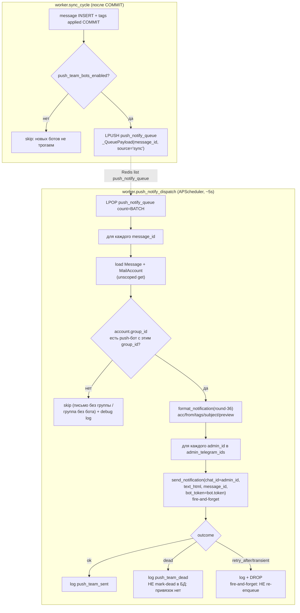

# ADR-0027 — Push-only Telegram-боты по командам (per-team notification bots)

| | |
| --- | --- |
| Статус | accepted |
| Дата | 2026-06-09 |
| Заменяет / отменён | нет; **расширяет** ADR-0022 §2 (push-уведомления) — добавляет параллельный, упрощённый канал доставки. Не трогает основной бот (`BOT_TOKEN`). |

## Context

Сейчас (ADR-0022 §2, round-31 `TG_NOTIFY_ALL_MESSAGES=true`) **один** основной бот (`BOT_TOKEN`) доставляет push-уведомления обо **всех** новых письмах всем получателям, у которых есть активная `telegram_links`-привязка и право видеть письмо (super_admin/group/owner). Два администратора получают **поток всех писем всех команд в один общий чат** с основным ботом — это неудобно: письма разных команд (`ivan` / `alexandra` / `andrei`) смешаны, нельзя быстро отделить команду от команды.

Пользователь явно запросил: разнести уведомления **по командам** — завести **3 дополнительных push-only бота**, по одному на команду; каждый бот шлёт письма **только своей команды** на тех же 2 администраторов (фиксированные Telegram chat id из `.env`). У администратора появляется **3 раздельных чата** (по одному с каждым ботом) вместо одного смешанного.

Существующий контекст, на который опирается решение:
- `mail_accounts.group_id` — ключ принадлежности ящика к команде (ADR-0019; аккаунт сохраняет исходную группу при переносе владельца). Прод-маппинг команд: `ivan`=group_id `1`, `alexandra`=group_id `2`, `andrei`=group_id `3`.
- Основной pipeline доставки (ADR-0022 §2): `sync_cycle` после COMMIT кладёт `message_id` в Redis-list `tg_notify_queue` → APScheduler-job `tg_notify_dispatch` (worker) `LPOP` батч → `TelegramNotifyService.dispatch_one_payload` резолвит получателей (recipient-SQL), формирует текст `format_notification` (round-36) и шлёт `send_notification`. Поверх — `telegram_notifications` (idempotency), `telegram_links` (привязки/dead-mark), per-chat throttle (§2.9), recovery-scan (§2.8).
- Формат уведомления — `backend/app/telegram/notify_format.py::format_notification` (round-36: `🆔`/`#️⃣`/`Клиент`/`Тема`/превью).
- Bot-API клиент — `backend/app/telegram/bot.py::send_notification` (использует токен из `settings.BOT_TOKEN` через `_api_url`).
- Bot-токен маскируется в логах через `REDACT_KEYS` в `shared/logging.py`.

Ключевое отличие новой фичи от ADR-0022: эти 3 бота **не имеют** ни webhook, ни SSO, ни `telegram_links`, ни привязок в БД, ни inbound-команд. Получатели **фиксированы** (2 chat id из `.env`), команда определяется **самим ботом** (явный `group_id` из `.env`), а не правами видимости пользователя. Это позволяет резко упростить доставку.

---

## Decision

Завести **3 дополнительных push-only Telegram-бота** (`ivan` / `alexandra` / `andrei`). Каждый бот:
- шлёт **только** `sendMessage` (никаких webhook / inbound-команд / SSO / БД-привязок);
- привязан к команде **явным** `group_id` из `.env`;
- доставляет уведомления о **всех** письмах своей команды (как `notify-all`) на **фиксированный** список из 2 администраторских Telegram chat id (`ADMIN_TELEGRAM_IDS`);
- использует **тот же** формат текста, что и основной бот (`format_notification`, round-36), **без** метки команды (сам бот = команда);
- доставляет **fire-and-forget**: без БД-трекинга, idempotency, recovery, без миграций.

Основной бот (`BOT_TOKEN`, ADR-0022 §2) **не меняется** и продолжает работать как прежде. Новые 3 бота — **дополнительный, независимый** канал.

### §1. Маппинг бот → команда (group_id)

Привязка бота к команде задаётся **явно** в `.env` (не выводится из username бота и не из БД):

| Бот | Token env | Group env | Прод group_id | Команда |
| --- | --- | --- | --- | --- |
| `ivan` | `BOT_IVAN_TOKEN` | `BOT_IVAN_GROUP_ID` | `1` | ivan |
| `alexandra` | `BOT_ALEXANDRA_TOKEN` | `BOT_ALEXANDRA_GROUP_ID` | `2` | alexandra |
| `andrei` | `BOT_ANDREI_TOKEN` | `BOT_ANDREI_GROUP_ID` | `3` | andrei |

Получатели — общие для всех трёх ботов:

| Env | Значение | Описание |
| --- | --- | --- |
| `ADMIN_TELEGRAM_IDS` | CSV, напр. `11111111,22222222` | Фиксированные Telegram chat id двух администраторов. Каждый push-бот шлёт каждому из них. |

**Почему явный `group_id`, а не маппинг по username бота:** username бота — внешний, изменяемый атрибут (ребрендинг, пересоздание бота через BotFather), не связанный с доменной моделью; матчинг по нему хрупок и неочевиден. `group_id` — стабильный первичный ключ команды в нашей БД (ADR-0019). Явная пара «token + group_id» в `.env` делает связь однозначной и аудируемой.

### §2. Конфигурация (`shared/config.py`)

Новые поля `Settings`:

```
BOT_IVAN_TOKEN: str = ""
BOT_IVAN_GROUP_ID: int | None = None
BOT_ALEXANDRA_TOKEN: str = ""
BOT_ALEXANDRA_GROUP_ID: int | None = None
BOT_ANDREI_TOKEN: str = ""
BOT_ANDREI_GROUP_ID: int | None = None
ADMIN_TELEGRAM_IDS: str = ""   # CSV chat id
```

Derived (computed) свойства — единый источник истины для воркера:

```python
@property
def admin_telegram_ids(self) -> list[int]:
    """Распарсенный CSV ADMIN_TELEGRAM_IDS; пустые/нечисловые элементы отбрасываются."""
    return [int(x) for x in self.ADMIN_TELEGRAM_IDS.split(",") if x.strip().lstrip("-").isdigit()]

@property
def push_team_bots(self) -> list[PushTeamBot]:
    """Список НАСТРОЕННЫХ push-ботов: только пары (token непустой И group_id задан).
    PushTeamBot = (name: str, token: str, group_id: int).
    Бот без токена или без group_id в список НЕ попадает (тихо игнорируется)."""
    ...

@property
def push_team_bots_enabled(self) -> bool:
    """True, если есть хотя бы один настроенный push-бот И непустой admin_telegram_ids."""
    return bool(self.push_team_bots) and bool(self.admin_telegram_ids)
```

`PushTeamBot` — маленький frozen-dataclass / NamedTuple (`name`, `token`, `group_id`).

**Инвариант (валидируется в `model_validator`, не допускать):** один `group_id` не должен быть привязан к двум разным ботам. При коллизии `group_id` среди настроенных ботов — **fail-fast** на старте (`ValueError`), потому что иначе письмо одной команды ушло бы дважды (двумя ботами) — это конфигурационная ошибка оператора, а не runtime-edge. Боты с пустым токеном/без `group_id` в проверке не участвуют (они просто не настроены).

### §3. Архитектура доставки (симметрична основному pipeline, минимально-инвазивна)

Отдельная Redis-очередь `push_notify_queue` + отдельный worker-job `push_notify_dispatch`. **Одна** общая очередь на все 3 бота (не по очереди на бота): payload несёт только `message_id`, бот выбирается на стороне диспатчера по `group_id` аккаунта. Это переиспользует существующий `_QueuePayload` и даёт **один** `LPOP` (нет дублей, нет конкуренции нескольких consumer'ов за один message).



**Поток по шагам:**

1. **`sync_cycle` (enqueue).** Сразу после существующего блока ADR-0022 enqueue (`TelegramNotifyService.enqueue_message_ids`) и ADR-0023 webhook-enqueue, в **том же** `if notified_message_ids:`-блоке (после COMMIT транзакции аккаунта), добавляется **третий независимый** `try/except`:
   - если `settings.push_team_bots_enabled` → `LPUSH push_notify_queue` тот же набор `message_id` (reuse `_QueuePayload(source="sync")`);
   - иначе — пропуск (фича выключена; основной бот и webhook не затрагиваются).
   - Любая ошибка LPUSH **проглатывается** (log warning), как и для основной очереди — Redis-сбой не валит `sync_cycle`.
   - Условие постановки = то же, что собирает `notified_message_ids` (round-31: при `TG_NOTIFY_ALL_MESSAGES=true` — каждое письмо; иначе — только с тегом). Push-боты `notify-all` по своей команде — соответствует требованию «все письма команды».

2. **`push_notify_dispatch` (новый job, по образцу `worker/app/tg_notify_dispatch.py`).** Каждые `PUSH_NOTIFY_DISPATCH_INTERVAL_SECONDS` (default 5с, `max_instances=1`, `coalesce=True`):
   - `LPOP push_notify_queue count=PUSH_NOTIFY_BATCH_SIZE`;
   - для каждого `message_id`:
     - `load Message` (unscoped `session.get`) → нет → debug-log + skip;
     - `load MailAccount` по `message.mail_account_id` → нет → debug-log + skip;
     - `group_id = account.group_id`; если `group_id is None` → skip (письмо вне команды);
     - найти push-бота с этим `group_id` (lookup по `settings.push_team_bots`); нет → skip (группа без настроенного бота);
     - собрать текст: `format_notification(round-36)` — те же `acc_label` / `from_label` / `tag_names` / `subject` / `body_preview`, что и в основном диспатчере (теги/превью резолвятся теми же helper'ами — допустимо переиспользовать query-методы; **без** метки команды);
     - для каждого `admin_id` в `settings.admin_telegram_ids`: `send_notification(chat_id=admin_id, text_html=..., message_id=..., bot_token=bot.token)` — **fire-and-forget**;
     - результат `send_notification` **только логируется** (ok / dead / retry_after / transient) — **никаких** записей в БД, **никакого** re-enqueue, **никакого** mark-dead.
   - Любая ошибка обработки одного item — `catch` + log + продолжить (как в `tg_notify_dispatch`); job никогда не пробрасывает исключение наружу (обёртка `_safe_push_notify_dispatch` в `main.py`, как у остальных job'ов).

3. **Регистрация job (`worker/app/main.py`).** Добавить `scheduler.add_job(_safe_push_notify_dispatch, IntervalTrigger(seconds=settings.PUSH_NOTIFY_DISPATCH_INTERVAL_SECONDS), id="push_notify_dispatch", coalesce=True, max_instances=1, misfire_grace_time=30)`. Рекавери-job **нет** (fire-and-forget — см. §5).

**Почему одна очередь + один `LPOP`, а не встраивание в основной `tg_notify_dispatch`:** встраивание в существующий диспатчер означало бы доставку push-ботов под тем же retry/re-enqueue, что и основной бот → при `retry_after`/`transient` основного бота сообщение возвращается в `tg_notify_queue` и обрабатывается повторно → push-боты получили бы **дубль** (у них нет idempotency-таблицы, чтобы его отсечь). Отдельная очередь + отдельный `LPOP` гарантируют: каждый `message_id` обрабатывается push-каналом ровно один раз, независимо от судьбы основного бота.

### §4. Параметризация bot-клиента (`backend/app/telegram/bot.py`)

Текущий `_api_url(method)` и `send_notification(...)` хардкодят `settings.BOT_TOKEN`. Их нужно сделать **токен-параметризуемыми**, сохранив обратную совместимость:

```python
def _api_url(method: str, token: str | None = None) -> str:
    settings = get_settings()
    tok = token or settings.BOT_TOKEN     # дефолт = основной бот (ADR-0022)
    return f"https://api.telegram.org/bot{tok}/{method}"

async def send_notification(*, chat_id: int, text_html: str, message_id: int,
                            bot_token: str | None = None) -> SendNotificationResult:
    ...
    # при bot_token=None — поведение ADR-0022 без изменений;
    # ветку `if not settings.telegram_bot_enabled: return disabled` НЕ применять,
    # когда bot_token задан явно (push-бот включён фактом наличия токена в push_team_bots).
```

- Все вызовы `_api_url(...)` внутри `send_notification` принимают `token=bot_token`.
- Существующие call-site'ы (основной диспатчер) вызывают `send_notification(...)` без `bot_token` → токен = `BOT_TOKEN`, поведение ADR-0022 **не меняется**.
- **Важно:** guard `settings.telegram_bot_enabled` (требует `BOT_TOKEN` + webhook-secret + webapp-url) **не должен** блокировать push-бот: push-боты не используют webhook/webapp. Когда `bot_token` передан явно — считаем бот «включённым» самим фактом наличия токена в `push_team_bots` (диспатчер вызывает `send_notification` только для настроенных ботов). Реализация: при `bot_token is not None` пропускать `disabled`-ветку.

### §5. Fire-and-forget — обоснование trade-off

Доставка push-ботов **намеренно** упрощена до fire-and-forget: **без** `telegram_notifications`-трекинга, **без** idempotency-ключа, **без** recovery-scan, **без** mark-dead, **без** миграций.

**Почему это приемлемо:**
- Канал — **admin-мониторинг**, а не транзакционно-критичная доставка. Письмо в любом случае **сохранено** в БД и доступно в Inbox (UI) и через основной бот (ADR-0022, с полным трекингом/recovery). Push-бот — удобный «второй экран», а не единственный источник.
- Дубликат при сбое не нужен — у канала нет повторных попыток, поэтому idempotency-таблица не требуется (нечего дедуплицировать).
- Потеря **редка** и ограничена: происходит только при падении/рестарте worker в момент, когда item уже извлечён `LPOP` из `push_notify_queue`, но `sendMessage` ещё не выполнен. На текущем масштабе (≤ единиц писем/мин, единичные рестарты) — единичные пропуски; письмо при этом не теряется (см. выше), теряется только дублирующее push-уведомление.
- При `retry_after` (429) / `transient` (5xx, network) item **не** возвращается в очередь — просто логируется и дропается. Это сознательно: re-enqueue без idempotency дал бы дубли остальным admin'ам и busy-loop; цена — редкий пропуск уведомления в admin-канале.

Зарегистрировано как **TD-041 (low)** в `100-known-tech-debt.md`. Эскалация (добавить трекинг/recovery) — только если оператор сообщит о значимых пропусках.

### §6. Reuse существующих компонентов

| Компонент | Reuse |
| --- | --- |
| Формат текста | `notify_format.format_notification` (round-36) + `html_to_plain` / `normalize_preview` — **как есть**, без изменений. |
| Bot-API клиент | `bot.send_notification` + `_api_url` — параметризуются токеном (§4); логика 200/429/403/5xx сохраняется. |
| Очередь wire-format | `_QueuePayload` (`notify_service.py`) — переиспользуется (`message_id` + `source`). |
| Резолв тегов/превью сообщения | те же query-helper'ы, что и в `dispatch_one_payload` (`list_tags_for_message` и т.п.) — допустимо вызывать из push-диспатчера. |
| Job-обёртка / APScheduler | паттерн `_safe_*` + `add_job(coalesce, max_instances=1)` (`main.py`). |

### §7. Отличия от основного бота (ADR-0022)

| Аспект | Основной бот (`BOT_TOKEN`, ADR-0022) | Push-команда-боты (ADR-0027) |
| --- | --- | --- |
| Webhook / inbound | да (`/api/telegram/webhook`, `/start`, callback «Посмотреть сообщение») | **нет** — только outbound `sendMessage` |
| SSO / `telegram_links` | да (initData HMAC, привязки, self-heal) | **нет** — получатели фиксированы в `.env` |
| Кому шлёт | всем по visibility (super_admin/group/owner) + активная привязка + opt-out | фиксированные `ADMIN_TELEGRAM_IDS`; команда = `group_id` бота |
| Объём | все письма (notify-all) по всем видимым ящикам | все письма **только** своей команды (`group_id`) |
| Idempotency | `telegram_notifications` UNIQUE | **нет** (fire-and-forget) |
| Recovery / retry | recovery-scan + re-enqueue на 429/transient | **нет** — дроп при сбое |
| Mark-dead | да (`telegram_links.dead_at`) | **нет** — только log `push_team_dead` |
| Throttle | per-chat `TG_SEND_PER_CHAT_PER_MINUTE` | нет отдельного (поток мал: ≤2 admin × писем/мин); глобальный лимит Bot API per-бот достаточен |
| Inline-кнопка | «Посмотреть сообщение» (callback) | наследуется от `send_notification` (та же кнопка); callback обрабатывается **основным** webhook'ом — для push-ботов callback не настроен, кнопка ведёт в никуда → **в push-варианте кнопку отключить** (`send_notification` параметр или отдельный текст-only путь) |

> **Решение по inline-кнопке:** push-боты **не** имеют webhook, поэтому callback `msg:{id}` от их кнопки никто не обработает (спиннер у пользователя зависнет). Backend-агент должен слать push-уведомления **без** inline-кнопки — либо добавить в `send_notification` флаг `with_button: bool = True` и передавать `False` из push-диспатчера, либо использовать отдельный текст-only `sendMessage`. Предпочтительно — флаг `with_button=False` (минимальная правка, переиспользует всю обработку статусов).

### §8. Security

- **Токены ботов** (`BOT_IVAN_TOKEN` / `BOT_ALEXANDRA_TOKEN` / `BOT_ANDREI_TOKEN`) — только в `.env` (`chmod 600`), как `BOT_TOKEN`. Передаются в контейнер **worker** (диспатчер живёт в worker'е). В `api` они не нужны.
- **Redact в логах:** добавить три новых ключа в `REDACT_KEYS` (`shared/logging.py`) рядом с `BOT_TOKEN`: `BOT_IVAN_TOKEN`, `BOT_ALEXANDRA_TOKEN`, `BOT_ANDREI_TOKEN`. `_api_url` уже не логирует URL (см. ADR-0022 §2 / docstring `bot.py`) — токен в логи не попадает по построению; redact — defence-in-depth для случайного дампа settings.
- `ADMIN_TELEGRAM_IDS` — не секрет (Telegram chat id), но логировать его в каждом событии не нужно; в structured-логах оставлять только конкретный `chat_id` доставки.
- Компрометация токена push-бота → атакующий может слать сообщения **от имени бота** двум известным admin'ам (фишинг), но **не** получает доступа к письмам/системе (бот push-only, без БД/SSO). Митигация: ротация токена через BotFather + обновление `.env`.

### §9. Edge cases

| Сценарий | Поведение |
| --- | --- |
| Письмо без группы (`account.group_id IS NULL`) | skip (debug-log `push_team_skip_no_group`). Личные ящики вне команд push-каналом не покрываются — by design. |
| Группа без настроенного бота (нет пары с этим `group_id`) | skip (debug-log `push_team_skip_no_bot`). |
| Несколько ботов на один `group_id` | **не допускается** — fail-fast на старте (§2 invariant), иначе дубли. |
| Бот настроен (token), но `group_id` не задан | бот **не** попадает в `push_team_bots` (тихо игнорируется) — не настроен. |
| `ADMIN_TELEGRAM_IDS` пуст | `push_team_bots_enabled=false` → `sync_cycle` не делает LPUSH; фича выключена целиком. |
| Админ заблокировал push-бота (403) | `send_notification` вернёт `kind="dead"` → log `push_team_dead`; **в БД ничего не пишем** (привязок нет). Следующее письмо снова попытается доставить (разблокировал — снова получает). |
| 429 / 5xx / network | log + **дроп** (fire-and-forget, §5). Без re-enqueue. |
| Message/Account удалены к моменту dispatch (retention) | skip + debug-log (как в `tg_notify_dispatch`). |
| Redis недоступен на enqueue | LPUSH-ошибка проглочена в `sync_cycle` (как для основной очереди); push-уведомления по этому циклу не отправятся, письма сохранены. |
| `push_notify_queue` потеряна при рестарте Redis | items пропадают (fire-and-forget); recovery нет — осознанный trade-off (§5). |

---

## Consequences

**Плюсы:**
- Администраторы получают **3 раздельных чата** по командам — чистое разделение потоков без меток/фильтров.
- Минимально-инвазивно: основной бот, его pipeline, БД-схема, миграции — **не тронуты**. Вся новая логика — один enqueue-блок, один worker-job, токен-параметризация клиента, новые config-поля.
- Переиспользует формат (round-36) и Bot-клиент → консистентный внешний вид уведомлений, минимум нового кода.
- Фича полностью управляется `.env`: нет ботов/`ADMIN_TELEGRAM_IDS` → канал выключен, остальное работает как раньше.

**Минусы / принятые компромиссы:**
- Fire-and-forget → редкая потеря push-уведомления при рестарте worker (TD-041, low). Письма не теряются.
- Маппинг команд через `.env` (не через UI/БД) → изменение состава команд требует правки `.env` + рестарта worker. На текущем масштабе (3 фиксированные команды) приемлемо.
- Дублирование доставки между основным ботом и push-ботами (одно письмо команды может прийти и через основной бот по visibility, и через push-бот) — это by design (разные каналы/чаты); если в будущем избыточно — отдельный ADR.
- Нет per-chat throttle у push-ботов → при всплеске писем одной команды теоретически возможен 429 (тогда уведомление дропается). На текущем потоке (≤2 admin) риск низкий.

---

## Alternatives considered

1. **Встроить push-команда-доставку в существующий `tg_notify_dispatch` / `tg_notify_queue`.**
   Отвергнуто: основной диспатчер делает re-enqueue на `retry_after`/`transient` (ADR-0022 §2.4). Без отдельной idempotency push-боты получали бы **дубли** при каждом повторе. Отдельная очередь + один `LPOP` устраняет это в принципе.

2. **БД-трекинг доставки push-ботов (по образцу `telegram_notifications`) + recovery-scan.**
   Отвергнуто как избыточное для fire-and-forget admin-канала: idempotency-таблица нужна только при наличии повторов (которых здесь нет), а письма и так полностью покрыты основным ботом с recovery. Дало бы миграцию + новый код ради канала, потеря в котором не критична.

3. **Маппинг бот → команда по username бота (BotFather @ivan_bot → команда «ivan»).**
   Отвергнуто: username — внешний изменяемый атрибут, не связанный с доменной моделью; хрупко к ребрендингу/пересозданию бота. Явный `group_id` в `.env` — стабильная связь с PK команды (ADR-0019).

4. **Очередь на каждого бота (`push_notify_queue:{group_id}`).**
   Отвергнуто: лишняя сложность (N очередей, N consumer'ов / N `LPOP`), без выигрыша. Бот тривиально выбирается по `account.group_id` на стороне одного диспатчера; одна очередь = проще, без рассинхрона.

5. **Раздельная фильтрация на стороне `sync_cycle` (класть в очередь только письма команд с настроенными ботами).**
   Отвергнуто: усложняет enqueue знанием о маппинге ботов и `group_id` каждого аккаунта в горячем sync-пути. Дешевле положить все `message_id` (как для основной очереди/webhook) и отфильтровать в диспатчере, где `MailAccount` всё равно загружается.

---

## Open questions

Нет блокирующих. Прод-значения подтверждены пользователем: `ivan`=1, `alexandra`=2, `andrei`=3; получатели — 2 фиксированных admin chat id. Реальные токены ботов и chat id заполняет devops в prod `.env` (не хранятся в репозитории).
