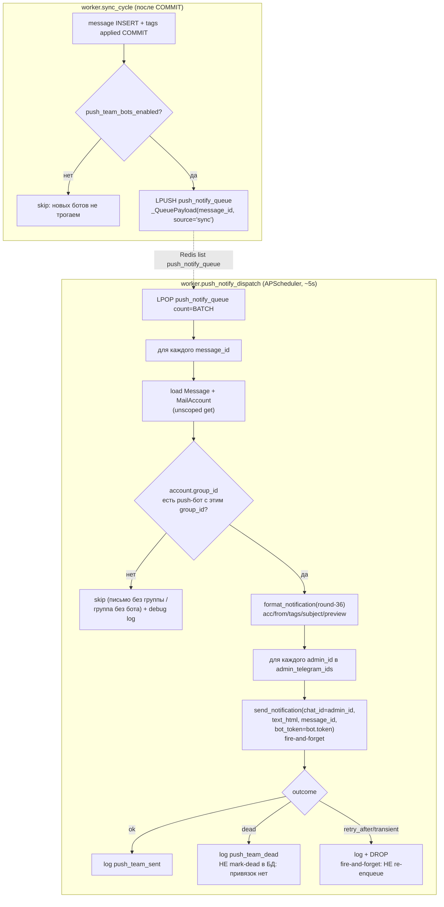

# ADR-0027 — Push-only Telegram-боты по командам (per-team notification bots)

| | |
| --- | --- |
| Статус | **superseded by [ADR-0043](./ADR-0043-strip-to-connector-push-to-crm.md)** (2026-07-10) — push-боты переключают вебхуки на CRM, диспетчер в CRM (CRM `ADR-044` §6/§9); ранее accepted |
| Дата | 2026-06-09 (round-42: добавлен webhook + callback-кнопка push-ботам; round-44: 4-й push-бот `business2`) |
| Заменяет / отменён | нет; **расширяет** ADR-0022 §2 (push-уведомления) — добавляет параллельный, упрощённый канал доставки. Не трогает основной бот (`BOT_TOKEN`). |

> **Round-42 update.** Исходная редакция (round-31) слала push-уведомления **без** inline-кнопки «Посмотреть сообщение» (`with_button=False`), потому что у push-ботов не было webhook и callback `msg:{id}` некому было обработать. **Подтверждено** (round-42): webhook на `postapp.store` достижим для Telegram-инфраструктуры (основной бот webhook `…/webhook/{secret}` работает: Telegram резолвит `postapp.store → 132.243.113.117`, `pending=0`, без ошибок; DNS-парковка ломает только браузеры). Поэтому push-боты теперь **получают собственный webhook + callback-кнопку**: §7 пересмотрен (`with_button=True`), добавлен §10 (webhook + callback-маршрут push-ботов) и §11 (авторизация push-callback по `admin_telegram_ids` + group-match). TD-041 (fire-and-forget доставки уведомлений) **не меняется** — webhook касается только inbound-callback, не исходящей доставки.

> **Round-44 update (+`business2`, 4-й push-бот).** Добавлен **четвёртый** push-only бот `business2` — полностью по образцу `ivan`/`alexandra`/`andrei`, той же механикой (отдельная очередь `push_notify_queue` + job `push_notify_dispatch` + callback-webhook). Изменения **только конфигурационные**: новые `.env`-поля `BOT_BUSINESS2_TOKEN` / `BOT_BUSINESS2_GROUP_ID` / `BOT_BUSINESS2_WEBHOOK_SECRET`, перечисление бота в двух местах `shared/config.py` (дубль-инвариант `group_id` в `model_validator` + property `push_team_bots`) и три новых ключа в `REDACT_KEYS` (`shared/logging.py`). **Новых endpoint'ов / worker-job'ов / миграций нет** — роут `/api/telegram/push-webhook/{bot_name}` (`router.py`) и диспатчер `push_notify_dispatch` (`worker/app/push_notify_dispatch.py`) **generic** (матчат бота по `name` / `account.group_id`). Имя-слаг бота — `business2`; webhook URL — `…/api/telegram/push-webhook/business2`. Прод `group_id` для `business2` задаётся **оператором в `.env`** и должен **отличаться** от `1`/`2`/`3` (иначе fail-fast дубля, §2). Везде ниже «3 push-бота» читается теперь как «4 push-бота».

## Context

Сейчас (ADR-0022 §2, round-31 `TG_NOTIFY_ALL_MESSAGES=true`) **один** основной бот (`BOT_TOKEN`) доставляет push-уведомления обо **всех** новых письмах всем получателям, у которых есть активная `telegram_links`-привязка и право видеть письмо (super_admin/group/owner). Два администратора получают **поток всех писем всех команд в один общий чат** с основным ботом — это неудобно: письма разных команд (`ivan` / `alexandra` / `andrei`) смешаны, нельзя быстро отделить команду от команды.

Пользователь явно запросил: разнести уведомления **по командам** — завести **дополнительные push-only боты**, по одному на команду; каждый бот шлёт письма **только своей команды** на тех же 2 администраторов (фиксированные Telegram chat id из `.env`). У администратора появляется **раздельный чат** на каждый бот вместо одного смешанного. Исходно (round-31) заведено **3** бота (`ivan`/`alexandra`/`andrei`); round-44 добавляет **4-й** бот `business2` (итого 4).

Существующий контекст, на который опирается решение:
- `mail_accounts.group_id` — ключ принадлежности ящика к команде (ADR-0019; аккаунт сохраняет исходную группу при переносе владельца). Прод-маппинг команд: `ivan`=group_id `1`, `alexandra`=group_id `2`, `andrei`=group_id `3`; `business2`=group_id, задаваемый оператором в `.env` (≠ `1`/`2`/`3`).
- Основной pipeline доставки (ADR-0022 §2): `sync_cycle` после COMMIT кладёт `message_id` в Redis-list `tg_notify_queue` → APScheduler-job `tg_notify_dispatch` (worker) `LPOP` батч → `TelegramNotifyService.dispatch_one_payload` резолвит получателей (recipient-SQL), формирует текст `format_notification` (round-36) и шлёт `send_notification`. Поверх — `telegram_notifications` (idempotency), `telegram_links` (привязки/dead-mark), per-chat throttle (§2.9), recovery-scan (§2.8).
- Формат уведомления — `backend/app/telegram/notify_format.py::format_notification` (round-36: `🆔`/`#️⃣`/`Клиент`/`Тема`/превью).
- Bot-API клиент — `backend/app/telegram/bot.py::send_notification` (использует токен из `settings.BOT_TOKEN` через `_api_url`).
- Bot-токен маскируется в логах через `REDACT_KEYS` в `shared/logging.py`.

Ключевое отличие новой фичи от ADR-0022: эти push-боты **не имеют** SSO, `telegram_links`, привязок в БД, ни inbound-команд `/start`/`/help`. Получатели **фиксированы** (2 chat id из `.env`), команда определяется **самим ботом** (явный `group_id` из `.env`), а не правами видимости пользователя. Это позволяет резко упростить доставку.

**Round-42:** push-боты получают **один** inbound-канал — webhook, который принимает **только `callback_query`** от кнопки «Посмотреть сообщение» (всё остальное — `/start`, `message`, прочие update — игнорируется). Это не возвращает SSO/`telegram_links`/привязки: callback-нажатие авторизуется по `from.id ∈ admin_telegram_ids` (push-админы известны из `.env`, у них может не быть `user`-строки в БД) + защитная проверка принадлежности письма группе этого бота. См. §10–§11.

---

## Decision

Завести **дополнительные push-only Telegram-боты** (round-31: `ivan` / `alexandra` / `andrei`; round-44: + `business2` → итого **4**). Каждый бот:
- шлёт **только** `sendMessage` (никаких webhook / inbound-команд / SSO / БД-привязок);
- привязан к команде **явным** `group_id` из `.env`;
- доставляет уведомления о **всех** письмах своей команды (как `notify-all`) на **фиксированный** список из 2 администраторских Telegram chat id (`ADMIN_TELEGRAM_IDS`);
- использует **тот же** формат текста, что и основной бот (`format_notification`, round-36), **без** метки команды (сам бот = команда);
- доставляет **fire-and-forget**: без БД-трекинга, idempotency, recovery, без миграций.

Основной бот (`BOT_TOKEN`, ADR-0022 §2) **не меняется** и продолжает работать как прежде. Эти push-боты — **дополнительный, независимый** канал.

### §1. Маппинг бот → команда (group_id)

Привязка бота к команде задаётся **явно** в `.env` (не выводится из username бота и не из БД):

| Бот | Token env | Group env | Прод group_id | Команда |
| --- | --- | --- | --- | --- |
| `ivan` | `BOT_IVAN_TOKEN` | `BOT_IVAN_GROUP_ID` | `1` | ivan |
| `alexandra` | `BOT_ALEXANDRA_TOKEN` | `BOT_ALEXANDRA_GROUP_ID` | `2` | alexandra |
| `andrei` | `BOT_ANDREI_TOKEN` | `BOT_ANDREI_GROUP_ID` | `3` | andrei |
| `business2` (round-44) | `BOT_BUSINESS2_TOKEN` | `BOT_BUSINESS2_GROUP_ID` | оператор (`.env`), ≠ `1`/`2`/`3` | business2 |

> **round-44 — прод `group_id` для `business2`.** В отличие от `ivan`/`alexandra`/`andrei` (зафиксированы `1`/`2`/`3`), конкретный `group_id` команды `business2` **заполняет devops/оператор** в prod `.env` (`BOT_BUSINESS2_GROUP_ID`) и он **обязан отличаться** от `1`/`2`/`3` — иначе сработает fail-fast дубля `group_id` на старте (§2). Значение должно совпадать с реальным `groups.id` команды `business2` в БД (ADR-0019).

Получатели — общие для всех push-ботов:

| Env | Значение | Описание |
| --- | --- | --- |
| `ADMIN_TELEGRAM_IDS` | CSV, напр. `11111111,22222222` | Фиксированные Telegram chat id двух администраторов. Каждый push-бот шлёт каждому из них. |

**Почему явный `group_id`, а не маппинг по username бота:** username бота — внешний, изменяемый атрибут (ребрендинг, пересоздание бота через BotFather), не связанный с доменной моделью; матчинг по нему хрупок и неочевиден. `group_id` — стабильный первичный ключ команды в нашей БД (ADR-0019). Явная пара «token + group_id» в `.env` делает связь однозначной и аудируемой.

### §2. Конфигурация (`shared/config.py`)

Новые поля `Settings`:

```
BOT_IVAN_TOKEN: str = ""
BOT_IVAN_GROUP_ID: int = Field(default=0, ge=0)
BOT_IVAN_WEBHOOK_SECRET: str = ""          # round-42
BOT_ALEXANDRA_TOKEN: str = ""
BOT_ALEXANDRA_GROUP_ID: int = Field(default=0, ge=0)
BOT_ALEXANDRA_WEBHOOK_SECRET: str = ""     # round-42
BOT_ANDREI_TOKEN: str = ""
BOT_ANDREI_GROUP_ID: int = Field(default=0, ge=0)
BOT_ANDREI_WEBHOOK_SECRET: str = ""        # round-42
BOT_BUSINESS2_TOKEN: str = ""              # round-44
BOT_BUSINESS2_GROUP_ID: int = Field(default=0, ge=0)   # round-44
BOT_BUSINESS2_WEBHOOK_SECRET: str = ""     # round-44
ADMIN_TELEGRAM_IDS: str = ""   # CSV chat id
```

> **Замечание о типе `group_id`.** В реализации `BOT_*_GROUP_ID` — `int = Field(default=0, ge=0)` (не `int | None`): «не задан» кодируется значением `0`, а «настроен» — `group_id > 0`. `business2` следует той же форме. Это влияет на формулировку инварианта и фильтра ниже: бот считается настроенным, когда `token` непустой **И** `group_id > 0`.

**round-42 — `BOT_*_WEBHOOK_SECRET`.** Каждый push-бот, у которого нужна callback-кнопка, получает **явный** per-бот webhook-secret (32 hex, `openssl rand -hex 16`), **симметрично** основному боту (`TELEGRAM_WEBHOOK_SECRET`, ADR-0018). Secret используется и в URL-path push-webhook'а, и в header `X-Telegram-Bot-Api-Secret-Token` (двойная проверка как в основном webhook — `backend/app/telegram/router.py::_secret_matches`).

**Почему явный secret в `.env`, а не детерминированный, выведенный из токена.** Детерминированный secret (`HMAC(token)` или `sha256(token)`) соблазнителен (одно поле меньше), но: (а) **асимметричен** основному боту — оператор не сможет ротировать secret независимо от токена и наоборот; (б) **связывает** компрометацию secret и токена (знание одного выводит другое при известном алгоритме); (в) усложняет аудит/ротацию (в `.env` не видно, что выставлено). Явная пара «token + webhook_secret» в `.env` — тот же проверенный паттерн, что у основного бота; ровно один лишний `.env`-ключ на бота.

Derived (computed) свойства — единый источник истины для воркера:

```python
@property
def admin_telegram_ids(self) -> list[int]:
    """Распарсенный CSV ADMIN_TELEGRAM_IDS; пустые/нечисловые элементы отбрасываются."""
    return [int(x) for x in self.ADMIN_TELEGRAM_IDS.split(",") if x.strip().lstrip("-").isdigit()]

@property
def push_team_bots(self) -> list[PushTeamBot]:
    """Список НАСТРОЕННЫХ push-ботов: только пары (token непустой И group_id задан).
    PushTeamBot = (name: str, token: str, group_id: int, webhook_secret: str).
    Бот без токена или без group_id в список НЕ попадает (тихо игнорируется).
    webhook_secret может быть "" — тогда у бота нет callback-кнопки (см. §7/§10)."""
    ...

@property
def push_team_bots_enabled(self) -> bool:
    """True, если есть хотя бы один настроенный push-бот И непустой admin_telegram_ids."""
    return bool(self.push_team_bots) and bool(self.admin_telegram_ids)
```

`PushTeamBot` — маленький frozen-dataclass / NamedTuple. **round-42:** добавлено поле `webhook_secret: str` (`name`, `token`, `group_id`, `webhook_secret`). Worker (доставка) поле игнорирует; webhook-роут в `api` (§10) использует его для маршрутизации + secret-валидации.

**round-42 — связь `with_button` и `webhook_secret`.** Push-уведомление получает кнопку «Посмотреть сообщение» **только если у бота задан `webhook_secret`** (иначе callback `msg:{id}` некому обработать — спиннер зависнет). Диспатчер вычисляет `with_button = bool(bot.webhook_secret)` на бот (§7). Production-инвариант: все push-боты (round-44: все 4 — `ivan`/`alexandra`/`andrei`/`business2`) настраиваются с `webhook_secret` (devops), но fallback на `with_button=False` при пустом secret сохраняется — фича деградирует gracefully, а не ломается, если оператор забыл secret.

**Lookup-инвариант для webhook (round-42):** имя бота в URL push-webhook'а (`/api/telegram/push-webhook/{bot_name}`) — это фиксированный `name` (`ivan`/`alexandra`/`andrei`/`business2`). `push_team_bots` уже даёт стабильный `name`; webhook-роут резолвит `PushTeamBot` по `name` и сверяет `webhook_secret`. Несуществующее имя / бот без secret → `not_found` (§10).

**Инвариант (валидируется в `model_validator`, не допускать):** один `group_id` не должен быть привязан к двум разным ботам. Проверка перечисляет все настроенные боты — round-44: `BOT_IVAN` / `BOT_ALEXANDRA` / `BOT_ANDREI` / `BOT_BUSINESS2`. При коллизии `group_id` среди настроенных ботов — **fail-fast** на старте (`ValueError`), потому что иначе письмо одной команды ушло бы дважды (двумя ботами) — это конфигурационная ошибка оператора, а не runtime-edge. Боты с пустым токеном или `group_id = 0` в проверке не участвуют (они просто не настроены). Текст ошибки перечисляет все 4 поля, например: `Duplicate push-bot group_id: each configured push bot (BOT_IVAN/BOT_ALEXANDRA/BOT_ANDREI/BOT_BUSINESS2) must map to a distinct group_id (ADR-0027 §2)`. **Практическое следствие для `business2`:** `BOT_BUSINESS2_GROUP_ID` обязан отличаться от прод-значений `1`/`2`/`3` (см. §1), иначе старт упадёт.

### §3. Архитектура доставки (симметрична основному pipeline, минимально-инвазивна)

Отдельная Redis-очередь `push_notify_queue` + отдельный worker-job `push_notify_dispatch`. **Одна** общая очередь на все push-боты (round-44: на все 4; не по очереди на бота): payload несёт только `message_id`, бот выбирается на стороне диспатчера по `group_id` аккаунта. Это переиспользует существующий `_QueuePayload` и даёт **один** `LPOP` (нет дублей, нет конкуренции нескольких consumer'ов за один message).



> **round-44 — generic-инвариант пути доставки.** Диспатчер `worker/app/push_notify_dispatch.py` и enqueue в `sync_cycle` **не перечисляют** боты по имени: они работают с `settings.push_team_bots` (любой длины) и выбирают бот по `account.group_id`. Поэтому добавление `business2` **не меняет** ни enqueue-блок, ни диспатчер, ни регистрацию job — только `shared/config.py` (новые поля + перечисление в `model_validator`/`push_team_bots`) и `shared/logging.py` (redact). Новой Redis-очереди / job'а не вводится.

**Поток по шагам:**

1. **`sync_cycle` (enqueue).** Сразу после существующего блока ADR-0022 enqueue (`TelegramNotifyService.enqueue_message_ids`) и ADR-0023 webhook-enqueue, в **том же** `if notified_message_ids:`-блоке (после COMMIT транзакции аккаунта), добавляется **третий независимый** `try/except`:
   - если `settings.push_team_bots_enabled` → `LPUSH push_notify_queue` тот же набор `message_id` (reuse `_QueuePayload(source="sync")`);
   - иначе — пропуск (фича выключена; основной бот и webhook не затрагиваются).
   - Любая ошибка LPUSH **проглатывается** (log warning), как и для основной очереди — Redis-сбой не валит `sync_cycle`.
   - Условие постановки = то же, что собирает `notified_message_ids` (round-31: при `TG_NOTIFY_ALL_MESSAGES=true` — каждое письмо; иначе — только с тегом). Push-боты `notify-all` по своей команде — соответствует требованию «все письма команды».

2. **`push_notify_dispatch` (новый job, по образцу `worker/app/tg_notify_dispatch.py`).** Каждые `PUSH_NOTIFY_DISPATCH_INTERVAL_SECONDS` (default 5с, `max_instances=1`, `coalesce=True`):
   - `LPOP push_notify_queue count=PUSH_NOTIFY_BATCH_SIZE`;
   - для каждого `message_id`:
     - `load Message` (unscoped `session.get`) → нет → debug-log + skip;
     - `load MailAccount` по `message.mail_account_id` → нет → debug-log + skip;
     - `group_id = account.group_id`; если `group_id is None` → skip (письмо вне команды);
     - найти push-бота с этим `group_id` (lookup по `settings.push_team_bots`); нет → skip (группа без настроенного бота);
     - собрать текст: `format_notification(round-36)` — те же `acc_label` / `from_label` / `tag_names` / `subject` / `body_preview`, что и в основном диспатчере (теги/превью резолвятся теми же helper'ами — допустимо переиспользовать query-методы; **без** метки команды);
     - для каждого `admin_id` в `settings.admin_telegram_ids`: `send_notification(chat_id=admin_id, text_html=..., message_id=..., bot_token=bot.token, with_button=bool(bot.webhook_secret))` — **fire-and-forget** (round-42: кнопка только при настроенном `webhook_secret`);
     - результат `send_notification` **только логируется** (ok / dead / retry_after / transient) — **никаких** записей в БД, **никакого** re-enqueue, **никакого** mark-dead.
   - Любая ошибка обработки одного item — `catch` + log + продолжить (как в `tg_notify_dispatch`); job никогда не пробрасывает исключение наружу (обёртка `_safe_push_notify_dispatch` в `main.py`, как у остальных job'ов).

3. **Регистрация job (`worker/app/main.py`).** Добавить `scheduler.add_job(_safe_push_notify_dispatch, IntervalTrigger(seconds=settings.PUSH_NOTIFY_DISPATCH_INTERVAL_SECONDS), id="push_notify_dispatch", coalesce=True, max_instances=1, misfire_grace_time=30)`. Рекавери-job **нет** (fire-and-forget — см. §5).

**Почему одна очередь + один `LPOP`, а не встраивание в основной `tg_notify_dispatch`:** встраивание в существующий диспатчер означало бы доставку push-ботов под тем же retry/re-enqueue, что и основной бот → при `retry_after`/`transient` основного бота сообщение возвращается в `tg_notify_queue` и обрабатывается повторно → push-боты получили бы **дубль** (у них нет idempotency-таблицы, чтобы его отсечь). Отдельная очередь + отдельный `LPOP` гарантируют: каждый `message_id` обрабатывается push-каналом ровно один раз, независимо от судьбы основного бота.

### §4. Параметризация bot-клиента (`backend/app/telegram/bot.py`)

Текущий `_api_url(method)` и `send_notification(...)` хардкодят `settings.BOT_TOKEN`. Их нужно сделать **токен-параметризуемыми**, сохранив обратную совместимость:

```python
def _api_url(method: str, token: str | None = None) -> str:
    settings = get_settings()
    tok = token or settings.BOT_TOKEN     # дефолт = основной бот (ADR-0022)
    return f"https://api.telegram.org/bot{tok}/{method}"

async def send_notification(*, chat_id: int, text_html: str, message_id: int,
                            bot_token: str | None = None) -> SendNotificationResult:
    ...
    # при bot_token=None — поведение ADR-0022 без изменений;
    # ветку `if not settings.telegram_bot_enabled: return disabled` НЕ применять,
    # когда bot_token задан явно (push-бот включён фактом наличия токена в push_team_bots).
```

- Все вызовы `_api_url(...)` внутри `send_notification` принимают `token=bot_token`.
- Существующие call-site'ы (основной диспатчер) вызывают `send_notification(...)` без `bot_token` → токен = `BOT_TOKEN`, поведение ADR-0022 **не меняется**.
- **Важно:** guard `settings.telegram_bot_enabled` (требует `BOT_TOKEN` + webhook-secret + webapp-url) **не должен** блокировать push-бот: push-боты не используют webhook/webapp. Когда `bot_token` передан явно — считаем бот «включённым» самим фактом наличия токена в `push_team_bots` (диспатчер вызывает `send_notification` только для настроенных ботов). Реализация: при `bot_token is not None` пропускать `disabled`-ветку.

### §5. Fire-and-forget — обоснование trade-off

Доставка push-ботов **намеренно** упрощена до fire-and-forget: **без** `telegram_notifications`-трекинга, **без** idempotency-ключа, **без** recovery-scan, **без** mark-dead, **без** миграций.

**Почему это приемлемо:**
- Канал — **admin-мониторинг**, а не транзакционно-критичная доставка. Письмо в любом случае **сохранено** в БД и доступно в Inbox (UI) и через основной бот (ADR-0022, с полным трекингом/recovery). Push-бот — удобный «второй экран», а не единственный источник.
- Дубликат при сбое не нужен — у канала нет повторных попыток, поэтому idempotency-таблица не требуется (нечего дедуплицировать).
- Потеря **редка** и ограничена: происходит только при падении/рестарте worker в момент, когда item уже извлечён `LPOP` из `push_notify_queue`, но `sendMessage` ещё не выполнен. На текущем масштабе (≤ единиц писем/мин, единичные рестарты) — единичные пропуски; письмо при этом не теряется (см. выше), теряется только дублирующее push-уведомление.
- При `retry_after` (429) / `transient` (5xx, network) item **не** возвращается в очередь — просто логируется и дропается. Это сознательно: re-enqueue без idempotency дал бы дубли остальным admin'ам и busy-loop; цена — редкий пропуск уведомления в admin-канале.

Зарегистрировано как **TD-041 (low)** в `100-known-tech-debt.md`. Эскалация (добавить трекинг/recovery) — только если оператор сообщит о значимых пропусках.

### §6. Reuse существующих компонентов

| Компонент | Reuse |
| --- | --- |
| Формат текста | `notify_format.format_notification` (round-36) + `html_to_plain` / `normalize_preview` — **как есть**, без изменений. |
| Bot-API клиент | `bot.send_notification` + `_api_url` — параметризуются токеном (§4); логика 200/429/403/5xx сохраняется. |
| Очередь wire-format | `_QueuePayload` (`notify_service.py`) — переиспользуется (`message_id` + `source`). |
| Резолв тегов/превью сообщения | те же query-helper'ы, что и в `dispatch_one_payload` (`list_tags_for_message` и т.п.) — допустимо вызывать из push-диспатчера. |
| Job-обёртка / APScheduler | паттерн `_safe_*` + `add_job(coalesce, max_instances=1)` (`main.py`). |

### §7. Отличия от основного бота (ADR-0022)

| Аспект | Основной бот (`BOT_TOKEN`, ADR-0022) | Push-команда-боты (ADR-0027) |
| --- | --- | --- |
| Webhook / inbound | да (`/api/telegram/webhook`, `/start`, callback «Посмотреть сообщение») | **нет** — только outbound `sendMessage` |
| SSO / `telegram_links` | да (initData HMAC, привязки, self-heal) | **нет** — получатели фиксированы в `.env` |
| Кому шлёт | всем по visibility (super_admin/group/owner) + активная привязка + opt-out | фиксированные `ADMIN_TELEGRAM_IDS`; команда = `group_id` бота |
| Объём | все письма (notify-all) по всем видимым ящикам | все письма **только** своей команды (`group_id`) |
| Idempotency | `telegram_notifications` UNIQUE | **нет** (fire-and-forget) |
| Recovery / retry | recovery-scan + re-enqueue на 429/transient | **нет** — дроп при сбое |
| Mark-dead | да (`telegram_links.dead_at`) | **нет** — только log `push_team_dead` |
| Throttle | per-chat `TG_SEND_PER_CHAT_PER_MINUTE` | нет отдельного (поток мал: ≤2 admin × писем/мин); глобальный лимит Bot API per-бот достаточен |
| Webhook / inbound | да (`/api/telegram/webhook/{secret}`, `/start`, `/help`, callback) | **round-42:** да, **но только callback** (`/api/telegram/push-webhook/{bot_name}`, per-бот secret); `/start`/`message`/прочее — игнорируется |
| Inline-кнопка | «Посмотреть сообщение» (callback `msg:{id}`) | **round-42:** да (`with_button=True`); callback обрабатывается **push-webhook'ом** этого же бота (§10–§11), не основным; авторизация по `admin_telegram_ids` + group-match |

> **Решение по inline-кнопке (round-42, пересмотр round-31).** Исходно push-боты не имели webhook → callback `msg:{id}` некому было обработать → кнопка отключалась (`with_button=False`). Теперь webhook подтверждён достижимым (см. round-42 update в шапке), и каждый push-бот получает **собственный** webhook + callback-маршрут (§10). Push-уведомления снова шлются **с** кнопкой «Посмотреть сообщение» (`with_button=True`), `callback_data="msg:{message_id}"` — тот же контракт кнопки, что у основного бота (`bot.py::send_notification`, ≤64 байта). Нажатие показывает **тело письма** прямо в чате (§11). Кнопка добавляется, только если у бота задан `webhook_secret` (§2 round-42); при пустом secret диспатчер шлёт `with_button=False` (graceful degradation).

### §8. Security

- **Токены ботов** (`BOT_IVAN_TOKEN` / `BOT_ALEXANDRA_TOKEN` / `BOT_ANDREI_TOKEN` / `BOT_BUSINESS2_TOKEN`) — только в `.env` (`chmod 600`), как `BOT_TOKEN`. Передаются в контейнеры **worker** (диспатчер) и **api** (callback-webhook, см. §10). round-44: `BOT_BUSINESS2_TOKEN` — туда же.
- **Redact в логах:** добавить новые ключи в `REDACT_KEYS` (`shared/logging.py`) рядом с `BOT_TOKEN`: токены `BOT_IVAN_TOKEN`, `BOT_ALEXANDRA_TOKEN`, `BOT_ANDREI_TOKEN` и (round-44) `BOT_BUSINESS2_TOKEN`. **round-42 + round-44:** добавить per-бот webhook-secret'ы — `BOT_IVAN_WEBHOOK_SECRET`, `BOT_ALEXANDRA_WEBHOOK_SECRET`, `BOT_ANDREI_WEBHOOK_SECRET`, `BOT_BUSINESS2_WEBHOOK_SECRET` (симметрично `TELEGRAM_WEBHOOK_SECRET`, который уже в списке). Итого по push-каналу redact'ятся 8 ключей (4 токена + 4 webhook-secret). `_api_url` уже не логирует URL (см. ADR-0022 §2 / docstring `bot.py`) — токен в логи не попадает по построению; redact — defence-in-depth для случайного дампа settings. push-webhook **не** логирует ни secret из URL-path, ни header (как основной webhook, `router.py::telegram_webhook`).
- `ADMIN_TELEGRAM_IDS` — не секрет (Telegram chat id), но логировать его в каждом событии не нужно; в structured-логах оставлять только конкретный `chat_id` доставки.
- Компрометация токена push-бота → атакующий может слать сообщения **от имени бота** двум известным admin'ам (фишинг), но **не** получает доступа к письмам/системе (бот push-only, без БД/SSO). Митигация: ротация токена через BotFather + обновление `.env`.
- **round-42 — авторизация push-callback** (§11). Тело письма по callback `msg:{id}` отдаётся **только** если нажавший `from.id ∈ admin_telegram_ids` **и** письмо принадлежит группе именно этого бота (`account.group_id == bot.group_id`). Это закрывает два вектора: (а) чужой пользователь, узнавший токен бота и приславший себе кнопку, не получит тело (не админ → deny); (б) админ не сможет вытащить письмо чужой команды, подделав `msg:{id}` от чужой группы (group-mismatch → ignore). Webhook-secret (per-бот) отсекает spoofed-update'ы на уровне маршрута до любой БД-работы (§10).
- **round-42 — push-webhook secret.** Каждый push-webhook валидирует per-бот `webhook_secret` (URL-path + опциональный header), как основной webhook. Неверный secret → `not_found` (роут неперечислим — STRIDE-S, симметрично основному, `06-security.md` §1.8). Push-боты **не** обрабатывают `/start`/`message` → даже при валидном secret любой не-callback update тихо дропается (200), inbound-поверхность сведена к одному типу update.

### §9. Edge cases

| Сценарий | Поведение |
| --- | --- |
| Письмо без группы (`account.group_id IS NULL`) | skip (debug-log `push_team_skip_no_group`). Личные ящики вне команд push-каналом не покрываются — by design. |
| Группа без настроенного бота (нет пары с этим `group_id`) | skip (debug-log `push_team_skip_no_bot`). |
| Несколько ботов на один `group_id` | **не допускается** — fail-fast на старте (§2 invariant), иначе дубли. |
| Бот настроен (token), но `group_id` не задан | бот **не** попадает в `push_team_bots` (тихо игнорируется) — не настроен. |
| `ADMIN_TELEGRAM_IDS` пуст | `push_team_bots_enabled=false` → `sync_cycle` не делает LPUSH; фича выключена целиком. |
| Админ заблокировал push-бота (403) | `send_notification` вернёт `kind="dead"` → log `push_team_dead`; **в БД ничего не пишем** (привязок нет). Следующее письмо снова попытается доставить (разблокировал — снова получает). |
| 429 / 5xx / network | log + **дроп** (fire-and-forget, §5). Без re-enqueue. |
| Message/Account удалены к моменту dispatch (retention) | skip + debug-log (как в `tg_notify_dispatch`). |
| Redis недоступен на enqueue | LPUSH-ошибка проглочена в `sync_cycle` (как для основной очереди); push-уведомления по этому циклу не отправятся, письма сохранены. |
| `push_notify_queue` потеряна при рестарте Redis | items пропадают (fire-and-forget); recovery нет — осознанный trade-off (§5). |
| **round-42:** push-webhook secret неверный (URL-path или header) | `not_found` (404-эквивалент, неперечислимо), как основной webhook. БД не трогается. |
| **round-42:** push-webhook для несуществующего `bot_name` или бота без `webhook_secret` | `not_found` (не настроен) — до secret-проверки/БД. |
| **round-42:** push-webhook получил не-`callback_query` update (`/start`, `message`, прочее) | тихо дропается, `200 OK` (push-боты не принимают inbound-команд, §10). |
| **round-42:** callback `msg:{id}`, нажавший `from.id ∉ admin_telegram_ids` | `answerCallbackQuery` «Нет доступа» (`show_alert`), тело **не** показывается (§11). |
| **round-42:** callback `msg:{id}`, но письмо принадлежит другой группе (`account.group_id != bot.group_id`) | ignore: `answerCallbackQuery` «Сообщение недоступно», тело **не** показывается (защита от подделки id, §11). |
| **round-42:** callback `msg:{id}`, письмо/аккаунт удалены (retention) | `answerCallbackQuery` «Сообщение больше не доступно» (как у основного callback). |
| **round-42:** callback `msg:{id}`, `callback_data` не матчит `^msg:(\d+)$` | `answerCallbackQuery` «Неподдерживаемое действие» (reuse `_CALLBACK_PATTERN`). |

### §10. Push-webhook (round-42) — приём callback_query от push-ботов

Каждый настроенный push-бот с непустым `webhook_secret` получает собственный webhook-эндпоинт в **api**-контейнере. Это **симметрия** основному боту (`router.py::telegram_webhook`), но с тремя сужениями: (а) маршрутизация по `bot_name`; (б) принимается **только** `callback_query` (никаких `/start`/`/help`/`message`); (в) авторизация callback по `admin_telegram_ids` + group-match (§11), а не по `telegram_links`.

**Эндпоинт:**

```
POST /api/telegram/push-webhook/{bot_name}
```

- `bot_name` ∈ `{ivan, alexandra, andrei, business2}` (стабильный `PushTeamBot.name`; round-44 добавил `business2`).
- Authn — **тот же двойной механизм**, что у основного webhook (`router.py::_secret_matches`, `secrets.compare_digest`):
  1. URL-path `{secret}` **не** в пути — secret передаётся **только** в header `X-Telegram-Bot-Api-Secret-Token` (Telegram шлёт его, т.к. `setWebhook` вызывается с `secret_token=…`). **Решение по транспорту secret:** в отличие от основного бота (secret и в path, и в header), у push-webhook secret кладётся **в header**, а в path — только `bot_name`. Причина: один публичный путь `/push-webhook/{bot_name}` проще зарегистрировать и аудировать; перечислимость пути не повышает риск, т.к. без верного header-secret запрос отклоняется до любой работы. Если CI-фикстуры не шлют header — допускается тот же tolerance, что у основного (header отсутствует → принять, header présent но неверный → отклонить); но в проде Telegram **всегда** шлёт header при `setWebhook(secret_token=…)`. **Альтернатива (симметрия):** secret и в path (`/push-webhook/{bot_name}/{secret}`), и в header — оставлено на усмотрение backend-агента (ровно тот же `_secret_matches`); рекомендуется header-only для простоты, но path-вариант приемлем и строго симметричен основному. **Q-0027-1** (non-blocking).
  2. Header `X-Telegram-Bot-Api-Secret-Token` == `bot.webhook_secret` → иначе `NotFoundError` (404-эквивалент, неперечислимо).
- Маршрутизация: `bot = next((b for b in settings.push_team_bots if b.name == bot_name and b.webhook_secret), None)`; `None` → `NotFoundError` (несуществующий/не настроенный бот неотличим от неверного secret — STRIDE-S).
- Парсинг тела: reuse `TelegramUpdate.model_validate` (schemas.py); malformed JSON / invalid update → log + `200` (как основной webhook — снять с retry-очереди Telegram).
- **Только `callback_query`:** если `update.callback_query is None` → log `push_webhook_ignored_non_callback` + `200`. `/start`/`message`/`edited_message`/прочее **не** маршрутизируются в `handle_update` (push-боты не launcher). Это сужает inbound-поверхность.
- При `update.callback_query is not None` → `handle_push_callback_query(query, bot, db)` (§11) → `200`.
- Rate-limit: тот же `_LIMIT_TG_WEBHOOK` (60/min per IP) **до** secret-проверки (spoofed-flood defence), как у основного.

**Регистрация `setWebhook` (round-42).** Основной бот регистрирует webhook **не в коде**, а **вручную при деплое** curl-командой (`docs/07-deployment.md` §14.3: `curl -F url=… -F secret_token=… …/setWebhook`). Симметрично, push-webhook'и регистрируются **тем же deployment-шагом** — отдельный curl на каждый настроенный push-бот:

```bash
source /opt/mail-aggregator/.env
for pair in "ivan:${BOT_IVAN_TOKEN}:${BOT_IVAN_WEBHOOK_SECRET}" \
            "alexandra:${BOT_ALEXANDRA_TOKEN}:${BOT_ALEXANDRA_WEBHOOK_SECRET}" \
            "andrei:${BOT_ANDREI_TOKEN}:${BOT_ANDREI_WEBHOOK_SECRET}" \
            "business2:${BOT_BUSINESS2_TOKEN}:${BOT_BUSINESS2_WEBHOOK_SECRET}"; do
  name="${pair%%:*}"; rest="${pair#*:}"; token="${rest%%:*}"; secret="${rest##*:}"
  [ -n "$token" ] && [ -n "$secret" ] && curl -F "url=https://postapp.store/api/telegram/push-webhook/${name}" \
       -F "secret_token=${secret}" \
       "https://api.telegram.org/bot${token}/setWebhook"
done
```

- **Идемпотентно:** повторный `setWebhook` на тот же URL+secret — no-op в смысле эффекта (Telegram перезаписывает). Безопасно гонять при каждом деплое.
- **Можно ли переиспользовать механизм основного `setWebhook`?** Да — это **тот же** Bot-API метод `setWebhook`, отличаются только токен (per-бот), URL (`/push-webhook/{name}`) и `secret_token` (per-бот `webhook_secret`). Никакого нового кода; расширяется существующий deployment-раздел §14.3 (см. `07-deployment.md`). **Программная регистрация при старте `api` не вводится** — оставляем симметрию (основной бот тоже регистрируется руками; deployment-step единообразен, без скрытого сетевого вызова в lifespan).
- **Контейнер:** push-webhook-роут живёт в **api** (как все webhook-роуты). Значит `api`-контейнеру теперь нужны `BOT_*_TOKEN` (для `answerCallbackQuery`/`sendMessage` по callback) и `BOT_*_WEBHOOK_SECRET` (для secret-валидации). **Изменение по сравнению с round-31** (§8 гласил «токены только в worker»): теперь токены и webhook-secret push-ботов передаются **и в api, и в worker** (worker — для доставки уведомлений, api — для обработки callback). `07-deployment.md` обновляется соответствующе.

### §11. Авторизация и обработка push-callback (round-42)

Обработка callback от push-бота — **отдельный путь** `handle_push_callback_query`, **не** общий `callback_handler.handle_callback_query` (тот резолвит права через `telegram_links` + visibility — у push-админов привязок в БД может не быть). Контракт:

1. **Парсинг `callback_data`** — reuse `_CALLBACK_PATTERN = ^msg:(\d+)$` (callback_handler.py). Не матчит → `answerCallbackQuery` «Неподдерживаемое действие» + return.
2. **Авторизация нажавшего:** `from.id` должен быть ∈ `settings.admin_telegram_ids`. Иначе → `answerCallbackQuery(text="Нет доступа.", show_alert=True)` + return. **Это ключевое отличие** от основного callback: права = членство в `admin_telegram_ids` из `.env`, **не** `telegram_links`→`user`→visibility. Push-админ идентифицируется по `from.id`, у него может не быть `users`-строки.
3. **Резолв чата для ответа:** `chat_id = query.message.chat.id` (или, эквивалентно, `from.id` — для приватного чата с ботом они совпадают). `query.message is None` (очень старое сообщение) → `answerCallbackQuery` + return (не можем ответить в чат).
4. **Загрузка письма (unscoped):** `message = session.get(Message, message_id)`; `None` → `answerCallbackQuery("Сообщение больше не доступно.")` + return. Затем `account = MailAccountsRepo.get_by_id(message.mail_account_id)`; `None` → то же.
5. **DEFENSIVE group-match:** `account.group_id == bot.group_id`? Нет → `answerCallbackQuery("Сообщение недоступно.")` + return + log `push_callback_group_mismatch`. Это отсекает подделку `msg:{id}` от чужой команды (админ команды ivan не вытащит письмо команды andrei, послав себе `msg:{id}` чужого письма через бота ivan). **Замена** visibility-резолва основного callback: у push нет per-user scope, право видеть = «письмо моей команды».
6. **Показ тела:** reuse `callback_handler._format_message_body(subject, from_label, body_text, body_html)` — тот же sanitize+collapse pipeline (round-39/41, `sanitize_telegram_html` + `collapse_blank_lines_tg`). Затем `_split_for_telegram` (chunk-split, ≤3800 char/chunk, ≤4 chunks) — **тот же** splitter. Каждый chunk шлётся через `send_html_message`, но **с токеном этого push-бота** (`bot.token`), а не основного. → **Backend-импликация:** `send_html_message(chat_id, text_html)` сейчас хардкодит `BOT_TOKEN` через `_api_url("sendMessage")`; для push нужно параметризовать токеном — либо добавить `bot_token: str | None = None` в `send_html_message` + `_post_send_message` (симметрично `send_notification`, §4), либо отдельный helper. Рекомендуется параметризация `bot_token` (минимальная правка, reuse статус-обработки). Аналогично `answer_callback_query` — добавить `bot_token: str | None = None` (callback подтверждается **через того же бота**, что прислал кнопку).
7. **Ack:** финальный `answer_callback_query(callback_id, bot_token=bot.token)` (без текста — тело уже в чате) — снять спиннер.
8. **Никаких БД-записей / re-raise:** путь, как и основной callback, **никогда** не пробрасывает исключение (webhook возвращает 200). БД используется только на чтение (`Message`/`MailAccount`).

**Почему отдельный путь, а не расширение `handle_callback_query`:** основной callback намертво завязан на `telegram_links`→`user`→`build_scope`→`MessageService.get(scope=…)` (visibility). Push-callback имеет **другую** модель прав (admin-id + group-match) и **другой** токен ответа. Ветвление внутри одного хэндлера запутало бы оба пути; отдельная функция (≈реюз `_format_message_body`/`_split_for_telegram`/`_CALLBACK_PATTERN`) чище и тестируется изолированно.

---

## Consequences

**Плюсы:**
- Администраторы получают **раздельный чат на каждую команду** (round-44: 4 чата — `ivan`/`alexandra`/`andrei`/`business2`) — чистое разделение потоков без меток/фильтров.
- Минимально-инвазивно: основной бот, его pipeline, БД-схема, миграции — **не тронуты**. Вся новая логика — один enqueue-блок, один worker-job, токен-параметризация клиента, новые config-поля.
- Переиспользует формат (round-36) и Bot-клиент → консистентный внешний вид уведомлений, минимум нового кода.
- Фича полностью управляется `.env`: нет ботов/`ADMIN_TELEGRAM_IDS` → канал выключен, остальное работает как раньше.
- **round-42:** push-уведомления снова **с кнопкой** «Посмотреть сообщение» — паритет с основным ботом; нажатие показывает тело письма прямо в чате. Reuse `_format_message_body`/`_split_for_telegram`/`_CALLBACK_PATTERN` → нулевой новый форматтер.

**Минусы / принятые компромиссы:**
- Fire-and-forget → редкая потеря push-уведомления при рестарте worker (TD-041, low). Письма не теряются.
- Маппинг команд через `.env` (не через UI/БД) → изменение состава команд / добавление бота (как `business2` в round-44) требует правки `.env` + перечисления бота в `shared/config.py` + рестарта api/worker. На текущем масштабе (4 фиксированные команды) приемлемо; если число команд начнёт расти динамически — отдельный ADR с конфигом ботов в БД/списком.
- Дублирование доставки между основным ботом и push-ботами (одно письмо команды может прийти и через основной бот по visibility, и через push-бот) — это by design (разные каналы/чаты); если в будущем избыточно — отдельный ADR.
- Нет per-chat throttle у push-ботов → при всплеске писем одной команды теоретически возможен 429 (тогда уведомление дропается). На текущем потоке (≤2 admin) риск низкий.
- **round-42:** push-токены и `webhook_secret` теперь нужны **и в api** (не только worker) — для обработки callback. Расширяет поверхность секретов в api-контейнере. Митигация: redact-list + per-бот secret + `chmod 600 .env` + group-match авторизация.
- **round-42 / round-44:** per-бот `.env`-ключ `BOT_*_WEBHOOK_SECRET` + `setWebhook`-шаг в деплое на каждый бот (round-44: 4 бота). Без secret кнопка деградирует в `with_button=False` (не ломается). Приемлемо при 4 фиксированных ботах.

---

## Alternatives considered

1. **Встроить push-команда-доставку в существующий `tg_notify_dispatch` / `tg_notify_queue`.**
   Отвергнуто: основной диспатчер делает re-enqueue на `retry_after`/`transient` (ADR-0022 §2.4). Без отдельной idempotency push-боты получали бы **дубли** при каждом повторе. Отдельная очередь + один `LPOP` устраняет это в принципе.

2. **БД-трекинг доставки push-ботов (по образцу `telegram_notifications`) + recovery-scan.**
   Отвергнуто как избыточное для fire-and-forget admin-канала: idempotency-таблица нужна только при наличии повторов (которых здесь нет), а письма и так полностью покрыты основным ботом с recovery. Дало бы миграцию + новый код ради канала, потеря в котором не критична.

3. **Маппинг бот → команда по username бота (BotFather @ivan_bot → команда «ivan»).**
   Отвергнуто: username — внешний изменяемый атрибут, не связанный с доменной моделью; хрупко к ребрендингу/пересозданию бота. Явный `group_id` в `.env` — стабильная связь с PK команды (ADR-0019).

4. **Очередь на каждого бота (`push_notify_queue:{group_id}`).**
   Отвергнуто: лишняя сложность (N очередей, N consumer'ов / N `LPOP`), без выигрыша. Бот тривиально выбирается по `account.group_id` на стороне одного диспатчера; одна очередь = проще, без рассинхрона.

5. **Раздельная фильтрация на стороне `sync_cycle` (класть в очередь только письма команд с настроенными ботами).**
   Отвергнуто: усложняет enqueue знанием о маппинге ботов и `group_id` каждого аккаунта в горячем sync-пути. Дешевле положить все `message_id` (как для основной очереди/webhook) и отфильтровать в диспатчере, где `MailAccount` всё равно загружается.

6. **round-42 — детерминированный webhook-secret push-бота (`HMAC(token)`/`sha256(token)`), без отдельного `.env`-ключа.**
   Отвергнуто: асимметрично основному боту, связывает компрометацию secret и токена, не ротируется независимо, непрозрачно в аудите. Явный `BOT_*_WEBHOOK_SECRET` — тот же паттерн, что `TELEGRAM_WEBHOOK_SECRET` (§2 round-42).

7. **round-42 — программная регистрация push-`setWebhook` при старте `api` (lifespan).**
   Отвергнуто (для симметрии): основной бот регистрируется **вручную** curl-командой в деплое (§14.3), не в коде. Программная регистрация в lifespan создала бы асимметрию (один бот — руками, три — в коде), скрытый сетевой вызов при старте и проблему идемпотентности/таймаутов на boot. Push-`setWebhook` — тот же deployment-шаг, тот же Bot-API метод, по curl-строке на бот (§10).

8. **round-42 — переиспользовать `callback_handler.handle_callback_query` для push-callback (ветвление внутри).**
   Отвергнуто: основной callback завязан на `telegram_links`→`user`→visibility-scope и `BOT_TOKEN`-ответ. Push имеет другую модель прав (`admin_telegram_ids` + group-match) и отвечает токеном своего бота. Отдельная `handle_push_callback_query` (реюз только `_format_message_body`/`_split_for_telegram`/`_CALLBACK_PATTERN`) чище и изолированно тестируема (§11).

---

## Open questions

Нет блокирующих. Прод-значения подтверждены пользователем: `ivan`=1, `alexandra`=2, `andrei`=3; получатели — 2 фиксированных admin chat id. Реальные токены ботов и chat id заполняет devops в prod `.env` (не хранятся в репозитории).

**round-44 (`business2`, non-blocking).** Прод `group_id` команды `business2` (`BOT_BUSINESS2_GROUP_ID`) заполняет devops/оператор в prod `.env`; он **обязан отличаться** от `1`/`2`/`3` (иначе fail-fast дубля, §2) и совпадать с реальным `groups.id` команды `business2` (ADR-0019). Токен `BOT_BUSINESS2_TOKEN` и `BOT_BUSINESS2_WEBHOOK_SECRET` (`openssl rand -hex 16`) заполняет devops так же, как у остальных push-ботов (api + worker), и регистрирует webhook шагом деплоя (§10). Конкретное прод-значение `group_id` для `business2` — операционная настройка, не архитектурный блокер: фича включится фактом непустого токена + положительного `group_id` (§2).

**round-42 (non-blocking):**

- **Q-0027-1** — транспорт push-webhook secret: header-only (`/push-webhook/{bot_name}` + `X-Telegram-Bot-Api-Secret-Token`) **или** path+header строго симметрично основному (`/push-webhook/{bot_name}/{secret}`)? Решение делегировано backend-агенту; рекомендация — header-only (проще регистрация/аудит, та же защита через `_secret_matches`). Не блокирует: оба варианта используют существующий механизм валидации. По умолчанию принимается header-only.

Прод-токены push-ботов и их `webhook_secret` (`openssl rand -hex 16` на бота) заполняет devops в prod `.env` (api + worker) и регистрирует webhook'и шагом деплоя (§10, `07-deployment.md` §14.3-push). Если у бота `webhook_secret` пуст — push-уведомления этого бота шлются **без** кнопки (graceful degradation), фича не блокируется.
